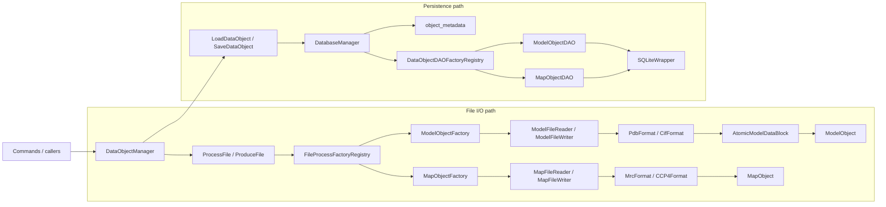
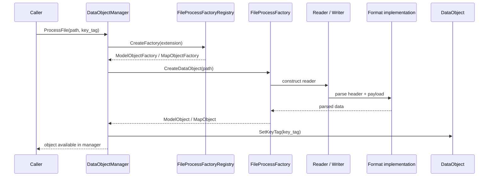
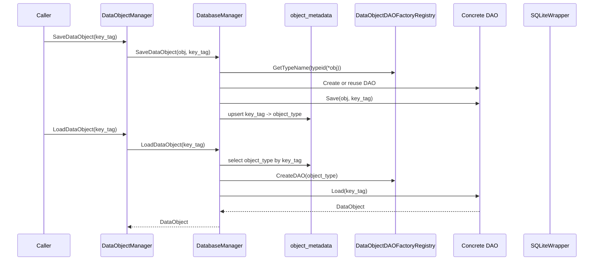
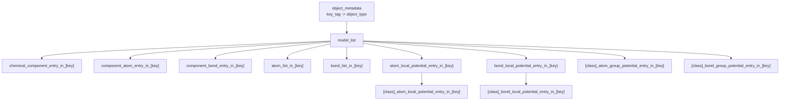

# DataObject I/O Architecture

This document describes the repository's DataObject input and output architecture.

It focuses on how `ModelObject` and `MapObject` move through:

- file parsing and file writing
- factory and registry selection
- in-memory `DataObject` ownership
- SQLite persistence and reconstruction

Use this document together with:

- `docs/development-guidelines.md`
- `docs/architecture/command-architecture.md`

## 1. Scope and Intent

The repository has two distinct I/O paths for `DataObject` instances:

1. File I/O
   Parse model or map files into `DataObject` instances, or write objects back to files.
2. Database I/O
   Save and load `DataObject` instances through SQLite using DAO implementations.

The orchestration boundary for both paths is `DataObjectManager`, but the parsing, formatting, and persistence details live below it.

## 2. Topology Overview

## 3. Core Roles

### 3.1 `DataObjectBase`

All persistent or file-loadable domain objects inherit from `DataObjectBase`.

Current concrete `DataObject` types used by I/O:

- `ModelObject`
- `MapObject`

The base contract includes:

- `Clone()`
- `Display()`
- `Update()`
- `Accept(DataObjectVisitorBase *)`
- `SetKeyTag(...)`
- `GetKeyTag()`

For I/O work, the most important design point is that the file and database layers always exchange objects through `DataObjectBase`, then recover concrete types through factories or DAOs.

### 3.2 `DataObjectManager`

`DataObjectManager` is the high-level boundary used by commands and tests.

Its responsibilities are:

- choose file factories from file extensions
- parse files into `DataObject` instances
- write objects back to files
- hold loaded objects in memory under `key_tag`
- initialize and delegate to `DatabaseManager`
- load and save objects from and to SQLite

It also eagerly registers the default file factories from its constructor.

It is intentionally not a parser, not a DAO, and not a format implementation.

### 3.3 `DataObjectVisitorBase`

Visitors are not the persistence mechanism, but they are part of the `DataObject` interaction contract after load.

The I/O implication is:

- file/database layers materialize `ModelObject` or `MapObject`
- later processing can traverse them polymorphically through `Accept(...)`

## 4. File I/O Architecture

### 4.1 Entry points

File-oriented operations enter through:

- `DataObjectManager::ProcessFile(path, key_tag)`
- `DataObjectManager::ProduceFile(path, key_tag)`

`ProcessFile(...)`:

1. extracts the filename extension
2. asks `FileProcessFactoryRegistry` for a factory
3. creates a `DataObject`
4. assigns the caller-provided `key_tag`
5. stores the object in the manager's in-memory map

`ProduceFile(...)` performs the reverse:

1. finds an in-memory object by `key_tag`
2. selects a factory from the output extension
3. asks that factory to write the object

### 4.2 Extension-based factory dispatch

`FileProcessFactoryRegistry::RegisterDefaultFactories()` maps extensions to factory families:

- model: `.pdb`, `.cif`, `.mmcif`, `.mcif`
- map: `.mrc`, `.map`, `.ccp4`

Important design detail:

- extension dispatch happens at the factory layer
- format dispatch then happens again inside the reader or writer implementation

This means a new file format is not complete until both levels are updated.

### 4.3 File I/O flow

## 5. Model File Pipeline

### 5.1 Reader and format split

Model file parsing is split into:

- `ModelFileReader`
- `ModelFileFormatBase`
- concrete formats:
  - `PdbFormat`
  - `CifFormat`

`ModelFileReader` selects the concrete format implementation from the input extension.

Current input support:

- `.pdb`
- `.cif`
- `.mmcif`
- `.mcif`

### 5.2 Intermediate representation

Model parsing does not construct `ModelObject` directly inside `PdbFormat` or `CifFormat`.

Instead, the format implementation fills an `AtomicModelDataBlock`, which holds:

- one or more model-number-specific atom lists
- bond candidates
- chemistry dictionaries and key systems
- metadata such as PDB ID, EMD ID, resolution, and chain/entity mappings

This is the key architectural seam between:

- text parsing
- domain object assembly

### 5.3 Factory responsibility

`ModelObjectFactory` converts `AtomicModelDataBlock` into a final `ModelObject`.

Its responsibilities are:

- choose the target model number
  - prefer model `1`
  - fall back to the first available model if model `1` is absent
- move the chosen atom list into a `ModelObject`
- filter bond objects so only bonds whose endpoints belong to the selected atom set remain
- transfer metadata and key systems from `AtomicModelDataBlock` to `ModelObject`

This separation is important:

- format classes parse source files
- the factory decides how parsed raw content becomes the supported in-memory model

### 5.4 Writer support

Model writing uses:

- `ModelFileWriter`
- `ModelFileFormatBase`
- concrete formats:
  - `PdbFormat`
  - `CifFormat`

Current output support is narrower than input support:

| Path | Supported model extensions |
| --- | --- |
| Read | `.pdb`, `.cif`, `.mmcif`, `.mcif` |
| Write | `.pdb`, `.cif` |

Future contributors should preserve this distinction unless they explicitly implement write support for mmCIF aliases as well.

## 6. Map File Pipeline

### 6.1 Reader and format split

Map file parsing is split into:

- `MapFileReader`
- `MapFileFormatBase`
- concrete formats:
  - `MrcFormat`
  - `CCP4Format`

Current input support:

- `.mrc`
- `.map`
- `.ccp4`

`MapFileReader` normalizes the extension to lowercase before dispatch.

### 6.2 Direct materialization

Unlike model parsing, map parsing does not need an intermediate block object.

`MapObjectFactory` constructs `MapObject` directly from:

- grid size
- grid spacing
- origin
- owned voxel array

This works because map files are already structurally close to the final in-memory representation.

### 6.3 Writer support

Map writing uses:

- `MapFileWriter`
- `MapFileFormatBase`
- `MrcFormat` or `CCP4Format`

Current output support:

- `.mrc`
- `.map`
- `.ccp4`

`MapObjectDAO` persistence is simple, but file writing remains format-aware because header serialization depends on the chosen binary layout.

## 7. Persistence Architecture

### 7.1 Top-level flow

Database persistence enters through:

- `DataObjectManager::SaveDataObject(key_tag, renamed_key_tag)`
- `DataObjectManager::LoadDataObject(key_tag)`

The flow is:

1. `DataObjectManager` delegates to `DatabaseManager`
2. `DatabaseManager` resolves the correct DAO
3. the DAO serializes or reconstructs the concrete object

### 7.2 Metadata indirection

`DatabaseManager` always maintains a shared table:

- `object_metadata(key_tag, object_type)`

This table is the entry point for polymorphic loading.

On save:

- the DAO writes the object payload
- `DatabaseManager` upserts the `(key_tag, object_type)` row

On load:

- `DatabaseManager` first reads `object_type`
- then asks `DataObjectDAOFactoryRegistry` for the correct DAO

This means the type lookup mechanism is externalized from the individual DAO tables.

### 7.3 DAO registration model

Persistence uses a second self-registration mechanism:

- `DataObjectDAORegistrar<ModelObject, ModelObjectDAO>("model")`
- `DataObjectDAORegistrar<MapObject, MapObjectDAO>("map")`

Important distinction from file I/O:

- file factories are registered explicitly through `RegisterDefaultFactories()`
- DAOs are registered implicitly through namespace-scope static registrar objects in DAO translation units

If a new persistent `DataObject` type is added, it must register a DAO name that remains stable because that name is written into `object_metadata.object_type`.

### 7.4 `DatabaseManager` responsibilities

`DatabaseManager` owns:

- the SQLite connection
- a cache of DAO instances keyed by `std::type_index`
- two mutex domains
  - one for DAO cache access
  - one for database operations

It also defines the persistence coordination boundary:

- `SaveDataObject(...)` invokes the DAO save first, then upserts `object_metadata`
- DAO implementations own their own payload-save transactions
- `LoadDataObject(...)` resolves the DAO type and loads under `DatabaseManager`'s database lock

## 8. `ModelObjectDAO` Persistence Shape

`ModelObjectDAO` is the most complex I/O component in this repository.

It does not serialize a `ModelObject` into one table. Instead, it spreads the object across:

- one shared top-level model table
- multiple key-tag-scoped tables
- additional class-key-scoped potential-entry tables

### 8.1 Table namespace strategy

`ModelObjectDAO` uses the caller's `key_tag` as a table namespace after sanitization.

Sanitization rule:

- keep `[A-Za-z0-9_]`
- replace every other character with `_`

Example namespace fragments:

- `model_list`
- `atom_list_in_[sanitized_key_tag]`
- `bond_list_in_[sanitized_key_tag]`
- `chemical_component_entry_in_[sanitized_key_tag]`
- `atom_local_potential_entry_in_[sanitized_key_tag]`
- `[class_key]_atom_group_potential_entry_in_[sanitized_key_tag]`

This is a structural rule, not a display-only detail.

### 8.2 Model table topology

### 8.3 Save behavior

On save, `ModelObjectDAO`:

1. writes one row to `model_list`
2. writes chemistry dictionaries and component mappings
3. writes atom and bond tables
4. writes local potential entry tables
5. writes per-class group potential entry tables

Important behavior:

- many subordinate tables are cleared and rewritten on save
- the save path behaves like full replacement of the persisted state for that `key_tag`

### 8.4 Load behavior

On load, `ModelObjectDAO` reconstructs the object in stages:

1. load chemistry dictionaries and key systems
2. load atom list
3. load bond list
4. load model metadata
5. load atom group potential entries
6. load bond group potential entries

Important reconstruction detail:

- selected atom and bond state is inferred from the presence of local potential entries
- group membership is rebuilt after load by classifying selected atoms or bonds back into their group entries

This means the persisted schema contains both primary data and enough auxiliary tables to restore analysis results.

## 9. `MapObjectDAO` Persistence Shape

`MapObjectDAO` is intentionally much simpler than `ModelObjectDAO`.

It stores one map per `key_tag` in a single table:

- `map_list`

Stored fields:

- `key_tag`
- grid size
- grid spacing
- origin
- the full map value array as a BLOB

Load reconstructs a `MapObject` directly from those fields.

This difference is intentional:

- `MapObject` is close to a flat numeric payload
- `ModelObject` is a graph with metadata, chemistry dictionaries, and analysis annotations

## 10. SQLite Utility Layer

The DAO layer relies on `SQLiteWrapper` plus typed binder and column-reader helpers.

Key helper capabilities:

- RAII statement finalization through `StatementGuard`
- RAII transactions through `TransactionGuard`
- typed `Bind<T>(...)`
- typed `GetColumn<T>(...)`
- typed query iteration with `QueryIterator`

Current typed payload support includes:

- integers and doubles
- strings
- `std::vector<float>`
- `std::vector<double>`
- `std::vector<std::tuple<float, float>>`
- `std::vector<std::tuple<double, double>>`

This utility layer is what allows DAOs to store map arrays and local-potential sampling payloads without open-coding blob serialization every time.

## 11. Current Supported I/O Surface

| DataObject type | File read | File write | DB save/load |
| --- | --- | --- | --- |
| `ModelObject` | `.pdb`, `.cif`, `.mmcif`, `.mcif` | `.pdb`, `.cif` | yes |
| `MapObject` | `.mrc`, `.map`, `.ccp4` | `.mrc`, `.map`, `.ccp4` | yes |

## 12. Developer Rules

When modifying or extending DataObject I/O, follow these rules:

1. Keep file parsing logic in format classes, not in commands or manager classes.
2. Keep file-to-domain conversion logic in the corresponding factory when an intermediate representation is needed.
3. Treat `DataObjectManager` as the orchestration boundary, not as the place to implement parsing or SQL details.
4. When adding a new file format, update both the extension registry path and the concrete reader or writer dispatch path.
5. When adding a new persistent `DataObject`, implement a DAO, register it with `DataObjectDAORegistrar`, and keep its type name stable.
6. Preserve transaction boundaries in `DatabaseManager` and DAOs; do not bypass `SQLiteWrapper` with ad hoc raw SQLite calls in unrelated layers.
7. Keep `key_tag` values stable and preferably alphanumeric with underscores.
8. Avoid `key_tag` values that differ only by characters that sanitize to `_`, because `ModelObjectDAO` table namespaces would collide.
9. When changing `ModelObjectDAO` schema, update both save and load paths together and add regression coverage.
10. If read support and write support differ intentionally, document that difference explicitly.

## 13. Common Extension Patterns

### 13.1 Adding a new model or map file format

Minimum work:

1. implement a new `ModelFileFormatBase` or `MapFileFormatBase` subclass
2. update the reader to dispatch to it
3. update the writer if output is also supported
4. update `FileProcessFactoryRegistry::RegisterDefaultFactories()`
5. add regression tests for read and, if supported, write

### 13.2 Adding a new persistent DataObject type

Minimum work:

1. implement the new `DataObjectBase` subclass
2. implement `DataObjectDAOBase` for that type
3. register the DAO with `DataObjectDAORegistrar`
4. ensure `object_metadata.object_type` has a stable name
5. add command or manager coverage that saves then reloads the object

## 14. Reference Files

Inspect these files first when working on this architecture:

- `include/core/DataObjectManager.hpp`
- `src/core/DataObjectManager.cpp`
- `include/data/DataObjectBase.hpp`
- `include/data/FileProcessFactoryBase.hpp`
- `include/data/FileProcessFactoryRegistry.hpp`
- `src/data/FileProcessFactoryRegistry.cpp`
- `include/data/ModelFileReader.hpp`
- `src/data/ModelFileReader.cpp`
- `include/data/MapFileReader.hpp`
- `src/data/MapFileReader.cpp`
- `src/data/ModelObjectFactory.cpp`
- `src/data/MapObjectFactory.cpp`
- `include/data/DatabaseManager.hpp`
- `src/data/DatabaseManager.cpp`
- `include/data/DataObjectDAOFactoryRegistry.hpp`
- `src/data/DataObjectDAOFactoryRegistry.cpp`
- `include/data/ModelObjectDAO.hpp`
- `src/data/ModelObjectDAO.cpp`
- `include/data/MapObjectDAO.hpp`
- `src/data/MapObjectDAO.cpp`
- `include/data/SQLiteWrapper.hpp`
