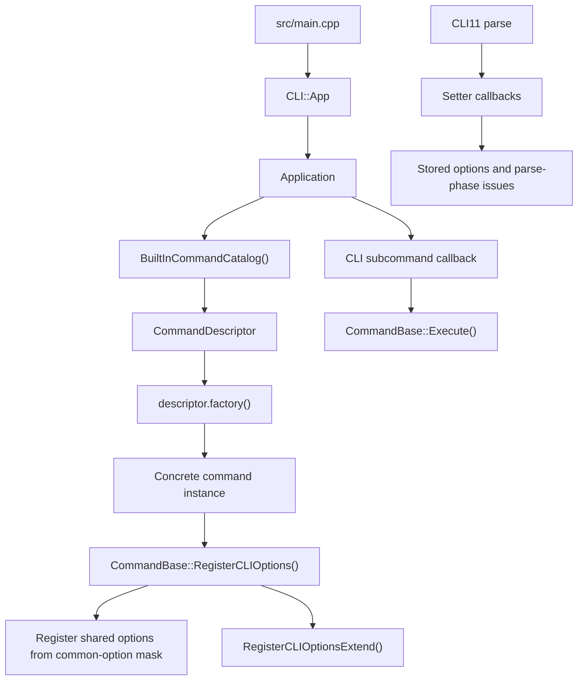
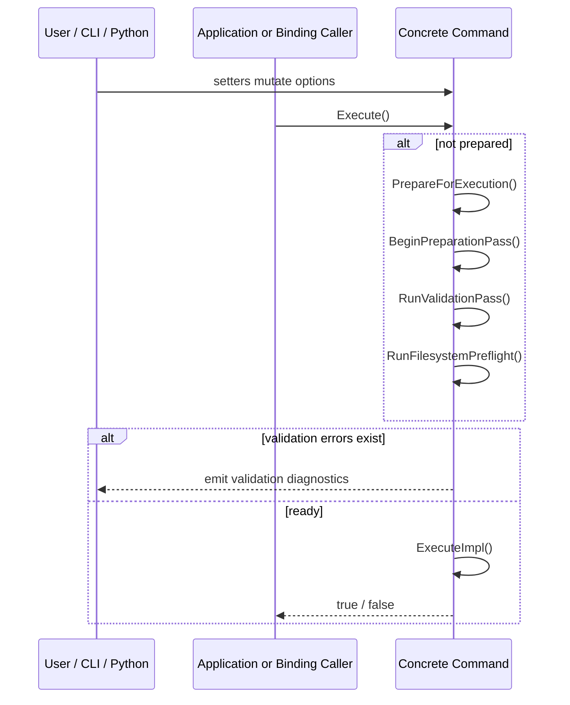

# Command Architecture

This guide describes the command system that exists in the codebase today. Treat it as a developer manual for reading, extending, and debugging commands, not as a refactor log.

Use this document together with [`../development-guidelines.md`](../development-guidelines.md) and [`../adding-a-command.md`](../adding-a-command.md). Editable diagrams for this area live under [`./diagrams/`](./diagrams/).

## 1. What the command layer owns

The command layer is the orchestration boundary of the application. A command is responsible for:

- receiving CLI11 or Python-binding input
- storing normalized options
- validating those options at the correct phase
- preparing runtime prerequisites such as parsed files, database access, and output locations
- sequencing domain logic in `core`, `data`, and `utils`
- reporting diagnostics through the shared logging and validation model

It is not responsible for:

- low-level file parsing details
- persistence internals
- numerical kernels
- painter / printer implementation details

Those concerns stay behind `DataObjectManager`, file processors, writers, and domain helpers.

## 2. Source of truth

When changing the command system, keep the ownership boundaries below intact:

- `BuiltInCommandCatalog()` decides which built-in commands exist and what their public CLI and Python names are.
- The concrete command type decides its `CommandId` and `CommonOptionMask`.
- `CommandBase` decides the shared lifecycle, diagnostics model, and shared option plumbing.
- Concrete command setters and `ValidateOptions()` decide option semantics.
- `DataObjectManager` and command-local workflow code decide how files, database objects, and outputs are processed.

If the same concern starts appearing in multiple layers, the design is usually drifting.

### Built-in command manifest

The built-in manifest order comes directly from the catalog and therefore defines CLI help order.

<!-- BEGIN GENERATED: built-in-command-manifest -->
1. `potential_analysis`
2. `potential_display`
3. `result_dump`
4. `map_simulation`
5. `map_visualization`
6. `position_estimation`
7. `model_test`
<!-- END GENERATED: built-in-command-manifest -->

The project does not currently provide a self-registration API for commands. The built-in catalog is an internal registration mechanism, not an installed public C++ API.

## 3. Startup and registration flow

The CLI startup path is intentionally small:

1. [`src/main.cpp`](../../../src/main.cpp) creates `CLI::App`.
2. [`Application`](../../../include/core/Application.hpp) receives that app.
3. [`src/core/Application.cpp`](../../../src/core/Application.cpp) requires exactly one subcommand and registers every descriptor from the built-in catalog.
4. Each descriptor builds one concrete command instance.
5. The command instance registers shared options first, then command-specific options.
6. The CLI callback invokes the command object.

Application callbacks invoke only `Execute()`.



There is no second CLI registration path elsewhere in the project.

### Catalog details

The catalog declarations live in `src/core/BuiltInCommandCatalogInternal.hpp`, not under `include/`.

Each `CommandDescriptor` stores:

- built-in `CommandId`
- CLI subcommand name
- user-facing description
- mirrored `common_options` mask
- Python binding class name
- factory function

The current descriptor build path in [`src/core/BuiltInCommandCatalog.cpp`](../../../src/core/BuiltInCommandCatalog.cpp) derives `CommandId` and shared-option policy from the concrete command type, which prevents the catalog from maintaining duplicate metadata by hand.

Database usage is derived directly from whether the built-in descriptor's `common_options` mask includes `CommonOption::Database`.
All built-in commands must provide a Python binding name in the built-in catalog.

## 4. Anatomy of a concrete command

Most commands should follow the same shape:

1. define an `Options` struct that extends `CommandOptions`
2. derive from `CommandWithOptions<OptionsT, CommandId::..., ...>`
3. implement command-specific setters
4. register CLI options in `RegisterCLIOptionsExtend(...)`
5. keep cross-field checks in `ValidateOptions()`
6. clear transient pointers and caches in `ResetRuntimeState()`
7. keep `ExecuteImpl()` focused on orchestration

The common base options available through `CommandOptions` are:

- `thread_size`
- `verbose_level`
- `database_path`
- `folder_path`

The template wrapper in [`include/core/CommandBase.hpp`](../../../include/core/CommandBase.hpp) is the normal way to declare built-ins:

```cpp
class ExampleCommand
    : public CommandWithOptions<
          ExampleCommandOptions,
          CommandId::Example,
          CommonOption::Threading | CommonOption::OutputFolder>
{
    // setters
    // RegisterCLIOptionsExtend(...)
    // ValidateOptions()
    // ResetRuntimeState()
    // ExecuteImpl()
};
```

### Shared option registration

Shared CLI options are registered by `CommandBase` based on the concrete command's `kCommonOptions` mask:

- `CommonOption::Threading`
- `CommonOption::Verbose`
- `CommonOption::Database`
- `CommonOption::OutputFolder`

Concrete commands should only register command-local options in `RegisterCLIOptionsExtend(...)`. The preferred helpers live in [`include/core/CommandOptionBinding.hpp`](../../../include/core/CommandOptionBinding.hpp):

- `command_cli::AddScalarOption(...)`
- `command_cli::AddStringOption(...)`
- `command_cli::AddPathOption(...)`
- `command_cli::AddEnumOption(...)`

## 5. Execution lifecycle

`Execute()` is the only caller-facing execution entry point for CLI callbacks, direct C++ callers, and Python bindings. `Execute()` internally decides whether `PrepareForExecution()` must run.



### What happens during preparation

`PrepareForExecution()` runs three internal steps:

1. `BeginPreparationPass()`
2. `RunValidationPass()`
3. `RunFilesystemPreflight()`

In concrete terms, that means:

1. apply the selected log level
2. call `ResetRuntimeState()`
3. clear cached objects from `m_data_manager`
4. invalidate the previous prepared state
5. call `ValidateOptions()`
6. stop early if any validation errors already exist
7. create the parent directory of `database_path` if the command uses the database option
8. create `folder_path` if the command uses the output-folder option
9. report remaining validation issues
10. mark the command prepared only if no errors remain

`Execute()` clears prepared state again after every run, so explicit preparation is only meant to cover the immediately following execution.

### Validation phases

Validation issues are tagged by phase:

| Phase | Typical location | Typical use |
| --- | --- | --- |
| `Parse` | setter callbacks | single-field checks, enum validation, required-path checks, safe fallbacks |
| `Prepare` | `ValidateOptions()` and filesystem preflight | cross-field rules, mode-dependent rules, directory creation failures |
| `Runtime` | `ExecuteImpl()` or deeper runtime helpers | failures discovered only during execution |

Two practical rules keep command code readable:

- put single-option validation in setters whenever possible
- put cross-field or mode-dependent validation in `ValidateOptions()`

### Prepared-state invalidation

Any setter path should call `MutateOptions(...)` directly or indirectly. That invalidates prepared state and clears `Prepare` / `Runtime` issues so the next execution revalidates from a fresh snapshot.

This is why command setters should use the base helpers rather than writing directly into `m_options`.

## 6. Setter and validation helper usage

`CommandBase` exposes a small extension surface that command authors are expected to use directly.

Core helpers:

- `MutateOptions(...)`
- `AddValidationError(...)`
- `AddNormalizationWarning(...)`
- `ResetParseIssues(...)`
- `ResetPrepareIssues(...)`

Convenience helpers built on top of that core API:

- `SetRequiredExistingPathOption(...)`
- `SetOptionalExistingPathOption(...)`
- `SetNormalizedScalarOption(...)`
- `SetFinitePositiveScalarOption(...)`
- `SetFiniteNonNegativeScalarOption(...)`
- `SetPositiveScalarOption(...)`
- `SetValidatedEnumOption(...)`
- `RequireDatabaseManager()`
- `BuildOutputPath(...)`

Use the convenience helpers when the setter matches an existing pattern. Fall back to `MutateOptions(...)` only when the command needs custom parsing or validation logic.

Two details matter in practice:

- required and optional path setters validate path existence immediately, but they do not create directories
- directory creation belongs only to filesystem preflight

## 7. Data access boundary

`DataObjectManager` is the command layer's boundary for file parsing, in-memory objects, database loading, and persistence.

Preferred command-facing entry points are:

- `RequireDatabaseManager()`
- `BuildOutputPath(...)`
- `m_data_manager.ProcessFile(...)`
- `m_data_manager.LoadDataObject(...)`
- `m_data_manager.SaveDataObject(...)`
- `m_data_manager.GetTypedDataObject(...)`
- `command_data_loader::*` helpers from `src/core/CommandDataLoaderInternal.hpp`
- `DataObjectDispatch` helpers (`As*`, `Expect*`) for runtime type checks
- `m_data_manager.ForEachDataObject(callback, ...)` for manager-owned traversal batches

Current preferred internal loading facade is
[`src/core/CommandDataLoaderInternal.hpp`](../../../src/core/CommandDataLoaderInternal.hpp),
which exposes non-template model/map loading helpers for command call sites.

Current command-local typed workflow APIs include:

- map/model preprocessing via `DataObjectWorkflowOps` (`NormalizeMapObject`, `PrepareModelObject`, ...)
- potential analysis flows via `PotentialAnalysisWorkflowOps`
- map sampling via stateless `SampleMapValues(...)`

The command should decide:

- what needs to be loaded
- when it needs to be loaded
- what should be saved
- which output filenames should be produced

The data layer should decide:

- how files are parsed
- how typed objects are created
- how SQLite persistence works

## 8. Shared option policy by command

The matrix below shows only the shared runtime-facing option policy.

<!-- BEGIN GENERATED: command-surface-matrix -->
| Command | Uses database at runtime | Uses output folder |
| --- | --- | --- |
| `potential_analysis` | yes | yes |
| `potential_display` | yes | yes |
| `result_dump` | yes | yes |
| `map_simulation` | no | yes |
| `map_visualization` | no | yes |
| `position_estimation` | no | yes |
| `model_test` | no | yes |
<!-- END GENERATED: command-surface-matrix -->

Use this matrix when deciding whether a new command should inherit `--database` or `--folder`. If the command does not actually use a shared surface at runtime, do not add it just for symmetry.

## 9. Built-in commands to use as templates

When reading existing code, start from the command that matches the workflow you are about to change.

| Command | Use it as a template for | Why |
| --- | --- | --- |
| `potential_analysis` | full-stack command lifecycle | file inputs, database output, cross-field validation, staged execution |
| `potential_display` | database-backed command with strategy dispatch | loads saved models, applies selection, delegates to painter logic |
| `result_dump` | database-backed export command | mode-based validation and output dispatch |
| `map_simulation` | file-driven output generation | no database, list parsing, multiple output artifacts |
| `map_visualization` | focused visualization command | compact file-driven workflow with one main artifact |
| `position_estimation` | map-only algorithm command | file input, normalization, iterative numeric workflow |
| `model_test` | algorithm / test-harness wrapper | shared lifecycle without heavy `DataObjectManager` use |

## 10. Python binding contract

The Python surface is tied to the same built-in catalog used by CLI registration, but the binding code is still written explicitly in [`bindings/CoreBindings.cpp`](../../../bindings/CoreBindings.cpp). The catalog provides built-in membership and class naming; it does not auto-generate setter exposure.

<!-- BEGIN GENERATED: built-in-python-command-surface -->
### Built-in Python command classes
- `PotentialAnalysisCommand`
- `PotentialDisplayCommand`
- `ResultDumpCommand`
- `MapSimulationCommand`
- `MapVisualizationCommand`
- `PositionEstimationCommand`
- `HRLModelTestCommand`

### Shared diagnostics types
- `LogLevel`
- `ValidationPhase`
- `ValidationIssue`

### Shared diagnostics methods on built-in Python commands
- `PrepareForExecution()`
- `HasValidationErrors()`
- `GetValidationIssues()`
<!-- END GENERATED: built-in-python-command-surface -->

Implications for command authors:

- adding a built-in command means adding its Python binding in the same change
- `python_binding_name` in the catalog must stay consistent with `bindings/CoreBindings.cpp`
- Python callers use the same `Execute()` path as the CLI
- `PrepareForExecution()` diagnostics are part of the Python-facing contract

## 11. Change checklist for command authors

Use the checklist below when adding a new built-in command or making a large command change:

1. add or update the public command header under `include/core/`
2. add or update the implementation under `src/core/`
3. define an options type derived from `CommandOptions`
4. derive from `CommandWithOptions<...>`
5. declare the correct `CommonOptionMask`
6. register only command-local CLI options in `RegisterCLIOptionsExtend(...)`
7. keep setters on top of `MutateOptions(...)` and the validation helpers
8. keep cross-field rules in `ValidateOptions()`
9. reset transient state in `ResetRuntimeState()`
10. keep `ExecuteImpl()` phase-oriented and orchestration-focused
11. add or update the descriptor in `BuiltInCommandCatalog()`
12. add or update the Python binding in `bindings/CoreBindings.cpp`
13. update tests, examples, and this document in the same change

The most useful tests to revisit after a command-system change are:

- `tests/CommandDescriptorShape_test.cpp`
- `tests/CommandCommonOptions_test.cpp`
- `tests/CommandExecutionContract_test.cpp`
- `tests/PreparedStateInvalidation_test.cpp`
- `tests/DocsSync_test.cpp`
- command-specific tests under `tests/*Command*_test.cpp`

## 12. What to avoid

Avoid these anti-patterns:

- bypassing `BuiltInCommandCatalog()` and hard-coding new built-ins elsewhere
- reintroducing static self-registration
- validating obvious bad input only deep inside `ExecuteImpl()`
- writing directly into `m_options` without invalidating prepared state
- creating directories during setter execution
- mixing CLI parsing details into algorithm-heavy workflow code
- reaching around `DataObjectManager` to manipulate persistence internals directly
- adding a new top-level command when an enum-based extension of an existing command is the better fit

## 13. Recommended reference files

For command work, inspect these files first:

- `src/main.cpp`
- `include/core/Application.hpp`
- `src/core/Application.cpp`
- `include/core/CommandBase.hpp`
- `src/core/CommandBase.cpp`
- `src/core/BuiltInCommandCatalogInternal.hpp`
- `src/core/BuiltInCommandCatalog.cpp`
- `include/core/CommandMetadata.hpp`
- `include/core/CommandOptionBinding.hpp`
- `src/core/CommandDataLoaderInternal.hpp`
- `include/core/DataObjectManager.hpp`
- `src/core/DataObjectManager.cpp`
- `include/core/PotentialAnalysisCommand.hpp`
- `src/core/PotentialAnalysisCommand.cpp`
- `include/core/PotentialDisplayCommand.hpp`
- `src/core/PotentialDisplayCommand.cpp`
- `include/core/ResultDumpCommand.hpp`
- `src/core/ResultDumpCommand.cpp`
- `include/core/MapSimulationCommand.hpp`
- `src/core/MapSimulationCommand.cpp`
- `include/core/MapVisualizationCommand.hpp`
- `src/core/MapVisualizationCommand.cpp`
- `include/core/PositionEstimationCommand.hpp`
- `src/core/PositionEstimationCommand.cpp`
- `include/core/HRLModelTestCommand.hpp`
- `src/core/HRLModelTestCommand.cpp`
- `bindings/CoreBindings.cpp`
