# Command Architecture

## Source of Truth

Top-level command membership is defined in the internal command catalog in
[`src/core/command/detail/CommandCatalog.hpp`](/src/core/command/detail/CommandCatalog.hpp).

Each entry uses:

- `CommandEntry<RequestType>{cli_name, description, request_type_name, execute}`

That typed list is visited by:

- [`src/core/command/CommandSystem.cpp`](/src/core/command/CommandSystem.cpp)
- [`src/python/CommandSystemBindings.cpp`](/src/python/CommandSystemBindings.cpp)

The catalog stores typed executor functions, so CLI and Python bindings reuse the same command
execution path without exposing concrete command classes or per-command headers.

## Public Surface

Public command headers separate concerns:

- [`include/rhbm_gem/core/CommandSystem.hpp`](/include/rhbm_gem/core/CommandSystem.hpp)
  - typed `rhbm_gem::core::RunCommand(request)` execution API
- [`include/rhbm_gem/core/CommandTypes.hpp`](/include/rhbm_gem/core/CommandTypes.hpp)
  - shared public enums
  - `CommandRequestBase`
  - one plain request DTO per command
  - default data/database path helper declarations
  - `CommandDiagnostic`
  - `CommandResult`

The public C++ API is centered on `rhbm_gem::core` typed requests, `RunCommand(request)`, shared enums, and path helpers.
CLI wiring and request binding schema stay internal.
The private command catalog owns request-to-command routing, so concrete command headers do not
become public includes.

## Internal Binding Model

CLI and Python bindings share one internal request field catalog in
[`src/core/command/detail/CommandCatalog.hpp`](/src/core/command/detail/CommandCatalog.hpp).
Those request field helpers live under `rhbm_gem::command_internal`.
Each request field entry uses `RequestField{...}`; CLI binding behavior is inferred from the request member
type. CSV lists use `,`, and reference groups use `group=item1,item2` parsing as fixed binder
behavior rather than schema configuration.
The `RequestField` field name is also used as the Python request attribute name.

That schema is the single source for:

- CLI option registration
- Python request field binding

Enum alias and binding metadata live in
[`src/core/command/detail/CommandEnumCatalog.hpp`](/src/core/command/detail/CommandEnumCatalog.hpp)
under `rhbm_gem::command_internal`.

## Execution Surfaces

### CLI

[`src/main.cpp`](/src/main.cpp) delegates to the public
[`RunCommandCLI(...)`](/include/rhbm_gem/core/CommandSystem.hpp), so the executable entrypoint
does not expose CLI11 setup or parsing details.

[`src/core/command/CommandSystem.cpp`](/src/core/command/CommandSystem.cpp):

1. enables `require_subcommand(1)`
2. visits the internal command catalog
3. creates one subcommand per command entry
4. binds shared `CommandRequestBase` fields
5. binds command-specific fields from `RequestFieldCatalog`
6. routes the callback to `rhbm_gem::core::RunCommand(request)`
7. wraps CLI11 parsing and exit-code handling in `RunCommandCLI(...)`

### Python

[`src/python/CommandSystemBindings.cpp`](/src/python/CommandSystemBindings.cpp) binds:

- `CommandRequestBase`
- one request type per command
- `CommandResult`
- `CommandDiagnostic`
- shared enums from `CommandTypes.hpp`

Request type registration, `RunCommand(...)` overload membership, and request fields come from
the internal command catalog.

## Runtime Flow

All public execution entrypoints converge on the same flow:

```mermaid
flowchart LR
    A["CLI callback or Python call"] --> B["rhbm_gem::core::RunCommand(request)"]
    B --> C["Catalog executor"]
    C --> D["Construct local command"]
    D --> E["ExecuteRequest(request)"]
    E --> F["Normalize and validate request"]
    F --> G["Output folder preflight"]
    G --> H["ExecuteImpl(request)"]
    H --> I["CommandResult"]
```

`rhbm_gem::core::RunCommand(request)` returns `CommandResult` with:

- `succeeded == true` when execution completes
- `succeeded == false` when validation, preflight, or execution stops the command
- `issues` containing public validation diagnostics as option/message pairs

## Concrete Command Shape

Concrete command classes live inside their implementation files under
[`src/core/command/`](/src/core/command/).
Do not add per-command headers; each `.cpp` exposes only its internal executor function.

Shared command-framework internals live in:

- [`src/core/command/detail/`](/src/core/command/detail/)

The standard shape is:

1. derive from `CommandBase<XxxRequest>`
2. keep request normalization and field validation in `NormalizeAndValidateRequest(request)`
3. keep semantic checks in `ValidatePreparedRequest(request)`
4. keep orchestration in `ExecuteImpl(request)`
5. expose `command_internal::ExecuteXxxCommand(...)` through `CommandCatalog.hpp`

`CommandBase<XxxRequest>`:

1. copies the typed request for one execution
2. coerces shared base options
3. calls `NormalizeAndValidateRequest(request)`
4. calls `ValidatePreparedRequest(request)`
5. runs output-directory preflight before `ExecuteImpl(request)`

## Shared Request Base

`CommandRequestBase` contributes these shared options:

- `job_count` exposed by CLI as `-j,--jobs`
- `verbosity` exposed by CLI as `-v,--verbose`
- `output_dir` exposed by CLI as `-o,--folder`

Command-specific fields live directly on each request DTO.

## Filesystem and Validation Behavior

`CommandBase` performs:

1. request normalization and validation issue tracking
2. output-directory preflight for `output_dir`
3. logger-level setup from `verbosity`

The generic layer manages only the shared `output_dir`. Internal validation still tracks
option name, level, and message. The public result keeps only option/message diagnostics.
