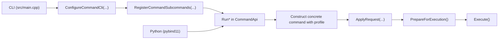

# Command Architecture

Current command registration and execution flow.

Related guides:

- [`/docs/developer/adding-a-command.md`](/docs/developer/adding-a-command.md)
- [`/docs/developer/development-guidelines.md`](/docs/developer/development-guidelines.md)

## 1. Source of truth

Top-level command membership is defined in:

- `/include/rhbm_gem/core/command/CommandList.def`

Each entry uses:

- `RHBM_GEM_COMMAND(COMMAND_ID, CLI_NAME, DESCRIPTION, PROFILE)`

This manifest is expanded directly with X-macros by:

- `/include/rhbm_gem/core/command/CommandMetadata.hpp`
- `/include/rhbm_gem/core/command/CommandApi.hpp`
- `/src/core/command/CommandApi.cpp`
- `/src/core/command/CommandCatalog.cpp`
- `/src/python/CommandApiBindings.cpp`

The manifest does not generate request structs or command-specific CLI field bindings.

Always-on command list:

1. `potential_analysis`
2. `potential_display`
3. `result_dump`
4. `map_simulation`
5. `model_test`

Experimental command list (`RHBM_GEM_ENABLE_EXPERIMENTAL_FEATURE=ON` only, via the guarded block in
`CommandList.def`):

1. `map_visualization`
2. `position_estimation`

## 2. Execution surfaces

All entrypoints converge on the public `Run*` functions in `CommandApi`.

## 3. Registry shape

`CommandCatalog()` returns metadata only:

- `id`
- `name`
- `description`
- `profile`

`ConfigureCommandCli(CLI::App &)` is the public top-level CLI setup entrypoint.
It enables `require_subcommand(1)` and then delegates to `RegisterCommandSubcommands(CLI::App &)`.

`RegisterCommandSubcommands(CLI::App &)` is the lower-level registry wiring entrypoint.
It creates the request object, binds common options from the profile, binds command-specific
options, and wires the callback to the matching `Run*` function.

There is no exported runtime-binder function object layer anymore.

## 4. Public contract and request surface

Shared command contract types live in `/include/rhbm_gem/core/command/CommandContract.hpp`.

This header owns:

- default command data/database paths
- `ValidationPhase`
- `ValidationIssue`
- `ExecutionReport`

Public requests and `Run*` entrypoints live in `/include/rhbm_gem/core/command/CommandApi.hpp`.
Experimental request types and `Run*` entrypoints are compiled into that public surface only when
`RHBM_GEM_ENABLE_EXPERIMENTAL_FEATURE` is enabled for the linked target.

Shared request fields:

- `thread_size`
- `verbose_level`
- `database_path`
- `folder_path`

`CommandApi.hpp` includes `CommandContract.hpp`, so callers that only need the public `Run*`
surface can include one header, while lower-level consumers can depend on `CommandContract.hpp`
directly for shared diagnostics/default-path behavior.

`CommonOptionProfile` in `CommandMetadata.hpp` controls shared CLI/common-option behavior:

- `FileWorkflow` -> `Threading | Verbose | OutputFolder`
- `DatabaseWorkflow` -> `Threading | Verbose | Database | OutputFolder`

## 5. Concrete command contract

Concrete command classes are internal types under `/src/core/command/`.

Current pattern:

1. Define `Options` deriving from `CommandOptions`.
2. Derive the command from `CommandWithOptions<Options>`.
3. Construct the command with a profile supplied by the caller (`Run*` from the manifest).
4. Implement `ApplyRequest(const XxxRequest &)`.
5. Call `ApplyCommonRequest(request.common)` inside `ApplyRequest(...)`.
6. Keep cross-field validation in `ValidateOptions()`.
7. Reset transient execution state in `ResetRuntimeState()`.
8. Keep `ExecuteImpl()` focused on orchestration.

Useful `CommandBase` helpers:

- `AssignOption(...)` for plain field assignment that should invalidate prepared state
- `MutateOptions(...)` for advanced setters that also manage parse issues, fallback logic, or
  derived state
- `AddValidationError(...)`
- `AddNormalizationWarning(...)`
- `ResetParseIssues(...)`
- `ResetPrepareIssues(...)`
- `SetRequiredExistingPathOption(...)`
- `SetOptionalExistingPathOption(...)`
- `SetNormalizedScalarOption(...)`
- `SetFinitePositiveScalarOption(...)`
- `SetFiniteNonNegativeScalarOption(...)`
- `SetPositiveScalarOption(...)`
- `SetValidatedEnumOption(...)`
- `BuildOutputPath(...)`

## 6. Lifecycle and validation

`Run*` functions follow this sequence:

1. Construct the concrete command with the manifest profile.
2. Call `ApplyRequest(...)`.
3. Call `PrepareForExecution()`.
4. Return early with validation issues if preparation fails.
5. Call `Execute()`.
6. Return an `ExecutionReport`.

`PrepareForExecution()` does three things in order:

1. reset transient preparation state
2. run validation and collect issues
3. run filesystem preflight

The preflight phase now stays command-local:

- resets transient runtime state
- clears loaded `DataObjectManager` state
- runs `ValidateOptions()`
- creates the output folder when needed

Database parent directory creation happens when the database layer is actually opened, not during
generic command preparation.

## 7. Command support helpers

Cross-command model/map helper logic lives in:

- `/src/core/command/CommandDataSupport.hpp`
- `/src/core/command/CommandDataSupport.cpp`

This module groups:

- typed file/database loaders (`command_data_loader::*`)
- map normalization
- model preparation/selection
- atom collection and simulation helpers
- atom/bond context construction

## 8. Python integration

Python bindings are split across:

- `/src/python/CoreBindings.cpp`
- `/src/python/CommonBindings.cpp`
- `/src/python/CommandApiBindings.cpp`

`/src/python/CommonBindings.cpp` exposes shared enums plus `ValidationPhase` / `ValidationIssue`.
`/src/python/CommandApiBindings.cpp` exposes request structs, `ExecutionReport`, and all `Run*`
functions via the manifest X-macro. Experimental command bindings follow the same gate as the
public C++ surface.
