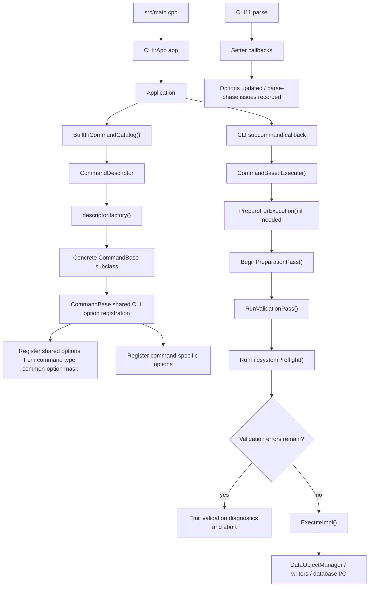
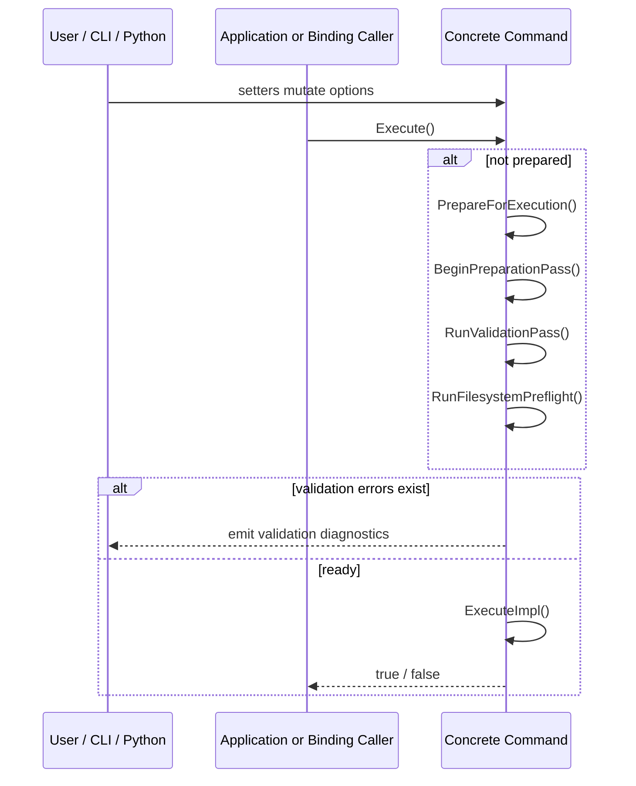

# Command Architecture

This document describes the current command-system architecture after the catalog-driven refactor and the later cleanup passes. It focuses on the actual registration path, the `CommandBase` lifecycle contract, and the extension points that command authors should use today.

Use this document together with [`../development-guidelines.md`](../development-guidelines.md). Editable diagram sources for this area live under [`./diagrams/`](./diagrams/).

## 1. Purpose

The command layer is the orchestration boundary of the application.

It is responsible for:

- translating CLI or Python-binding inputs into command options
- normalizing and validating those options
- preparing runtime prerequisites such as parsed files, loaded database objects, and output locations
- invoking domain logic from `core`, `data`, and `utils`
- emitting user-facing logs, persisted objects, and output artifacts

It is not responsible for:

- low-level file format parsing
- database implementation details
- numerical kernels or domain algorithms
- painter or printer implementations

Those concerns stay behind `DataObjectManager`, file processors, writers, and domain-specific helpers.

## 1.1 Source of Truth by Concern

The current design is easiest to understand when each concern is mapped to exactly one owner:

- `BuiltInCommandCatalog()` decides whether a built-in command exists and what its public CLI/Python names are.
- The concrete command type decides its `CommandId` and shared `CommonOptionMask`.
- `CommandBase` decides the shared execution lifecycle and diagnostics model.
- Concrete command setters and `ValidateOptions()` decide option semantics.
- `DataObjectManager` and command-local workflow code decide how files, database objects, and output artifacts are processed.

If a change duplicates one of those responsibilities in another layer, it is usually pushing the architecture in the wrong direction.

## 2. Runtime Topology

The command system is assembled explicitly at process startup.

Two structural consequences matter:

- there is one command instance per registered CLI subcommand
- built-in registration order is defined only by `BuiltInCommandCatalog()`

## 3. Registration Model

### 3.1 Process entry points

The CLI entry point is intentionally small:

- `src/main.cpp` creates `CLI::App`
- `Application` receives that `CLI::App`
- `Application` requires exactly one subcommand and registers all built-in commands

`Application` performs the real wiring in `src/core/Application.cpp`:

1. create a command instance through `CommandDescriptor::factory`
2. add a CLI11 subcommand using the descriptor name and description
3. call the base-class CLI registration path to add shared and command-local options
4. store the command in a `shared_ptr`
5. bind the subcommand callback to `CommandBase::Execute()`
6. convert `Execute() == false` into `CLI::RuntimeError(1)` so command failure reaches the process exit code

There is no secondary registration path hidden elsewhere.

### 3.2 Built-in command catalog

Built-in commands are defined centrally in `BuiltInCommandCatalog()`. The declarations live in `src/core/BuiltInCommandCatalogInternal.hpp`, not under `include/`.

The built-in manifest order is generated from the built-in command catalog:

<!-- BEGIN GENERATED: built-in-command-manifest -->
1. `potential_analysis`
2. `potential_display`
3. `result_dump`
4. `map_simulation`
5. `map_visualization`
6. `position_estimation`
7. `model_test`
<!-- END GENERATED: built-in-command-manifest -->

This gives deterministic CLI help ordering and avoids dependence on cross-translation-unit static initialization order.

The project does not currently provide a self-registration API for commands.
The built-in catalog is an internal registration mechanism, not an installed public C++ API.

### 3.3 Descriptor responsibilities

Each internal `CommandDescriptor` stores:

- the built-in `CommandId`
- the command name
- the user-facing description
- the mirrored `common_options` mask used by shared option and docs/test helpers
- the Python binding class name for that built-in command
- the factory returning `std::unique_ptr<CommandBase>`

The descriptor deliberately stores only authoritative metadata. In the current design:

- common-option policy is declared on the concrete command type and mirrored into the built-in catalog
- database usage is inferred from `common_options`
- output-folder support is inferred from `common_options`
- Python class naming is read directly from `python_binding_name`

`BuiltInCommandCatalog.cpp` now builds descriptors from the concrete command type, so the catalog no longer hand-maintains `CommandId`, common-option surface, and factory wiring separately for each built-in.

Database usage is derived directly from whether the built-in descriptor's `common_options` mask includes `CommonOption::Database`.
All built-in commands must provide a Python binding name in the built-in catalog.
The lightweight public metadata header is `include/core/CommandMetadata.hpp`; it now carries both `CommandId` and the shared common-option types. `CommandId.hpp` no longer exists as a separate public header.

## 4. `CommandBase` Contract

All built-in commands derive from `CommandBase`. In practice, every current built-in uses `CommandWithOptions<OptionsT, CommandId::..., CommonOptions...>` so the base class can keep the raw options object and command id as internal implementation detail while the command type itself remains the source of its shared-option surface.

### 4.1 Public caller contract vs. override hooks

There are two different contracts to keep separate when reading command code:

- the public caller-facing API on `CommandBase`
- the protected override hooks that concrete commands must implement

Every concrete command must implement these protected hooks:

- `bool ExecuteImpl()`
- `void RegisterCLIOptionsExtend(CLI::App * command)`

Concrete commands usually also override:

- `void ValidateOptions()`
- `void ResetRuntimeState()`

The public entry points shared by CLI and Python are:

- `Execute()`
- `PrepareForExecution()`
- `HasValidationErrors()`
- `GetValidationIssues()`

The public C++ command contract also includes:

- shared setters inherited from `CommandBase`
- command-specific setters defined on each concrete command

Python bindings then expose the relevant setters for each concrete built-in command explicitly in `bindings/CoreBindings.cpp`.

`Execute()` is the only supported execution entry point for CLI callbacks, direct C++ callers, and Python bindings. Raw option access, command-id introspection, and CLI-registration hooks are internal mechanics rather than caller-facing API.

In practice, outside code should never call `RegisterCLIOptionsExtend(...)`, `ValidateOptions()`, `ResetRuntimeState()`, or `ExecuteImpl()` directly. Those are subclass plumbing, not user-facing command operations.

### 4.2 Shared base state

`CommandBase` owns and manages:

- `DataObjectManager m_data_manager`
- `std::vector<ValidationIssue> m_validation_issues`
- internal prepared-state tracking
- base option fields inherited from `CommandOptions`

Shared base options are:

- `thread_size`
- `verbose_level`
- `database_path`
- `folder_path`

### 4.3 Shared option surface

Each command inherits only the common CLI options declared on its concrete command type and mirrored into catalog `common_options` metadata:

- `CommonOption::Threading`
- `CommonOption::Verbose`
- `CommonOption::Database`
- `CommonOption::OutputFolder`

The base registration path first registers shared options from the command type's common-option declaration and then delegates to `RegisterCLIOptionsExtend(...)` for command-local options.

This means:

- commands do not duplicate shared option definitions
- enabling or disabling a shared option is a command-type declaration change that the catalog mirrors automatically for registration, bindings, docs sync, and tests
- command headers do not need to know how shared CLI11 bindings are wired

### 4.4 Protected Surface Categories

The remaining protected surface on `CommandBase` now falls into three distinct groups.

Lifecycle hooks that concrete commands override:

- `RegisterCLIOptionsExtend(...)`
- `ValidateOptions()`
- `ResetRuntimeState()`
- `ExecuteImpl()`

Core command extension API that command-local setters and validators are expected to call directly:

- `MutateOptions(...)`
- `AddValidationError(...)`
- `AddNormalizationWarning(...)`
- `ResetParseIssues(...)`
- `ResetPrepareIssues(...)`

Base convenience helpers built on top of that core API:

- `SetRequiredExistingPathOption(...)`
- `SetOptionalExistingPathOption(...)`
- `SetNormalizedScalarOption(...)`
- `SetFinitePositiveScalarOption(...)`
- `SetFiniteNonNegativeScalarOption(...)`
- `SetPositiveScalarOption(...)`
- `SetValidatedEnumOption(...)`
- `RequireDatabaseManager()`
- `BuildOutputPath(...)`

This split is intentional: command authors should think of the validation and issue helpers as the primary extension API, while the path, scalar, enum, database, and output helpers are convenience layers that keep common command code terse.

As a rule of thumb:

- if a setter mainly needs to mutate state or add/remove issues, start from `MutateOptions(...)`, `AddValidationError(...)`, and the issue-reset helpers
- if a setter matches an already-supported pattern such as "required existing path", "positive scalar with fallback", or "validated enum", prefer the convenience helper instead of open-coding the pattern

### 4.5 Internal base mechanics

Some `CommandBase` functions are intentionally internal implementation detail, not command extension API. That includes the prepared-state machinery, shared option registration internals, generic scalar-validation internals, and filesystem validation helpers.

Command code should treat these behaviors as part of the base-class contract, not something to call directly.

## 5. Validation and Execution Lifecycle

Application callbacks invoke only `Execute()`.
`Execute()` internally decides whether `PrepareForExecution()` must run.

### 5.1 Validation phases

Validation issues are explicitly tagged by phase:

| Phase | Where it usually happens | Typical responsibility |
| --- | --- | --- |
| `Parse` | setter callbacks | single-field checks, enum validation, required-path existence checks, safe fallback warnings |
| `Prepare` | `ValidateOptions()` and filesystem preflight | cross-field constraints, mode-specific requirements, directory preflight |
| `Runtime` | `ExecuteImpl()` or deeper runtime helpers | unexpected workflow failures after preparation |

Two practical rules follow:

- single-option validation belongs in setters whenever possible
- cross-field or mode-dependent validation belongs in `ValidateOptions()`

### 5.2 What `PrepareForExecution()` actually does

`PrepareForExecution()` orchestrates three internal steps:

1. `BeginPreparationPass()`
2. `RunValidationPass()`
3. `RunFilesystemPreflight()`

The actual work performed is:

1. apply the selected log level
2. call `ResetRuntimeState()`
3. clear all cached data objects from `m_data_manager`
4. invalidate any previous prepared state
5. run `ValidateOptions()`
6. report issues and abort early if validation errors already exist
7. create the parent directory for `database_path` when the command's common-option mask includes the database option
8. create `folder_path` when the command's common-option mask includes the output-folder option
9. report any remaining issues
10. mark the command prepared only if no errors remain

### 5.3 Prepared-state invalidation

Any setter path should call `MutateOptions(...)` directly or indirectly. That invalidates prepared-state assumptions and clears `Prepare` and `Runtime` issues so the next execution works from a fresh option snapshot.

`Execute()` also clears prepared state after every run, so preparation is intentionally short-lived:

- explicit `PrepareForExecution()` can be reused by the immediately following `Execute()`
- prepared state is not intended as a multi-run cache

### 5.4 Filesystem preflight

`RunFilesystemPreflight()` is the shared place where base filesystem side effects happen before `ExecuteImpl()`:

- if the command's common-option mask includes `CommonOption::Database`, it creates the parent directory of `database_path` when needed
- if the command's common-option mask includes `CommonOption::OutputFolder`, it creates `folder_path` when needed

Setter paths do not create directories. They only normalize values or record validation issues.

## 6. Data Boundary

`DataObjectManager` is the command layer's boundary for file parsing, in-memory object access, database loading, and persistence.

Preferred command-facing helpers on `CommandBase` are:

- `RequireDatabaseManager()`
- `BuildOutputPath(stem, extension)`

These helpers keep command code focused on orchestration:

- commands decide which files, objects, and persistence operations are needed
- commands decide when those objects should be loaded or saved
- `DataObjectManager` and related processors decide how file or database operations are implemented

When database-backed objects are needed, `RequireDatabaseManager()` must run before any direct `LoadDataObject(...)` / `SaveDataObject(...)` use.

Some commands also use internal `src/core` helpers such as `CommandDataAccessInternal.hpp` to avoid repeating typed file/database loading boilerplate. Those helpers are intentionally internal and are not part of the supported `CommandBase` extension surface described in this document.

## 7. Current Command Families

The current commands share one base lifecycle but fall into three practical families.

### 7.1 File-driven analysis and generation

| Command | Primary inputs | Main phases | Main outputs |
| --- | --- | --- | --- |
| `potential_analysis` | model file, map file, database path | load model/map, preprocess, sample, classify, fit, save analyzed model | persisted `ModelObject` in SQLite |
| `map_simulation` | model file, blurring width list | load model, build atom list, simulate maps for each width | `.map` files |
| `map_visualization` | model file, map file, atom serial id | load model/map, normalize, derive local sampling frame, paint 2D slice | PDF plot |
| `position_estimation` | map file | load map, normalize, threshold voxels, KD-tree convergence, deduplicate | ChimeraX `.cmm` points |

### 7.2 Database-driven presentation and export

| Command | Primary inputs | Main phases | Main outputs |
| --- | --- | --- | --- |
| `potential_display` | painter choice, model key list, optional reference groups | load models, apply atom selection, dispatch painter | painter-specific output files |
| `result_dump` | printer choice, model key list, optional map file | load models, collect atoms with local potential entries, dispatch dump mode | CSV, CMM, CIF-related exports depending on mode |

### 7.3 Standalone algorithm and test harness

| Command | Primary inputs | Main phases | Main outputs |
| --- | --- | --- | --- |
| `model_test` | tester mode and fitting parameters | choose tester workflow and run synthetic experiments | logs and optional ROOT-backed plots |

`model_test` still inherits from `CommandBase` for consistent options, validation, diagnostics, and execution flow even though its main workflow does not depend on `DataObjectManager`.

### 7.4 Command surface matrix

This matrix covers only the runtime-facing shared option policy. Python bindings are a separate built-in contract and are listed in Section 9.

<!-- BEGIN GENERATED: command-surface-matrix -->
| Command | Uses database at runtime | Uses output folder |
| --- | --- | --- |
| `potential_analysis` | yes | yes |
| `potential_display` | yes | yes |
| `result_dump` | yes | yes |
| `map_simulation` | no | yes |
| `map_visualization` | no | yes |
| `position_estimation` | no | yes |
| `model_test` | no | yes |
<!-- END GENERATED: command-surface-matrix -->

## 8. Concrete Command Notes

### 8.1 `potential_analysis`

`potential_analysis` is still the best reference implementation for a full command lifecycle.

Its workflow is:

1. require a database manager
2. parse the model and map files
3. optionally rewrite model metadata for simulation mode
4. normalize map values
5. select atoms and bonds, attaching fresh local-potential entries
6. sample map values around selected atoms
7. classify atoms into group structures
8. run either alpha training or direct local fitting
9. run potential fitting
10. optionally run the experimental bond workflow when compiled in
11. save the analyzed model back to SQLite under `saved_key_tag`

It also demonstrates the preferred split between parse-phase setter validation and prepare-phase cross-field checks.

### 8.2 `potential_display`

`potential_display` is the clearest example of the "load saved models, then dispatch a strategy object" pattern.

Its workflow is:

1. require the database manager
2. load one or more primary `ModelObject` instances
3. optionally load grouped reference-model sets
4. apply `AtomSelector` rules to mark atoms as selected
5. instantiate a `PainterBase` subtype from `PainterType`
6. feed selected data into the painter

### 8.3 `result_dump`

`result_dump` is structurally similar to `potential_display`, but its dispatch point is export mode rather than painter strategy.

Its workflow is:

1. require the database manager
2. optionally parse a map file
3. load each requested `ModelObject`
4. collect atoms that already contain local-potential entries
5. dispatch to a dump mode selected by `PrinterType`

The important mode-dependent prepare rule is:

- `PrinterType::MAP_VALUE` requires `--map`

### 8.4 `map_simulation`

`map_simulation` is intentionally file-driven and does not use the database surface.

It demonstrates:

- required input-path validation through setters
- list-style parsing and normalization for `--blurring-width`
- generation of multiple output artifacts from one parsed model
- use of `BuildOutputPath(...)` without any database dependency

Its key prepare-time rule is:

- at least one positive blurring width must remain after parsing and normalization

### 8.5 `map_visualization`

`map_visualization` is a focused analysis and visualization command with one main output artifact.

It currently:

1. parses one model and one map
2. normalizes the map
3. selects all atoms and bonds
4. finds the requested atom by serial ID
5. derives a local reference frame from a non-degenerate bond vector
6. samples a 2D local slice
7. writes a PDF named like `map_slice_<model>_atom<id>.pdf`

### 8.6 `position_estimation`

`position_estimation` is the clearest map-only algorithm command.

It currently:

1. parses one map and normalizes it
2. selects voxels above a threshold ratio
3. builds a KD-tree over selected voxels
4. iteratively updates candidate points using weighted nearest neighbors
5. quantizes and deduplicates the converged points
6. writes `point_list_<mapname>.cmm`

### 8.7 `model_test`

`model_test` is a command wrapper around synthetic tester workflows.

It demonstrates that `CommandBase` is still useful even when a command mostly needs:

- shared options
- enum-based mode dispatch
- validation helpers
- consistent logging and diagnostics

Its main prepare-time rule is:

- `--fit-min <= --fit-max`

## 9. CLI and Python Surface

The CLI surface is driven by:

- `src/main.cpp`
- `Application`
- `BuiltInCommandCatalog()`
- concrete `CommandBase` subclasses

The Python surface is generated from the same built-in command catalog. Every built-in command has a Python class in `bindings/CoreBindings.cpp`.
Python support for built-in commands is not an optional surface-policy dimension. It is a built-in catalog contract that always accompanies CLI registration.
The binding code remains hand-written on purpose; the catalog supplies naming and built-in membership, not automatic setter generation.

<!-- BEGIN GENERATED: built-in-python-command-surface -->
### Built-in Python command classes
- `PotentialAnalysisCommand`
- `PotentialDisplayCommand`
- `ResultDumpCommand`
- `MapSimulationCommand`
- `MapVisualizationCommand`
- `PositionEstimationCommand`
- `HRLModelTestCommand`

### Shared diagnostics types
- `LogLevel`
- `ValidationPhase`
- `ValidationIssue`

### Shared diagnostics methods on built-in Python commands
- `PrepareForExecution()`
- `HasValidationErrors()`
- `GetValidationIssues()`
<!-- END GENERATED: built-in-python-command-surface -->

Implications for future work:

- adding a new built-in command requires a Python binding in the same change
- `python_binding_name` must stay consistent with `bindings/CoreBindings.cpp`
- Python-bound commands call the same `Execute()` path as the CLI
- `PrepareForExecution()` diagnostics are part of the current Python-facing contract

## 10. Implementation Rules for New Commands

When adding a new built-in command, follow this order:

1. add the public command interface under `include/core/`
2. add the implementation under `src/core/`
3. derive from `CommandBase`, usually via `CommandWithOptions<Options, CommandId::...>`
4. define a command-local options type derived from `CommandOptions`
5. add command-specific setters and use `CommandBase` helper families before adding custom boilerplate
6. keep single-field validation in setters
7. keep cross-field or mode-dependent validation in `ValidateOptions()`
8. keep transient caches and pointers resettable through `ResetRuntimeState()`
9. keep `ExecuteImpl()` phase-oriented and orchestration-focused
10. use `DataObjectManager` helper paths for parsing, loading, and persistence
11. add the built-in descriptor entry to `BuiltInCommandCatalog()`
12. add the Python binding in `bindings/CoreBindings.cpp`
13. update tests, docs, and examples in the same change

A useful mental model is:

- the catalog decides whether the built-in command exists and what its public names are
- the command type declares which shared options it gets
- the command class decides option semantics and workflow sequencing
- the data layer decides how files and persistence are implemented

## 11. What to Avoid

Avoid these anti-patterns:

- bypassing `BuiltInCommandCatalog()` and hard-coding new built-in CLI subcommands elsewhere
- reintroducing static self-registration patterns
- validating obvious bad input only deep inside `ExecuteImpl()`
- mixing CLI parsing details into algorithm-heavy workflow code
- creating directories during parse-time setter execution
- letting commands reach around `DataObjectManager` to manipulate persistence internals directly
- building a new top-level command when an enum-based mode extension on an existing command is the cleaner fit

## 12. Recommended Reference Files

For future command work, inspect these files first:

- `src/main.cpp`
- `include/core/Application.hpp`
- `src/core/Application.cpp`
- `include/core/CommandBase.hpp`
- `src/core/CommandBase.cpp`
- `src/core/BuiltInCommandCatalogInternal.hpp`
- `src/core/BuiltInCommandCatalog.cpp`
- `include/core/CommandMetadata.hpp`
- `src/core/CommandDataAccessInternal.hpp`
- `include/core/CommandOptionBinding.hpp`
- `include/core/DataObjectManager.hpp`
- `src/core/DataObjectManager.cpp`
- `include/core/PotentialAnalysisCommand.hpp`
- `src/core/PotentialAnalysisCommand.cpp`
- `include/core/PotentialDisplayCommand.hpp`
- `src/core/PotentialDisplayCommand.cpp`
- `include/core/ResultDumpCommand.hpp`
- `src/core/ResultDumpCommand.cpp`
- `include/core/MapSimulationCommand.hpp`
- `src/core/MapSimulationCommand.cpp`
- `include/core/MapVisualizationCommand.hpp`
- `src/core/MapVisualizationCommand.cpp`
- `include/core/PositionEstimationCommand.hpp`
- `src/core/PositionEstimationCommand.cpp`
- `include/core/HRLModelTestCommand.hpp`
- `src/core/HRLModelTestCommand.cpp`
- `bindings/CoreBindings.cpp`
