# Command Architecture

This page documents the command system as it exists in this repository today.

Related guides:

- [`docs/developer/adding-a-command.md`](/docs/developer/adding-a-command.md)
- [`docs/developer/development-guidelines.md`](/docs/developer/development-guidelines.md)

## Source of Truth

Top-level command membership is defined in
[`include/rhbm_gem/core/command/CommandList.def`](/include/rhbm_gem/core/command/CommandList.def).

Each manifest entry uses:

- `RHBM_GEM_COMMAND(COMMAND_ID, CLI_NAME, DESCRIPTION)`

That manifest is expanded by:

- [`include/rhbm_gem/core/command/CommandContract.hpp`](/include/rhbm_gem/core/command/CommandContract.hpp)
- [`include/rhbm_gem/core/command/CommandApi.hpp`](/include/rhbm_gem/core/command/CommandApi.hpp)
- [`src/core/command/CommandApi.cpp`](/src/core/command/CommandApi.cpp)
- [`src/python/CommandApiBindings.cpp`](/src/python/CommandApiBindings.cpp)

Stable commands in the manifest:

1. `potential_analysis`
2. `potential_display`
3. `result_dump`
4. `map_simulation`
5. `model_test`

Experimental commands behind `RHBM_GEM_ENABLE_EXPERIMENTAL_FEATURE`:

1. `map_visualization`
2. `position_estimation`

## Public Contract

Shared command metadata and validation types live in
[`include/rhbm_gem/core/command/CommandContract.hpp`](/include/rhbm_gem/core/command/CommandContract.hpp).

This header defines:

- `CommandId`
- `CommandDescriptor`
- `GetCommandCatalog()`
- `ValidationPhase`
- `ValidationIssue`
- default data and database path helpers

Public request types and execution entrypoints live in
[`include/rhbm_gem/core/command/CommandApi.hpp`](/include/rhbm_gem/core/command/CommandApi.hpp).

This header defines:

- `CommonCommandRequest`
- one request type per command
- `ExecutionReport`
- `ConfigureCommandCli(...)`
- one `Run*` declaration per manifest entry

Shared enums and their CLI/Python mappings live in
[`include/rhbm_gem/core/command/CommandEnumClass.hpp`](/include/rhbm_gem/core/command/CommandEnumClass.hpp).

## Request Schema and Binding Model

Each request type declares a static `VisitFields(Visitor &&)` schema. The same schema is used by
both CLI registration and Python bindings.

`CommandApi.hpp` currently supports these field-spec categories:

- object fields via `MakeObjectField(...)`
- scalar fields via `MakeScalarField(...)`
- path fields via `MakePathField(...)`
- enum fields via `MakeEnumField(...)`
- CSV list fields via `MakeCsvListField(...)`
- reference-group fields via `MakeRefGroupField(...)`

`CommonCommandRequest` contributes these shared options:

- `thread_size` as `-j,--jobs`
- `verbose_level` as `-v,--verbose`
- `folder_path` as `-o,--folder`

Command-specific request structs add their own fields. For example:

- database-backed commands add `database_path`
- `PotentialDisplayRequest` uses CSV list and ref-group bindings for model keys and reference sets
- experimental commands follow the same schema rules when the feature flag is enabled

## Execution Surfaces

### CLI

The CLI entrypoint is [`src/main.cpp`](/src/main.cpp). It creates `CLI::App`, calls
`ConfigureCommandCli(app)`, and then delegates parsing to CLI11.

`ConfigureCommandCli(...)` in [`src/core/command/CommandApi.cpp`](/src/core/command/CommandApi.cpp):

1. enables `require_subcommand(1)`
2. expands `CommandList.def`
3. creates one subcommand per manifest entry
4. binds common fields from `CommonCommandRequest::VisitFields(...)`
5. binds command-specific fields from `XxxRequest::VisitFields(...)`
6. routes each callback to the corresponding `Run*` function

If a command finishes with `report.executed == false`, the CLI callback throws
`CLI::RuntimeError(1)`.

### Python

Python bindings live in
[`src/python/CommandApiBindings.cpp`](/src/python/CommandApiBindings.cpp).

The binding layer expands the same manifest to expose:

- `CommonCommandRequest`
- one request type per command
- `ExecutionReport`
- shared enums from `CommandEnumClass.hpp`
- `ValidationPhase`
- `ValidationIssue`
- one `Run*` binding per manifest entry

## Runtime Flow

All public execution entrypoints converge on the same flow:

```mermaid
flowchart LR
    A["CLI callback or Python call"] --> B["Run* in CommandApi"]
    B --> C["RunCommand(...)"]
    C --> D["Construct concrete command"]
    D --> E["ApplyRequest(...)"]
    E --> F["command.Run()"]
    F --> G["BeginPreparationPass()"]
    G --> H["RunValidationPass()"]
    H --> I["RunFilesystemPreflight()"]
    I --> J["ExecuteImpl()"]
    J --> K["ExecutionReport"]
```

In [`src/core/command/CommandApi.cpp`](/src/core/command/CommandApi.cpp), each manifest-expanded
`Run*` function delegates to `RunCommand<CommandType>(request)`, which:

1. constructs the concrete command
2. calls `ApplyRequest(...)`
3. calls `Run()`
4. returns `ExecutionReport { prepared, executed, validation_issues }`

## Concrete Command Shape

Concrete command classes live in:

- headers under [`src/core/internal/command/`](/src/core/internal/command/)
- implementations under [`src/core/command/`](/src/core/command/)

The standard shape is:

1. derive from `CommandWithRequest<XxxRequest>`
2. keep request normalization in `NormalizeRequest()`
3. keep cross-field or semantic checks in `ValidateOptions()`
4. clear transient execution state in `ResetRuntimeState()`
5. keep orchestration in `ExecuteImpl()`

`CommandWithRequest<XxxRequest>` stores the typed request internally. `ApplyRequest(...)`:

1. copies the public request into the command
2. invalidates prepared state
3. coerces shared common options through `CoerceCommonRequest(...)`
4. calls `NormalizeRequest()`

## Validation and Preparation Lifecycle

`CommandBase::Run()` in [`src/core/command/CommandBase.cpp`](/src/core/command/CommandBase.cpp)
performs:

1. `BeginPreparationPass()`
2. `RunValidationPass()`
3. `RunFilesystemPreflight()`
4. `ExecuteImpl()`

`BeginPreparationPass()`:

- sets the logger level from `verbose_level`
- calls `ResetRuntimeState()`
- clears loaded objects from `DataObjectManager`
- invalidates prepared state and clears prepare-phase issues

`RunValidationPass()`:

- calls `ValidateOptions()`
- reports validation issues if any error-level issue exists
- stops execution on validation errors

`RunFilesystemPreflight()`:

- creates `folder_path` when it is non-empty and does not exist
- records a prepare-phase error if output-directory creation fails
- does not create database parent directories

When preparation succeeds, `m_was_prepared` becomes `true` before `ExecuteImpl()` runs.

## Common Helper API

The helper API currently exposed by `CommandBase` includes:

- `ValidateRequiredPath(...)`
- `ValidateOptionalPath(...)`
- `RequireNonEmptyText(...)`
- `RequireNonEmptyList(...)`
- `RequireCondition(...)`
- `CoerceScalar(...)`
- `CoerceEnum(...)`
- `BuildOutputPath(...)`
- `ClearParseIssues(...)`
- `ClearPrepareIssues(...)`
- `AddValidationError(...)`
- `AddNormalizationWarning(...)`
- `InvalidatePreparedState()`
- `CoerceCommonRequest(...)`

Use parse-phase helpers in `NormalizeRequest()` and prepare-phase checks in `ValidateOptions()`.

## Filesystem and Database Behavior

The generic command layer only manages the output folder from `CommonCommandRequest`.

- `folder_path` is normalized through `CoerceCommonRequest(...)`
- output directories are created during filesystem preflight
- database paths are carried as request data only
- commands that need SQLite call `m_data_manager.SetDatabaseManager(...)` during execution

## Related Files

- [`src/main.cpp`](/src/main.cpp)
- [`include/rhbm_gem/core/command/CommandList.def`](/include/rhbm_gem/core/command/CommandList.def)
- [`include/rhbm_gem/core/command/CommandContract.hpp`](/include/rhbm_gem/core/command/CommandContract.hpp)
- [`include/rhbm_gem/core/command/CommandApi.hpp`](/include/rhbm_gem/core/command/CommandApi.hpp)
- [`include/rhbm_gem/core/command/CommandEnumClass.hpp`](/include/rhbm_gem/core/command/CommandEnumClass.hpp)
- [`src/core/command/CommandApi.cpp`](/src/core/command/CommandApi.cpp)
- [`src/core/internal/command/CommandBase.hpp`](/src/core/internal/command/CommandBase.hpp)
- [`src/core/command/CommandBase.cpp`](/src/core/command/CommandBase.cpp)
- [`src/python/CommandApiBindings.cpp`](/src/python/CommandApiBindings.cpp)
