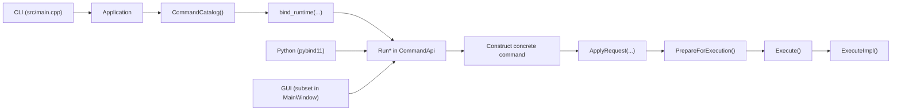

# Command Architecture

Current command registration and execution flow.

Related guides:

- [`../adding-a-command.md`](../adding-a-command.md)
- [`../development-guidelines.md`](../development-guidelines.md)

## 1. Source of truth

Top-level command membership is defined in:

- `src/core/internal/CommandList.def`

Each entry uses:

- `RHBM_GEM_COMMAND(COMMAND_ID, COMMAND_TYPE, CLI_NAME, DESCRIPTION, PROFILE)`

The manifest drives:

- generated `CommandId` entries in `include/rhbm_gem/core/command/CommandMetadata.hpp`
- generated `Run*` declarations in `include/rhbm_gem/core/command/CommandApi.hpp`
- generated `Run*` definitions in `src/core/command/CommandApi.cpp`
- generated command catalog entries in `src/core/command/CommandCatalog.cpp`
- generated pybind `Run*` exports in `bindings/CommandApiBindings.cpp`
- generated source/test CMake lists
- generated sections in this document
- CLI registration order through `CommandCatalog()`

The manifest does not generate these manual surfaces:

- request structs in `include/rhbm_gem/core/command/CommandApi.hpp`
- command-specific CLI option binding logic in `src/core/command/CommandCatalog.cpp`
- pybind request-field exposure in `bindings/CommandApiBindings.cpp`
- GUI exposure in `src/gui/MainWindow.cpp`

### Command manifest

<!-- BEGIN GENERATED: command-manifest -->
1. `potential_analysis`
2. `potential_display`
3. `result_dump`
4. `map_simulation`
5. `map_visualization`
6. `position_estimation`
7. `model_test`
<!-- END GENERATED: command-manifest -->

## 2. Execution surfaces

All entrypoints converge on the public `Run*` functions in `CommandApi`.

Current entrypoints:

- CLI: `src/main.cpp` creates `CLI::App`, `Application` requires exactly one subcommand, and
  `RegisterAllCommands()` adds subcommands from `CommandCatalog()`.
- Python: `bindings/CoreBindings.cpp` loads shared bindings and command bindings.
- GUI: `src/gui/MainWindow.cpp` currently exposes only `map_simulation`,
  `potential_analysis`, and `result_dump`.

## 3. Command catalog and runtime binders

`CommandCatalog()` returns `CommandDescriptor` entries with:

- `id`
- `name`
- `description`
- `profile`
- `bind_runtime`

`bind_runtime` is now a private implementation detail inside `src/core/command/CommandCatalog.cpp`;
there is no separate runtime-registry header anymore.

Catalog entries are built through a shared descriptor factory in `CommandCatalog.cpp` rather than
per-command `Bind*Runtime(...)` wrappers. The manifest still drives the generated catalog block,
but command-specific CLI binding stays in `Bind<Command>RequestOptions(...)`.

Each runtime binder:

1. Creates a request object.
2. Applies shared CLI options from the command profile.
3. Binds command-specific CLI options.
4. Returns a runner that calls the matching `Run*` function.

## 4. Public request surface

Public command requests live in `include/rhbm_gem/core/command/CommandApi.hpp`.

Shared request fields:

- `thread_size`
- `verbose_level`
- `database_path`
- `folder_path`

`CommonOptionProfile` in `include/rhbm_gem/core/command/CommandMetadata.hpp` controls which
shared options are active:

- `FileWorkflow` -> `Threading | Verbose | OutputFolder`
- `DatabaseWorkflow` -> `Threading | Verbose | Database | OutputFolder`

### Shared policy matrix

<!-- BEGIN GENERATED: command-surface-matrix -->
| Command | Uses database at runtime | Uses output folder |
| --- | --- | --- |
| `potential_analysis` | yes | yes |
| `potential_display` | yes | yes |
| `result_dump` | yes | yes |
| `map_simulation` | no | yes |
| `map_visualization` | no | yes |
| `position_estimation` | no | yes |
| `model_test` | no | yes |
<!-- END GENERATED: command-surface-matrix -->

## 5. Concrete command contract

Concrete command classes are internal types under `src/core/command/`.

The current pattern is:

1. Define `Options` derived from `CommandOptions`.
2. Derive from `CommandWithProfileOptions<...>` or `CommandWithOptions<...>`.
3. Implement `ApplyRequest(const XxxRequest&)`.
4. Call `ApplyCommonRequest(request.common)` from `ApplyRequest(...)`.
5. Keep cross-field validation in `ValidateOptions()`.
6. Reset transient execution state in `ResetRuntimeState()`.
7. Keep `ExecuteImpl()` focused on workflow orchestration.

Common extension helpers from `CommandBase` include:

- `MutateOptions(...)`
- `AddValidationError(...)`
- `AddNormalizationWarning(...)`
- `ResetParseIssues(...)`
- `ResetPrepareIssues(...)`
- `SetRequiredExistingPathOption(...)`
- `SetOptionalExistingPathOption(...)`
- `SetNormalizedScalarOption(...)`
- `SetFinitePositiveScalarOption(...)`
- `SetFiniteNonNegativeScalarOption(...)`
- `SetPositiveScalarOption(...)`
- `SetValidatedEnumOption(...)`
- `BuildOutputPath(...)`

## 6. Lifecycle and validation

`Run*` functions in `src/core/command/CommandApi.cpp` follow this sequence:

1. Construct the concrete command.
2. Call `ApplyRequest(...)`.
3. Call `PrepareForExecution()`.
4. Return early with validation issues if preparation fails.
5. Call `Execute()`.
6. Return an `ExecutionReport`.

`PrepareForExecution()` runs:

1. `BeginPreparationPass()`
2. `RunValidationPass()`
3. `RunFilesystemPreflight()`

Current preflight behavior:

- resets transient runtime state
- clears loaded `DataObjectManager` state
- runs `ValidateOptions()`
- creates the database parent directory when needed for `DatabaseWorkflow`
- creates the output folder when needed

Validation phases:

- `Parse`: request application and scalar/enum/path setters
- `Prepare`: `ValidateOptions()` and filesystem preflight

Prepared-state rule:

- option mutations must go through `MutateOptions(...)` or helpers built on top of it, because
  mutation invalidates prepared state and clears prepare-phase issues

## 7. Python and GUI integration

Python bindings are split across:

- `bindings/CoreBindings.cpp`
- `bindings/CommonBindings.cpp`
- `bindings/CommandApiBindings.cpp`

`bindings/CommonBindings.cpp` exposes shared enums and diagnostics.
`bindings/CommandApiBindings.cpp` exposes request structs, `ExecutionReport`, and all `Run*`
functions.

The GUI is not manifest-driven today. `src/gui/MainWindow.cpp` still builds request objects
manually for its subset, but it now reads command names and shared option policy from
`CommandCatalog()` instead of maintaining a second hard-coded metadata list.

### Python command surface

<!-- BEGIN GENERATED: command-python-surface -->
### Python request types
- `CommonCommandRequest`
- `PotentialAnalysisRequest`
- `PotentialDisplayRequest`
- `ResultDumpRequest`
- `MapSimulationRequest`
- `MapVisualizationRequest`
- `PositionEstimationRequest`
- `HRLModelTestRequest`

### Python run functions
- `RunPotentialAnalysis(...)`
- `RunPotentialDisplay(...)`
- `RunResultDump(...)`
- `RunMapSimulation(...)`
- `RunMapVisualization(...)`
- `RunPositionEstimation(...)`
- `RunHRLModelTest(...)`

### Shared diagnostics types
- `LogLevel`
- `ValidationPhase`
- `ValidationIssue`
- `ExecutionReport`
<!-- END GENERATED: command-python-surface -->

## 8. Files that usually move together

When a command changes, review these files together:

- `src/core/internal/CommandList.def`
- `include/rhbm_gem/core/command/CommandApi.hpp`
- `src/core/command/CommandApi.cpp`
- `src/core/command/CommandCatalog.cpp`
- `bindings/CommandApiBindings.cpp`
- `src/core/command/<Command>.hpp`
- `src/core/command/<Command>.cpp`
- `tests/core/command/`
- this document and `docs/developer/adding-a-command.md`
