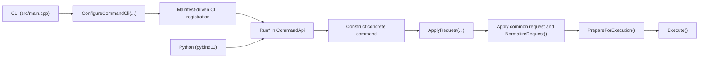

# Command Architecture

This page documents the command system. It describes the implementation that is in this
repository.

Related guides:

- [`docs/developer/adding-a-command.md`](/docs/developer/adding-a-command.md)
- [`docs/developer/development-guidelines.md`](/docs/developer/development-guidelines.md)

## 1. Source of truth

Top-level command membership is defined in:

- [`include/rhbm_gem/core/command/CommandList.def`](/include/rhbm_gem/core/command/CommandList.def)

Each entry uses:

- `RHBM_GEM_COMMAND(COMMAND_ID, CLI_NAME, DESCRIPTION)`

The manifest is expanded with X-macros by:

- [`include/rhbm_gem/core/command/CommandContract.hpp`](/include/rhbm_gem/core/command/CommandContract.hpp)
- [`include/rhbm_gem/core/command/CommandApi.hpp`](/include/rhbm_gem/core/command/CommandApi.hpp)
- [`src/core/command/CommandApi.cpp`](/src/core/command/CommandApi.cpp)
- [`src/core/command/CommandOptionSupport.cpp`](/src/core/command/CommandOptionSupport.cpp)
- [`src/python/CommandApiBindings.cpp`](/src/python/CommandApiBindings.cpp)

Request structs are declared in [`include/rhbm_gem/core/command/CommandApi.hpp`](/include/rhbm_gem/core/command/CommandApi.hpp).
Each request type defines `VisitFields(...)`, and that field schema is reused by both CLI
registration and Python bindings.

Concrete command headers are aggregated by:

- [`src/core/internal/command/CommandRegistry.hpp`](/src/core/internal/command/CommandRegistry.hpp)

Stable commands in `CommandList.def`:

1. `potential_analysis`
2. `potential_display`
3. `result_dump`
4. `map_simulation`
5. `model_test`

Experimental commands in the `#ifdef RHBM_GEM_ENABLE_EXPERIMENTAL_FEATURE` block:

1. `map_visualization`
2. `position_estimation`

## 2. Execution surfaces

All entrypoints converge on the public `Run*` functions declared in `CommandApi.hpp` and defined
in `CommandApi.cpp`.

## 3. Registry and registration

`ConfigureCommandCli(CLI::App &)` is the top-level CLI setup entrypoint. It enables
`require_subcommand(1)` and expands `CommandList.def` to register each subcommand.

Shared CLI registration lives in [`src/core/command/CommandOptionSupport.cpp`](/src/core/command/CommandOptionSupport.cpp).
For each manifest entry it:

1. creates a subcommand
2. constructs one request object
3. binds common fields from `CommonCommandRequest::VisitFields(...)`
4. binds command-specific fields from `XxxRequest::VisitFields(...)`
5. routes the callback to the matching `Run*` function

[`src/core/command/CommandApi.cpp`](/src/core/command/CommandApi.cpp) and [`src/core/command/CommandOptionSupport.cpp`](/src/core/command/CommandOptionSupport.cpp) both include
[`src/core/internal/command/CommandRegistry.hpp`](/src/core/internal/command/CommandRegistry.hpp), so adding a command requires updating that
header include list.

## 4. Public contract and request surface

Shared command metadata, default paths, and validation types live in:

- [`include/rhbm_gem/core/command/CommandContract.hpp`](/include/rhbm_gem/core/command/CommandContract.hpp)

This header defines:

- `CommandId`
- `CommandDescriptor`
- default data and database path helpers
- `ValidationPhase`
- `ValidationIssue`

Public request types, `ExecutionReport`, request field descriptors, and `Run*` entrypoints live in:

- [`include/rhbm_gem/core/command/CommandApi.hpp`](/include/rhbm_gem/core/command/CommandApi.hpp)

Shared request fields are declared on `CommonCommandRequest`:

- `thread_size`
- `verbose_level`
- `folder_path`

Database-backed commands declare `database_path` on their own request type:

- `PotentialAnalysisRequest`
- `PotentialDisplayRequest`
- `ResultDumpRequest`

Shared command enums and their CLI/Python mappings live in:

- [`include/rhbm_gem/core/command/CommandEnumClass.hpp`](/include/rhbm_gem/core/command/CommandEnumClass.hpp)

## 5. Concrete command contract

Concrete command classes are internal types with headers under [`src/core/internal/command/`](/src/core/internal/command/)
and implementation files under [`src/core/command/`](/src/core/command/).

The standard shape is:

1. derive from `CommandWithRequest<XxxRequest>`
2. use the public request as the command configuration object
3. construct the command with the default `CommandWithRequest<XxxRequest>{}` base
4. keep field normalization in `NormalizeRequest()`
5. keep cross-field checks in `ValidateOptions()`
6. keep transient execution cleanup in `ResetRuntimeState()`
7. keep workflow orchestration in `ExecuteImpl()`

`CommandWithRequest<XxxRequest>::ApplyRequest(...)` performs this sequence:

1. copy the public request into the command
2. apply `request.common` through `ApplyCommonRequest(...)`
3. sync normalized common values back into `request.common`
4. call `NormalizeRequest()`

Useful `CommandBase` helpers:

- `AssignOption(...)`
- `MutateOptions(...)`
- `AddValidationError(...)`
- `AddNormalizationWarning(...)`
- `ResetParseIssues(...)`
- `ResetPrepareIssues(...)`
- `SetRequiredExistingPathOption(...)`
- `SetOptionalExistingPathOption(...)`
- `SetNormalizedScalarOption(...)`
- `SetFinitePositiveScalarOption(...)`
- `SetFiniteNonNegativeScalarOption(...)`
- `SetPositiveScalarOption(...)`
- `SetValidatedEnumOption(...)`
- `BuildOutputPath(...)`

## 6. Lifecycle and validation

Each `Run*` function in `CommandApi.cpp` follows this sequence:

1. construct the concrete command
2. call `ApplyRequest(...)`
3. call `PrepareForExecution()`
4. return early with `prepared=false` if preparation fails
5. call `Execute()`
6. return an `ExecutionReport`

`PrepareForExecution()` in `CommandBase` performs:

1. `BeginPreparationPass()`
2. `RunValidationPass()`
3. `RunFilesystemPreflight()`

`BeginPreparationPass()`:

- sets the logger level from the common request
- calls `ResetRuntimeState()`
- clears loaded `DataObjectManager` objects
- invalidates prepared state and clears prepare-phase issues

`RunValidationPass()`:

- calls `ValidateOptions()`
- reports validation issues
- fails preparation if any error-level issue exists

`RunFilesystemPreflight()`:

- creates the output folder when `folder_path` is not empty and the directory does not already
  exist
- records a prepare-phase validation error if directory creation fails
- does not create database parent directories

Database setup stays in command execution code. Commands that use SQLite call
`DataObjectManager::SetDatabaseManager(...)` when they open the database during execution.

## 7. Command support helpers

Cross-command model and map helpers live in:

- [`src/core/internal/command/CommandDataLoader.hpp`](/src/core/internal/command/CommandDataLoader.hpp)
- [`src/core/command/CommandDataLoader.cpp`](/src/core/command/CommandDataLoader.cpp)
- [`src/core/internal/command/CommandModelSupport.hpp`](/src/core/internal/command/CommandModelSupport.hpp)
- [`src/core/command/CommandModelSupport.cpp`](/src/core/command/CommandModelSupport.cpp)

These modules contain:

- typed file/database loaders such as `LoadModelFromFile(...)`
- map normalization helpers
- model preparation helpers
- atom collection and simulation helpers
- atom and bond context construction helpers

## 8. Python integration

Python bindings live in:

- [`src/python/CommandApiBindings.cpp`](/src/python/CommandApiBindings.cpp)

`CommandApiBindings.cpp` exposes:

- shared enums from `CommandEnumClass.hpp`
- `ValidationPhase`
- `ValidationIssue`
- `CommonCommandRequest`
- one request type per manifest entry
- `ExecutionReport`
- all `Run*` functions from the manifest

Request properties are emitted by walking each request type's `VisitFields(...)`.
Experimental request types and `Run*` bindings follow the same manifest and feature-flag rules as
the public C++ API.
