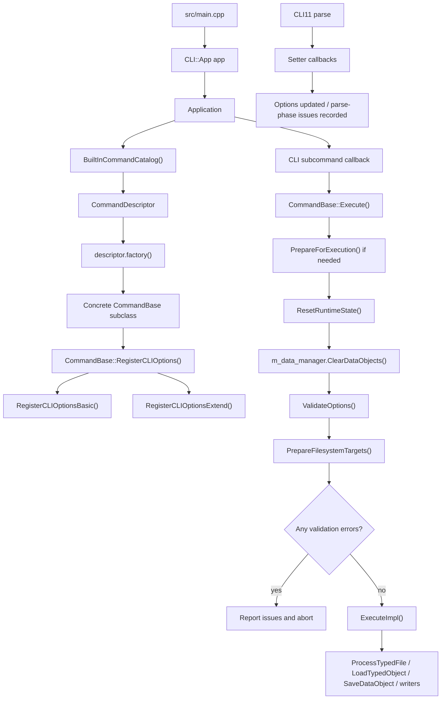
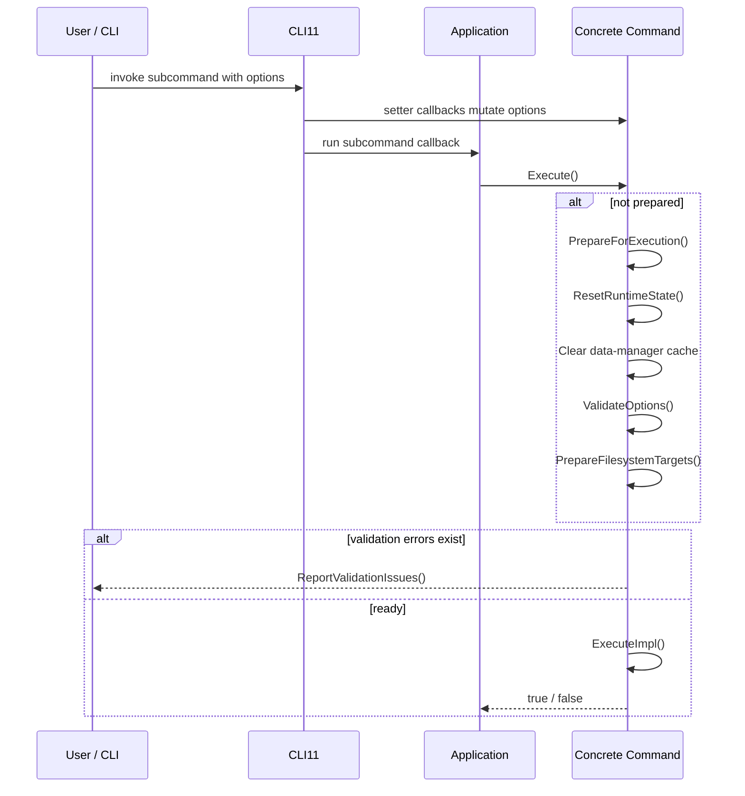

# Command Architecture

This document describes the current command-system architecture after the catalog-driven refactor. It focuses on how commands are registered, how option parsing and validation are layered, and how concrete commands should interact with the rest of the codebase.

Use this document together with [`../development-guidelines.md`](../development-guidelines.md), especially the contributor guidance for adding new built-in commands. Editable diagram sources for this area live under [`./diagrams/`](./diagrams/).

## 1. Purpose

The command layer is the orchestration boundary of the application.

It is responsible for:

- translating CLI or Python-binding inputs into command options
- normalizing and validating those options
- preparing runtime prerequisites such as parsed files, loaded database objects, and output locations
- invoking domain logic from `core`, `data`, and `utils`
- emitting user-facing logs, persisted objects, and output artifacts

It is not responsible for:

- low-level file format parsing
- database implementation details
- heavy numerical or domain algorithms

Those concerns should stay behind `DataObjectManager`, file processors, writers, and domain-specific helpers.

## 2. Runtime Topology

The command system is assembled explicitly at process startup. The registration flow is:

Two structural consequences matter for contributors:

- there is one command instance per registered CLI subcommand
- command registration order is defined only by `BuiltInCommandCatalog()`

## 3. Registration Model

### 3.1 Process entry points

The CLI entry point is small by design:

- `src/main.cpp` creates `CLI::App`
- `Application` receives that `CLI::App`
- `Application` requires exactly one subcommand and registers all built-in commands

`Application::RegisterCommand(...)` performs the real wiring:

1. create a command instance through `CommandDescriptor::factory`
2. add a CLI11 subcommand using the descriptor name and description
3. call `CommandBase::RegisterCLIOptions(...)`
4. store the command in a `shared_ptr`
5. bind the subcommand callback to `CommandBase::Execute()`

This is the entire built-in registration path. There is no secondary registry hidden elsewhere.

### 3.2 Built-in command catalog

Built-in CLI commands are defined centrally in `BuiltInCommandCatalog()`. `Application` iterates that catalog directly and creates one CLI subcommand per descriptor.

The built-in manifest order is generated from the built-in command catalog:

<!-- BEGIN GENERATED: built-in-command-manifest -->
1. `potential_analysis`
2. `potential_display`
3. `result_dump`
4. `map_simulation`
5. `map_visualization`
6. `position_estimation`
7. `model_test`
<!-- END GENERATED: built-in-command-manifest -->

This gives deterministic help ordering and avoids any dependence on cross-translation-unit static initialization order.

### 3.3 Descriptor responsibilities

Each built-in `CommandDescriptor` stores:

- the built-in `CommandId`
- the command name
- the user-facing description
- the command factory returning `std::unique_ptr<CommandBase>`
- `CommandSurface` metadata for shared option exposure
- `DatabaseUsage`
- `BindingExposure`
- the Python binding name when the command is Python-public

The project does not currently provide a self-registration API for commands. Built-in CLI behavior flows only through the built-in command catalog.

## 4. `CommandBase` Contract

All built-in commands derive from `CommandBase`.

### 4.1 Required overrides

Every concrete command must provide:

- `bool ExecuteImpl()`
- `void RegisterCLIOptionsExtend(CLI::App * command)`
- `const CommandOptions & GetOptions() const`
- `CommandOptions & GetOptions()`
- `CommandId GetCommandId() const`

Optional lifecycle hooks are:

- `void ValidateOptions()`
- `void ResetRuntimeState()`

`CommandBase::Execute()` is the public non-virtual wrapper. It is the only supported execution entry point for CLI callbacks, direct C++ callers, and Python bindings.

### 4.2 Shared base state

`CommandBase` already owns and manages:

- `DataObjectManager m_data_manager`
- `std::vector<ValidationIssue> m_validation_issues`
- the prepared-state flag `m_is_prepared_for_execution`
- base option fields inherited from `CommandOptions`

Shared base options are:

- `thread_size`
- `verbose_level`
- `database_path`
- `folder_path`

### 4.3 Common-option surface

Each command inherits only the common CLI options enabled by its `CommandSurface` metadata:

- `CommonOption::Threading`
- `CommonOption::Verbose`
- `CommonOption::Database`
- `CommonOption::OutputFolder`

`CommandBase::RegisterCLIOptionsBasic(...)` inspects the current command descriptor through `FindCommandDescriptor(GetCommandId())` and registers only the applicable base options.

This means:

- commands do not manually duplicate shared option definitions
- adding or removing a shared option from a command is a catalog-level change

### 4.4 Setter pattern and option ownership

The intended pattern for command-local options is:

1. define `struct Options : public CommandOptions`
2. store one `Options m_options`
3. return `m_options` from both `GetOptions()` overloads
4. mutate fields only through setters
5. let setters invalidate prepared state via `MutateOptions(...)`

Concrete setters should use the shared helper families on `CommandBase` when possible:

- `SetNormalizedScalarOption(...)`
- `SetValidatedScalarOption(...)`
- `SetFinitePositiveScalarOption(...)`
- `SetFiniteNonNegativeScalarOption(...)`
- `SetPositiveScalarOption(...)`
- `SetValidatedEnumOption(...)`
- `SetRequiredExistingPathOption(...)`
- `SetOptionalExistingPathOption(...)`

This keeps command code consistent in three areas:

- parse-time diagnostics are attached to the correct option name
- invalid input falls back in a deliberate and reviewable way
- any option change clears prepared-state assumptions automatically

## 5. Validation and Execution Lifecycle

Application callbacks invoke only `Execute()`. `Execute()` internally decides whether `PrepareForExecution()` must run.

The lifecycle is:

### 5.1 Validation phases

Validation issues are explicitly tagged by phase:

| Phase | Where it usually happens | Typical responsibility |
| --- | --- | --- |
| `Parse` | setter callbacks | single-field checks, enum validation, required-path existence checks, safe fallback warnings |
| `Prepare` | `ValidateOptions()` and `PrepareFilesystemTargets()` | cross-field constraints, mode-specific requirements, directory preflight |
| `Runtime` | `ExecuteImpl()` or deeper runtime helpers | unexpected workflow failures after preparation |

Two practical rules follow from this split:

- single-option validation belongs in setters whenever possible
- cross-field or mode-dependent validation belongs in `ValidateOptions()`

### 5.2 What `PrepareForExecution()` actually does

`PrepareForExecution()` is more than a boolean guard. In the current implementation it:

1. applies the selected log level
2. calls `ResetRuntimeState()`
3. clears all cached data objects from `m_data_manager`
4. invalidates any previous prepared state
5. runs `ValidateOptions()`
6. reports issues and aborts early if any validation error already exists
7. runs `PrepareFilesystemTargets()`
8. reports issues again and marks the command prepared only if no errors remain

### 5.3 Prepared-state invalidation

Any setter path should call `MutateOptions(...)` directly or indirectly. That invalidates the prepared flag and clears `Prepare` and `Runtime` issues so the next execution works from a fresh option snapshot.

`Execute()` also clears the prepared flag after every run, so prepared state is intentionally short-lived:

- explicit `PrepareForExecution()` can be reused by the immediately following `Execute()`
- prepared state is not a long-term cache across multiple executions

### 5.4 Filesystem preflight

`PrepareFilesystemTargets()` is the only shared place where base filesystem side effects happen before `ExecuteImpl()`:

- if the command uses the database surface, it creates the parent directory of `database_path` when needed
- if the command uses the output-folder surface, it creates `folder_path` when needed

Setter paths do not create directories. They only normalize values or record validation issues.

## 6. Data Boundary

`DataObjectManager` is the command layer's boundary for file parsing, in-memory object access, database loading, and persistence.

Preferred command-facing helpers on `CommandBase` are:

- `ProcessTypedFile<T>(path, key_tag, label)`
- `OptionalProcessTypedFile<T>(path, key_tag, label)`
- `LoadTypedObject<T>(key_tag, label)`
- `RequireDatabaseManager()`
- `BuildOutputPath(stem, extension)`

These helpers exist to keep command code focused on orchestration:

- commands decide which objects are needed
- commands decide when those objects should be loaded or saved
- `DataObjectManager` and related processors decide how the file/database operations are implemented

When database-backed objects are needed, `RequireDatabaseManager()` must be called before `LoadTypedObject(...)` or any direct `LoadDataObject(...)` / `SaveDataObject(...)` use.

## 7. Current Command Families

The current commands are not all shaped identically. After the refactor they share a base lifecycle, but their data access patterns fall into three clear families.

### 7.1 File-driven analysis and generation

These commands primarily start from input files and use `ProcessTypedFile(...)`:

| Command | Primary inputs | Main phases | Main outputs |
| --- | --- | --- | --- |
| `potential_analysis` | model file, map file, database path | load model/map, preprocess, sample, classify, fit, save analyzed model | persisted `ModelObject` in SQLite |
| `map_simulation` | model file, blurring width list | load model, build atom list, simulate maps for each width | `.map` files |
| `map_visualization` | model file, map file, atom serial id | load model/map, normalize, derive local sampling frame, paint 2D slice | PDF plot |
| `position_estimation` | map file | load map, normalize, threshold voxels, KD-tree convergence, deduplicate | ChimeraX `.cmm` points |

### 7.2 Database-driven presentation and export

These commands primarily load previously saved `ModelObject` instances from SQLite:

| Command | Primary inputs | Main phases | Main outputs |
| --- | --- | --- | --- |
| `potential_display` | painter choice, model key list, optional reference groups | load models, apply atom selection, dispatch painter | painter-specific output files |
| `result_dump` | printer choice, model key list, optional map file | load models, collect atoms with local potential entries, dispatch dump mode | CSV, CMM, CIF-related exports depending on mode |

### 7.3 Standalone algorithm/test harness

| Command | Primary inputs | Main phases | Main outputs |
| --- | --- | --- | --- |
| `model_test` | tester mode and fitting parameters | choose tester workflow and run synthetic experiments | logs and optional ROOT-backed plots |

`model_test` still inherits from `CommandBase` for a consistent CLI surface, but it does not rely on `DataObjectManager` for its main workflow.

### 7.4 Command surface matrix

<!-- BEGIN GENERATED: command-surface-matrix -->
| Command | Uses database at runtime | Uses output folder | Exposed to Python |
| --- | --- | --- | --- |
| `potential_analysis` | yes | yes | yes |
| `potential_display` | yes | yes | yes |
| `result_dump` | yes | yes | yes |
| `map_simulation` | no | yes | yes |
| `map_visualization` | no | yes | no |
| `position_estimation` | no | yes | no |
| `model_test` | no | yes | no |
<!-- END GENERATED: command-surface-matrix -->

## 8. Concrete Command Notes

### 8.1 `potential_analysis`

This is still the best reference implementation for a full command lifecycle.

In current code it:

1. requires a database manager
2. parses the model and map files
3. optionally rewrites model metadata for simulation mode
4. normalizes map values
5. selects atoms and bonds, attaching fresh local-potential entries
6. samples map values around selected atoms
7. classifies atoms into group structures
8. runs either alpha training or direct local fitting
9. runs potential fitting
10. optionally runs the experimental bond workflow when compiled in
11. saves the analyzed model back to SQLite under `saved_key_tag`

This command also demonstrates the intended split between:

- parse-phase scalar validation in setters
- prepare-phase cross-field checks in `ValidateOptions()`

Current prepare-time checks are:

- `--simulation true` requires a positive `--sim-resolution`
- `--sampling-min <= --sampling-max`
- `--fit-min <= --fit-max`

### 8.2 `potential_display`

This is the clearest example of the "load saved models, then dispatch a strategy object" pattern.

Its workflow is:

1. require the database manager
2. load one or more primary `ModelObject` instances
3. optionally load grouped reference-model sets
4. apply `AtomSelector` rules to mark atoms as selected
5. instantiate a `PainterBase` subtype from `PainterType`
6. feed selected data into the painter

This is the preferred extension point for new display/reporting flows that consume stored analysis results.

### 8.3 `result_dump`

This command is structurally similar to `potential_display`, but its dispatch point is export mode rather than painter strategy.

Its workflow is:

1. require the database manager
2. optionally parse a map file
3. load each requested `ModelObject`
4. collect atoms that already contain local-potential entries
5. dispatch to a dump mode selected by `PrinterType`

The important mode-dependent validation is in `ValidateOptions()`:

- `PrinterType::MAP_VALUE` requires `--map`

If new output formats are needed, extending `PrinterType` and this command is usually better than introducing a separate top-level command.

### 8.4 `map_simulation`

`map_simulation` is intentionally file-driven and does not touch the database.

It demonstrates:

- required input-path validation through a setter
- list-style parsing and normalization for `--blurring-width`
- generation of multiple output artifacts from one parsed model
- use of `BuildOutputPath(...)` without any database dependency

Its key prepare-time rule is simple:

- at least one positive blurring width must remain after parsing and normalization

### 8.5 `map_visualization`

`map_visualization` is a focused analysis/visualization command rather than a general report generator.

It currently:

1. parses one model and one map
2. normalizes the map
3. selects all atoms and bonds
4. finds the requested atom by serial ID
5. derives a local reference frame from a non-degenerate bond vector
6. samples a 2D local slice
7. writes a PDF named like `map_slice_<model>_atom<id>.pdf`

This is a good reference when adding a specialized command with a small, self-contained workflow and one output artifact.

### 8.6 `position_estimation`

`position_estimation` is the clearest map-only algorithm command.

It currently:

1. parses one map and normalizes it
2. selects voxels above a threshold ratio
3. builds a KD-tree over selected voxels
4. iteratively updates candidate points using weighted nearest neighbors
5. quantizes and deduplicates the converged points
6. writes `point_list_<mapname>.cmm`

This command is a good reference for algorithm-heavy flows that still fit the shared command lifecycle cleanly.

### 8.7 `model_test`

`model_test` is a CLI-facing wrapper around synthetic tester workflows.

It demonstrates that `CommandBase` is still useful even when a command mostly needs:

- shared CLI options
- enum-based mode dispatch
- validation helpers
- consistent logging and timing

Its main prepare-time rule is:

- `--fit-min <= --fit-max`

## 9. CLI vs Python Binding Surface

The CLI surface is driven by:

- `src/main.cpp`
- `Application`
- `BuiltInCommandCatalog()`
- concrete `CommandBase` subclasses

The Python surface is separate and currently exposes only a subset of commands through `bindings/CoreBindings.cpp`.

<!-- BEGIN GENERATED: python-public-command-surface -->
### Python-public command classes
- `PotentialAnalysisCommand`
- `PotentialDisplayCommand`
- `ResultDumpCommand`
- `MapSimulationCommand`

### Shared diagnostics types
- `LogLevel`
- `ValidationPhase`
- `ValidationIssue`

### Shared diagnostics methods on Python-public commands
- `PrepareForExecution()`
- `HasValidationErrors()`
- `GetValidationIssues()`
<!-- END GENERATED: python-public-command-surface -->

Implications for future work:

- adding a new CLI command does not automatically expose it to Python
- `BindingExposure` and `python_binding_name` must stay consistent with `bindings/CoreBindings.cpp`
- Python-bound commands call the same `Execute()` path as the CLI
- `PrepareForExecution()` diagnostics are part of the current Python-facing contract

## 10. Implementation Rules for New Commands

When adding a new built-in command, follow this order:

1. add the public interface under `include/core/`
2. add the implementation under `src/core/`
3. derive from `CommandBase`
4. define `Options : CommandOptions`
5. implement setters for all command-local options
6. use setter helpers on `CommandBase` before adding custom validation boilerplate
7. keep single-field validation in setters
8. keep cross-field or mode-dependent validation in `ValidateOptions()`
9. keep runtime caches and transient pointers resettable through `ResetRuntimeState()`
10. keep `ExecuteImpl()` phase-oriented and orchestration-focused
11. use `DataObjectManager` helper paths for parsing, loading, and persistence
12. add a `CommandDescriptor` entry to `BuiltInCommandCatalog()`
13. update bindings, tests, and docs when the command is part of a public workflow

A useful mental model is:

- catalog decides whether the command exists and which common options it gets
- the command class decides option semantics and workflow sequencing
- the data layer decides how files and persistence are implemented

## 11. What to Avoid

Avoid these anti-patterns:

- bypassing `BuiltInCommandCatalog()` and hard-coding new built-in CLI subcommands elsewhere
- reintroducing static self-registration patterns
- validating obvious bad input only deep inside `ExecuteImpl()`
- mixing CLI parsing details into algorithm-heavy workflow code
- creating directories during parse-time setter execution
- letting commands reach around `DataObjectManager` to manipulate persistence internals directly
- building a new top-level command when an enum-based mode extension on an existing command is the cleaner fit

## 12. Recommended Reference Files

For future command work, inspect these files first:

- `src/main.cpp`
- `include/core/Application.hpp`
- `src/core/Application.cpp`
- `include/core/CommandBase.hpp`
- `src/core/CommandBase.cpp`
- `include/core/BuiltInCommandCatalog.hpp`
- `src/core/BuiltInCommandCatalog.cpp`
- `include/core/CommandMetadata.hpp`
- `include/core/CommandOptionBinding.hpp`
- `include/core/DataObjectManager.hpp`
- `src/core/DataObjectManager.cpp`
- `include/core/PotentialAnalysisCommand.hpp`
- `src/core/PotentialAnalysisCommand.cpp`
- `include/core/PotentialDisplayCommand.hpp`
- `src/core/PotentialDisplayCommand.cpp`
- `include/core/ResultDumpCommand.hpp`
- `src/core/ResultDumpCommand.cpp`
- `include/core/MapSimulationCommand.hpp`
- `src/core/MapSimulationCommand.cpp`
- `include/core/MapVisualizationCommand.hpp`
- `src/core/MapVisualizationCommand.cpp`
- `include/core/PositionEstimationCommand.hpp`
- `src/core/PositionEstimationCommand.cpp`
- `include/core/HRLModelTestCommand.hpp`
- `src/core/HRLModelTestCommand.cpp`
- `bindings/CoreBindings.cpp`
