# Command Architecture

## Source of Truth

Top-level command membership is defined in the internal command catalog in
[`src/core/command/detail/CommandCatalog.hpp`](/src/core/command/detail/CommandCatalog.hpp).

Each entry uses:

- `CommandEntry<CommandType>{cli_name, description, request_type_name}`

That typed list is visited by:

- [`src/core/command/CommandSystem.cpp`](/src/core/command/CommandSystem.cpp)
- [`src/python/CommandSystemBindings.cpp`](/src/python/CommandSystemBindings.cpp)

The catalog also keeps the shared typed execution helper internal, so CLI and Python bindings reuse
the same command execution path without exposing concrete command headers through the public API.

## Public Surface

Public command headers separate concerns:

- [`include/rhbm_gem/core/command/CommandSystem.hpp`](/include/rhbm_gem/core/command/CommandSystem.hpp)
  - `ListCommands()`
- [`include/rhbm_gem/core/command/CommandSystem.hpp`](/include/rhbm_gem/core/command/CommandSystem.hpp)
  - typed `RunCommand(request)` execution API
- [`include/rhbm_gem/core/command/CommandTypes.hpp`](/include/rhbm_gem/core/command/CommandTypes.hpp)
  - shared public enums
  - enum alias and binding metadata in `rhbm_gem::internal`
  - `CommandRequestBase`
  - one plain request DTO per command
  - default data/database path helpers
  - `ValidationIssue`
  - `CommandResult`
  - `CommandInfo`

The public API is centered on typed requests, `RunCommand(request)`, shared enums, and path helpers.
CLI wiring and request binding schema stay internal.
The private command catalog owns request-to-command routing, so concrete command headers do not
become public includes.

## Internal Binding Model

CLI and Python bindings share one internal schema in
[`src/core/command/detail/CommandCatalog.hpp`](/src/core/command/detail/CommandCatalog.hpp).
Those request-schema helpers live under `rhbm_gem::command_internal`.
Each schema entry uses `FieldSpec{...}`; CLI binding behavior is inferred from the request member
type. CSV lists use `,`, and reference groups use `group=item1,item2` parsing as fixed binder
behavior rather than schema configuration.
The `FieldSpec` field name is also used as the Python request attribute name.

That schema is the single source for:

- CLI option registration
- Python request field binding

Enum alias and binding metadata live next to the enum declarations in
[`include/rhbm_gem/core/command/CommandTypes.hpp`](/include/rhbm_gem/core/command/CommandTypes.hpp).
The helper symbols stay under `rhbm_gem::internal`.

## Execution Surfaces

### CLI

[`src/main.cpp`](/src/main.cpp) delegates to the public
[`RunCommandCLI(...)`](/include/rhbm_gem/core/command/CommandSystem.hpp), so the executable entrypoint
does not expose CLI11 setup or parsing details.

[`src/core/command/CommandSystem.cpp`](/src/core/command/CommandSystem.cpp):

1. enables `require_subcommand(1)`
2. visits the internal command catalog
3. creates one subcommand per command entry
4. binds shared `CommandRequestBase` fields
5. binds command-specific fields from `CommandRequestSchema`
6. routes the callback to `RunCommand(request)`
7. wraps CLI11 parsing and exit-code handling in `RunCommandCLI(...)`

### Python

[`src/python/CommandSystemBindings.cpp`](/src/python/CommandSystemBindings.cpp) binds:

- `CommandRequestBase`
- one request type per command
- `CommandResult`
- `ValidationIssue`
- shared enums from `CommandTypes.hpp`

Request type registration, `RunCommand(...)` overload membership, and request fields come from
the internal command catalog.

## Runtime Flow

All public execution entrypoints converge on the same flow:

```mermaid
flowchart LR
    A["CLI callback or Python call"] --> B["RunCommand(request)"]
    B --> C["Construct concrete command"]
    C --> D["ApplyRequest(...)"]
    D --> E["command.Run()"]
    E --> F["BeginPreparationPass()"]
    F --> G["RunValidationPass()"]
    G --> H["RunFilesystemPreflight()"]
    H --> I["ExecuteImpl()"]
    I --> J["CommandResult"]
```

`RunCommand(request)` returns `CommandResult` with:

- `succeeded == true` when execution completes
- `succeeded == false` when validation, preflight, or execution stops the command
- `issues` containing public validation diagnostics without exposing internal phase metadata

## Concrete Command Shape

Concrete command classes live in [`src/core/command/`](/src/core/command/).

Shared command-framework internals live in:

- [`src/core/command/detail/`](/src/core/command/detail/)

The standard shape is:

1. derive from `CommandBase<XxxRequest>`
2. keep parse-phase request normalization and validation in `NormalizeAndValidateRequest()`
3. keep semantic checks in `ValidatePreparedRequest()`
4. clear transient runtime state in `ResetRuntimeState()`
5. keep orchestration in `ExecuteImpl()`

`CommandBase<XxxRequest>`:

1. stores the typed request internally
2. uses shared base options during lifecycle/preflight
3. coerces shared base options
4. calls `NormalizeAndValidateRequest()`

## Shared Request Base

`CommandRequestBase` contributes these shared options:

- `job_count` exposed by CLI as `-j,--jobs`
- `verbosity` exposed by CLI as `-v,--verbose`
- `output_dir` exposed by CLI as `-o,--folder`

Command-specific fields live directly on each request DTO.

## Filesystem and Validation Behavior

`CommandBase` performs:

1. request normalization and validation issue tracking
2. output-directory preflight for `output_dir`
3. logger-level setup from `verbosity`

The generic layer manages only the shared `output_dir`. Internal validation still tracks
parse/prepare phase boundaries for issue clearing and log formatting, but those phases are
not part of the public DTO surface.
