# Command Architecture

This page documents the command system as it exists in this repository today.

## Source of Truth

Top-level command membership is defined in
[`src/core/command/CommandManifest.def`](/src/core/command/CommandManifest.def).

Each entry uses:

- `RHBM_GEM_COMMAND(COMMAND_ID, CLI_NAME, DESCRIPTION)`

That manifest is expanded by:

- [`src/core/command/CommandApi.cpp`](/src/core/command/CommandApi.cpp)
- [`src/core/command/CommandCli.cpp`](/src/core/command/CommandCli.cpp)

## Public Surface

Public command headers now separate concerns:

- [`include/rhbm_gem/core/command/CommandApi.hpp`](/include/rhbm_gem/core/command/CommandApi.hpp)
  - `CommandRequestBase`
  - one plain request DTO per command
  - `ValidationPhase`
  - `ValidationIssue`
  - `CommandOutcome`
  - `CommandResult`
  - `ListCommands()`
  - one `Run*` declaration per command
- [`include/rhbm_gem/core/command/CommandEnums.hpp`](/include/rhbm_gem/core/command/CommandEnums.hpp)
  - shared public enums
- [`include/rhbm_gem/core/command/CommandPaths.hpp`](/include/rhbm_gem/core/command/CommandPaths.hpp)
  - default data/database path helpers

The public surface does not expose CLI wiring, manifest macros, or request binding schema.

## Internal Binding Model

CLI and Python bindings share one internal schema in
[`src/core/internal/command/CommandRequestSchema.hpp`](/src/core/internal/command/CommandRequestSchema.hpp).

That schema is the single source for:

- CLI option registration
- Python request field binding

Internal enum alias and binding metadata live in
[`src/core/internal/command/CommandEnumMetadata.hpp`](/src/core/internal/command/CommandEnumMetadata.hpp).

Public enum types stay small; alias maps and binding tokens are internal-only.

## Execution Surfaces

### CLI

[`src/main.cpp`](/src/main.cpp) creates `CLI::App` and calls the internal
[`ConfigureCommandCli(...)`](/src/core/internal/command/CommandCli.hpp).

[`src/core/command/CommandCli.cpp`](/src/core/command/CommandCli.cpp):

1. enables `require_subcommand(1)`
2. expands `CommandManifest.def`
3. creates one subcommand per manifest entry
4. binds shared `CommandRequestBase` fields
5. binds command-specific fields from `CommandRequestSchema`
6. routes the callback to the corresponding `Run*` function

### Python

[`src/python/CommandApiBindings.cpp`](/src/python/CommandApiBindings.cpp) binds:

- `CommandRequestBase`
- one request type per command
- `CommandOutcome`
- `CommandResult`
- `ValidationPhase`
- `ValidationIssue`
- shared enums from `CommandEnums.hpp`

## Runtime Flow

All public execution entrypoints converge on the same flow:

```mermaid
flowchart LR
    A["CLI callback or Python call"] --> B["Run* in CommandApi"]
    B --> C["RunCommand(...)"]
    C --> D["Construct concrete command"]
    D --> E["ApplyRequest(...)"]
    E --> F["command.Run()"]
    F --> G["BeginPreparationPass()"]
    G --> H["RunValidationPass()"]
    H --> I["RunFilesystemPreflight()"]
    I --> J["ExecuteImpl()"]
    J --> K["CommandResult"]
```

`Run*` returns:

- `CommandOutcome::Succeeded` when execution completes
- `CommandOutcome::ValidationFailed` when validation/preflight stops execution
- `CommandOutcome::ExecutionFailed` when preparation succeeds but `ExecuteImpl()` returns false

## Concrete Command Shape

Concrete command classes live in:

- [`src/core/internal/command/`](/src/core/internal/command/)
- [`src/core/command/`](/src/core/command/)

The standard shape is:

1. derive from `CommandWithRequest<XxxRequest>`
2. keep request normalization in `NormalizeRequest()`
3. keep semantic checks in `ValidateOptions()`
4. clear transient runtime state in `ResetRuntimeState()`
5. keep orchestration in `ExecuteImpl()`

`CommandWithRequest<XxxRequest>`:

1. stores the typed request internally
2. binds the request to `CommandBase`
3. coerces shared base options through `CoerceBaseRequest(...)`
4. calls `NormalizeRequest()`

## Shared Request Base

`CommandRequestBase` contributes these shared options:

- `job_count` as `-j,--jobs`
- `verbosity` as `-v,--verbose`
- `output_dir` as `-o,--folder`

Command-specific fields live directly on each request DTO; there is no nested `common` wrapper.

## Filesystem and Validation Behavior

`CommandBase` performs:

1. request normalization and validation issue tracking
2. output-directory preflight for `output_dir`
3. logger-level setup from `verbosity`

The generic layer manages only the shared `output_dir`. Database path handling remains
command-specific.
