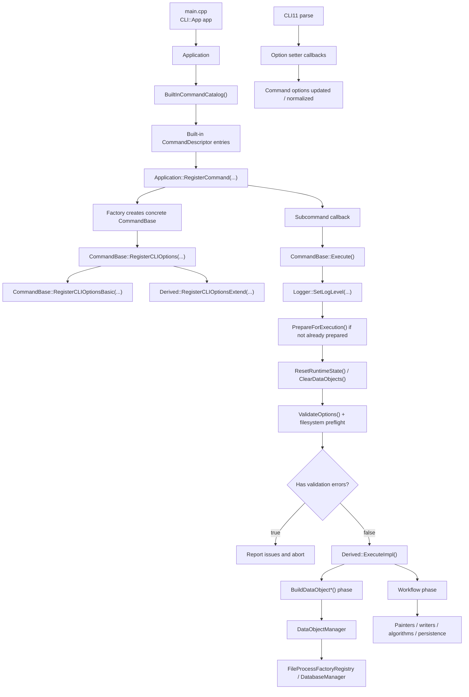
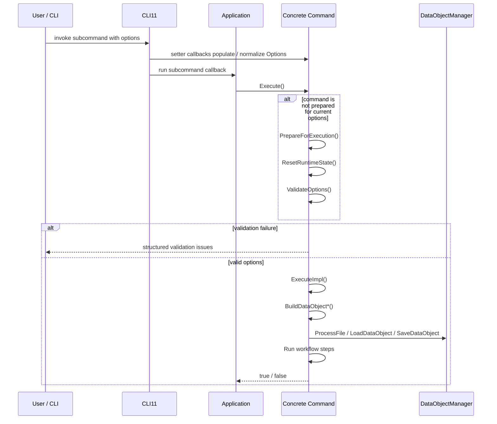

# Command Architecture

This document describes how command classes are structured in this repository, how they are wired into the CLI, and what implementation rules new commands are expected to follow.

Use this document together with [`../development-guidelines.md`](../development-guidelines.md), especially Section 7. Editable diagram sources for this area live under [`./diagrams/`](./diagrams/).

## 1. Purpose

The command layer is the orchestration boundary of the application:

- It translates CLI or binding inputs into validated command options.
- It builds prerequisites such as parsed files, database-backed objects, and runtime helpers.
- It invokes domain logic from `core`, `data`, and `utils`.
- It emits user-facing logs, output files, and persistence side effects.

The command layer is not the place for file format parsing, DAO details, or low-level algorithms.

## 2. Main Runtime Topology

## 3. Registration Model

### 3.1 Explicit built-in manifest

Built-in CLI commands are defined centrally in `BuiltInCommandCatalog()`. `Application` iterates that catalog directly and creates one CLI subcommand per descriptor.

The built-in manifest order is generated from the built-in command catalog:

<!-- BEGIN GENERATED: built-in-command-manifest -->
1. `potential_analysis`
2. `potential_display`
3. `result_dump`
4. `map_simulation`
5. `map_visualization`
6. `position_estimation`
7. `model_test`
<!-- END GENERATED: built-in-command-manifest -->

This makes help ordering deterministic and avoids relying on cross-translation-unit static initialization order for built-in behavior.

### 3.2 Built-in descriptor responsibilities

Each built-in `CommandDescriptor` stores:

- the built-in `CommandId`
- the command name
- the user-facing description
- a factory returning `std::unique_ptr<CommandBase>`
- command surface metadata (`CommandSurface`)
- database usage policy (`DatabaseUsage`)
- binding exposure policy (`BindingExposure`)
- the Python binding name for Python-public commands

The project does not currently provide a self-registration API for commands. Built-in CLI behavior flows only through the built-in command catalog.

## 4. Base Class Contract

All CLI commands derive from `CommandBase`.

### 4.1 Required virtual contract

Each command must provide:

- `bool ExecuteImpl()`
- `void RegisterCLIOptionsExtend(CLI::App * command)`
- `const CommandOptions & GetOptions() const`
- `CommandOptions & GetOptions()`
- `CommandId GetCommandId() const`

`CommandBase::Execute()` is the public non-virtual wrapper. It is the single formal execution entry point for CLI callbacks, direct C++ callers, and Python bindings.

### 4.2 Shared base features

`CommandBase` already owns:

- `DataObjectManager m_data_manager`
- a `ValidationIssue` collection for parse / prepare / runtime diagnostics
- base CLI options in `CommandOptions`

Shared base options:

- `thread_size`
- `verbose_level`
- `database_path`
- `folder_path`

Base setters are not passive assignment helpers. They also normalize and validate:

- `SetThreadSize()` clamps invalid values to `1`
- `SetVerboseLevel()` restores an allowed log level when needed
- `SetDatabasePath()` lexically normalizes non-empty paths but does not create directories during parse
- `SetFolderPath()` preserves the chosen folder path, ensures a trailing slash for non-empty values, and does not create directories during parse

### 4.3 Common option capability mask

`CommandBase` reads each command descriptor from the built-in command catalog and derives shared option behavior from `CommandSurface` / `GetCommonOptionMask()`:

- `Threading`
- `Verbose`
- `Database`
- `OutputFolder`

### 4.4 Options pattern

Each concrete command follows the same pattern:

1. Define `struct Options : public CommandOptions`.
2. Store one `Options m_options`.
3. Return `m_options` from both `GetOptions()` overloads.
4. Keep option-local normalization and validation inside setter methods.
5. Keep cross-field or semantic validation inside `ValidateOptions()`.

This is the preferred extension point for new command parameters.
The shared setter helper families for scalar normalization, scalar validation, and enum validation now live on `CommandBase`, so new commands should reuse those helpers before introducing command-local setter boilerplate.
Invalid enum or mode selections should be rejected from setter paths or `PrepareForExecution()`, not first discovered from a runtime `switch` default branch inside `ExecuteImpl()`.

## 5. Standard Execution Lifecycle

Application callbacks invoke only `Execute()`. `Execute()` internally decides whether `PrepareForExecution()` must run.

Most commands in this repository follow the same three-step shape:

Recommended command shape:

1. `RegisterCLIOptionsExtend()` binds CLI options to setter functions.
2. Setters invalidate any previously prepared state, normalize user input when a safe fallback exists, and register parse-phase validation issues for invalid single-option inputs.
3. `PrepareForExecution()` resets runtime state, clears command-local data objects, validates cross-field constraints, and performs filesystem preflight for the current option snapshot.
4. Any option mutation after `PrepareForExecution()` invalidates the prepared state.
5. `Execute()` is the single public entry point. It prepares the command if needed, then calls `ExecuteImpl()`.
6. `Execute()` clears the prepared flag after each run, so cached prepared state is only reusable between an explicit `PrepareForExecution()` call and the immediately following `Execute()`.
7. `ExecuteImpl()` runs the main workflow in clear phases.
8. Any persistence or file output happens after the main computation is ready.

## 6. Data Boundary

`DataObjectManager` is the command layer's gateway for moving data between files, memory, visitors, and the database. Most commands access it through thin `CommandBase` helpers instead of calling the manager directly.

Preferred command-facing helpers on `CommandBase`:

- `ProcessTypedFile<T>(path, key_tag, label)`
- `OptionalProcessTypedFile<T>(path, key_tag, label)`
- `LoadTypedObject<T>(key_tag, label)`
- `RequireDatabaseManager()`
- `BuildOutputPath(stem, extension)`

Underlying `DataObjectManager` operations still include:

- `ProcessFile(path, key_tag)` for parsing model or map files into in-memory data objects
- `LoadDataObject(key_tag)` for loading previously saved objects from SQLite
- `SaveDataObject(key_tag, renamed_key_tag)` for persistence
- `GetTypedDataObject<T>(key_tag)` for typed retrieval
- `Accept(visitor, key_tag_list)` for visitor-based traversal

Design intent:

- commands decide *which* objects are needed and *when*
- the data layer decides *how* files and persistence are implemented

When a command needs database-backed objects, call `RequireDatabaseManager()` before `LoadTypedObject()` or any direct `LoadDataObject()` / `SaveDataObject()` usage.

## 7. Current Command Families

### 7.1 File-driven analysis commands

These commands ingest files directly through `ProcessFile(...)`-backed helpers such as `ProcessTypedFile(...)`:

| Command | Main inputs | Main phases | Main outputs |
| --- | --- | --- | --- |
| `potential_analysis` | model file, map file, database path | build objects, preprocess, sample atoms, classify atoms, fit atoms, save | updated `ModelObject` persisted to database |
| `map_simulation` | model file, blurring width list | build atom list, simulate maps | generated `.map` files |
| `map_visualization` | model file, map file | preprocess, sample around one atom, visualize | rendered plot/PDF output |
| `position_estimation` | map file | threshold voxels, KD-tree, iterative convergence, deduplication | ChimeraX point file |

### 7.2 Database-driven presentation / export commands

These commands primarily load previously saved `ModelObject` instances from the database:

| Command | Main inputs | Main phases | Main outputs |
| --- | --- | --- | --- |
| `potential_display` | painter choice, model key list, optional reference groups | load models, apply selection, dispatch painter | painter-specific output files |
| `result_dump` | printer choice, model key list, optional map file | load models, collect selected atoms, dispatch dump mode | CSV, CIF, CMM and related dump files |

### 7.3 Standalone test harness command

| Command | Main inputs | Main phases | Main outputs |
| --- | --- | --- | --- |
| `model_test` | tester mode and fitting parameters | choose simulation scenario, run `HRLModelTester` workflows | logs and optional ROOT-based plots |

`model_test` is still a `CommandBase` subclass for CLI consistency, but it does not currently rely on `DataObjectManager`.

### 7.4 Command surface matrix

<!-- BEGIN GENERATED: command-surface-matrix -->
| Command | Uses database at runtime | Uses output folder | Exposed to Python |
| --- | --- | --- | --- |
| `potential_analysis` | yes | yes | yes |
| `potential_display` | yes | yes | yes |
| `result_dump` | yes | yes | yes |
| `map_simulation` | no | yes | yes |
| `map_visualization` | no | yes | no |
| `position_estimation` | no | yes | no |
| `model_test` | no | yes | no |
<!-- END GENERATED: command-surface-matrix -->

## 8. Concrete Command Notes

### 8.1 `potential_analysis`

This is the most representative end-to-end command in the repository.

Architecture pattern:

1. Parse model and map files and initialize `DatabaseManager` from the configured database path.
2. Optionally adjust model metadata for simulated maps.
3. Normalize map values.
4. Prepare selected atoms and bonds and attach fresh local potential entries.
5. Sample map values around atoms.
6. Run atom classification and atom fitting logic.
7. Save the resulting `ModelObject` back to the database under a caller-controlled key.

If you are adding another analysis-style command, this class is the closest reference implementation.

Bond-oriented analysis is currently isolated behind the experimental build flag `RHBM_GEM_ENABLE_EXPERIMENTAL_BOND_ANALYSIS` and is disabled by default, so it is not part of the default command contract.
Command-local scalar setters on this class also demonstrate the intended split between parse-time single-field checks and prepare-time cross-field checks such as range ordering or simulation-only requirements.

### 8.2 `potential_display`

This command demonstrates the "database object -> selection -> strategy output" pattern:

1. Load one or more `ModelObject` instances from SQLite.
2. Apply `AtomSelector` rules.
3. Choose a `PainterBase` implementation from `PainterType`.
4. Feed the selected data objects into the chosen painter.

This is the preferred pattern for future visualization or reporting commands that operate on saved analysis results.

### 8.3 `result_dump`

This command demonstrates the "database object -> mode switch -> writer output" pattern:

1. Load one or more saved `ModelObject` instances.
2. Optionally parse a map file if map-based dumping is requested.
3. Build a selected-atom cache.
4. Dispatch to a dump mode selected by `PrinterType`.

If a new export mode is needed, extending this command is usually a better fit than creating a brand new top-level command.

### 8.4 `map_simulation`

This command is intentionally file-driven and does not need a database-backed workflow for its core behavior.

It shows that `CommandBase` can still be reused when a command needs typed file loading and output management but no database persistence:

- common CLI options
- logging level control
- required input path validation
- `ProcessTypedFile<ModelObject>()`
- output folder management

### 8.5 `map_visualization`

This command is structurally similar to `potential_analysis`, but it narrows the workflow to:

- load model and map
- normalize map
- pick one atom context
- generate a focused visualization artifact

It is a good reference for single-purpose exploratory commands.

### 8.6 `position_estimation`

This command shows a map-only workflow:

- parse one map
- normalize values
- build a filtered voxel list
- create a KD-tree
- iteratively update candidate points
- deduplicate and export the final positions

It is a good reference for algorithm-heavy commands that still fit the shared CLI lifecycle.

## 9. CLI vs Python Binding Surface

The CLI surface is driven by:

- `main.cpp`
- `Application`
- `BuiltInCommandCatalog()`
- concrete `CommandBase` subclasses

The Python surface is separate and currently exposes only a subset of commands through `bindings/CoreBindings.cpp`.

<!-- BEGIN GENERATED: python-public-command-surface -->
### Python-public command classes
- `PotentialAnalysisCommand`
- `PotentialDisplayCommand`
- `ResultDumpCommand`
- `MapSimulationCommand`

### Shared diagnostics types
- `LogLevel`
- `ValidationPhase`
- `ValidationIssue`

### Shared diagnostics methods on Python-public commands
- `PrepareForExecution()`
- `HasValidationErrors()`
- `GetValidationIssues()`
<!-- END GENERATED: python-public-command-surface -->

Implication for future work:

- adding a new CLI command does not automatically expose it to Python
- if a command is intended to be public from Python, bindings must be updated explicitly
- bound command instances call `Execute()` directly, so `Execute()` must remain safe for repeated calls on the same instance
- CLI-only commands should remain documented as such

## 10. Implementation Rules For New Commands

When adding a new command, follow this checklist:

1. Add the public interface under `include/core/`.
2. Add the implementation under `src/core/`.
3. Derive from `CommandBase`.
4. Define `Options : CommandOptions`.
5. Implement option-local validation in setter methods and cross-field validation in `ValidateOptions()`, not in scattered workflow code.
6. Implement `RegisterCLIOptionsExtend()` using setter callbacks.
7. Keep `ExecuteImpl()` phase-oriented: rely on `CommandBase::Execute()` / `PrepareForExecution()`, then build prerequisites, then run the workflow.
8. Use `DataObjectManager` as the boundary for file parsing and persistence.
9. Add a new `CommandDescriptor` entry to `BuiltInCommandCatalog()` with the command name, description, `CommandSurface`, `DatabaseUsage`, `BindingExposure`, and factory.
10. Update bindings, examples, tests, and user-facing docs if the command is part of a supported public workflow.

## 11. What Future Contributors Should Avoid

Avoid these anti-patterns:

- bypassing `BuiltInCommandCatalog()` and hard-coding new CLI subcommands in `Application`
- re-introducing namespace-scope static registration for built-in commands
- putting format-specific parsing logic directly inside a command
- delaying basic validation until deep inside `Execute()`
- mutating the filesystem during CLI parse instead of during preflight
- mixing CLI parsing concerns with algorithm implementation details
- letting commands manipulate database internals directly instead of using `DataObjectManager`
- introducing multiple unrelated responsibilities into one command when an existing mode switch or strategy object is a better extension point

## 12. Recommended Reference Files

For future command work, inspect these files first:

- `include/core/CommandBase.hpp`
- `src/core/CommandBase.cpp`
- `include/core/BuiltInCommandCatalog.hpp`
- `src/core/BuiltInCommandCatalog.cpp`
- `include/core/Application.hpp`
- `src/core/Application.cpp`
- `include/core/PotentialAnalysisCommand.hpp`
- `src/core/PotentialAnalysisCommand.cpp`
- `include/core/PotentialDisplayCommand.hpp`
- `src/core/PotentialDisplayCommand.cpp`
- `include/core/ResultDumpCommand.hpp`
- `src/core/ResultDumpCommand.cpp`
- `include/core/DataObjectManager.hpp`
- `src/core/DataObjectManager.cpp`
- `bindings/CoreBindings.cpp`
