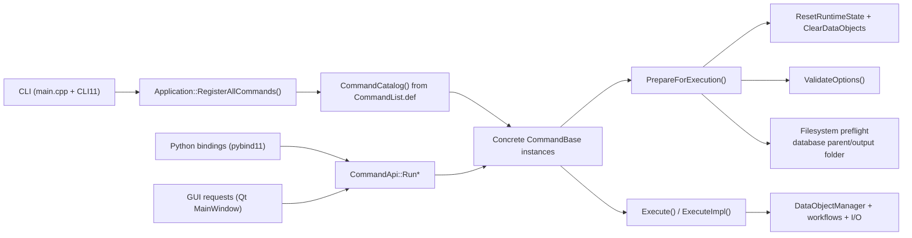

# Command Architecture

Current command runtime and extension contracts.

Related guides:

- [`../adding-a-command.md`](../adding-a-command.md)
- [`../development-guidelines.md`](../development-guidelines.md)

## 1. Runtime topology

## 2. Source of truth

Top-level command membership is defined in:

- `src/core/internal/CommandList.def`

Each entry follows:

- `RHBM_GEM_COMMAND(COMMAND_ID, COMMAND_TYPE, CLI_NAME, DESCRIPTION, PROFILE)`

The manifest drives:

- `CommandCatalog()` construction (`src/core/command/CommandCatalog.cpp`)
- CLI subcommand registration order (`src/core/command/Application.cpp`)
- Python request/run surface (`bindings/CommandApiBindings.cpp`)
- generated catalog/CMake/docs artifacts (`scripts/developer/generate_command_artifacts.py`)

`CommandDescriptor` fields (`src/core/internal/CommandCatalog.hpp`):

- `id`
- `name`
- `description`
- `common_options`
- `factory`

### Command manifest

<!-- BEGIN GENERATED: command-manifest -->
1. `potential_analysis`
2. `potential_display`
3. `result_dump`
4. `map_simulation`
5. `map_visualization`
6. `position_estimation`
7. `model_test`
<!-- END GENERATED: command-manifest -->

## 3. Registration paths

CLI path:

1. `src/main.cpp` creates `CLI::App`.
2. `Application` requires exactly one subcommand.
3. `RegisterAllCommands()` iterates `CommandCatalog()`.
4. For each descriptor, it creates a command instance, registers CLI options, and binds callback to `Execute()`.
5. Callback throws `CLI::RuntimeError(1)` when execution fails.

Python path:

- `bindings/CoreBindings.cpp` registers shared types + request structs + `Run*` entrypoints.

GUI path:

- `MainWindow` builds `CommandApi` requests and calls `Run*` entrypoints.

## 4. Concrete command contract

Command shape:

1. Define `Options` derived from `CommandOptions`.
2. Derive command class from `CommandWithProfileOptions<...>` or `CommandWithOptions<...>`.
3. Implement `ApplyRequest(const XxxRequest&)` as the external configuration entrypoint.
4. Keep command-local `Set*` helpers internal/private for CLI parsing and normalization.
5. Register command-local CLI options in `RegisterCLIOptionsExtend(...)`.
6. Keep cross-field checks in `ValidateOptions()`.
7. Reset transient runtime fields in `ResetRuntimeState()`.
8. Keep `ExecuteImpl()` focused on orchestration.

Base `CommandOptions` fields:

- `thread_size`
- `verbose_level`
- `database_path`
- `folder_path`

`CommonOptionProfile` (`CommandMetadata.hpp`) maps to:

- `FileWorkflow` -> `Threading | Verbose | OutputFolder`
- `DatabaseWorkflow` -> `Threading | Verbose | Database | OutputFolder`

## 5. Shared options

`CommandBase::RegisterCLIOptionsBasic(...)` exposes shared flags by `common_options` mask:

- `-j,--jobs`
- `-v,--verbose`
- `-d,--database`
- `-o,--folder`

Concrete commands should only add command-specific flags in `RegisterCLIOptionsExtend(...)`.

### Shared policy matrix

<!-- BEGIN GENERATED: command-surface-matrix -->
| Command | Uses database at runtime | Uses output folder |
| --- | --- | --- |
| `potential_analysis` | yes | yes |
| `potential_display` | yes | yes |
| `result_dump` | yes | yes |
| `map_simulation` | no | yes |
| `map_visualization` | no | yes |
| `position_estimation` | no | yes |
| `model_test` | no | yes |
<!-- END GENERATED: command-surface-matrix -->

## 6. Lifecycle and validation

`Execute()` is the single execution entry point across CLI/Python/GUI.

Behavior:

- If not prepared, `Execute()` calls `PrepareForExecution()`.
- If already prepared, `Execute()` runs `ExecuteImpl()` directly.
- Prepared state is cleared after each execution attempt.

`PrepareForExecution()` sequence:

1. `BeginPreparationPass()`
2. `RunValidationPass()`
3. `RunFilesystemPreflight()`

Validation phases:

| Phase | Typical source | Typical purpose |
| --- | --- | --- |
| `Parse` | `ApplyRequest(...)` and internal option setters | single-field validation/normalization |
| `Prepare` | `ValidateOptions()` + preflight | cross-field checks and runtime preflight failures |

Prepared-state invalidation rule:

- All option mutations must go through `MutateOptions(...)` or wrappers built on it.

## 7. Command helper APIs

Core APIs (`CommandBase`):

- `MutateOptions(...)`
- `AddValidationError(...)`
- `AddNormalizationWarning(...)`
- `ResetParseIssues(...)`
- `ResetPrepareIssues(...)`

Convenience setters:

- `SetRequiredExistingPathOption(...)`
- `SetOptionalExistingPathOption(...)`
- `SetNormalizedScalarOption(...)`
- `SetFinitePositiveScalarOption(...)`
- `SetFiniteNonNegativeScalarOption(...)`
- `SetPositiveScalarOption(...)`
- `SetValidatedEnumOption(...)`

Execution boundary helpers:

- `BuildOutputPath(...)`

CLI binding helpers (`src/core/internal/CommandOptionBinding.hpp`):

- `command_cli::AddScalarOption(...)`
- `command_cli::AddStringOption(...)`
- `command_cli::AddPathOption(...)`
- `command_cli::AddEnumOption(...)`

## 8. Data boundary

Commands should use command-facing APIs and helpers:

- `DataObjectManager` (`ProcessFile`, `LoadDataObject`, `SaveDataObject`, `ForEachDataObject`, typed getters)
- `command_data_loader::*` (`src/core/internal/CommandDataLoader.hpp`)
- typed workflow helpers in `src/core/workflow/DataObjectWorkflowOps.*`
- `SampleMapValues(...)` for map sampling

Use `DataObjectDispatch` only when dispatching generic `DataObjectBase` at runtime.

## 9. Python binding contract

Python bindings expose:

- request structs (`*Request`)
- shared diagnostics/result structs (`ValidationIssue`, `ExecutionReport`)
- `Run*` functions mapped to `CommandApi`

### Python command surface

<!-- BEGIN GENERATED: command-python-surface -->
### Python request types
- `CommonCommandRequest`
- `PotentialAnalysisRequest`
- `PotentialDisplayRequest`
- `ResultDumpRequest`
- `MapSimulationRequest`
- `MapVisualizationRequest`
- `PositionEstimationRequest`
- `HRLModelTestRequest`

### Python run functions
- `RunPotentialAnalysis(...)`
- `RunPotentialDisplay(...)`
- `RunResultDump(...)`
- `RunMapSimulation(...)`
- `RunMapVisualization(...)`
- `RunPositionEstimation(...)`
- `RunHRLModelTest(...)`

### Shared diagnostics types
- `LogLevel`
- `ValidationPhase`
- `ValidationIssue`
- `ExecutionReport`
<!-- END GENERATED: command-python-surface -->

## 10. Update checklist

When adding or changing a command:

1. Update command implementation (`include/.../command/*.hpp`, `src/core/command/*.cpp`).
2. Update membership and metadata in `src/core/internal/CommandList.def`.
3. Refresh generated artifacts (`python3 scripts/developer/generate_command_artifacts.py`).
4. Update request/run bindings (`bindings/CommandApiBindings.cpp`) when command surface changes.
5. Update command and contract tests.
6. Keep this document and `docs/developer/adding-a-command.md` in sync.

## 11. Key files

- `src/main.cpp`
- `include/rhbm_gem/core/command/Application.hpp`
- `src/core/command/Application.cpp`
- `include/rhbm_gem/core/command/CommandApi.hpp`
- `src/core/command/CommandApi.cpp`
- `include/rhbm_gem/core/command/CommandBase.hpp`
- `src/core/command/CommandBase.cpp`
- `include/rhbm_gem/core/command/CommandMetadata.hpp`
- generated `command-id-entries` block in `include/rhbm_gem/core/command/CommandMetadata.hpp`
- `src/core/internal/CommandList.def`
- `src/core/internal/CommandCatalog.hpp`
- `src/core/command/CommandCatalog.cpp`
- `src/core/internal/CommandOptionBinding.hpp`
- `src/core/internal/CommandDataLoader.hpp`
- `include/rhbm_gem/data/io/DataObjectManager.hpp`
- `bindings/CommonBindings.cpp`
- `bindings/CommandApiBindings.cpp`
- `bindings/CoreBindings.cpp`

Representative concrete commands:

- `src/core/command/PotentialAnalysisCommand.cpp`
- `src/core/command/PotentialDisplayCommand.cpp`
- `src/core/command/ResultDumpCommand.cpp`
- `src/core/command/MapSimulationCommand.cpp`
- `src/core/command/MapVisualizationCommand.cpp`
- `src/core/command/PositionEstimationCommand.cpp`
- `src/core/command/HRLModelTestCommand.cpp`
