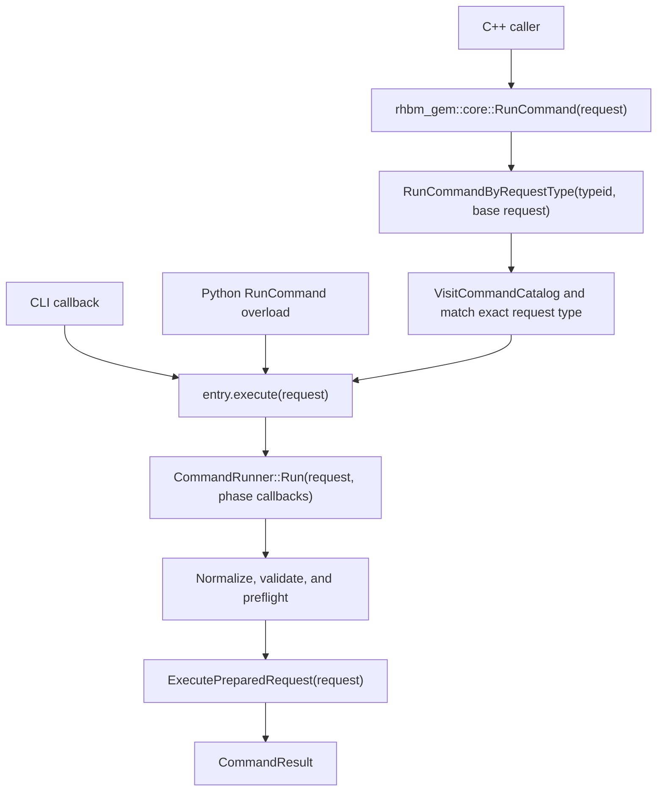

# Command Architecture

## Source of Truth

Top-level command membership is defined in the internal command catalog in
[`src/core/command/detail/CommandCatalog.hpp`](/src/core/command/detail/CommandCatalog.hpp).

Each entry uses:

- `CommandEntry<RequestType>{cli_name, description, request_type_name, execute}`

That typed list is visited by:

- [`src/core/command/CommandSystem.cpp`](/src/core/command/CommandSystem.cpp)
- [`src/python/CommandSystemBindings.cpp`](/src/python/CommandSystemBindings.cpp)

The catalog stores typed executor functions, so C++, CLI, and Python converge on the same
`CommandRunner` lifecycle without exposing per-command implementation headers.

Stable entries live in `kStableCommands`. Experimental entries live in
`kExperimentalCommands` and are visible only when `RHBM_GEM_ENABLE_EXPERIMENTAL_FEATURE` is
enabled; that option is off by default. The same feature guard covers experimental request DTOs,
request fields, executor declarations, command sources, and catalog entries, so catalog visitors
only see commands compiled into the current build.
The stable `umap_embedding` entry follows the same complete-surface guard with
`RHBM_GEM_ENABLE_UMAP`; it is omitted when the optional private umappp dependency is disabled.

## Public Surface

Public command headers separate concerns:

- [`include/rhbm_gem/core/CommandSystem.hpp`](/include/rhbm_gem/core/CommandSystem.hpp)
  - typed `rhbm_gem::core::RunCommand(request)` execution API
- [`include/rhbm_gem/core/CommandTypes.hpp`](/include/rhbm_gem/core/CommandTypes.hpp)
  - shared public enums
  - `CommandRequestBase`
  - one plain request DTO per command
  - default data/database path helper declarations
  - `CommandDiagnostic`
  - `CommandResult`

The public C++ API is centered on `rhbm_gem::core` typed requests, `RunCommand(request)`, shared enums, and path helpers.
CLI wiring and request binding schema stay internal.
The private command catalog owns request-to-command routing, so concrete command headers do not
become public includes.

## Internal Binding Model

CLI and Python bindings share one internal request field catalog in
[`src/core/command/detail/CommandCatalog.hpp`](/src/core/command/detail/CommandCatalog.hpp).
Those request field helpers live under `rhbm_gem::core::command_internal`.
Each request field entry uses `RequestField{...}`; CLI binding behavior is inferred from the request member
type. CSV lists use `,`, and reference groups use `group=item1,item2` parsing as fixed binder
behavior rather than schema configuration.
The `RequestField` field name is also used as the Python request attribute name.

That schema is the single source for:

- CLI option registration
- Python request field binding

Enum alias and binding metadata live in
[`src/core/command/detail/CommandEnumCatalog.hpp`](/src/core/command/detail/CommandEnumCatalog.hpp)
under `rhbm_gem::core::command_internal`.

## Execution Surfaces

### CLI

[`src/main.cpp`](/src/main.cpp) delegates to the public
[`RunCommandCLI(...)`](/include/rhbm_gem/core/CommandSystem.hpp), so the executable entrypoint
does not expose CLI11 setup or parsing details.

[`src/core/command/CommandSystem.cpp`](/src/core/command/CommandSystem.cpp):

1. enables `require_subcommand(1)`
2. visits the internal command catalog
3. creates one subcommand per command entry
4. binds shared `CommandRequestBase` fields
5. binds command-specific fields from `RequestFieldCatalog`
6. captures the catalog entry's typed executor directly
7. wraps CLI11 parsing and exit-code handling in `RunCommandCLI(...)`

### Python

[`src/python/CommandSystemBindings.cpp`](/src/python/CommandSystemBindings.cpp) binds:

- `CommandRequestBase`
- one request type per command
- `CommandResult`
- `CommandDiagnostic`
- shared enums from `CommandTypes.hpp`

Request type registration, `RunCommand(...)` overload membership, and request fields come from
the internal command catalog.
Each Python `RunCommand(...)` overload binds the catalog entry's typed executor directly. It does
not pass through the C++ `RunCommandByRequestType(...)` type dispatcher, but it converges on the
same executor and `CommandRunner` lifecycle.

## Runtime Flow

The entrypoints use different dispatch paths and converge at the catalog's typed executor:

```mermaid
flowchart TD
    A["C++ caller"] --> B["rhbm_gem::core::RunCommand(request)"]
    B --> D["RunCommandByRequestType(typeid, base request)"]
    D --> E["VisitCommandCatalog and match exact request type"]
    C["CLI callback"] --> G["entry.execute(request)"]
    F["Python RunCommand overload"] --> G
    E --> G
    G --> I["CommandRunner::Run(request, phase callbacks)"]
    I --> J["Normalize, validate, and preflight"]
    J --> K["ExecutePreparedRequest(request)"]
    K --> L["CommandResult"]
```

The C++ template accepts any type derived from `CommandRequestBase`. If its exact type is not in the
catalog, the dispatcher returns a failed result with a `request_type` diagnostic instead of invoking
an executor. Python exposes only the overloads generated from the current catalog.

Each execution surface returns or consumes a `CommandResult` with:

- `succeeded == true` when validation and preflight pass and the execution callback returns `true`
- `succeeded == false` when validation, preflight, or execution stops the command
- `issues` containing framework routing, normalization, validation, and preflight diagnostics as
  option/message pairs

Warnings remain in `issues` without failing the command. Diagnostic severity is retained only while
the command runs, for control flow and logging; it is not part of the public result. An
Execution failure can therefore return `succeeded == false` without adding an issue if the
concrete command reports the runtime error only through logging. The CLI converts any failed result
to exit code `1`; C++ and Python callers receive the result object.

## Concrete Command Shape

Command phase functions live inside anonymous namespaces in their implementation files under
[`src/core/command/`](/src/core/command/). Do not add per-command headers; each `.cpp` exposes only
its internal catalog executor function.

Shared command-framework internals live in:

- [`src/core/command/detail/`](/src/core/command/detail/)

The standard shape is:

1. define `ExecutePreparedRequest(const XxxRequest &)` for typed orchestration
2. add `NormalizeAndValidateRequest(CommandRunner<XxxRequest> &, XxxRequest &)` only when needed
3. add `ValidatePreparedRequest(CommandRunner<XxxRequest> &, const XxxRequest &)` only when needed
4. compose the present phases in `command_internal::ExecuteXxxCommand(...)`
5. expose that executor through `CommandCatalog.hpp`

`CommandRunner<XxxRequest>`:

1. copies the typed request for one execution
2. clears issues left from any previous execution of that runner
3. normalizes shared base options and sets the logger level
4. calls the optional normalization/field-validation callback and stops on errors
5. calls the optional semantic-validation callback and stops on errors
6. runs output-directory preflight and stops if directory creation fails
7. calls the required execution callback, reports pending issues, and builds the public result

`Run(request, execute)`, `Run(request, normalize_and_validate, execute)`, and
`Run(request, normalize_and_validate, validate_prepared, execute)` let each executor supply only the
phases it actually needs. No concrete command class or virtual hook is involved.

## Shared Request Base

`CommandRequestBase` contributes these shared options:

- `job_count` exposed by CLI as `-j,--jobs`
- `verbosity` exposed by CLI as `-v,--verbose`
- `output_dir` exposed by CLI as `-o,--folder`

Command-specific fields live directly on each request DTO.

## Filesystem and Validation Behavior

`CommandRunner` performs:

1. common normalization for `job_count`, `verbosity`, and `output_dir`
2. logger-level setup from the normalized `verbosity`
3. command-specific normalization and two-stage validation issue tracking
4. output-directory preflight for `output_dir` only after validation succeeds

The generic filesystem layer manages only the shared `output_dir`. Internal validation still tracks
option name, level, and message. The public result keeps only option/message diagnostics, while
warnings and errors are both logged at their internal levels.
