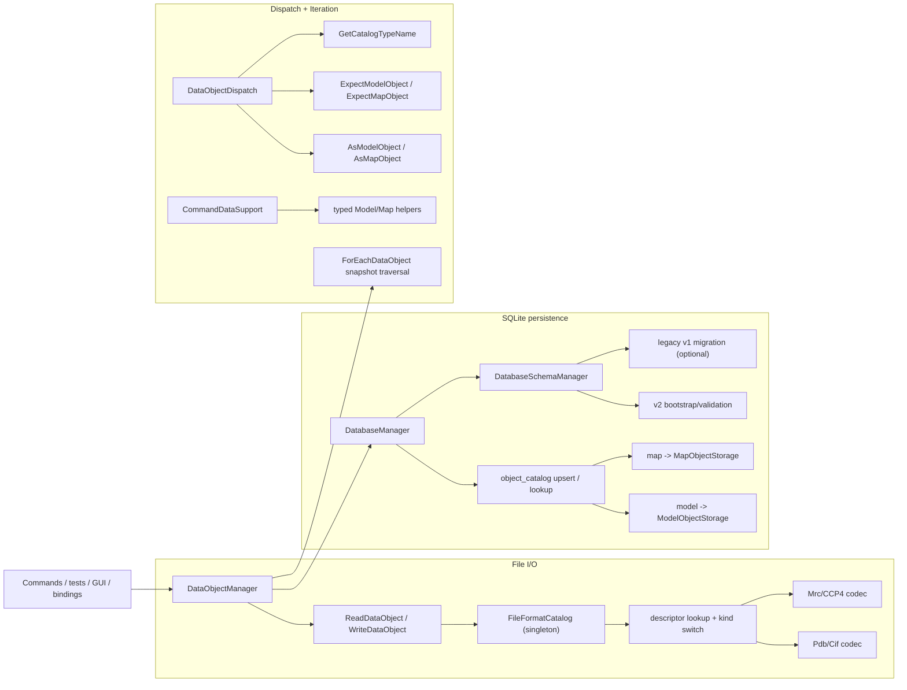

# DataObject I/O, Dispatch, and Iteration Architecture

This document defines current runtime contracts for:

- file I/O
- SQLite persistence
- typed dispatch
- manager iteration and typed workflow integration

Related guides:

- [`../development-guidelines.md`](../development-guidelines.md)
- [`./command-architecture.md`](./command-architecture.md)
- [`../adding-dataobject-operations-and-iteration.md`](../adding-dataobject-operations-and-iteration.md)

## 1. Scope

Top-level DataObject roots are fixed to:

- `ModelObject`
- `MapObject`

`AtomObject` and `BondObject` are model-domain objects and are not top-level file/database roots.

## 2. Supported Surface

| Top-level object | File read | File write | SQLite save/load |
| --- | --- | --- | --- |
| `ModelObject` | `.pdb`, `.cif`, `.mmcif`, `.mcif` | `.pdb`, `.cif` | yes |
| `MapObject` | `.mrc`, `.map`, `.ccp4` | `.mrc`, `.map`, `.ccp4` | yes |

Rules:

- Extension matching is case-insensitive.
- `.mmcif` and `.mcif` are read-only aliases to CIF backend.

## 3. Runtime Topology



## 4. File I/O Contract

Public API (`include/rhbm_gem/data/io/FileIO.hpp`):

- `ReadDataObject(path)`
- `WriteDataObject(path, obj)`
- `ReadModel(path)` / `WriteModel(path, model, model_parameter=0)`
- `ReadMap(path)` / `WriteMap(path, map)`

Contract:

- Descriptor lookup is performed once per operation.
- Routing is explicit by descriptor kind (`model` or `map`).
- Codec dispatch is fixed inside `FileIO.cpp` via `FileFormatCatalog`.
- Generic write uses strict type contracts:
  - model branch -> `ExpectModelObject(...)`
  - map branch -> `ExpectMapObject(...)`
- Entry points return success or throw `std::runtime_error` with path + operation context.

`DataObjectManager` file integration:

- `ProcessFile(...)`: reads object, sets key tag, stores object in memory.
- `ProduceFile(...)`: writes in-memory object by key.
- missing key in `ProduceFile(...)` logs warning and returns.

## 5. SQLite Persistence Contract

`DataObjectManager` DB entry points:

- `SaveDataObject(key_tag, renamed_key_tag="")`
- `LoadDataObject(key_tag)`

`DatabaseManager` responsibilities:

- open SQLite
- ensure schema via `DatabaseSchemaManager::EnsureSchema()`
- own transaction boundary for each save/load
- upsert/query `object_catalog(key_tag, object_type)`
- route by stable type name only:
  - `model` -> `ModelObjectStorage`
  - `map` -> `MapObjectStorage`

Behavior:

- save throws when input pointer is null.
- load throws when key is missing.
- unknown catalog type throws fail-fast runtime error.
- `SaveDataObject(key, renamed)` only changes persisted key; in-memory map key is unchanged.

## 6. Schema Contract

Version source: `PRAGMA user_version`.

Supported states:

- `2`: validate normalized v2 schema.
- `1`: migrate legacy v1 to v2 only when `RHBM_GEM_LEGACY_V1_SUPPORT=ON`.
- `0`:
  - empty DB -> bootstrap v2
  - legacy-v1 layout -> migrate when legacy support is enabled
  - non-empty non-legacy -> fail fast
- other versions -> fail fast

v2 invariants:

- `object_catalog(key_tag, object_type)` is the polymorphic root.
- `object_type` is constrained to `model` or `map`.
- `model_object.key_tag` and `map_list.key_tag` reference `object_catalog(key_tag)` with `ON DELETE CASCADE`.
- model payload tables reference `model_object(key_tag)` with `ON DELETE CASCADE`.
- validation checks table presence, PK/FK shape, and catalog/payload key consistency.

## 7. Typed Dispatch Contract

`DataObjectDispatch` API (`include/rhbm_gem/data/dispatch/DataObjectDispatch.hpp`):

- probes: `AsModelObject(...)`, `AsMapObject(...)`
- strict checks: `ExpectModelObject(...)`, `ExpectMapObject(...)`
- catalog helper: `GetCatalogTypeName(...)`

Contract:

- probe helpers return typed pointer or `nullptr`.
- expect helpers return typed reference or throw with caller context + resolved runtime type.
- `GetCatalogTypeName(...)` returns:
  - `model` for `ModelObject`
  - `map` for `MapObject`
- `GetCatalogTypeName(...)` throws for non-top-level types (`AtomObject`, `BondObject`, unresolved types).

## 8. Manager Iteration Contract

`DataObjectManager::ForEachDataObject(...)` supports mutable and const traversal with:

```cpp
struct IterateOptions
{
    bool deterministic_order{ true };
};
```

Behavior:

- empty key list:
  - `deterministic_order=true`: lexicographic key order
  - `deterministic_order=false`: container iteration order
- non-empty key list: callback order follows input key list order
- missing keys are skipped with warning logs
- empty callback throws runtime error
- traversal is snapshot-based; callbacks run after snapshot capture

## 9. Typed Workflow and Painter Boundaries

Shared typed workflow helpers (`src/core/command/CommandDataSupport.*`):

- `NormalizeMapObject`
- `PrepareModelObject`
- `ApplyModelSelection`
- `CollectModelAtoms`
- `PrepareSimulationAtoms`
- `BuildModelAtomBondContext`

Map sampling helper:

- `SampleMapValues(...)` (`include/rhbm_gem/core/command/MapSampling.hpp`)

Painter typed object validation:

- `RequirePainterObject(...)` in `src/core/internal/PainterTypeCheck.hpp`
- painter implementations route data/reference ingestion explicitly after validation
- null or mismatched typed input throws runtime error

## 10. Extension Boundaries

Allowed extension:

- add model/map file codec via `FileFormatCatalog`
- evolve model/map schema and corresponding fixed storage implementation
- add reusable typed model/map operations in `CommandDataSupport`

Out of scope:

- runtime registration of arbitrary top-level `DataObject` types
- runtime registration of storage factories
- runtime resolver/factory override chains for file kind dispatch

## 11. Key Files

Core orchestration:

- `include/rhbm_gem/data/io/DataObjectManager.hpp`
- `src/data/io/DataObjectManager.cpp`
- `include/rhbm_gem/data/io/FileIO.hpp`
- `src/data/io/file/FileIO.cpp`

File registry/backends:

- `src/data/internal/file/FileFormatCatalog.hpp`
- `src/data/io/file/FileFormatCatalog.cpp`

Dispatch + typed ops:

- `include/rhbm_gem/data/dispatch/DataObjectDispatch.hpp`
- `src/data/dispatch/DataObjectDispatch.cpp`
- `src/core/command/CommandDataSupport.hpp`
- `src/core/command/CommandDataSupport.cpp`
- `include/rhbm_gem/core/command/MapSampling.hpp`
- `src/core/command/MapSampling.cpp`
- `src/core/internal/PainterTypeCheck.hpp`

SQLite/schema:

- `src/data/internal/sqlite/DatabaseManager.hpp`
- `src/data/io/sqlite/DatabaseManager.cpp`
- `src/data/internal/sqlite/DatabaseSchemaManager.hpp`
- `src/data/io/sqlite/DatabaseSchemaManager.cpp`
- `src/data/internal/sqlite/ModelObjectStorage.hpp`
- `src/data/io/sqlite/ModelObjectStorage.cpp`
- `src/data/internal/sqlite/MapObjectStorage.hpp`
- `src/data/io/sqlite/MapObjectStorage.cpp`
- `src/data/internal/sqlite/SQLiteWrapper.hpp`
- optional legacy migration helper:
  - `src/data/internal/sqlite/LegacyModelObjectReader.hpp`
  - `src/data/io/sqlite/legacy_v1/LegacyModelObjectReader.cpp`
