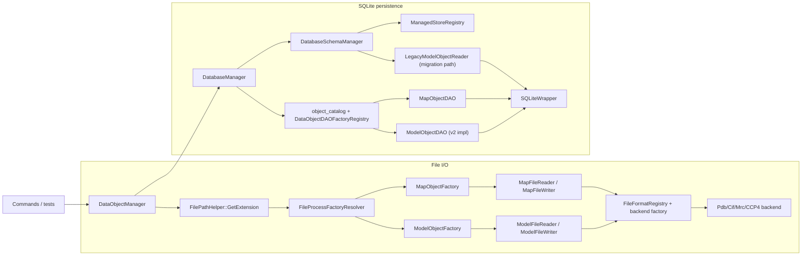

# DataObject I/O Architecture

This document is the developer manual for file and SQLite I/O of top-level `DataObject` instances.

Use this document to:

- trace file import/export behavior from `DataObjectManager`
- understand SQLite save/load behavior and schema expectations
- extend supported file formats
- add a new persistent top-level `DataObject`

This document describes current behavior only.

Related guides:

- [`../development-guidelines.md`](../development-guidelines.md)
- [`./command-architecture.md`](./command-architecture.md)
- [`./dataobject-typed-dispatch-architecture.md`](./dataobject-typed-dispatch-architecture.md)
- [`../adding-dataobject-operations-and-iteration.md`](../adding-dataobject-operations-and-iteration.md)

## 1. Scope

Top-level I/O roots in this project:

- `ModelObject`
- `MapObject`

`AtomObject` and `BondObject` are internal to `ModelObject` and are not standalone file/database roots.

## 2. Supported Surface

| Top-level object | File read | File write | SQLite save/load |
| --- | --- | --- | --- |
| `ModelObject` | `.pdb`, `.cif`, `.mmcif`, `.mcif` | `.pdb`, `.cif` | yes |
| `MapObject` | `.mrc`, `.map`, `.ccp4` | `.mrc`, `.map`, `.ccp4` | yes |

Notes:

- Extension matching is case-insensitive (`FilePathHelper::GetExtension` + lowercasing).
- `.mmcif` and `.mcif` are read-only aliases to the CIF backend.

## 3. Runtime Topology



## 4. File I/O Contract

### 4.1 Entry points

- `DataObjectManager::ProcessFile(filename, key_tag)`
- `DataObjectManager::ProduceFile(filename, key_tag)`

Behavior:

- `ProcessFile(...)` creates a `DataObject`, sets its key tag, and inserts/replaces it in memory.
- `ProduceFile(...)` writes an existing in-memory object selected by key tag.
- Reusing a key tag replaces the previous in-memory object (`insert_or_assign`).

### 4.2 Dispatch and resolver

- `FileFormatRegistry` is the source of truth for extension-kind-read/write/backend descriptors.
- `DefaultFileProcessFactoryResolver` maps extension kind to `ModelObjectFactory` or `MapObjectFactory`.
- `OverrideableFileProcessFactoryResolver` supports per-extension overrides and falls back to default resolution.
- Override register/unregister/lookup paths are mutex-protected.

### 4.3 Model pipeline

Read path:

1. `ModelFileReader` checks descriptor support via `LookupForRead(...)`.
2. Backend (`PdbFormat` or `CifFormat`) parses into `AtomicModelDataBlock`.
3. `ModelObjectFactory` builds `ModelObject`.

Current assembly rules in `ModelObjectFactory`:

- choose model number `1` when present, otherwise fallback to first available model
- move atom list for the selected model only
- move parsed bond list and keep bonds whose endpoints are both in the selected atom set
- copy/move metadata and key systems:
  - `pdb_id`, `emd_id`, `resolution`, `resolution_method`
  - `chain_id_list_map`
  - chemical component dictionary
  - component/atom/bond key systems

Write path:

- `ModelFileWriter` checks write support via `LookupForWrite(...)`.
- Output backends are `.pdb` and `.cif` only.

### 4.4 Map pipeline

Read/write path:

- `MapFileReader` / `MapFileWriter` dispatch through `FileFormatRegistry`.
- Backends are `MrcFormat` and `CCP4Format`.

`MapFileFormatBase` contract:

```cpp
virtual void Read(std::istream & stream, const std::string & source_name) = 0;
virtual void Write(const MapObject & map_object, std::ostream & stream) = 0;
virtual std::unique_ptr<float[]> GetDataArray() = 0;
virtual std::array<int, 3> GetGridSize() = 0;
virtual std::array<float, 3> GetGridSpacing() = 0;
virtual std::array<float, 3> GetOrigin() = 0;
```

`MapObjectFactory` builds `MapObject` directly from those values.

Ownership rule:

- `MapFileReader::GetMapValueArray()` transfers ownership of the voxel array to the caller.

### 4.5 Error behavior

- Missing key in `ProduceFile(...)` logs a warning and returns.
- Missing key in `SaveDataObject(...)` logs a warning and returns.
- Parse/write/load failures throw exceptions.
- `ProcessFile(...)`, `ProduceFile(...)`, and `LoadDataObject(...)` wrap failures with
  file path and/or key context.

## 5. SQLite Persistence Contract

### 5.1 Entry points

Manager entry points:

- `SaveDataObject(key_tag, renamed_key_tag="")`
- `LoadDataObject(key_tag)`

Precondition:

- call `SetDatabaseManager(...)` before save/load; otherwise operations throw.

Rename semantics:

- `SaveDataObject(original, renamed)` changes only the persisted key.
- in-memory key remains `original`.

### 5.2 `DatabaseManager` responsibilities

`DatabaseManager`:

- owns `SQLiteWrapper`
- calls `DatabaseSchemaManager::EnsureSchema()` in constructor
- defines the transaction boundary for each save/load
- dispatches DAOs by `object_catalog.object_type`
- caches DAO instances by `std::type_index`

Save flow:

1. begin transaction (`SQLiteWrapper::TransactionGuard`)
2. upsert `(key_tag, object_type)` into `object_catalog`
3. resolve DAO and call `dao->Save(...)`
4. commit/rollback by RAII

Load flow:

1. begin transaction
2. read `object_type` from `object_catalog`
3. resolve DAO and call `dao->Load(...)`
4. commit/rollback by RAII

DAO contract:

- DAO implementations are transaction-free and rely on the outer `DatabaseManager` transaction.

### 5.3 Catalog dispatch contract

`object_catalog` is the polymorphic root table:

```sql
CREATE TABLE IF NOT EXISTS object_catalog (
    key_tag TEXT PRIMARY KEY,
    object_type TEXT NOT NULL,
    CHECK (object_type IN ('model', 'map'))
);
```

`object_type` values are stable persisted names and must match DAO registration names.

### 5.4 Schema lifecycle policy

Schema version source: `PRAGMA user_version`

- `2`: validate normalized v2 schema only
- `1`: migrate to normalized v2
- `0` + empty database: create normalized v2
- `0` + recognized legacy v1 layout: migrate to normalized v2
- `0` + non-empty non-legacy layout: reject
- any other version: reject

Normalized v2 ownership model:

- `object_catalog(key_tag, object_type)` is the root
- `model_object.key_tag` and `map_list.key_tag` reference `object_catalog(key_tag)` with `ON DELETE CASCADE`
- model child tables reference `model_object(key_tag)` with `ON DELETE CASCADE`

Migration behavior (when triggered) keeps only the final v2 layout:

- migrate legacy model payload through `LegacyModelObjectReader` into `ModelObjectDAOSqlite`
- migrate legacy map payload into final `map_list`
- rebuild `object_catalog`
- drop owned legacy tables and remove legacy `object_metadata` if present
- set `user_version = 2` and validate final schema

### 5.5 Managed store registry

`ManagedStoreRegistry` defines descriptors for `model` and `map` stores:

- `managed_table_names`
- `ensure_schema_v2(...)`
- `validate_schema_v2(...)`
- `list_keys(...)`

`DatabaseSchemaManager` uses these descriptors to centralize schema creation/validation and to verify catalog keys vs payload keys.

### 5.6 DAO registration and stable names

DAO registration is static (translation-unit registration):

- `ModelObjectDAO` registered as `"model"` (implementation inherits `ModelObjectDAOSqlite`)
- `MapObjectDAO` registered as `"map"`

Registration API:

```cpp
DataObjectDAORegistrar<DataObjectType, DAOType>("stable_name")
```

`stable_name` is persisted in `object_catalog.object_type`.

### 5.7 Per-object persistence details

`ModelObject` (normalized v2 tables):

- root: `model_object`
- chain map: `model_chain_map`
- chemical components: `model_component`, `model_component_atom`, `model_component_bond`
- structure: `model_atom`, `model_bond`
- analysis: `model_atom_local_potential`, `model_bond_local_potential`,
  `model_atom_posterior`, `model_bond_posterior`,
  `model_atom_group_potential`, `model_bond_group_potential`

Save strategy:

- clear key-scoped rows in model child tables, then write current structure/analysis payload
- update root row via `model_object` upsert

Load behavior:

- load structure first, then analysis
- rebuild selected views/group mappings through `LoadAnalysis(...)` + `ModelObject::Update()`

`MapObject`:

- stored in shared `map_list` with grid size/spacing/origin and voxel BLOB
- DAO uses single-row upsert by key tag and reconstructs `MapObject` on load

## 6. Iteration and Typed Dispatch Integration

I/O paths hand off objects to command workflows through manager iteration and typed helpers.

Current contracts:

- `DataObjectManager::ForEachDataObject(...)` supports mutable and const callbacks
- default traversal with empty key list is deterministic key order
- explicit key list preserves caller order
- iteration uses snapshot semantics, so map mutation (for example `ClearDataObjects()`) does not invalidate an active traversal
- `DataObjectDispatch` provides runtime typed helpers: `AsModelObject`, `AsMapObject`, `ExpectModelObject`, `ExpectMapObject`, `GetCatalogTypeName`

## 7. Extension Playbooks

### 7.1 Add a new file format

1. Implement backend (`ModelFileFormatBase` or `MapFileFormatBase`).
2. Add descriptor entry in `FileFormatRegistry`.
3. Extend `FileFormatBackendFactory` only when adding a new backend enum branch.
4. Add read/write tests for the support matrix.
5. Update this document.

### 7.2 Add a new persistent top-level `DataObject`

1. Add new `DataObjectBase` subtype.
2. Implement `DataObjectDAOBase` subtype.
3. Register DAO with stable name via `DataObjectDAORegistrar`.
4. Add managed store descriptor (`ensure/validate/list_keys/managed tables`).
5. Extend `object_catalog` constraints and schema validation for the new `object_type`.
6. Keep DAO transaction-free.
7. Add schema migration and round-trip tests.
8. Update this document.

## 8. Key Files

Core orchestration:

- `include/rhbm_gem/core/command/DataObjectManager.hpp`
- `src/data/io/DataObjectManager.cpp`
- `include/rhbm_gem/utils/domain/FilePathHelper.hpp`
- `src/utils/domain/FilePathHelper.cpp`

File dispatch and factories:

- `src/data/internal/io/file/FileFormatRegistry.hpp`
- `src/data/io/file/FileFormatRegistry.cpp`
- `src/data/internal/io/file/FileProcessFactoryResolver.hpp`
- `src/data/io/file/FileProcessFactoryResolver.cpp`
- `src/data/internal/io/file/FileProcessFactoryBase.hpp`
- `src/data/internal/io/file/FileFormatBackendFactory.hpp`
- `src/data/io/file/FileFormatBackendFactory.cpp`
- `src/data/io/file/ModelObjectFactory.cpp`
- `src/data/io/file/MapObjectFactory.cpp`

Model/map file I/O:

- `include/rhbm_gem/data/io/ModelFileReader.hpp`, `src/data/io/file/ModelFileReader.cpp`
- `include/rhbm_gem/data/io/ModelFileWriter.hpp`, `src/data/io/file/ModelFileWriter.cpp`
- `include/rhbm_gem/data/io/MapFileReader.hpp`, `src/data/io/file/MapFileReader.cpp`
- `include/rhbm_gem/data/io/MapFileWriter.hpp`, `src/data/io/file/MapFileWriter.cpp`
- `src/data/internal/io/file/PdbFormat.hpp`, `src/data/io/file/PdbFormat.cpp`
- `src/data/internal/io/file/CifFormat.hpp`, `src/data/io/file/CifFormat.cpp`
- `src/data/internal/io/file/MrcFormat.hpp`, `src/data/io/file/MrcFormat.cpp`
- `src/data/internal/io/file/CCP4Format.hpp`, `src/data/io/file/CCP4Format.cpp`

Database/schema/DAO:

- `src/data/internal/io/sqlite/DatabaseManager.hpp`, `src/data/io/sqlite/DatabaseManager.cpp`
- `src/data/internal/migration/DatabaseSchemaManager.hpp`, `src/data/schema/DatabaseSchemaManager.cpp`
- `src/data/internal/io/sqlite/DataObjectDAOFactoryRegistry.hpp`, `src/data/io/sqlite/DataObjectDAOFactoryRegistry.cpp`
- `src/data/internal/io/sqlite/ManagedStoreRegistry.hpp`, `src/data/io/sqlite/ManagedStoreRegistry.cpp`
- `src/data/internal/io/sqlite/ModelObjectDAO.hpp`, `src/data/io/sqlite/ModelObjectDAO.cpp`
- `src/data/internal/io/sqlite/ModelObjectDAOSqlite.hpp`, `src/data/io/sqlite/ModelObjectDAOSqlite.cpp` (class `ModelObjectDAOSqlite`)
- `src/data/internal/io/sqlite/MapObjectDAO.hpp`, `src/data/io/sqlite/MapObjectDAO.cpp`
- `src/data/io/sqlite/ModelSchemaSql.hpp`
- `src/data/io/sqlite/ModelStructurePersistence.hpp`, `src/data/io/sqlite/ModelStructurePersistence.cpp`
- `src/data/io/sqlite/ModelAnalysisPersistence.hpp`, `src/data/io/sqlite/ModelAnalysisPersistence.cpp`
- `src/data/internal/migration/LegacyModelObjectReader.hpp`, `src/data/migration/legacy_v1/LegacyModelObjectReader.cpp`
- `src/data/internal/io/sqlite/SQLiteWrapper.hpp`

## 9. Common Pitfalls

- `ProcessFile(...)` and `LoadDataObject(...)` replace in-memory object on key collision.
- `ClearDataObjects()` clears memory only; it does not delete DB rows.
- `ProduceFile(...)` chooses writer by output filename extension.
- Schema bootstrap/validation runs in `DatabaseManager` construction, not on every save/load.
- `SQLiteWrapper` keeps one active prepared statement per connection.
