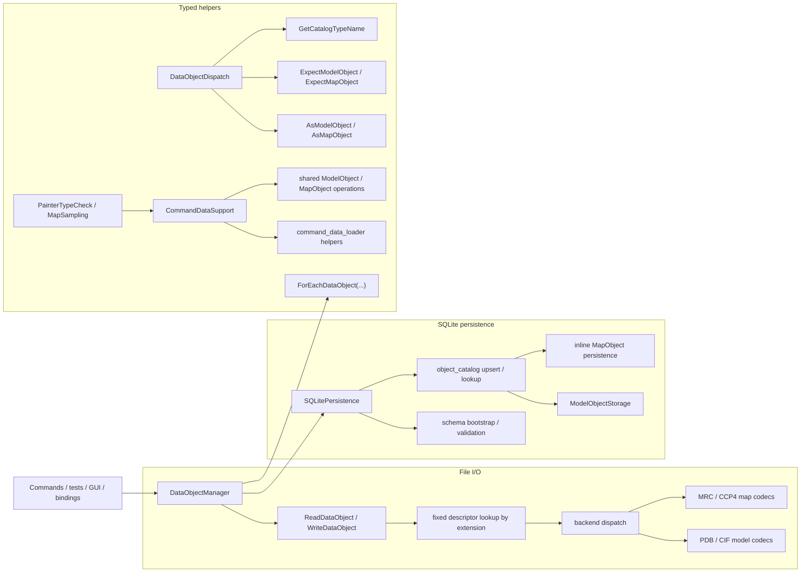

# DataObject I/O and Iteration Architecture

This document describes the current runtime contract for:

- file I/O
- SQLite persistence
- typed object dispatch
- `DataObjectManager` iteration
- shared typed command helpers layered on top of these boundaries

Related references:

- [`../development-guidelines.md`](../development-guidelines.md)
- [`./command-architecture.md`](./command-architecture.md)
- [`../adding-dataobject-operations-and-iteration.md`](../adding-dataobject-operations-and-iteration.md)

## 1. Scope

Top-level persisted/file-backed `DataObject` roots are fixed to:

- `ModelObject`
- `MapObject`

`AtomObject` and `BondObject` are model-domain objects. They are never top-level file or SQLite roots.

## 2. Supported Surface

| Top-level object | File read | File write | SQLite save/load |
| --- | --- | --- | --- |
| `ModelObject` | `.pdb`, `.cif`, `.mmcif`, `.mcif` | `.pdb`, `.cif` | yes |
| `MapObject` | `.mrc`, `.map`, `.ccp4` | `.mrc`, `.map`, `.ccp4` | yes |

Rules:

- extension lookup is case-insensitive
- `.mmcif` and `.mcif` use the CIF reader and are read-only
- `.mrc` uses the MRC backend
- `.map` and `.ccp4` use the CCP4 backend

## 3. Runtime Topology



## 4. File I/O Contract

Public API:

- `ReadDataObject(path)`
- `WriteDataObject(path, obj)`
- `ReadModel(path)` / `WriteModel(path, model, model_parameter=0)`
- `ReadMap(path)` / `WriteMap(path, map)`

Behavior:

- `FileIO.cpp` owns the single descriptor registry for file-format support.
- descriptor routing is explicit by `DataObjectKind` (`Model` or `Map`).
- `WriteDataObject(...)` enforces type/backend agreement through:
  - `ExpectModelObject(data_object, "WriteDataObject()")`
  - `ExpectMapObject(data_object, "WriteDataObject()")`
- typed entry points fail if the extension resolves to the wrong kind.
- all public entry points wrap failures in `std::runtime_error` with file path and operation context.

`DataObjectManager` integration:

- `ProcessFile(filename, key_tag)` reads, assigns `key_tag`, calls `Display()`, and stores the object in memory.
- `ProduceFile(filename, key_tag)` logs and returns when the key is missing; otherwise it writes the in-memory object to disk.

Replacing an existing in-memory key is allowed and logs a warning.

## 5. In-Memory Object Contract

`DataObjectManager` stores objects in:

- `std::unordered_map<std::string, std::shared_ptr<DataObjectBase>>`

Concurrency boundaries:

- `m_map_mutex` protects the in-memory object map
- `m_db_mutex` protects manager-level persistence access

Lookup helpers:

- `HasDataObject(key_tag)` returns presence only
- `GetDataObject(key_tag)` throws if the key is missing
- `GetTypedDataObject<T>(key_tag)` throws if the key is missing or the runtime type does not match `T`

`AddDataObject(...)` is private manager infrastructure. It rejects null pointers, replaces duplicate keys, and logs replacement.

## 6. SQLite Persistence Contract

Manager entry points:

- `SetDatabaseManager(db_path)`
- `SaveDataObject(key_tag, renamed_key_tag="")`
- `LoadDataObject(key_tag)`

`SetDatabaseManager(...)` creates an internal `SQLitePersistence` boundary object. If the same path is already active, it logs a warning and keeps the existing instance.

`SQLitePersistence` responsibilities:

- create the database parent directory if needed
- open SQLite
- bootstrap or validate only the current normalized schema
- own the transaction boundary for each save/load
- upsert and query `object_catalog(key_tag, object_type)`
- route by stable catalog type name only:
  - `model` -> `ModelObjectStorage`
  - `map` -> inline map save/load helpers in the same persistence unit

Behavior differences to keep straight:

- `DataObjectManager::SaveDataObject(...)`
  - throws if the DB manager is not initialized
  - logs a warning and returns if the in-memory key is missing
  - `renamed_key_tag` changes only the persisted key, not the in-memory key
- `SQLitePersistence::SaveDataObject(...)`
  - throws if the input pointer is null
  - throws if `GetCatalogTypeName(...)` cannot resolve a supported top-level type
- `LoadDataObject(...)`
  - throws if the DB manager is not initialized
  - throws if the catalog row is missing
  - loads the object and stores it in the in-memory map under the requested key

## 7. Schema Contract

Schema version source: `PRAGMA user_version`.

Supported states:

- `2`
  - validate the current normalized schema
- `0`
  - empty database -> bootstrap the current normalized schema
- any other state
  - fail fast as unsupported

Current schema invariants:

- `object_catalog(key_tag, object_type)` is the polymorphic root catalog
- `object_type` is required and limited to `model` or `map`
- `model_object.key_tag` references `object_catalog(key_tag)` with `ON DELETE CASCADE`
- `map_list.key_tag` references `object_catalog(key_tag)` with `ON DELETE CASCADE`
- every model payload table references `model_object(key_tag)` with `ON DELETE CASCADE`
- validation checks required tables, primary-key shape, foreign-key shape, and catalog/payload key consistency

The persistence layer validates the existing current schema; it does not silently repair arbitrary damaged databases.

## 8. Typed Object Dispatch Contract

API:

- `AsModelObject(...)`, `AsMapObject(...)`
- `ExpectModelObject(...)`, `ExpectMapObject(...)`
- `GetCatalogTypeName(...)`

Behavior:

- `As*` helpers return a typed pointer or `nullptr`
- `Expect*` helpers return a typed reference or throw with caller context and resolved runtime type
- `GetCatalogTypeName(...)` returns:
  - `model` for `ModelObject`
  - `map` for `MapObject`
- `GetCatalogTypeName(...)` throws for non-top-level types such as `AtomObject` and `BondObject`

`DataObjectDispatch` belongs to the `data/object` layer because it encodes `DataObjectBase` hierarchy rules, not command policy.

## 9. Manager Iteration Contract

`DataObjectManager::ForEachDataObject(...)` has mutable and const overloads plus:

```cpp
struct IterateOptions
{
    bool deterministic_order{ true };
};
```

Behavior:

- empty key list:
  - `deterministic_order=true`: iterate keys in lexicographic order
  - `deterministic_order=false`: iterate current container order
- non-empty key list:
  - callback order follows the caller-provided key order
  - missing keys are skipped with warning logs
- empty callback throws `std::runtime_error`
- traversal is snapshot-based:
  - the manager copies matching `shared_ptr`s while holding `m_map_mutex`
  - callbacks run after the mutex is released

## 10. Shared Typed Command Helpers

Current shared helpers live in `src/core/command/CommandDataSupport.*`.

Loader helpers in `namespace command_data_loader`:

- `ProcessModelFile(...)`
- `ProcessMapFile(...)`
- `OptionalProcessMapFile(...)`
- `LoadModelObject(...)`

Reusable typed operations:

- `NormalizeMapObject(...)`
- `PrepareModelObject(...)`
- `ApplyModelSelection(...)`
- `CollectModelAtoms(...)`
- `PrepareSimulationAtoms(...)`
- `BuildModelAtomBondContext(...)`

## 11. Extension Boundaries

Allowed extension:

- add model or map file formats through the descriptor table in `FileIO.cpp`
- evolve the fixed model/map SQLite storage implementations
- add reusable typed model/map helpers in `CommandDataSupport`
- extend manager iteration policy through `IterateOptions`

Out of scope:

- runtime registration of arbitrary top-level `DataObject` roots
- runtime registration of storage factories
- replacing file or DB routing with plugin chains

## 12. Key Files

Core orchestration:

- `include/rhbm_gem/data/io/DataObjectManager.hpp`
- `src/data/io/DataObjectManager.cpp`
- `include/rhbm_gem/data/io/FileIO.hpp`
- `src/data/io/file/FileIO.cpp`

SQLite persistence:

- `src/data/internal/sqlite/SQLitePersistence.hpp`
- `src/data/io/sqlite/SQLitePersistence.cpp`
- `src/data/internal/sqlite/ModelObjectStorage.hpp`
- `src/data/io/sqlite/ModelObjectStorage.cpp`

Typed dispatch and shared helpers:

- `include/rhbm_gem/data/object/DataObjectDispatch.hpp`
- `src/data/object/DataObjectDispatch.cpp`
- `src/core/command/CommandDataSupport.hpp`
- `src/core/command/CommandDataSupport.cpp`

Reference tests:

- `tests/data/DataObjectRuntime_test.cpp`
- `tests/data/DataObjectSchema_test.cpp`
