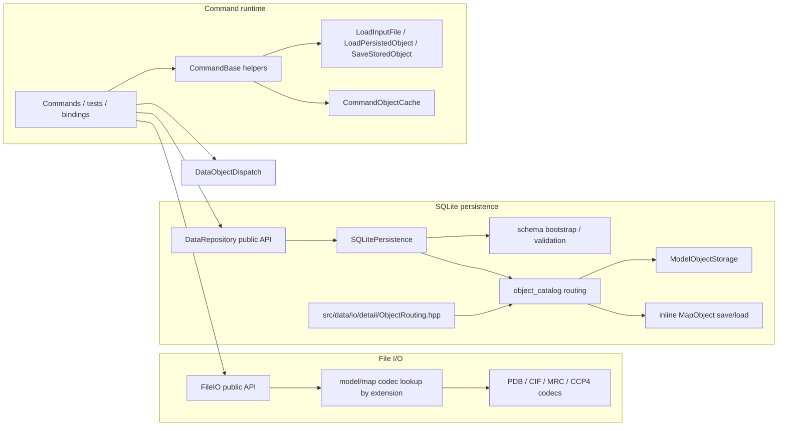

# DataObject I/O Architecture

This document describes the current runtime contract for:

- typed file I/O
- SQLite persistence
- typed object dispatch
- command-side object loading and persistence

Related references:

- [`/docs/developer/development-guidelines.md`](/docs/developer/development-guidelines.md)
- [`/docs/developer/architecture/command-architecture.md`](/docs/developer/architecture/command-architecture.md)
- [`/docs/developer/adding-dataobject-operations.md`](/docs/developer/adding-dataobject-operations.md)

Header boundary rule:

- only `/include/rhbm_gem/data/**` is public API surface
- headers stored under `/src/data/**` are internal implementation details
- headers stored under `/src/core/command/detail/**` are command-internal orchestration helpers
- source-private data I/O headers live under `/src/data/io/file`, `/src/data/io/sqlite`, and `/src/data/io/detail`

## 1. Scope

Top-level file-backed and SQLite-persisted `DataObject` roots are fixed to:

- `ModelObject`
- `MapObject`

`AtomObject` and `BondObject` are model-domain objects. They are not top-level file or database roots.

## 2. Public Surface

| Component | Public entry points | Responsibility |
| --- | --- | --- |
| `FileIO` | `ReadModel`, `WriteModel`, `ReadMap`, `WriteMap` | Typed file import/export |
| `DataRepository` | `DataRepository(path)`, `LoadModel`, `LoadMap`, `SaveModel`, `SaveMap` | Database persistence only |
| `DataObjectDispatch` | `AsModelObject`, `AsMapObject`, `ExpectModelObject`, `ExpectMapObject` | Runtime type probing and enforcement |

## 3. Supported Formats

| Top-level object | File read | File write | SQLite save/load |
| --- | --- | --- | --- |
| `ModelObject` | `.pdb`, `.cif`, `.mmcif`, `.mcif` | `.pdb`, `.cif` | yes |
| `MapObject` | `.mrc`, `.map`, `.ccp4` | `.mrc`, `.map`, `.ccp4` | yes |

Rules enforced by `/src/data/io/file/ModelMapFileIO.cpp`:

- extension lookup is case-insensitive
- `.mmcif` and `.mcif` use the CIF reader and are read-only
- `.mrc` uses the MRC codec
- `.map` and `.ccp4` use the CCP4 codec
- typed entry points fail when the extension resolves to an unsupported operation

## 4. Runtime Topology

## 5. File I/O Contract

Public API:

- `ReadModel(path)` / `WriteModel(path, model, model_parameter=0)`
- `ReadMap(path)` / `WriteMap(path, map)`

Behavior:

- only typed file entry points are public
- `ModelMapFileIO.cpp` owns the extension-to-codec tables for model and map formats
- all public entry points wrap failures in `std::runtime_error` with file path and operation context
- `WriteModel(..., model_parameter)` is the only public file I/O parameter that varies by caller policy

## 6. Database Persistence Contract

Public API:

- `DataRepository(database_path)`
- `LoadModel(key_tag)` / `LoadMap(key_tag)`
- `SaveModel(model, key_tag)` / `SaveMap(map, key_tag)`

Behavior:

- `DataRepository` is database-only; it does not perform file I/O
- the database path is bound at construction time
- `LoadModel(...)` and `LoadMap(...)` return typed `std::unique_ptr` objects
- save methods persist under the explicit key passed by the caller
- saving under a different persisted key does not rename the source object's in-memory `key_tag`
- if the repository is constructed with an empty path, `SQLitePersistence` falls back to `database.sqlite`

`SQLitePersistence` responsibilities:

- create the database parent directory if needed
- open SQLite
- bootstrap or validate the current normalized schema
- serialize save/load operations with an internal mutex
- own a transaction for each save/load operation
- route by catalog type name stored in `object_catalog(key_tag, object_type)`
- dispatch supported top-level types only:
  - `model` -> `ModelObjectStorage`
  - `map` -> inline map save/load helpers in `SQLitePersistence.cpp`

## 7. Schema Contract

Schema version source:

- `PRAGMA user_version`

Supported states:

- `2`
  - validate the current normalized schema
- `0`
  - bootstrap only when the database is otherwise empty
- any other state
  - fail fast as unsupported

Current schema invariants:

- `object_catalog(key_tag, object_type)` is the top-level catalog
- `object_type` is required and limited to `model` or `map`
- `model_object.key_tag` references `object_catalog(key_tag)` with `ON DELETE CASCADE`
- `map_list.key_tag` references `object_catalog(key_tag)` with `ON DELETE CASCADE`
- every model payload table references `model_object(key_tag)` with `ON DELETE CASCADE`
- validation checks required tables, primary-key shape, foreign-key shape, and catalog/payload key consistency
- unsupported shapes such as `object_metadata` fail validation instead of being migrated in place

## 8. Typed Object Dispatch Contract

API:

- `AsModelObject(...)`, `AsMapObject(...)`
- `ExpectModelObject(...)`, `ExpectMapObject(...)`

Behavior:

- `As*` helpers return a typed pointer or `nullptr`
- `Expect*` helpers return a typed reference or throw with caller context and resolved runtime type
- catalog naming and top-level persistence routing stay in source-private I/O helpers

## 9. Command Integration Contract

Commands built on `CommandBase` typically use these internal helpers:

- `LoadInputFile<T>(path, key_tag)`
- `AttachDataRepository(database_path)`
- `LoadPersistedObject<T>(key_tag)`
- `SaveStoredObject(key_tag, persisted_key="")`

Behavior:

- `LoadInputFile<T>(...)` reads a typed object through `FileIO`, sets its `key_tag`, stores it in a command-private cache, and returns `shared_ptr<T>`
- `LoadPersistedObject<T>(...)` loads through `DataRepository`, stores the result in the same command-private cache, and returns `shared_ptr<T>`
- `SaveStoredObject(...)` resolves the cached runtime type via `DataObjectDispatch` and persists through `DataRepository`
- the command-private `CommandObjectCache` is an implementation detail of `CommandBase`, not a shared data-layer contract
- there is no shared manager-owned iteration API; traversal, ordering, and selection belong in command-local typed workflows or ordinary container iteration

## 10. Key Files

Core orchestration:

- `/include/rhbm_gem/data/io/DataRepository.hpp`
- `/include/rhbm_gem/data/io/ModelMapFileIO.hpp`
- `/src/core/command/detail/CommandBase.hpp`
- `/src/data/io/DataRepository.cpp`
- `/src/data/io/file/ModelMapFileIO.cpp`

SQLite persistence:

- `/src/data/io/sqlite/SQLitePersistence.hpp`
- `/src/data/io/sqlite/SQLitePersistence.cpp`
- `/src/data/io/sqlite/ModelObjectStorage.hpp`
- `/src/data/io/sqlite/ModelObjectStorage.cpp`
- `/src/data/io/detail/ObjectRouting.hpp`

Typed dispatch and reference tests:

- `/include/rhbm_gem/data/object/DataObjectDispatch.hpp`
- `/src/data/object/DataObjectDispatch.cpp`
- `/tests/data/DataPublicSurface_test.cpp`
- `/tests/data/DataObjectDispatchAndIngestion_test.cpp`
- `/tests/data/DataObjectFileIO_test.cpp`
- `/tests/data/DataObjectImportRegression_test.cpp`
- `/tests/data/DataObjectRuntimeBehavior_test.cpp`
- `/tests/data/DataObjectPersistence_test.cpp`
- `/tests/data/DataObjectSchemaBootstrap_test.cpp`
- `/tests/data/DataObjectSchemaCompatibility_test.cpp`
- `/tests/data/DataObjectSchemaValidation_test.cpp`
