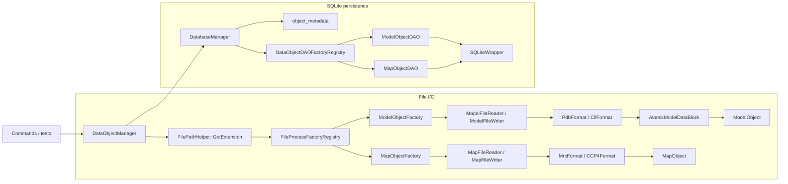

# DataObject I/O Developer Guide

This document explains how the repository currently loads, writes, saves, and reloads top-level `DataObject` instances.

Use it when you need to:

- trace a file import or export path
- understand how SQLite persistence selects a DAO
- add a new file format or a new persistent `DataObject`
- check which metadata survives a file or database round-trip

Read this together with:

- [`../development-guidelines.md`](../development-guidelines.md)
- [`./command-architecture.md`](./command-architecture.md)

Editable diagrams for this area live under [`./diagrams/`](./diagrams/).

## 1. What This Subsystem Owns

At the architecture level, this subsystem only treats `ModelObject` and `MapObject` as top-level I/O units.

`AtomObject` and `BondObject` also inherit from `DataObjectBase`, but they are subordinate parts of a `ModelObject`; they are not registered in the file factory registry or DAO registry as standalone load/save targets.

The main responsibilities are split like this:

- `DataObjectManager`: command-facing orchestration and in-memory ownership
- `FileProcessFactoryRegistry`: choose the file pipeline from the extension
- `ModelObjectFactory` / `MapObjectFactory`: build or write the concrete object
- `DatabaseManager`: choose the DAO and coordinate SQLite access
- `DataObjectDAOFactoryRegistry`: map runtime type or stored type name to a DAO
- `ModelObjectDAO` / `MapObjectDAO`: persist and reconstruct concrete objects
- `SQLiteWrapper`: low-level SQL execution, statements, transactions, typed bind/read helpers

## 2. How Callers Should Use It

The command layer should usually talk to `DataObjectManager`, not directly to readers, writers, or DAOs.

Typical file path:

```cpp
DataObjectManager manager;
manager.ProcessFile(model_path, "model");
auto model = manager.GetTypedDataObject<ModelObject>("model");
```

Typical persistence path:

```cpp
DataObjectManager manager;
manager.SetDatabaseManager(database_path);
manager.ProcessFile(model_path, "model");
manager.SaveDataObject("model", "saved_model");

manager.LoadDataObject("saved_model");
auto model = manager.GetTypedDataObject<ModelObject>("saved_model");
```

Practical rules:

- Commands should prefer `DataObjectManager` or the wrappers in `src/core/CommandDataAccessInternal.hpp`.
- `SetDatabaseManager(...)` must be called before `SaveDataObject(...)` or `LoadDataObject(...)`.
- `ProduceFile(...)` only works for objects already present in memory.
- Reusing an in-memory `key_tag` replaces the previous object in `DataObjectManager`.
- `SaveDataObject(key_tag, renamed_key_tag)` only changes the database key. It does not rename the in-memory object or the in-memory map entry.

## 3. Runtime Topology



## 4. File I/O

### 4.1 Dispatch Rules

All public file entry points start in `DataObjectManager`:

- `ProcessFile(path, key_tag)`
- `ProduceFile(path, key_tag)`

Extension normalization happens in `FilePathHelper::GetExtension(...)`, which lowercases the suffix before dispatch. The rest of the pipeline therefore works with normalized extensions.

`FileProcessFactoryRegistry::RegisterDefaultFactories()` currently registers:

- model: `.pdb`, `.cif`, `.mmcif`, `.mcif`
- map: `.mrc`, `.map`, `.ccp4`

Important implementation detail:

- default file factories are registered once per process via `std::call_once` in `DataObjectManager`'s constructor
- extension-to-factory dispatch happens in `FileProcessFactoryRegistry`
- format-to-parser dispatch happens again inside the concrete reader or writer

When adding a new file format, both layers usually need to change.

### 4.2 `ProcessFile(...)`

`DataObjectManager::ProcessFile(...)` does the following:

1. normalize and inspect the file extension
2. ask `FileProcessFactoryRegistry` for a factory
3. call `CreateDataObject(...)`
4. set the loaded object's `key_tag`
5. insert or replace the object in the in-memory map

If parsing fails, `DataObjectManager` wraps the lower-level exception with the file path and requested `key_tag`.

### 4.3 `ProduceFile(...)`

`DataObjectManager::ProduceFile(...)` does the reverse:

1. look up the in-memory object by `key_tag`
2. select a factory from the output extension
3. delegate to `OutputDataObject(...)`

Current behavior to keep in mind:

- missing in-memory keys do not throw; the manager logs a warning and returns
- output format is selected from the target filename, not from the source filename

## 5. Model File Pipeline

### 5.1 Read Path

Model import is split into three layers:

1. `ModelFileReader`
2. `ModelFileFormatBase` implementations (`PdbFormat`, `CifFormat`)
3. `ModelObjectFactory`

`ModelFileReader`:

- chooses `PdbFormat` for `.pdb`
- chooses `CifFormat` for `.cif`, `.mmcif`, `.mcif`
- reads header first, then data payload

The format implementation parses into `AtomicModelDataBlock`, not directly into `ModelObject`.

That intermediate block owns:

- atoms grouped by model number
- bonds
- parsed chemistry dictionaries
- component / atom / bond key systems
- entity and chain metadata used during parsing
- secondary-structure ranges used to annotate atoms during parse
- identifiers such as PDB ID, EMD ID, and resolution

### 5.2 `ModelObjectFactory` Assembly Rules

`ModelObjectFactory::CreateDataObject(...)` is where parsed model data becomes the supported in-memory form.

Current behavior:

1. read the file into an `AtomicModelDataBlock`
2. choose model number `1` when present
3. otherwise fall back to the first model number in the file
4. move only the selected model's atom list into a new `ModelObject`
5. move the full parsed bond list, then keep only bonds whose endpoints are both in the selected atom set
6. copy or move selected metadata into the `ModelObject`

Metadata that is currently transferred from the block to `ModelObject`:

- `pdb_id`
- `emd_id`
- `resolution`
- `resolution_method`
- `chain_id_list_map`
- chemical component dictionary
- component key system
- atom key system

Notable current limits:

- the parsed `BondKeySystem` is not moved into `ModelObject` on file import
- entity metadata in `AtomicModelDataBlock` is parser-side state and is not stored on `ModelObject`
- secondary-structure ranges are not persisted as standalone structures; they are applied to atom state during parsing

### 5.3 Write Path

Model export uses:

- `ModelFileWriter`
- `PdbFormat` or `CifFormat`

Current support is narrower for write than for read:

| Path | Supported model extensions |
| --- | --- |
| Read | `.pdb`, `.cif`, `.mmcif`, `.mcif` |
| Write | `.pdb`, `.cif` |

This distinction is intentional in the current codebase. Do not document `.mmcif` or `.mcif` output support unless it is actually implemented in `ModelFileWriter`.

## 6. Map File Pipeline

### 6.1 Read and Write Path

Map import and export are simpler than the model path.

Components:

- `MapFileReader` / `MapFileWriter`
- `MapFileFormatBase` implementations
- `MrcFormat` for `.mrc`
- `CCP4Format` for `.map` and `.ccp4`

`MapObjectFactory::CreateDataObject(...)` builds `MapObject` directly from:

- grid size
- grid spacing
- origin
- owned voxel array

There is no intermediate structure like `AtomicModelDataBlock` because the map formats already match the in-memory shape closely.

### 6.2 Ownership Detail

`MapFileReader::GetMapValueArray()` transfers ownership of the voxel array to the caller. After that call, the reader no longer owns the data.

This matters when debugging or extending the map pipeline: treat the returned array as move-only state, not as a reusable buffer.

### 6.3 Supported Extensions

Map read and write currently support the same surface:

- `.mrc`
- `.map`
- `.ccp4`

## 7. SQLite Persistence

### 7.1 Entry Points

Database persistence enters through:

- `DataObjectManager::SaveDataObject(key_tag, renamed_key_tag)`
- `DataObjectManager::LoadDataObject(key_tag)`

`DataObjectManager` itself does not know any schema details. It only:

- ensures a `DatabaseManager` exists
- fetches the in-memory object for save
- delegates to `DatabaseManager`
- inserts the loaded object back into the in-memory map

### 7.2 `DatabaseManager`

`DatabaseManager` owns:

- the SQLite connection
- the `object_metadata` table
- a DAO cache keyed by `std::type_index`
- separate mutexes for DAO-cache access and database operations

`object_metadata` is the polymorphic dispatch table:

```sql
CREATE TABLE IF NOT EXISTS object_metadata (
    key_tag TEXT PRIMARY KEY,
    object_type TEXT
);
```

Save flow:

1. create or reuse the DAO for the runtime object type
2. call `dao->Save(...)`
3. upsert `(key_tag, object_type)` into `object_metadata`

Load flow:

1. read `object_type` from `object_metadata`
2. resolve the DAO from `DataObjectDAOFactoryRegistry`
3. call `dao->Load(key_tag)`

Important implementation detail:

- DAO payload save and `object_metadata` upsert are separate transactions
- a save is therefore coordinated in order, but not wrapped in one cross-table transaction spanning both layers

### 7.3 DAO Registration

DAO registration is static and translation-unit driven:

- `ModelObjectDAO` registers itself as `"model"`
- `MapObjectDAO` registers itself as `"map"`

The registration mechanism is:

```cpp
DataObjectDAORegistrar<DataObjectType, DAOType>("stable_name")
```

The string name is persisted in `object_metadata.object_type`, so it must remain stable once data may already exist on disk.

This is different from file factory registration:

- file factories are registered explicitly by `RegisterDefaultFactories()`
- DAOs are registered implicitly by namespace-scope registrar objects in the DAO `.cpp` files

## 8. `ModelObjectDAO` Schema and Reconstruction

`ModelObjectDAO` is the most complex I/O path in the repository.

### 8.1 Table Naming Strategy

Top-level model metadata is stored in `model_list`.

Most other tables are namespaced by a sanitized version of `key_tag`:

- keep `[A-Za-z0-9_]`
- replace every other character with `_`

Examples:

- `atom_list_in_example_key`
- `bond_list_in_example_key`
- `chemical_component_entry_in_example_key`
- `atom_local_potential_entry_in_example_key`
- `component_atom_entry_in_example_key`
- `component_bond_entry_in_example_key`
- `[class_key]_atom_group_potential_entry_in_example_key`

### 8.2 What Gets Saved

Current `ModelObjectDAO::Save(...)` writes:

- one row in `model_list`
- chemical component entries
- component atom entries
- component bond entries
- atom list
- bond list
- atom local potential entries
- bond local potential entries
- class-specific atom posterior tables when atom group entries exist
- class-specific bond posterior tables when bond group entries exist
- class-specific atom group tables
- class-specific bond group tables

Subordinate tables are generally handled as full replacement:

- `CREATE TABLE IF NOT EXISTS ...`
- `DELETE FROM ...`
- insert current rows again

`model_list` itself uses an upsert instead of table clearing.

### 8.3 What Does Not Get Saved

A database round-trip for `ModelObject` does not currently preserve everything that file import can produce.

Notably absent from `ModelObjectDAO` persistence:

- `chain_id_list_map`
- parser-only entity metadata from `AtomicModelDataBlock`
- KD-tree and other derived caches

Practical consequence:

- a `ModelObject` loaded from SQLite does not restore the chain metadata used by `FilterAtomFromSymmetry(...)`
- if a workflow depends on that metadata after a DB reload, it must rebuild or re-import it

### 8.4 How Load Works

`ModelObjectDAO::Load(...)` reconstructs the object in this order:

1. load chemical component entries
2. load component atom entries
3. load component bond entries
4. load atoms
5. load bonds
6. load one row from `model_list`
7. create group-potential buckets for every known chemical class
8. load group tables when present

Selection state is restored indirectly:

- atoms and bonds are marked selected when a local potential entry exists for them
- selected atom and bond lists are rebuilt by `ModelObject::Update()` / `SetBondList(...)`
- group membership is rebuilt by classifying selected members with `AtomClassifier` and `BondClassifier`

This means the persisted schema stores both structural data and analysis results, not just raw coordinates.

## 9. `MapObjectDAO` Schema

`MapObjectDAO` stores one map per `key_tag` in a single table:

- `map_list`

Stored columns:

- `key_tag`
- `grid_size_x`, `grid_size_y`, `grid_size_z`
- `grid_spacing_x`, `grid_spacing_y`, `grid_spacing_z`
- `origin_x`, `origin_y`, `origin_z`
- `map_value_array` as a BLOB

The map payload is copied into a `std::vector<float>` for binding, then reconstructed back into an owned `float[]` during load.

Compared with `ModelObjectDAO`, this path is intentionally flat and direct.

## 10. SQLite Utility Layer

The DAO layer depends on `SQLiteWrapper` for:

- SQL execution via `Execute(...)`
- prepared statements via `Prepare(...)`
- typed binders via `Bind<T>(...)`
- typed column readers via `GetColumn<T>(...)`
- RAII statement cleanup via `StatementGuard`
- RAII transactions via `TransactionGuard`
- typed streaming queries via `QueryIterator`

This utility layer is what makes the DAO code manageable despite storing BLOB payloads such as:

- `std::vector<float>`
- `std::vector<std::tuple<float, float>>`
- `std::vector<std::tuple<double, double>>`

## 11. Current Supported Surface

| Top-level object | File read | File write | SQLite save/load |
| --- | --- | --- | --- |
| `ModelObject` | `.pdb`, `.cif`, `.mmcif`, `.mcif` | `.pdb`, `.cif` | yes |
| `MapObject` | `.mrc`, `.map`, `.ccp4` | `.mrc`, `.map`, `.ccp4` | yes |

## 12. Key Source Files

Start with these files when debugging or extending this subsystem:

- `include/core/DataObjectManager.hpp`
- `src/core/DataObjectManager.cpp`
- `include/data/FileProcessFactoryRegistry.hpp`
- `src/data/FileProcessFactoryRegistry.cpp`
- `src/data/ModelObjectFactory.cpp`
- `src/data/MapObjectFactory.cpp`
- `src/data/ModelFileReader.cpp`
- `src/data/MapFileReader.cpp`
- `src/data/ModelFileWriter.cpp`
- `src/data/MapFileWriter.cpp`
- `include/data/DatabaseManager.hpp`
- `src/data/DatabaseManager.cpp`
- `include/data/DataObjectDAOFactoryRegistry.hpp`
- `src/data/DataObjectDAOFactoryRegistry.cpp`
- `include/data/ModelObjectDAO.hpp`
- `src/data/ModelObjectDAO.cpp`
- `include/data/MapObjectDAO.hpp`
- `src/data/MapObjectDAO.cpp`
- `include/data/SQLiteWrapper.hpp`

## 13. Extension Playbooks

### 13.1 Add a New File Format for an Existing Object

For a new model or map format:

1. implement or extend the appropriate `*Format` class
2. update the relevant reader and writer dispatch logic
3. register the extension in `FileProcessFactoryRegistry::RegisterDefaultFactories()`
4. add read and write tests
5. update this document's support matrix

If the format parses into a different intermediate shape, decide whether it still fits the current factory contract or whether a new assembly seam is needed.

### 13.2 Add a New Persistent Top-Level `DataObject`

For a new database-persisted top-level object:

1. derive from `DataObjectBase`
2. implement a `DataObjectDAOBase` subclass
3. register it with `DataObjectDAORegistrar<...>("stable_name")`
4. decide whether it also needs file factories and readers/writers
5. add round-trip tests for save and load
6. document the schema and support matrix here

`DatabaseManager` usually does not need new branching logic; it already dispatches through the DAO registry.

## 14. Current Gotchas

- `ProcessFile(...)` and `LoadDataObject(...)` replace an existing in-memory `key_tag`.
- `ClearDataObjects()` only clears the in-memory map; it does not delete database rows.
- `ProduceFile(...)` warns and returns when the key is missing; it does not throw.
- `SaveDataObject(original, renamed)` saves under a new database key but leaves the in-memory object under `original`.
- Model database persistence is not a lossless round-trip for all parser metadata.
- Model file write support is intentionally narrower than model file read support.
