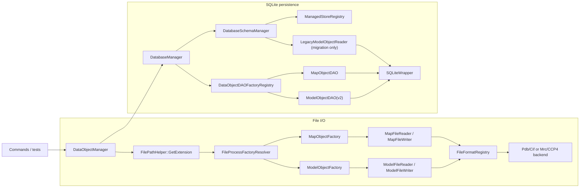

# DataObject I/O Developer Manual

This manual explains the current file and SQLite I/O system for top-level `DataObject` instances.

Use this document when you need to:

- trace import/export behavior from command entry points
- understand save/load behavior to SQLite
- extend supported file formats
- add a new persistent top-level `DataObject`

Read with:

- [`../development-guidelines.md`](../development-guidelines.md)
- [`./command-architecture.md`](./command-architecture.md)

## 1. Scope

Top-level I/O units in this project are:

- `ModelObject`
- `MapObject`

`AtomObject` and `BondObject` are `ModelObject` internals and are not standalone file/database roots.

## 2. Quick Usage

Typical import + in-memory access:

```cpp
DataObjectManager manager;
manager.ProcessFile(model_path, "model");
auto model = manager.GetTypedDataObject<ModelObject>("model");
```

Typical database round trip:

```cpp
DataObjectManager manager;
manager.SetDatabaseManager(database_path);
manager.ProcessFile(model_path, "model");
manager.SaveDataObject("model", "saved_model");

manager.LoadDataObject("saved_model");
auto model = manager.GetTypedDataObject<ModelObject>("saved_model");
```

Operational rules:

- Call `SetDatabaseManager(...)` before save/load.
- `ProduceFile(...)` only writes objects already in memory.
- Reusing an in-memory `key_tag` replaces the previous entry.
- `SaveDataObject(original, renamed)` changes only database key; in-memory key remains `original`.

## 3. Supported Surface

| Top-level object | File read | File write | SQLite save/load |
| --- | --- | --- | --- |
| `ModelObject` | `.pdb`, `.cif`, `.mmcif`, `.mcif` | `.pdb`, `.cif` | yes |
| `MapObject` | `.mrc`, `.map`, `.ccp4` | `.mrc`, `.map`, `.ccp4` | yes |

## 4. Runtime Topology



## 5. File I/O

### 5.1 Dispatch and Factory Rules

- Entry points: `DataObjectManager::ProcessFile(...)` and `ProduceFile(...)`.
- Extension normalization uses `FilePathHelper::GetExtension(...)` (lowercase).
- `FileFormatRegistry` is the single source of truth for format support and backend mapping.
- `DefaultFileProcessFactoryResolver` derives built-in factories from `FileFormatRegistry`.
- `OverrideableFileProcessFactoryResolver` allows per-extension overrides and is mutex-protected for concurrent register/unregister/lookup.

`DataObjectManager` behavior:

- `ProcessFile(...)`: build factory from extension, create object, set key, insert/replace in-memory entry.
- `ProduceFile(...)`: find in-memory object by key, pick writer path from output extension, write output.

Error behavior:

- Missing key in `ProduceFile(...)` logs warning and returns.
- Parse/write errors throw exceptions.
- `DataObjectManager` wraps lower-level errors with file path and `key_tag` context.

### 5.2 Model File Pipeline

Read path:

1. `ModelFileReader` resolves backend via `FileFormatRegistry` and `FileFormatBackendFactory`.
2. `PdbFormat` or `CifFormat` parses into `AtomicModelDataBlock`.
3. `ModelObjectFactory` converts parsed data to `ModelObject`.

Current assembly rules in `ModelObjectFactory`:

- Prefer model number `1`; fallback to first available model.
- Keep only atoms from selected model.
- Move parsed bond list and keep only bonds whose endpoints both exist in selected atom set.
- Transfer key metadata: `pdb_id`, `emd_id`, `resolution`, `resolution_method`, `chain_id_list_map`, chemical component dictionary, and key systems.

Write path:

- `ModelFileWriter` selects backend from output extension.
- Supported writes are `.pdb` and `.cif` only (`.mmcif` and `.mcif` are read-only aliases).

### 5.3 Map File Pipeline

Read/write path:

- `MapFileReader` / `MapFileWriter` dispatch via `FileFormatRegistry`.
- Backends are `MrcFormat` and `CCP4Format`.

Current `MapFileFormatBase` contract:

```cpp
virtual void Read(std::istream & stream, const std::string & source_name) = 0;
virtual void Write(const MapObject & map_object, std::ostream & stream) = 0;
virtual std::unique_ptr<float[]> GetDataArray() = 0;
virtual std::array<int, 3> GetGridSize() = 0;
virtual std::array<float, 3> GetGridSpacing() = 0;
virtual std::array<float, 3> GetOrigin() = 0;
```

`MapObjectFactory` builds `MapObject` directly from these values (no `AtomicModelDataBlock` equivalent).

Ownership note:

- `GetMapValueArray()` transfers ownership of voxel data to caller.

## 6. SQLite Persistence

### 6.1 Entry Points and Transaction Boundary

Entry points from `DataObjectManager`:

- `SaveDataObject(key_tag, renamed_key_tag)`
- `LoadDataObject(key_tag)`

`DatabaseManager` responsibilities:

- owns `SQLiteWrapper`
- calls `DatabaseSchemaManager::EnsureSchema()` during construction
- owns cross-table transaction boundary for both save and load
- dispatches DAO via `object_catalog` + `DataObjectDAOFactoryRegistry`
- caches DAO instances by `std::type_index`

`object_catalog` is the polymorphic dispatch root:

```sql
CREATE TABLE IF NOT EXISTS object_catalog (
    key_tag TEXT PRIMARY KEY,
    object_type TEXT NOT NULL,
    CHECK (object_type IN ('model', 'map'))
);
```

Save flow:

1. open transaction
2. upsert `(key_tag, object_type)` into `object_catalog`
3. resolve DAO and call `dao->Save(...)`
4. commit via RAII

Load flow:

1. open transaction
2. read `object_type` from `object_catalog`
3. resolve DAO and call `dao->Load(...)`
4. commit via RAII

DAO contract:

- DAO implementations are transaction-free; they rely on `DatabaseManager` transaction scope.

### 6.2 Schema Versioning and Migration

Schema version source: `PRAGMA user_version`

- `1`: legacy v1
- `2`: normalized v2 (final runtime shape)

`EnsureSchema()` policy:

1. `user_version == 1`: migrate v1 -> v2
2. `user_version == 2`: validate final v2 shape only
3. `user_version != 0 && != 1 && != 2`: reject
4. `user_version == 0`:
   - empty database: create final v2 + set version `2`
   - recognized legacy v1: migrate to final v2
   - other non-empty shapes: reject

Final v2 ownership model:

- `object_catalog(key_tag, object_type)` is the root.
- `model_object.key_tag` and `map_list.key_tag` reference `object_catalog(key_tag)` with `ON DELETE CASCADE`.
- model child tables reference `model_object(key_tag)` with `ON DELETE CASCADE`.

Migration (open-time, in-place) summary:

1. begin transaction
2. snapshot legacy model/map roots
3. create final v2 tables
4. migrate models through `LegacyModelObjectReader` -> `ModelObjectDAOv2`
5. migrate map rows into final `map_list`
6. rebuild `object_catalog`
7. drop only owned legacy tables and remove `object_metadata` if present
8. set `user_version = 2` and validate final v2

### 6.3 Managed Store Registry

`ManagedStoreRegistry` defines store descriptors per object type (`model`, `map`), including:

- schema creation callback
- schema validation callback
- key listing callback
- managed table list

`DatabaseSchemaManager` uses these descriptors to keep model/map schema handling centralized.

### 6.4 DAO Registration and Naming

DAO registration is static (translation-unit registration):

- `ModelObjectDAO` -> stable name `"model"`
- `MapObjectDAO` -> stable name `"map"`

Registration API:

```cpp
DataObjectDAORegistrar<DataObjectType, DAOType>("stable_name")
```

`stable_name` is persisted in `object_catalog.object_type`; treat it as on-disk ABI.

## 7. Persistence Details by Object

### 7.1 `ModelObject` (Normalized v2)

Persisted table groups:

- structure root: `model_object`
- chain map: `model_chain_map`
- chemical component dictionary: `model_component`, `model_component_atom`, `model_component_bond`
- structure: `model_atom`, `model_bond`
- analysis: `model_atom_local_potential`, `model_bond_local_potential`,
  `model_atom_posterior`, `model_bond_posterior`,
  `model_atom_group_potential`, `model_bond_group_potential`

Save strategy:

- scoped replacement by `key_tag` (delete this key's rows, then reinsert)
- no implicit schema creation in DAO

Round-trip caveats:

- parser-internal metadata from `AtomicModelDataBlock` is not fully promoted/persisted as standalone domain state
- selection/group views are reconstructed during load (`LoadAnalysis(...)`, `ModelObject::Update()`, classifiers)

### 7.2 `MapObject`

Stored in shared `map_list` table with:

- grid size, spacing, origin
- voxel array (`BLOB`)

`MapObjectDAO` follows same DAO contract: transaction-free, no implicit schema bootstrap.

## 8. Extension Guide

### 8.1 Add a New File Format

1. Implement backend (`ModelFileFormatBase` or `MapFileFormatBase`).
2. Add descriptor in `FileFormatRegistry`.
3. Extend `FileFormatBackendFactory` only if a new backend enum branch is needed.
4. Add read/write tests for the support matrix.
5. Update this manual's support matrix.

### 8.2 Add a New Persistent Top-Level `DataObject`

1. Derive from `DataObjectBase`.
2. Implement `DataObjectDAOBase` subclass.
3. Register DAO with stable name (`DataObjectDAORegistrar`).
4. Keep DAO transaction-free.
5. Add a `ManagedStoreDescriptor` entry (ensure/validate/list keys).
6. Extend `object_catalog` constraints and schema validation for the new `object_type`.
7. Add migration/round-trip tests.
8. Update this manual.

## 9. Key Files

Core orchestration:

- `include/core/DataObjectManager.hpp`
- `src/core/DataObjectManager.cpp`
- `include/utils/FilePathHelper.hpp`
- `src/utils/FilePathHelper.cpp`

File dispatch and factories:

- `include/data/FileFormatRegistry.hpp`
- `src/data/FileFormatRegistry.cpp`
- `include/data/FileProcessFactoryResolver.hpp`
- `src/data/FileProcessFactoryResolver.cpp`
- `include/data/FileProcessFactoryBase.hpp`
- `src/data/ModelObjectFactory.cpp`
- `src/data/MapObjectFactory.cpp`
- `include/data/FileFormatBackendFactory.hpp`
- `src/data/FileFormatBackendFactory.cpp`

Model/map file readers and formats:

- `include/data/ModelFileReader.hpp`, `src/data/ModelFileReader.cpp`
- `include/data/ModelFileWriter.hpp`, `src/data/ModelFileWriter.cpp`
- `include/data/MapFileReader.hpp`, `src/data/MapFileReader.cpp`
- `include/data/MapFileWriter.hpp`, `src/data/MapFileWriter.cpp`
- `include/data/PdbFormat.hpp`, `src/data/PdbFormat.cpp`
- `include/data/CifFormat.hpp`, `src/data/CifFormat.cpp`
- `include/data/MrcFormat.hpp`, `src/data/MrcFormat.cpp`
- `include/data/CCP4Format.hpp`, `src/data/CCP4Format.cpp`
- `src/data/map_io/MapAxisOrderHelper.hpp`
- `src/data/map_io/MapAxisOrderHelper.cpp`

Database and schema:

- `include/data/DatabaseManager.hpp`
- `src/data/DatabaseManager.cpp`
- `include/data/DatabaseSchemaManager.hpp`
- `src/data/DatabaseSchemaManager.cpp`
- `include/data/DataObjectDAOFactoryRegistry.hpp`
- `src/data/DataObjectDAOFactoryRegistry.cpp`
- `src/data/persistence/ManagedStoreRegistry.hpp`
- `src/data/persistence/ManagedStoreRegistry.cpp`

DAOs and model persistence internals:

- `include/data/ModelObjectDAO.hpp`, `src/data/ModelObjectDAO.cpp`
- `include/data/ModelObjectDAOv2.hpp`, `src/data/ModelObjectDAOv2.cpp`
- `include/data/MapObjectDAO.hpp`, `src/data/MapObjectDAO.cpp`
- `src/data/model_io/ModelSchemaSql.hpp`
- `src/data/model_io/ModelStructurePersistence.hpp`
- `src/data/model_io/ModelStructurePersistence.cpp`
- `src/data/model_io/ModelAnalysisPersistence.hpp`
- `src/data/model_io/ModelAnalysisPersistence.cpp`
- `src/data/model_io/SQLiteStatementBatch.hpp`
- `src/data/legacy/LegacyModelObjectReader.hpp`
- `src/data/legacy/LegacyModelObjectReader.cpp`

SQLite utility:

- `include/data/SQLiteWrapper.hpp`

## 10. Common Gotchas

- `ProcessFile(...)` and `LoadDataObject(...)` replace in-memory object on key collision.
- `ClearDataObjects()` only clears memory; it does not delete DB rows.
- `ProduceFile(...)` uses target filename extension for writer selection.
- `ProduceFile(...)` with missing key logs warning and returns.
- Reader/writer failures use exceptions, not `nullptr`/status flags.
- `DatabaseManager` validates/bootstrap schema on open; hot-path save/load does not re-bootstrap.
- `SQLiteWrapper` supports one active prepared statement per connection at a time.
