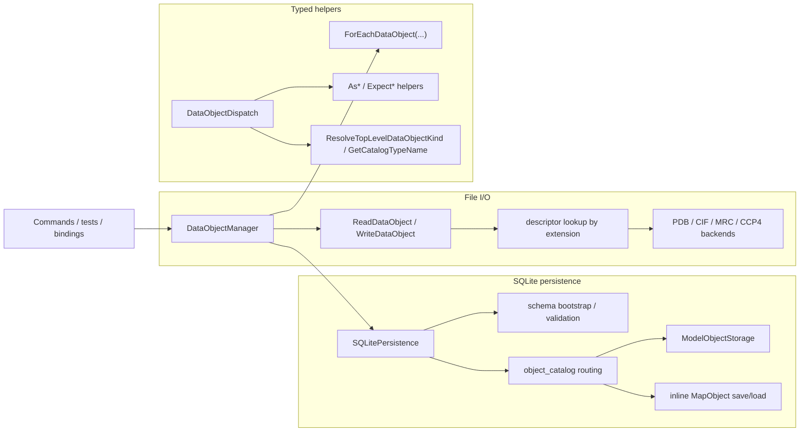

# DataObject I/O and Iteration Architecture

This document describes the current runtime contract for:

- file I/O
- SQLite persistence
- typed object dispatch
- `DataObjectManager` storage and iteration

Related references:

- [`/docs/developer/development-guidelines.md`](/docs/developer/development-guidelines.md)
- [`/docs/developer/architecture/command-architecture.md`](/docs/developer/architecture/command-architecture.md)
- [`/docs/developer/adding-dataobject-operations-and-iteration.md`](/docs/developer/adding-dataobject-operations-and-iteration.md)

Header boundary rule:

- only `/include/rhbm_gem/data/**` is public API surface
- headers stored under `/src/data/**` are internal implementation details
- source-private data I/O headers live next to their `.cpp` files under `/src/data/io/file` and `/src/data/io/sqlite`

## 1. Scope

Top-level file-backed and SQLite-persisted `DataObject` roots are fixed to:

- `ModelObject`
- `MapObject`

`AtomObject` and `BondObject` are model-domain objects. They are not top-level file or database roots.

## 2. Supported Surface

| Top-level object | File read | File write | SQLite save/load |
| --- | --- | --- | --- |
| `ModelObject` | `.pdb`, `.cif`, `.mmcif`, `.mcif` | `.pdb`, `.cif` | yes |
| `MapObject` | `.mrc`, `.map`, `.ccp4` | `.mrc`, `.map`, `.ccp4` | yes |

Rules enforced by `/src/data/io/file/FileIO.cpp`:

- extension lookup is case-insensitive
- `.mmcif` and `.mcif` use the CIF reader and are read-only
- `.mrc` uses the MRC backend
- `.map` and `.ccp4` use the CCP4 backend
- typed file entry points fail when the extension resolves to the wrong top-level kind

## 3. Runtime Topology



## 4. File I/O Contract

Public API:

- `ReadDataObject(path)`
- `WriteDataObject(path, obj)`
- `ReadModel(path)` / `WriteModel(path, model, model_parameter=0)`
- `ReadMap(path)` / `WriteMap(path, map)`

Behavior:

- `FileIO.cpp` owns the fixed descriptor table for supported extensions.
- `WriteDataObject(...)` enforces type/backend agreement through:
  - `ExpectModelObject(data_object, "WriteDataObject()")`
  - `ExpectMapObject(data_object, "WriteDataObject()")`
- all public entry points wrap failures in `std::runtime_error` with file path and operation context

`DataObjectManager` integration:

- `LoadFileIntoMemory(filename, key_tag)` reads the file, sets `key_tag`, and stores the object in memory
- `WriteMemoryObjectToFile(filename, key_tag)` writes the in-memory object to disk and throws if the key is missing
- `TryWriteMemoryObjectToFile(filename, key_tag)` logs a warning and returns `false` when the key is missing
- replacing an existing in-memory key is allowed and logs a warning
- legacy compatibility wrappers (`ProcessFile`, `ProduceFile`, `SetDatabaseManager`) still forward to the preferred APIs above

## 5. In-Memory Manager Contract

`DataObjectManager` stores objects in:

- `std::unordered_map<std::string, std::shared_ptr<DataObjectBase>>`

Concurrency boundaries:

- `m_map_mutex` protects the in-memory object map
- `m_db_mutex` protects manager-level persistence access

Public lookup and lifecycle helpers:

- `ClearDataObjects()`
- `HasDataObject(key_tag)`
- `GetDataObject(key_tag)`
- `GetTypedDataObject<T>(key_tag)`

Behavior:

- `GetDataObject(key_tag)` throws if the key is missing
- `GetTypedDataObject<T>(key_tag)` throws if the key is missing or the runtime type does not match `T`
- private `AddDataObject(...)` logs and replaces duplicate keys
- private `AddDataObject(...)` logs an error and returns `false` for `nullptr`

## 6. SQLite Persistence Contract

Manager entry points:

- `OpenDatabase(db_path)`
- `SaveDataObject(key_tag, renamed_key_tag="")`
- `TrySaveDataObject(key_tag, renamed_key_tag="")`
- `LoadDataObject(key_tag)`

`OpenDatabase(...)` behavior:

- creates an internal `SQLitePersistence` object
- if the same database path is already active, logs a warning and keeps the existing instance
- if the path is empty, `SQLitePersistence` falls back to `database.sqlite`

`SQLitePersistence` responsibilities:

- create the database parent directory if needed
- open SQLite
- bootstrap or validate only the current normalized schema
- own a transaction for each save/load operation
- route by catalog type name stored in `object_catalog(key_tag, object_type)`
- dispatch supported top-level types only:
  - `model` -> `ModelObjectStorage`
  - `map` -> inline map save/load helpers in `SQLitePersistence.cpp`

Behavior differences to keep straight:

- `DataObjectManager::SaveDataObject(...)`
  - throws if the DB manager is not initialized
  - throws if the in-memory key is missing
  - `renamed_key_tag` changes only the persisted key, not the in-memory key
- `DataObjectManager::TrySaveDataObject(...)`
  - logs a warning and returns `false` if the in-memory key is missing
  - otherwise forwards to `SaveDataObject(...)`
- `SQLitePersistence::SaveDataObject(...)`
  - throws if the input pointer is null
  - resolves the top-level kind once, then converts that kind to the catalog type name
- `LoadDataObject(...)`
  - throws if the DB manager is not initialized
  - throws if the catalog row is missing
  - loads the object and stores it in memory under the requested key

## 7. Schema Contract

Schema version source:

- `PRAGMA user_version`

Supported states:

- `2`
  - validate the current normalized schema
- `0`
  - bootstrap only when the database is otherwise empty
- any other state
  - fail fast as unsupported

Current schema invariants:

- `object_catalog(key_tag, object_type)` is the top-level catalog
- `object_type` is required and limited to `model` or `map`
- `model_object.key_tag` references `object_catalog(key_tag)` with `ON DELETE CASCADE`
- `map_list.key_tag` references `object_catalog(key_tag)` with `ON DELETE CASCADE`
- every model payload table references `model_object(key_tag)` with `ON DELETE CASCADE`
- validation checks required tables, primary-key shape, foreign-key shape, and catalog/payload key consistency
- unsupported shapes such as `object_metadata` fail validation instead of being migrated in place

## 8. Typed Object Dispatch Contract

API:

- `AsModelObject(...)`, `AsMapObject(...)`
- `ExpectModelObject(...)`, `ExpectMapObject(...)`
- `ResolveTopLevelDataObjectKind(...)`
- `GetCatalogTypeName(kind)`

Behavior:

- `As*` helpers return a typed pointer or `nullptr`
- `Expect*` helpers return a typed reference or throw with caller context and resolved runtime type
- `ResolveTopLevelDataObjectKind(...)` returns:
  - `TopLevelDataObjectKind::Model` for `ModelObject`
  - `TopLevelDataObjectKind::Map` for `MapObject`
- `GetCatalogTypeName(kind)` returns:
  - `model` for `TopLevelDataObjectKind::Model`
  - `map` for `TopLevelDataObjectKind::Map`
- `ResolveTopLevelDataObjectKind(...)` throws for non-top-level types such as `AtomObject` and `BondObject`

## 9. Manager Iteration Contract

`DataObjectManager::ForEachDataObject(...)` has mutable and const overloads plus:

```cpp
struct IterateOptions
{
    bool deterministic_order{ true };
};
```

Behavior:

- empty key list:
  - `deterministic_order=true`: iterate keys in lexicographic order
  - `deterministic_order=false`: iterate current `unordered_map` container order
- non-empty key list:
  - callback order follows the caller-provided key order
  - missing keys are skipped with warning logs
- empty callbacks throw `std::runtime_error`
- traversal is snapshot-based:
  - the manager copies matching `shared_ptr`s while holding `m_map_mutex`
  - callbacks run after the mutex is released

## 10. Shared Command Helpers

There is no repository-wide shared loader facade for commands.

Current guidance:

- simple file/database loading should call `DataObjectManager` directly in the command orchestration layer
- command-specific error context should be added in the command `BuildDataObject(...)` or equivalent `try/catch`
- keep one-hop wrappers local only when they add real policy, not when they only forward to:
  - `LoadFileIntoMemory(...)`
  - `LoadDataObject(...)`
  - `GetTypedDataObject<T>(...)`

Some typed workflow helpers still exist only as command-local functions such as:

- `PrepareModelForPotentialAnalysis(...)`
- `PrepareModelForVisualization(...)`
- `ApplyModelSelection(...)`
- `PrepareSimulationAtoms(...)`
- `BuildModelAtomBondContext(...)`

Promote these to a shared internal helper layer only when they are reused by multiple commands and the extracted workflow is materially larger than a one-hop wrapper.

## 11. Key Files

Core orchestration:

- `/include/rhbm_gem/data/io/DataObjectManager.hpp`
- `/include/rhbm_gem/data/io/FileIO.hpp`
- `/src/data/io/DataObjectManager.cpp`
- `/src/data/io/file/FileIO.cpp`

SQLite persistence:

- `/src/data/io/sqlite/SQLitePersistence.hpp`
- `/src/data/io/sqlite/SQLitePersistence.cpp`
- `/src/data/io/sqlite/ModelObjectStorage.hpp`
- `/src/data/io/sqlite/ModelObjectStorage.cpp`

Typed dispatch and shared helpers:

- `/include/rhbm_gem/data/object/DataObjectDispatch.hpp`
- `/src/data/object/DataObjectDispatch.cpp`

Reference tests:

- `/tests/data/DataObjectRuntime_test.cpp`
- `/tests/data/DataObjectSchema_test.cpp`
