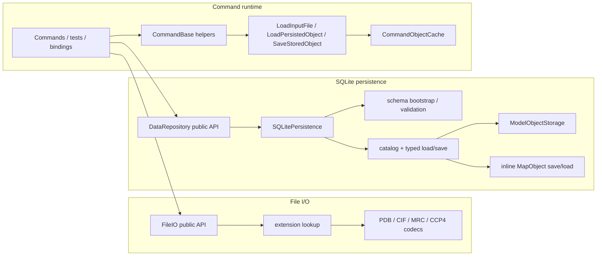

# DataObject I/O Architecture

This document describes the current contract for:

- typed file I/O
- SQLite persistence
- command-side object loading and persistence

Related references:

- [`/docs/developer/development-guidelines.md`](/docs/developer/development-guidelines.md)
- [`/docs/developer/architecture/command-architecture.md`](/docs/developer/architecture/command-architecture.md)
- [`/docs/developer/adding-dataobject-operations.md`](/docs/developer/adding-dataobject-operations.md)

## 1. Boundary

- only `/include/rhbm_gem/data/**` is public data-layer API
- headers under `/src/data/io/file` and `/src/data/io/sqlite` are internal implementation details
- `/src/data/detail/ModelAnalysisAccess.hpp` is the internal access layer for model-owned analysis state, owner lookup, and spatial lookup
- headers under `/src/core/command/detail/**` are command-internal orchestration helpers
- there is no public `DataObjectDispatch` header in the current project surface

## 2. Top-Level Objects

Top-level file-backed and SQLite-persisted roots are:

- `ModelObject`
- `MapObject`

`AtomObject` and `BondObject` are model-domain objects. They are not top-level file or database roots.

## 3. Public Surface

| Component | Public entry points | Responsibility |
| --- | --- | --- |
| `FileIO` | `ReadModel`, `WriteModel`, `ReadMap`, `WriteMap` | Typed file import/export |
| `DataRepository` | `DataRepository(path)`, `LoadModel`, `LoadMap`, `SaveModel`, `SaveMap` | Typed SQLite persistence |

There is no public type-erased dispatch layer for top-level data objects.

## 4. Supported Formats

| Top-level object | File read | File write | SQLite save/load |
| --- | --- | --- | --- |
| `ModelObject` | `.pdb`, `.cif`, `.mmcif`, `.mcif` | `.pdb`, `.cif` | yes |
| `MapObject` | `.mrc`, `.map`, `.ccp4` | `.mrc`, `.map`, `.ccp4` | yes |

Rules enforced by `/src/data/io/file/ModelMapFileIO.cpp`:

- extension lookup is case-insensitive
- `.mmcif` and `.mcif` use the CIF reader and are read-only
- `.mrc` uses the MRC codec
- `.map` and `.ccp4` use the CCP4 codec
- typed entry points fail when the extension resolves to an unsupported operation

## 5. Runtime Topology

## 6. File I/O Contract

Public API:

- `ReadModel(path)` / `WriteModel(path, model, model_parameter=0)`
- `ReadMap(path)` / `WriteMap(path, map)`

Behavior:

- only typed file entry points are public
- `ModelMapFileIO.cpp` owns the extension-to-codec tables for model and map formats
- all public entry points wrap failures in `std::runtime_error` with file path and operation context
- `WriteModel(..., model_parameter)` is the only public file I/O parameter that varies by caller policy

## 7. SQLite Persistence Contract

Public API:

- `DataRepository(database_path)`
- `LoadModel(key_tag)` / `LoadMap(key_tag)`
- `SaveModel(model, key_tag)` / `SaveMap(map, key_tag)`

Behavior:

- `DataRepository` is a thin typed wrapper over internal `SQLitePersistence`
- the database path is bound at construction time
- `LoadModel(...)` and `LoadMap(...)` return typed `std::unique_ptr` objects
- save methods persist under the explicit key passed by the caller
- saving under a different persisted key does not rename the source object's in-memory `key_tag`
- if `SQLitePersistence` is constructed with an empty path, it falls back to `database.sqlite`
- `SQLitePersistence` creates the database parent directory when needed
- each save/load operation is serialized by an internal mutex and wrapped in a transaction

Internal routing:

- `ModelObject` persistence is implemented by `ModelObjectStorage`
- `MapObject` persistence is implemented by inline helpers in `SQLitePersistence.cpp`
- only `model` and `map` catalog types are supported

## 8. Schema Contract

Schema version source:

- `PRAGMA user_version`

Supported states:

- `2`
  Validate the current normalized schema.
- `0`
  Bootstrap only when the database is otherwise empty.
- any other state
  Fail fast as unsupported.

Current invariants:

- `object_catalog(key_tag, object_type)` is the top-level catalog
- `object_type` is required and limited to `model` or `map`
- `model_object.key_tag` references `object_catalog(key_tag)` with `ON DELETE CASCADE`
- `map_list.key_tag` references `object_catalog(key_tag)` with `ON DELETE CASCADE`
- every model payload table references `model_object(key_tag)` with `ON DELETE CASCADE`
- validation checks required tables, primary-key shape, foreign-key shape, and catalog/payload key consistency
- `object_metadata` is treated as unsupported schema state and is rejected

## 9. Command Integration Contract

Commands built on `CommandBase` use internal helpers, not public data-layer dispatch:

- `AttachDataRepository(database_path)`
- `LoadInputFile<T>(path, key_tag)`
- `LoadPersistedObject<T>(key_tag)`
- `SaveStoredObject(key_tag, persisted_key="")`

Behavior:

- `LoadInputFile<T>(...)` supports `ModelObject` and `MapObject` only
- file-backed loads call `ReadModel(...)` or `ReadMap(...)`, assign `key_tag`, and store the result in `CommandObjectCache`
- persisted loads call `DataRepository::LoadModel(...)` or `DataRepository::LoadMap(...)` and store the result in the same cache
- `SaveStoredObject(...)` switches on `CommandObjectCache::ObjectKind` and forwards to the typed repository save method
- `CommandObjectCache` is command-internal state, not a shared data-layer abstraction
- repository-backed command request structs in `CommandApi.hpp` default `database_path` to `GetDefaultDatabasePath()`

There is no shared manager-owned iteration API for loaded objects. Traversal and selection stay in typed command workflows or ordinary container iteration.

Analysis-owned state stays behind the internal `ModelAnalysisAccess` layer. Commands and painters should not expose owner lookup, analysis-store access, fit-state clearing, or spatial-range helpers through public data headers.

## 10. Key Files

Public entry points:

- `/include/rhbm_gem/data/io/DataRepository.hpp`
- `/include/rhbm_gem/data/io/ModelMapFileIO.hpp`

File I/O:

- `/src/data/io/file/ModelMapFileIO.cpp`
- `/src/data/io/file/PdbFormat.*`
- `/src/data/io/file/CifFormat.*`
- `/src/data/io/file/MrcFormat.*`
- `/src/data/io/file/CCP4Format.*`

SQLite persistence:

- `/src/data/io/DataRepository.cpp`
- `/src/data/io/sqlite/SQLitePersistence.hpp`
- `/src/data/io/sqlite/SQLitePersistence.cpp`
- `/src/data/io/sqlite/ModelObjectStorage.hpp`
- `/src/data/io/sqlite/ModelObjectStorage.cpp`

Command integration:

- `/include/rhbm_gem/core/command/CommandApi.hpp`
- `/src/core/command/detail/CommandBase.hpp`
- `/src/core/command/detail/CommandObjectCache.hpp`

Contract tests:

- `/tests/data/DataPublicSurface_test.cpp`
- `/tests/data/DataObjectFileIO_test.cpp`
- `/tests/data/DataObjectImportRegression_test.cpp`
- `/tests/data/DataObjectRuntimeBehavior_test.cpp`
- `/tests/data/DataObjectPersistence_test.cpp`
- `/tests/data/DataObjectSchemaBootstrap_test.cpp`
- `/tests/data/DataObjectSchemaCompatibility_test.cpp`
- `/tests/data/DataObjectSchemaValidation_test.cpp`
- `/tests/data/SQLitePersistenceTypedApi_test.cpp`
- `/tests/data/DataObjectDispatchAndIngestion_test.cpp`
