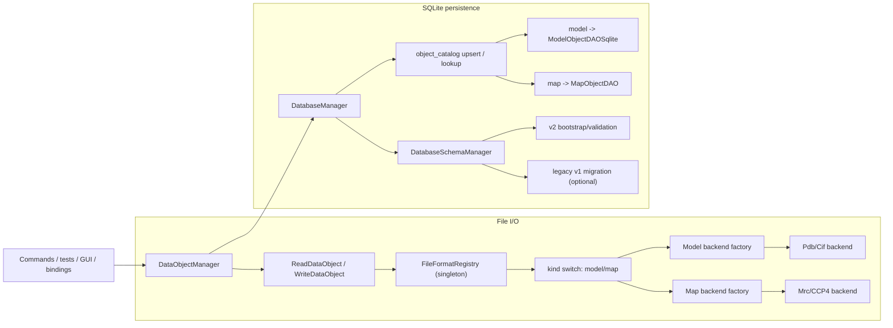

# DataObject I/O Architecture

This document defines the current runtime and development contract for DataObject file I/O and SQLite persistence.

Related guides:

- [`../development-guidelines.md`](../development-guidelines.md)
- [`./command-architecture.md`](./command-architecture.md)
- [`./dataobject-typed-dispatch-architecture.md`](./dataobject-typed-dispatch-architecture.md)
- [`../adding-dataobject-operations-and-iteration.md`](../adding-dataobject-operations-and-iteration.md)

## 1. Scope

Top-level I/O roots are fixed:

- `ModelObject`
- `MapObject`

`AtomObject` and `BondObject` are model-domain objects, not top-level file/database roots.

## 2. Supported Surface

| Top-level object | File read | File write | SQLite save/load |
| --- | --- | --- | --- |
| `ModelObject` | `.pdb`, `.cif`, `.mmcif`, `.mcif` | `.pdb`, `.cif` | yes |
| `MapObject` | `.mrc`, `.map`, `.ccp4` | `.mrc`, `.map`, `.ccp4` | yes |

Rules:

- Extension matching is case-insensitive.
- `.mmcif` and `.mcif` are read-only aliases to CIF backend.

## 3. Runtime Topology

## 4. File I/O Contract

Public API (`include/rhbm_gem/data/io/FileIO.hpp`):

- `ReadDataObject(path)`
- `WriteDataObject(path, obj)`
- `ReadModel(path)` / `WriteModel(path, model, model_parameter=0)`
- `ReadMap(path)` / `WriteMap(path, map)`

Contract:

- Descriptor lookup is performed once per operation.
- Routing is explicit by descriptor kind (`model` or `map`).
- Backend construction uses fixed factories (`CreateModelFileFormatBackend`, `CreateMapFileFormatBackend`).
- Type mismatch on generic write is enforced through `ExpectModelObject` / `ExpectMapObject`.
- All entry points return success or throw `std::runtime_error` with path + operation context.

`DataObjectManager` integration:

- `ProcessFile(...)`: read, set key tag, display object, store in map.
- `ProduceFile(...)`: write in-memory object by key.
- Missing key in `ProduceFile(...)` logs warning and returns without throwing.

## 5. SQLite Persistence Contract

Manager entry points:

- `SaveDataObject(key_tag, renamed_key_tag="")`
- `LoadDataObject(key_tag)`

`DatabaseManager` responsibilities:

- open SQLite connection
- call `DatabaseSchemaManager::EnsureSchema()`
- own transaction boundary for each save/load
- upsert or query `object_catalog(key_tag, object_type)`
- route by stable type name only:
  - `model` -> `ModelObjectDAOSqlite`
  - `map` -> `MapObjectDAO`

Behavior details:

- `SaveDataObject(...)` throws when input pointer is null.
- Unknown catalog type throws fail-fast runtime error.
- `LoadDataObject(...)` throws if key does not exist.
- `SaveDataObject(key, renamed)` changes persisted key only; in-memory key map is unchanged.

## 6. Schema Contract

Schema version source: `PRAGMA user_version`.

Supported states:

- `2`: validate normalized v2 schema.
- `1`: migrate legacy v1 to v2 only when `RHBM_GEM_LEGACY_V1_SUPPORT=ON`.
- `0`:
  - empty DB -> bootstrap v2
  - legacy-v1 layout -> migrate to v2 when legacy support is enabled
  - non-empty non-legacy -> fail fast
- other versions -> fail fast

v2 invariants:

- `object_catalog(key_tag, object_type)` is the root table.
- `object_type` is constrained to `model` or `map`.
- `model_object.key_tag` and `map_list.key_tag` reference `object_catalog(key_tag)` with `ON DELETE CASCADE`.
- model payload tables reference `model_object(key_tag)` with `ON DELETE CASCADE`.
- validation checks table presence, PK/FK shape, and catalog/payload key consistency.

## 7. Extension Boundaries

Allowed extension:

- Add model/map file backend via `FileFormatRegistry` + backend factory.
- Evolve model/map schema and corresponding fixed DAO implementation.

Out of scope:

- Runtime registration of arbitrary top-level `DataObject` types.
- Runtime registration of DAO factories.
- Runtime file resolver/factory override chains.

## 8. Key Files

Core orchestration:

- `include/rhbm_gem/data/io/DataObjectManager.hpp`
- `src/data/io/DataObjectManager.cpp`
- `include/rhbm_gem/data/io/FileIO.hpp`
- `src/data/io/file/FileIO.cpp`

File registry/backends:

- `src/data/internal/io/file/FileFormatRegistry.hpp`
- `src/data/io/file/FileFormatRegistry.cpp`
- `src/data/internal/io/file/FileFormatBackendFactory.hpp`
- `src/data/io/file/FileFormatBackendFactory.cpp`

SQLite/schema:

- `src/data/internal/io/sqlite/DatabaseManager.hpp`
- `src/data/io/sqlite/DatabaseManager.cpp`
- `src/data/internal/migration/DatabaseSchemaManager.hpp`
- `src/data/schema/DatabaseSchemaManager.cpp`
- `src/data/internal/io/sqlite/ModelObjectDAOSqlite.hpp`
- `src/data/io/sqlite/ModelObjectDAOSqlite.cpp`
- `src/data/internal/io/sqlite/MapObjectDAO.hpp`
- `src/data/io/sqlite/MapObjectDAO.cpp`
- `src/data/internal/io/sqlite/SQLiteWrapper.hpp`
- optional legacy migration helper:
  - `src/data/internal/migration/LegacyModelObjectReader.hpp`
  - `src/data/migration/legacy_v1/LegacyModelObjectReader.cpp`
