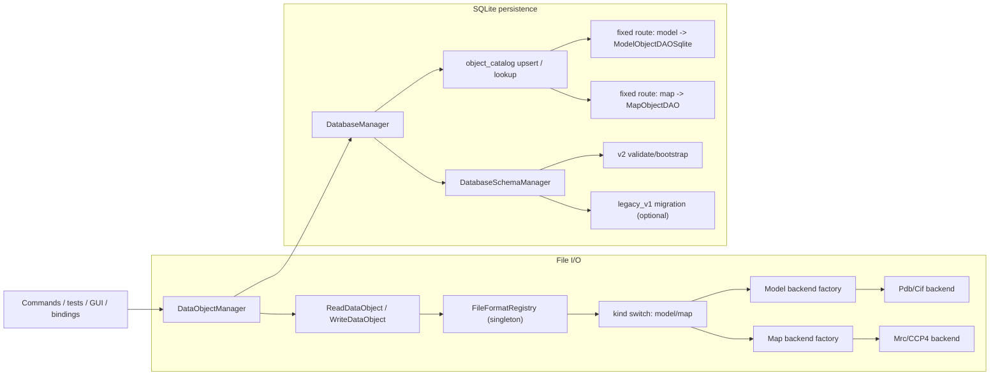

# DataObject I/O Architecture

This document describes the current (v2) Data I/O architecture after complexity reduction.

Related guides:

- [`../development-guidelines.md`](../development-guidelines.md)
- [`./command-architecture.md`](./command-architecture.md)
- [`./dataobject-typed-dispatch-architecture.md`](./dataobject-typed-dispatch-architecture.md)
- [`../adding-dataobject-operations-and-iteration.md`](../adding-dataobject-operations-and-iteration.md)

## 1. Scope

Top-level persisted/file-routable objects are fixed to:

- `ModelObject`
- `MapObject`

`AtomObject` / `BondObject` are `ModelObject` internals and are not standalone I/O roots.

## 2. Supported Surface

| Top-level object | File read | File write | SQLite save/load |
| --- | --- | --- | --- |
| `ModelObject` | `.pdb`, `.cif`, `.mmcif`, `.mcif` | `.pdb`, `.cif` | yes |
| `MapObject` | `.mrc`, `.map`, `.ccp4` | `.mrc`, `.map`, `.ccp4` | yes |

Notes:

- Extension matching is case-insensitive.
- `.mmcif` / `.mcif` are read aliases to CIF backend.

## 3. Runtime Topology

## 4. File I/O Contract

Public API (`include/rhbm_gem/data/io/FileIO.hpp`):

- `ReadDataObject(path)`
- `WriteDataObject(path, obj)`
- `ReadModel(path)` / `WriteModel(path, model, model_parameter)`
- `ReadMap(path)` / `WriteMap(path, map)`

Design rules:

- One descriptor lookup per operation; descriptor is forwarded through the full path.
- Kind dispatch is explicit (`model` / `map`), not factory-registered at runtime.
- Default `FileFormatRegistry` is process-level singleton.
- Entry points return success or throw context-rich exceptions (path + operation).

`DataObjectManager` integration:

- `ProcessFile(...)` calls `ReadDataObject(...)`, sets key tag, stores in memory.
- `ProduceFile(...)` calls `WriteDataObject(...)` for in-memory object by key.

## 5. SQLite Persistence Contract

Entry points (`DataObjectManager`):

- `SaveDataObject(key_tag, renamed_key_tag="")`
- `LoadDataObject(key_tag)`

`DatabaseManager` responsibilities:

- open SQLite and ensure schema via `DatabaseSchemaManager`
- keep transaction boundary for each save/load
- upsert / query `object_catalog(key_tag, object_type)`
- fixed routing only:
  - `object_type == "model"` -> `ModelObjectDAOSqlite`
  - `object_type == "map"` -> `MapObjectDAO`

Removed by design:

- runtime DAO factory registry
- `CreateDAO(name)` / `GetTypeName(type_index)` style generic dispatch
- arbitrary top-level runtime persistence extension path

## 6. Schema and Migration

Schema version source: `PRAGMA user_version`.

Supported behavior:

- `user_version = 2`: validate normalized v2 schema.
- `user_version = 1`: migrate legacy v1 -> v2 only if `RHBM_GEM_LEGACY_V1_SUPPORT=ON`.
- `user_version = 0`:
  - empty DB -> bootstrap v2
  - unversioned legacy-v1 layout -> migrate if legacy support is enabled
  - non-empty non-legacy layout -> fail fast
- any other version -> fail fast

v2 invariants:

- `object_catalog` is the polymorphic root (`object_type in ('model','map')`).
- `model_object.key_tag` and `map_list.key_tag` reference `object_catalog(key_tag)` with cascade.
- all model payload tables reference `model_object(key_tag)` with cascade.
- schema validation checks table presence, PK/FK shapes, and catalog/payload key consistency.

Legacy handling:

- legacy migration path remains supported (when compiled with `RHBM_GEM_LEGACY_V1_SUPPORT=ON`).
- legacy model reader lives in `src/data/migration/legacy_v1/`.
- migration remains transaction-protected and validated before commit.

## 7. Extension Policy

This architecture intentionally optimizes readability and traceability over runtime pluggability.

Allowed extension points:

- add model/map file backend in `FileFormatRegistry` + backend factory
- evolve model/map schema and corresponding fixed DAO implementations

Not supported:

- runtime registration of new top-level `DataObject` types
- runtime registration of arbitrary DAO factories
- runtime override resolver/factory chains for file kind dispatch

## 8. Key Files

Core orchestration:

- `include/rhbm_gem/data/io/DataObjectManager.hpp`
- `src/data/io/DataObjectManager.cpp`
- `include/rhbm_gem/data/io/FileIO.hpp`
- `src/data/io/file/FileIO.cpp`

File registry/backends:

- `src/data/internal/io/file/FileFormatRegistry.hpp`
- `src/data/io/file/FileFormatRegistry.cpp`
- `src/data/internal/io/file/FileFormatBackendFactory.hpp`
- `src/data/io/file/FileFormatBackendFactory.cpp`

SQLite/schema:

- `src/data/internal/io/sqlite/DatabaseManager.hpp`
- `src/data/io/sqlite/DatabaseManager.cpp`
- `src/data/internal/migration/DatabaseSchemaManager.hpp`
- `src/data/schema/DatabaseSchemaManager.cpp`
- `src/data/internal/io/sqlite/ModelObjectDAOSqlite.hpp`
- `src/data/io/sqlite/ModelObjectDAOSqlite.cpp`
- `src/data/internal/io/sqlite/MapObjectDAO.hpp`
- `src/data/io/sqlite/MapObjectDAO.cpp`
- `src/data/internal/io/sqlite/SQLiteWrapper.hpp`
- optional legacy migration helper:
  `src/data/internal/migration/LegacyModelObjectReader.hpp`,
  `src/data/migration/legacy_v1/LegacyModelObjectReader.cpp`

## 9. Common Pitfalls

- `ProcessFile(...)` / `LoadDataObject(...)` replace in-memory object on key collision.
- `SaveDataObject(original, renamed)` only renames persisted key; memory key is unchanged.
- `ClearDataObjects()` clears memory only, not database rows.
- schema bootstrap/validation is performed during `DatabaseManager` construction.
- unsupported schema versions fail fast by design.
