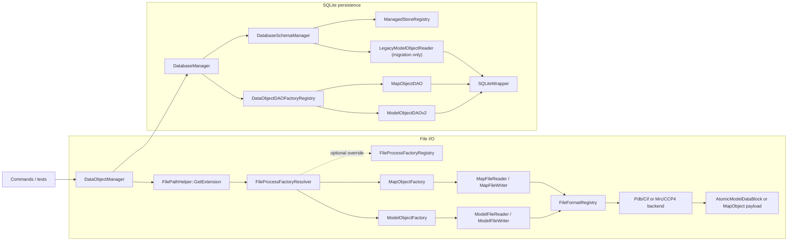

# DataObject I/O Developer Guide

This guide describes the current file and database I/O architecture for top-level `DataObject` instances.

Use it when you need to:

- trace how a file becomes an in-memory object
- trace how a `DataObject` is saved to or loaded from SQLite
- understand the normalized `ModelObject` persistence schema
- add a new file format or a new persistent top-level `DataObject`

Read this together with:

- [`../development-guidelines.md`](../development-guidelines.md)
- [`./command-architecture.md`](./command-architecture.md)

## 1. Scope

This subsystem currently treats only these types as top-level I/O units:

- `ModelObject`
- `MapObject`

`AtomObject` and `BondObject` inherit from `DataObjectBase`, but they are subordinate parts of `ModelObject`. They are not registered as standalone file or database I/O targets.

## 2. Main Responsibilities

- `DataObjectManager`: command-facing orchestration and in-memory ownership
- `FileFormatRegistry`: single source of truth for supported file extensions and backend dispatch
- `FileProcessFactoryResolver`: default built-in factory selection from the normalized extension
- `FileProcessFactoryRegistry`: compatibility wrapper around an overrideable resolver for tests and explicit overrides
- `ModelObjectFactory` / `MapObjectFactory`: build or write the concrete object
- `ModelFileReader` / `ModelFileWriter`: select model parser or writer backend from `FileFormatRegistry`
- `MapFileReader` / `MapFileWriter`: select map parser or writer backend from `FileFormatRegistry`
- `DatabaseManager`: own the SQLite connection, schema bootstrap or migration, and cross-table transaction boundaries
- `DatabaseSchemaManager`: schema-version detection, final normalized v2 bootstrap, legacy-shape upgrade, and legacy v1 migration
- `DataObjectDAOFactoryRegistry`: map runtime types and stored type names to DAO implementations
- `ModelObjectDAO` (`ModelObjectDAOv2`): normalized v2 persistence for `ModelObject`
- `LegacyModelObjectReader`: internal legacy v1 read path used only for migration
- `MapObjectDAO`: flat persistence for `MapObject`
- `ManagedStoreRegistry`: internal descriptor registry for model or map store schema, key listing, shadow-table rebuild, and validation
- `FileFormatBackendFactory`: shared helper that builds concrete parser or writer backends from `FileFormatRegistry`
- `SQLiteWrapper`: SQL execution, prepared statements, typed bind or read helpers, and RAII transaction handling

## 3. Recommended Call Path

The command layer should normally talk to `DataObjectManager`, not directly to readers, writers, or DAOs.

Typical file import:

```cpp
DataObjectManager manager;
manager.ProcessFile(model_path, "model");
auto model = manager.GetTypedDataObject<ModelObject>("model");
```

Typical database round-trip:

```cpp
DataObjectManager manager;
manager.SetDatabaseManager(database_path);
manager.ProcessFile(model_path, "model");
manager.SaveDataObject("model", "saved_model");

manager.LoadDataObject("saved_model");
auto model = manager.GetTypedDataObject<ModelObject>("saved_model");
```

Practical rules:

- Commands should prefer `DataObjectManager` or helpers in `src/core/CommandDataAccessInternal.hpp`.
- `SetDatabaseManager(...)` must be called before `SaveDataObject(...)` or `LoadDataObject(...)`.
- `ProduceFile(...)` only writes objects already present in memory.
- Reusing an in-memory `key_tag` replaces the previous entry in `DataObjectManager`.
- `SaveDataObject(original, renamed)` changes only the persisted database key. It does not rename the in-memory object or the in-memory map entry.

## 4. Runtime Topology



## 5. File I/O

### 5.1 Dispatch Model

All public file entry points start in `DataObjectManager`:

- `ProcessFile(path, key_tag)`
- `ProduceFile(path, key_tag)`

Extension normalization happens in `FilePathHelper::GetExtension(...)`. The resulting lowercase extension is then used consistently by the rest of the file pipeline.

`FileFormatRegistry` is the single source of truth for supported file formats. Each `FileFormatDescriptor` records:

- normalized extension
- top-level object kind (`Model` or `Map`)
- whether read is supported
- whether write is supported
- concrete backend selection (`ModelFormatBackend` or `MapFormatBackend`)

Lookup indexing is generated from the descriptor list at initialization time, with duplicate-extension checks. There is no second manually maintained extension-index table.

Current descriptors:

| Kind | Read | Write |
| --- | --- | --- |
| model | `.pdb`, `.cif`, `.mmcif`, `.mcif` | `.pdb`, `.cif` |
| map | `.mrc`, `.map`, `.ccp4` | `.mrc`, `.map`, `.ccp4` |

`DataObjectManager` now resolves built-in file behavior through `FileProcessFactoryResolver`. The default resolver is immutable and derives built-in factories only from `FileFormatRegistry`.

`FileProcessFactoryRegistry` remains only as a compatibility wrapper around an overrideable resolver. Its runtime contract is:

1. if an explicit override was registered with `RegisterFactory(...)`, use that override
2. otherwise ask `FileFormatRegistry` for the descriptor and instantiate the default top-level factory from `descriptor.kind`

There is no default factory registration step anymore. Built-in behavior is always derived from `FileFormatRegistry`, and explicit overrides are either:

- injected through `DataObjectManager(std::shared_ptr<const FileProcessFactoryResolver>)`
- or, for compatibility and tests, routed through `FileProcessFactoryRegistry`

`OverrideableFileProcessFactoryResolver` protects override registration and lookup with internal synchronization. Concurrent register/unregister and factory creation are supported by contract.

Readers and writers then use `FileFormatBackendFactory` plus `FileFormatRegistry` to choose the concrete backend implementation.

### 5.2 `ProcessFile(...)`

`DataObjectManager::ProcessFile(...)`:

1. gets the normalized extension
2. asks its configured `FileProcessFactoryResolver` for a factory
3. calls `CreateDataObject(...)`
4. sets the resulting object's `key_tag`
5. inserts or replaces it in the in-memory map

If parsing fails, `DataObjectManager` wraps the lower-level exception with the file path and requested `key_tag`.

Readers and factories are now throw-on-failure. They do not use `nullptr` as a normal error signal.

### 5.3 `ProduceFile(...)`

`DataObjectManager::ProduceFile(...)`:

1. looks up the in-memory object by `key_tag`
2. selects a factory from the output extension
3. delegates to `OutputDataObject(...)`

Current behavior to keep in mind:

- missing in-memory keys do not throw; the manager logs a warning and returns
- output format is selected from the target filename, not from the source filename
- once write dispatch begins, lower-level writer failures are rethrown with file path and `key_tag` context

## 6. Model File Pipeline

### 6.1 Read Path

Model import is split into three layers:

1. `ModelFileReader`
2. `ModelFileFormatBase` implementations (`PdbFormat`, `CifFormat`)
3. `ModelObjectFactory`

`ModelFileReader` asks `FileFormatRegistry` for the backend and then performs a single stream-based read:

- `.pdb` -> `ModelFormatBackend::Pdb`
- `.cif`, `.mmcif`, `.mcif` -> `ModelFormatBackend::Cif`

The format implementation parses into `AtomicModelDataBlock`, not directly into `ModelObject`.

Current contract of `ModelFileFormatBase`:

```cpp
virtual void Read(std::istream & stream, const std::string & source_name) = 0;
virtual void Write(const ModelObject & model_object, std::ostream & stream, int model_par) = 0;
virtual AtomicModelDataBlock * GetDataBlockPtr() = 0;
```

Important current intent:

- model backends no longer use filename-based split loading
- PDB import no longer opens the same file twice for header and atom parsing
- CIF parsing now keeps the parsed document in instance-local state instead of caching by filename

That intermediate block owns:

- atoms grouped by model number
- bonds
- parsed chemistry dictionaries
- component, atom, and bond key systems
- entity or chain metadata used during parsing
- identifiers such as PDB ID, EMD ID, and resolution

### 6.2 `ModelObjectFactory` Assembly Rules

`ModelObjectFactory::CreateDataObject(...)` converts parsed model data into the supported in-memory form.

Current behavior:

1. read the file into an `AtomicModelDataBlock`
2. choose model number `1` when present
3. otherwise fall back to the first model number in the file
4. move only the selected model's atom list into a new `ModelObject`
5. move the full parsed bond list, then retain only bonds whose endpoints are both in the selected atom set
6. move or copy supported metadata into `ModelObject`

Metadata transferred from the block to `ModelObject`:

- `pdb_id`
- `emd_id`
- `resolution`
- `resolution_method`
- `chain_id_list_map`
- chemical component dictionary
- component key system
- atom key system
- bond key system

Important current limits:

- parser-side entity metadata remains in `AtomicModelDataBlock`; it is not promoted to a public `ModelObject` domain surface
- secondary-structure ranges are applied to atom state during parsing and are not persisted as standalone structures

### 6.3 Write Path

Model export uses:

- `ModelFileWriter`
- `PdbFormat` or `CifFormat`, selected through `FileFormatRegistry`

Write support is intentionally narrower than read support:

| Path | Supported model extensions |
| --- | --- |
| Read | `.pdb`, `.cif`, `.mmcif`, `.mcif` |
| Write | `.pdb`, `.cif` |

`.mmcif` and `.mcif` are read-only aliases today.

## 7. Map File Pipeline

### 7.1 Read and Write Path

Map import and export are simpler than the model path.

Components:

- `MapFileReader` / `MapFileWriter`
- `MapFileFormatBase` implementations
- `MrcFormat`
- `CCP4Format`

`MapFileReader` and `MapFileWriter` also dispatch through `FileFormatRegistry`:

- `.mrc` -> `MapFormatBackend::Mrc`
- `.map`, `.ccp4` -> `MapFormatBackend::Ccp4`

Current contract of `MapFileFormatBase`:

```cpp
virtual void Read(std::istream & stream, const std::string & source_name) = 0;
virtual void Write(const MapObject & map_object, std::ostream & stream) = 0;
virtual std::unique_ptr<float[]> GetDataArray() = 0;
```

Important current intent:

- map backends use the same single stream-based read/write orchestration model as model backends
- map parsing/writing should not be split into separate public header/data operations at reader/writer level

`MapObjectFactory::CreateDataObject(...)` builds `MapObject` directly from:

- grid size
- grid spacing
- origin
- owned voxel array

There is no intermediate object equivalent to `AtomicModelDataBlock` because the map formats already match the in-memory structure closely.

### 7.2 Ownership Detail

`MapFileReader::GetMapValueArray()` transfers ownership of the voxel array to the caller. Treat the returned array as move-only state, not as a reusable buffer.

## 8. SQLite Persistence

### 8.1 Entry Points

Database persistence enters through:

- `DataObjectManager::SaveDataObject(key_tag, renamed_key_tag)`
- `DataObjectManager::LoadDataObject(key_tag)`

`DataObjectManager` itself does not know any schema details. It only:

- ensures a `DatabaseManager` exists
- fetches the in-memory object for save
- delegates to `DatabaseManager`
- inserts the loaded object back into the in-memory map

### 8.2 `DatabaseManager`

`DatabaseManager` owns:

- the SQLite connection
- schema bootstrap and migration via `DatabaseSchemaManager`
- the `object_catalog` dispatch table
- a DAO cache keyed by `std::type_index`
- the cross-table transaction boundary for save and load

`object_catalog` is the canonical polymorphic dispatch table:

```sql
CREATE TABLE IF NOT EXISTS object_catalog (
    key_tag TEXT PRIMARY KEY,
    object_type TEXT NOT NULL,
    CHECK (object_type IN ('model', 'map'))
);
```

Save flow:

1. rely on the schema that was already prepared when `DatabaseManager` opened the database
2. open a single transaction
3. resolve the stable stored type name from `DataObjectDAOFactoryRegistry`
4. upsert `(key_tag, object_type)` into `object_catalog`
5. create or reuse the DAO for the runtime object type
6. call `dao->Save(...)`
7. commit on scope exit

Load flow:

1. rely on the schema that was already prepared when `DatabaseManager` opened the database
2. open a single transaction
3. read `object_type` from `object_catalog`
4. resolve the DAO from `DataObjectDAOFactoryRegistry`
5. call `dao->Load(key_tag)`
6. return the reconstructed object

This is an intentional contract change from the legacy design: DAO implementations are transaction-free. `DatabaseManager` is the only transaction owner for normal save or load operations.

`DatabaseManager` also treats schema initialization as a one-shot concern per instance. Bootstrap, migration, validation, and any required legacy-shape rebuild happen when the database handle is opened, not on every hot-path save or load.

### 8.3 Schema Versioning and Migration

`DatabaseSchemaManager` uses SQLite `PRAGMA user_version` as the single schema-version source.

Current versions:

- `DatabaseSchemaVersion::LegacyV1 = 1`
- `DatabaseSchemaVersion::NormalizedV2 = 2`

`EnsureSchema()` behavior:

1. if `PRAGMA user_version == 1`, migrate legacy v1 to v2
2. if `PRAGMA user_version == 2`, validate the final catalog-based v2 schema only
3. if `PRAGMA user_version` is any other non-zero value, reject the database as unsupported
4. if `PRAGMA user_version == 0`:
   - `Empty`: create normalized v2 tables, set version to `2`, validate
   - `LegacyV1`: migrate directly to the final catalog-based v2
   - any other non-empty non-legacy shape: fail fast

Important intent:

- v2 now has one accepted runtime shape: final catalog-based v2
- any `user_version == 2` database retaining `object_metadata` is rejected, not upgraded in place
- unversioned non-empty databases are not silently claimed unless they are recognized legacy v1
- final v2 validation checks not only required table presence but also primary-key and foreign-key shape on managed tables

Final normalized v2 root ownership:

- `object_catalog(key_tag, object_type)` is the only polymorphic dispatch root
- `model_object.key_tag` references `object_catalog(key_tag) ON DELETE CASCADE`
- `map_list.key_tag` references `object_catalog(key_tag) ON DELETE CASCADE`
- all `model_*` child tables reference `model_object(key_tag) ON DELETE CASCADE`

Migration is open-time and in-place:

1. open one transaction
2. create final-v2 shadow or canonical tables
3. build or supplement `object_catalog` from authoritative payload roots
4. load legacy v1 models through `LegacyModelObjectReader` when applicable
5. save migrated models through `ModelObjectDAOv2`
6. drop only the legacy tables explicitly owned by the migrated keys
7. remove legacy `object_metadata` if present
8. set `PRAGMA user_version = 2`
9. validate the final catalog-based v2 schema

Current migration limits:

- historical sanitize collisions in legacy per-key tables cannot be repaired automatically
- legacy cleanup is explicit-key based, not broad table-name pattern sweeping
- managed store rebuild currently runs through `ManagedStoreRegistry`, which provides per-object schema creation, validation, key listing (including suffixed shadow roots), and shadow-table copy or rename behavior
- shadow DDL is emitted explicitly per managed store and table; migration no longer relies on broad SQL-identifier rewrite passes

### 8.4 DAO Registration

DAO registration is static and translation-unit driven:

- `ModelObjectDAO` registers as `"model"`
- `MapObjectDAO` registers as `"map"`

The registration mechanism is:

```cpp
DataObjectDAORegistrar<DataObjectType, DAOType>("stable_name")
```

The string name is persisted in `object_catalog.object_type`, so it must remain stable once databases exist on disk.

Legacy v1 model loading is intentionally not part of the registered DAO surface. It exists only as an internal migration reader under `src/data/legacy/`.

## 9. `ModelObject` Persistence Schema

### 9.1 Current DAO Roles

- `ModelObjectDAO` is the public DAO registered for model persistence
- `ModelObjectDAO` is currently a thin wrapper around `ModelObjectDAOv2`
- `LegacyModelObjectReader` reads legacy v1 layout only and is used by migration code

### 9.2 Normalized V2 Tables

`ModelObjectDAOv2` persists all model rows into fixed shared tables keyed by `key_tag`.

Implementation is intentionally split:

- `ModelObjectDAOv2.cpp`: orchestration only
- `include/data/ModelObjectDAOv2.hpp`: minimal public DAO facade
- `src/data/model_io/ModelSchemaSql.hpp`: shared SQL constants and scoped table lists
- `src/data/model_io/ModelStructurePersistence.hpp`: internal structure persistence declarations
- `src/data/model_io/ModelStructurePersistence.cpp`: structural save or load logic
- `src/data/model_io/ModelAnalysisPersistence.hpp`: internal analysis persistence declarations
- `src/data/model_io/ModelAnalysisPersistence.cpp`: local or posterior or group analysis save or load logic
- `src/data/model_io/SQLiteStatementBatch.hpp`: small prepared-statement helper for repeated insert patterns

Core tables:

- `model_object`
- `model_chain_map`
- `model_component`
- `model_component_atom`
- `model_component_bond`
- `model_atom`
- `model_bond`

Analysis-result tables:

- `model_atom_local_potential`
- `model_bond_local_potential`
- `model_atom_posterior`
- `model_bond_posterior`
- `model_atom_group_potential`
- `model_bond_group_potential`

The important design change is that persistence no longer creates per-key tables from sanitized `key_tag` values. This removes schema explosion and prevents collisions such as `a-b` and `a_b` mapping to the same table names.

### 9.3 Save Strategy

`ModelObjectDAOv2::Save(...)` uses scoped replacement by `key_tag`:

- assume normalized v2 tables already exist
- delete only rows for the current `key_tag`
- insert current rows again into each table

It does not clear whole tables for other objects, and it does not try to bootstrap schema on its own.

### 9.4 What Survives a Database Round-Trip

The normalized model path persists:

- structural metadata from `model_object`
- `chain_id_list_map` through `model_chain_map`
- chemical component dictionary
- atoms and bonds
- local potential entries
- posterior entries
- group potential entries

Selection state is reconstructed indirectly:

- atoms and bonds become selected when corresponding local-potential rows exist
- `ModelObject::Update()` and `SetBondList(...)` rebuild selected lists
- group membership is rebuilt by the existing classifier logic

### 9.5 Round-Trip Limits

A database round-trip still does not attempt to persist every parser-side detail.

Not persisted as standalone public state:

- parser-only entity metadata from `AtomicModelDataBlock`
- derived caches such as KD-tree-like accelerators

## 10. `MapObject` Persistence Schema

`MapObjectDAO` keeps a single shared table:

- `map_list`

Stored columns:

- `key_tag`
- `grid_size_x`, `grid_size_y`, `grid_size_z`
- `grid_spacing_x`, `grid_spacing_y`, `grid_spacing_z`
- `origin_x`, `origin_y`, `origin_z`
- `map_value_array` as a BLOB

`MapObjectDAO` now follows the same transaction contract as other DAOs: it does not open its own transaction.

## 11. SQLite Utility Layer

The DAO layer depends on `SQLiteWrapper` for:

- SQL execution via `Execute(...)`
- prepared statements via `Prepare(...)`
- typed binders via `Bind<T>(...)`
- typed column readers via `GetColumn<T>(...)`
- RAII statement cleanup via `StatementGuard`
- RAII transactions via `TransactionGuard`

One practical constraint matters when extending DAO or migration code: `SQLiteWrapper` supports one active prepared statement at a time. Fetch key lists first if a later step needs to prepare another statement on the same connection.

## 12. Supported Surface

| Top-level object | File read | File write | SQLite save/load |
| --- | --- | --- | --- |
| `ModelObject` | `.pdb`, `.cif`, `.mmcif`, `.mcif` | `.pdb`, `.cif` | yes |
| `MapObject` | `.mrc`, `.map`, `.ccp4` | `.mrc`, `.map`, `.ccp4` | yes |

## 13. Key Source Files

Start with these files when debugging or extending this subsystem:

- `include/core/DataObjectManager.hpp`
- `src/core/DataObjectManager.cpp`
- `include/data/FileFormatRegistry.hpp`
- `src/data/FileFormatRegistry.cpp`
- `include/data/FileProcessFactoryRegistry.hpp`
- `src/data/FileProcessFactoryRegistry.cpp`
- `include/data/FileFormatBackendFactory.hpp`
- `src/data/FileFormatBackendFactory.cpp`
- `src/data/ModelObjectFactory.cpp`
- `src/data/MapObjectFactory.cpp`
- `src/data/ModelFileReader.cpp`
- `src/data/MapFileReader.cpp`
- `src/data/ModelFileWriter.cpp`
- `src/data/MapFileWriter.cpp`
- `include/data/DatabaseManager.hpp`
- `src/data/DatabaseManager.cpp`
- `include/data/DatabaseSchemaManager.hpp`
- `src/data/DatabaseSchemaManager.cpp`
- `include/data/DataObjectDAOFactoryRegistry.hpp`
- `src/data/DataObjectDAOFactoryRegistry.cpp`
- `include/data/ModelObjectDAO.hpp`
- `include/data/ModelObjectDAOv2.hpp`
- `src/data/ModelObjectDAO.cpp`
- `src/data/ModelObjectDAOv2.cpp`
- `src/data/legacy/LegacyModelObjectReader.hpp`
- `src/data/legacy/LegacyModelObjectReader.cpp`
- `src/data/model_io/ModelSchemaSql.hpp`
- `src/data/model_io/ModelStructurePersistence.hpp`
- `src/data/model_io/ModelStructurePersistence.cpp`
- `src/data/model_io/ModelAnalysisPersistence.hpp`
- `src/data/model_io/ModelAnalysisPersistence.cpp`
- `src/data/model_io/SQLiteStatementBatch.hpp`
- `include/data/MapObjectDAO.hpp`
- `src/data/MapObjectDAO.cpp`
- `include/data/SQLiteWrapper.hpp`

## 14. Extension Playbooks

### 14.1 Add a New File Format for an Existing Object

For a new model or map format:

1. implement or extend the appropriate `*Format` backend
2. add or update the descriptor in `FileFormatRegistry`
3. update `FileFormatBackendFactory` only if the new descriptor needs a new backend enum or backend branch
4. add read and write tests for the supported matrix
5. update this document's support matrix

Do not add built-in format truth to `FileProcessFactoryRegistry`; that registry is now only the override seam.

If the format parses into a different intermediate shape, decide whether it still fits the current factory contract or whether a new assembly seam is needed.

### 14.2 Add a New Persistent Top-Level `DataObject`

For a new database-persisted top-level object:

1. derive from `DataObjectBase`
2. implement a `DataObjectDAOBase` subclass
3. register it with `DataObjectDAORegistrar<...>("stable_name")`
4. ensure the DAO stays transaction-free
5. add a `ManagedStoreDescriptor` entry so schema creation, validation, key listing, and rebuild behavior are available to `DatabaseSchemaManager`
6. decide whether it also needs file factories and readers or writers
7. add round-trip tests for save and load
8. document the schema and support matrix here

`DatabaseManager` usually does not need new branching logic; it already dispatches through the DAO registry.

## 15. Current Gotchas

- `ProcessFile(...)` and `LoadDataObject(...)` replace an existing in-memory `key_tag`.
- `ClearDataObjects()` only clears the in-memory map; it does not delete database rows.
- `ProduceFile(...)` warns and returns when the key is missing; it does not throw.
- readers and writers fail with exceptions; they do not report normal failures through `nullptr` or `IsSuccessfullyRead()`
- `SaveDataObject(original, renamed)` saves under a new database key but leaves the in-memory object under `original`.
- model write support is intentionally narrower than model read support
- parser-only metadata still does not become full `ModelObject` domain state just because it existed during file parsing
