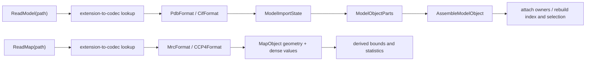
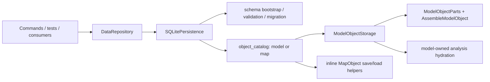

# DataObject I/O Architecture

This document describes the current contract for:

- the public top-level data objects
- typed model and map file I/O
- typed SQLite persistence and schema lifecycle
- command-side object loading, ownership, and persistence

Related references:

- [`/docs/developer/architecture/object-architecture.md`](/docs/developer/architecture/object-architecture.md)
- [`/docs/developer/architecture/command-architecture.md`](/docs/developer/architecture/command-architecture.md)
- [`/docs/developer/adding-dataobject-operations.md`](/docs/developer/adding-dataobject-operations.md)

## 1. Boundary and Top-Level Roots

The public data-layer headers live under `/include/rhbm_gem/data/**`.

- `/include/rhbm_gem/data/object/**` exposes object and analysis-facade types
- `/include/rhbm_gem/data/io/**` exposes typed file and repository I/O
- `/src/data/io/file/**`, `/src/data/io/sqlite/**`, and `/src/data/detail/**` are implementation details
- `/src/core/command/detail/**` contains command-internal orchestration helpers

There are two top-level file and SQLite roots:

- `ModelObject`
- `MapObject`

`AtomObject`, `BondObject`, and `ChemicalComponentEntry` are model-owned domain data. `ModelAnalysisView`, `ModelAnalysisEditor`, `AtomLocalPotentialView`, and `AtomLocalPotentialEditor` are non-owning facades over model-owned analysis state. None of these types is an independent file or database root.

There is no public type-erased `DataObjectDispatch` or shared data-object manager. Callers use the two root types explicitly.

## 2. Public I/O Surface

| Component | Public entry points | Ownership and responsibility |
| --- | --- | --- |
| `ModelMapFileIO` | `ReadModel`, `WriteModel`, `ReadMap`, `WriteMap` | Typed file import/export; reads return `std::unique_ptr` roots |
| `DataRepository` | `DataRepository(path)`, `LoadModel`, `LoadMap`, `SaveModel`, `SaveMap` | Typed SQLite persistence; loads return `std::unique_ptr` roots |

Public declarations are in:

- [`/include/rhbm_gem/data/io/ModelMapFileIO.hpp`](/include/rhbm_gem/data/io/ModelMapFileIO.hpp)
- [`/include/rhbm_gem/data/io/DataRepository.hpp`](/include/rhbm_gem/data/io/DataRepository.hpp)

File readers do not derive or assign a root object's `key_tag` from the filename. A command may assign a workflow-local key after reading. Repository loads do assign the persisted catalog key to the returned root.

Repository saves always use the explicit key supplied by the caller. Saving an object under a key different from its in-memory `key_tag` does not rename the source object.

## 3. Supported File Formats

| Top-level object | File read | File write | SQLite save/load |
| --- | --- | --- | --- |
| `ModelObject` | `.pdb`, `.cif`, `.mmcif`, `.mcif` | `.pdb`, `.cif` | yes |
| `MapObject` | `.mrc`, `.map`, `.ccp4` | `.mrc`, `.map`, `.ccp4` | yes |

Rules enforced by [`/src/data/io/ModelMapFileIO.cpp`](/src/data/io/ModelMapFileIO.cpp):

- extension lookup is case-insensitive through `path_helper::GetExtension(...)`
- `.pdb` uses `PdbFormat`
- `.cif`, `.mmcif`, and `.mcif` use `CifFormat`
- `.mmcif` and `.mcif` are read-only aliases; model writes to those extensions fail
- `.mrc` uses `MrcFormat`
- `.map` and `.ccp4` use `CCP4Format`
- unsupported extensions and codec/open/parse/write failures surface as `std::runtime_error`
- each public file entry point adds the operation and file path to the propagated error context

`WriteModel(..., model_parameter)` is the only public file-I/O parameter whose meaning varies by caller policy. Its default value is `0`.

## 4. File Import and Object Reconstruction

```mermaid
flowchart LR
    A["ReadModel(path)"] --> B["extension-to-codec lookup"]
    B --> C["PdbFormat / CifFormat"]
    C --> D["ModelImportState"]
    D --> E["ModelObjectParts"]
    E --> F["AssembleModelObject"]
    F --> G["attach owners / rebuild index and selection"]

    H["ReadMap(path)"] --> I["extension-to-codec lookup"]
    I --> J["MrcFormat / CCP4Format"]
    J --> K["MapObject geometry + dense values"]
    K --> L["derived bounds and statistics"]
```

PDB and CIF readers stage parsed structural data in `ModelImportState`. That state selects the requested model number, filters bonds to the chosen atom set, moves the payload into `ModelObjectParts`, and calls `AssembleModelObject(...)`. Assembly reattaches atom/bond ownership and endpoint pointers, invalidates derived state, and rebuilds object indexes and selection projections.

Map readers load header geometry and a dense float array, normalize axis order when required, and construct a `MapObject`. The object derives bounds and statistics from the loaded geometry and values.

## 5. SQLite Runtime Topology

```mermaid
flowchart LR
    A["Commands / tests / consumers"] --> B["DataRepository"]
    B --> C["SQLitePersistence"]
    C --> D["schema bootstrap / validation / migration"]
    C --> E["object_catalog: model or map"]
    E --> F["ModelObjectStorage"]
    E --> G["inline MapObject save/load helpers"]
    F --> H["ModelObjectParts + AssembleModelObject"]
    F --> I["model-owned analysis hydration"]
```

`DataRepository` is a thin public wrapper over internal `SQLitePersistence`. The database path is bound when the repository is constructed.

Path behavior:

- an empty `SQLitePersistence` path falls back to the relative path `database.sqlite`
- a non-empty parent directory is created before SQLite is opened
- repository-backed command DTOs default to `GetDefaultDatabasePath()`
- that command default is `$RHBM_GEM_DATA_DIR/database.sqlite` when the variable is set, otherwise `$HOME/.rhbmgem/data/database.sqlite`, with `.rhbmgem/data/database.sqlite` as the no-home fallback

Operation behavior:

- SQLite foreign keys are enabled for the connection
- each save/load is serialized by the `SQLitePersistence` instance's mutex
- each save/load is wrapped in an RAII transaction
- `LoadModel(...)` and `LoadMap(...)` verify the catalog type before loading payload
- a missing key or a model/map type mismatch throws `std::runtime_error`
- model save replaces all model child rows for that key before writing the current structural and analysis payload
- map save upserts the single `map_list` row for that key

`object_catalog.key_tag` is a shared namespace for model and map roots. A key should not be reused to convert one root type into the other.

## 6. Persisted Payload and Rebuilt State

### 6.1 ModelObject

| State | Current SQLite behavior |
| --- | --- |
| model metadata | persists the catalog key, PDB/EMD ids, resolution/method, standard average Q-score, reference height, and reference offset |
| structural payload | persists chain metadata, chemical-component templates, atoms including standard Q-score, and bonds |
| atom-local analysis | persists raw and peeling samples, sample-selection bits, peeling neighbor count, and OLS/MDPDE model parameters plus `alpha_r` for all three fitting stages |
| atom posterior | persists the third-stage posterior and uncertainty, outlier flag, and statistical distance |
| atom-group analysis | persists mean, MDPDE, prior with uncertainty, and `alpha_g` for all three fitting stages; rows are driven by the third-stage group-key set |
| local fit internals | does not persist runtime `fit_result` values or local OLS/MDPDE uncertainty components |
| bond analysis | legacy bond-analysis tables remain in the canonical schema, but the active runtime save/load path does not use them |

`ModelObjectStorage::Load(...)` rebuilds structure through `ModelObjectParts` and `AssembleModelObject(...)`, then applies the stored model row and analysis payload.

The following are reconstructed rather than stored as independent payload:

- component, atom, and bond key registries
- owner and bond-endpoint pointers
- serial-id lookup, sequence-id projection, and selection caches
- atom-group member pointers
- model KD-tree, center of mass, and position-range caches

Atom selection is indirectly restored from persisted atom-local analysis rows: atoms with a matching local entry become selected, and group membership is rebuilt from those selected atoms. Bond selection is not restored, and bond-analysis rows are not hydrated.

### 6.2 MapObject

Map persistence stores:

- the catalog key
- grid size
- grid spacing
- origin
- the dense float value array

Map bounds, lengths, min/max/mean, and standard deviation are derived again by `MapObject` when the stored geometry and values are loaded.

## 7. Schema Lifecycle Contract

The schema version source is `PRAGMA user_version`; the current version is `12`.

| Detected state | Behavior |
| --- | --- |
| version `12` | validate the current canonical schema and catalog/payload consistency |
| versions `2` through `11` | validate the expected legacy shape, migrate known changes to version `12`, then validate the result |
| version `0` with no non-SQLite tables | bootstrap the complete version-`12` schema |
| version `0` with existing application tables, version `1`, or any unknown version | fail fast as an unsupported schema/database state |

Known migrations cover Gaussian intercepts and staged results, removal of legacy atom `class_key` dimensions, raw/peeling sampling layouts, standard Q-score fields, reference Gaussian fields, peeling-neighbor count, and three-stage atom-group results.

Current canonical invariants include:

- `object_catalog(key_tag, object_type)` is the top-level catalog
- `object_type` is non-null and limited to `model` or `map`
- `model_object.key_tag` and `map_list.key_tag` reference `object_catalog(key_tag)` with `ON DELETE CASCADE`
- every model child table references `model_object(key_tag)` with `ON DELETE CASCADE`
- the canonical model schema contains 13 model tables, including legacy bond-analysis tables
- validation checks required tables and columns, primary-key shapes, foreign-key shapes, sampling/stage column layouts, forbidden legacy columns, and catalog/payload key consistency
- the legacy `object_metadata` table is treated as an unsupported database shape and is rejected

Schema initialization and migration happen when `SQLitePersistence` is constructed, before any typed save or load operation runs.

## 8. Command Integration

`CommandBase` does not own or load data objects. Concrete command workflows call the typed APIs and keep roots in command-local `std::unique_ptr` values or containers of those values.

Current command routing is:

| Command | File I/O | Repository I/O |
| --- | --- | --- |
| `PotentialAnalysisCommand` | `ReadModel`, `ReadMap` | `SaveModel` |
| `PotentialDisplayCommand` | none | `LoadModel` for primary and reference models |
| `ResultDumpCommand` | optional `ReadMap`; `WriteModel` for CIF outputs | `LoadModel` |
| `MapSimulationCommand` | `ReadModel`, `WriteMap` | none |
| experimental `MapVisualizationCommand` | `ReadModel`, `ReadMap` | none |
| experimental `PositionEstimationCommand` | `ReadMap` | none |

The public repository still supports `SaveMap(...)` and `LoadMap(...)`, and those paths are covered by data-layer tests, but no current production command persists or loads maps through the repository.

Commands catch I/O failures where workflow recovery is possible, log contextual errors, and return an unsuccessful `CommandResult`. There is no manager-owned iteration layer; traversal and selection use typed root containers and normal container iteration.

## 9. Key Files

Public entry points:

- `/include/rhbm_gem/data/io/DataRepository.hpp`
- `/include/rhbm_gem/data/io/ModelMapFileIO.hpp`

File I/O:

- `/src/data/io/ModelMapFileIO.cpp`
- `/src/data/io/file/ModelImportState.*`
- `/src/data/io/file/PdbFormat.*`
- `/src/data/io/file/CifFormat.*`
- `/src/data/io/file/MrcFormat.*`
- `/src/data/io/file/CCP4Format.*`

SQLite persistence:

- `/src/data/io/DataRepository.cpp`
- `/src/data/io/sqlite/SQLitePersistence.hpp`
- `/src/data/io/sqlite/SQLitePersistence.cpp`
- `/src/data/io/sqlite/ModelObjectStorage.hpp`
- `/src/data/io/sqlite/ModelObjectStorage.cpp`

Command integration:

- `/include/rhbm_gem/core/CommandTypes.hpp`
- `/src/core/command/CommandSystem.cpp`
- `/src/core/command/detail/CommandBase.hpp`
- concrete command sources under `/src/core/command/`

Primary verification suites:

- `/tests/data/DataObjectFileIO_test.cpp`
- `/tests/data/DataObjectImportRegression_test.cpp`
- `/tests/data/DataObjectMapBehavior_test.cpp`
- `/tests/data/DataObjectPersistence_test.cpp`
- `/tests/data/DataObjectSchemaLifecycle_test.cpp`
- `/tests/data/DataObjectSchemaValidation_test.cpp`
- `/tests/integration/CommandApiPipeline_test.cpp`
- `/tests/core/command/CommandScenarios_test.cpp`
