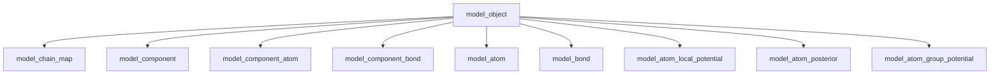

# DataObject I/O Architecture

This document describes the current typed file I/O and Model-only SQLite v15 boundary.

## 1. Public Surface

File I/O remains available for both object roots:

```cpp
std::unique_ptr<ModelObject> ReadModel(const std::filesystem::path & path);
void WriteModel(const std::filesystem::path & path, const ModelObject & model, int model_parameter = 1);

std::unique_ptr<MapObject> ReadMap(const std::filesystem::path & path);
void WriteMap(const std::filesystem::path & path, const MapObject & map);
```

SQLite persistence is deliberately narrower:

```cpp
DataRepository repository{ database_path };
repository.SaveModel(model, key_tag);
auto model = repository.LoadModel(key_tag);
```

`DataRepository` does not expose `SaveMap(...)` or `LoadMap(...)`. Maps remain supported through MRC and CCP4 files.

## 2. Supported File Formats

| Root | Read | Write |
|---|---|---|
| `ModelObject` | `.pdb`, `.cif`, `.mmcif`, `.mcif` | `.pdb`, `.cif` |
| `MapObject` | `.mrc`, `.map`, `.ccp4` | `.mrc`, `.map`, `.ccp4` |

Extension dispatch is case-insensitive. Public file functions add filename context and report failures as `std::runtime_error`.

## 3. Model Import

PDB and CIF parsers build a `ModelImportState`. The state owns atoms, bonds, chemical components, chain metadata, and key systems until parsing finishes. `TakeModelObject()` moves those values directly into `ModelObjectParts`, and `AssembleModelObject(...)` establishes owners, indexes, selection, and derived-state invariants.

Parser-only fields that were never consumed by the runtime are not collected. Import does not retain molecule-size counts, standalone entity-ID lists, or sheet-strand counts.

CIF/MMCIF numeric domain fields are parsed directly as `double`. PDB parsing likewise uses double-precision temporary fields. Coordinates, occupancy, temperature, and molecular weight therefore enter the runtime without an intermediate float representation.

## 4. Map Codecs

MRC and CCP4 keep separate headers and origin rules:

- MRC uses the explicit floating-point origin stored in its header.
- CCP4 derives origin from integer start indices multiplied by grid spacing.

They intentionally do not share a base class or format traits. `MapHelper` contains only mechanics common to both:

- positive voxel-dimension validation and voxel counting;
- validation that the file mode is float32 mode 2;
- float32 voxel seek/read and temporary float32 write buffers;
- file-axis to canonical XYZ voxel reordering;
- corresponding three-axis header-field reordering.

Any non-float32 mode is rejected before voxel allocation or decoding. A read widens the mode-2 payload immediately and performs axis normalization on a contiguous `double` array. A write narrows the `MapObject` double buffer only while encoding the mode-2 payload. Header geometry remains float32 because it is part of the MRC/CCP4 external format.

## 5. Repository Runtime

`DataRepository` owns:

- the resolved database path;
- one `SQLiteWrapper` connection;
- the per-repository mutex;
- transaction boundaries;
- schema creation and validation;
- the public Model save/load methods.

There is no intermediate persistence forwarding class. `ModelObjectStorage` remains separate because it maps the model graph and analysis payload to SQL rows.

Each save and load is serialized by the repository mutex and runs inside a transaction. An empty path still resolves to `database.sqlite`; parent directories are created before opening the database.

## 6. SQLite v15 Lifecycle

The accepted states are intentionally strict:

1. An empty database with `PRAGMA user_version = 0` is initialized as v15.
2. A database with `PRAGMA user_version = 15` is accepted only after structural validation.
3. Every other version or pre-existing unexpected structure is rejected.

There are no migrations and no overwrite-on-open fallback. In particular, v14 and earlier versions are rejected without changing their versions, tables, or rows.

Validation checks:

- the exact ten-table set;
- exact ordered column sets;
- every primary-key shape;
- `NOT NULL is_selected` on atom and bond rows;
- direct `key_tag` foreign keys from every child table to `model_object(key_tag)` with `ON DELETE CASCADE`.

## 7. v15 Table Topology

`model_object` is the direct root. There is no `object_catalog`, `map_list`, or legacy bond-analysis table.


```mermaid
flowchart TD
    M[model_object]
    M --> C[model_chain_map]
    M --> CC[model_component]
    M --> CA[model_component_atom]
    M --> CB[model_component_bond]
    M --> A[model_atom]
    M --> B[model_bond]
    M --> AL[model_atom_local_potential]
    M --> AP[model_atom_posterior]
    M --> AG[model_atom_group_potential]
```

The ten tables are:

- `model_object`;
- `model_chain_map`;
- `model_component`;
- `model_component_atom`;
- `model_component_bond`;
- `model_atom`;
- `model_bond`;
- `model_atom_local_potential`;
- `model_atom_posterior`;
- `model_atom_group_potential`.

## 8. Stored and Derived Values

The root stores model metadata but not `atom_size`; row counts are derived from child tables.

`model_atom` and `model_bond` store `is_selected` directly. Structure loading restores both selections before analysis hydration. Analysis rows never imply selection.

Atom-local raw and peeling samples are stored as BLOBs. Each sample is exactly three float64 values:

1. distance;
2. response;
3. selection flag encoded as `0.0` or `1.0`.

Each value is an IEEE-754 64-bit `double`, so one sample occupies `3 * sizeof(double)` bytes. Loading rejects any BLOB whose byte length is not an exact multiple of that size. Sample count is derived from the validated BLOB byte length, so there are no raw or peeling sampling-size columns and no legacy float32 or two-value decoder.

SQLite scalar fields are bound and read as `double` directly. Runtime values are not narrowed before persistence.

Atom-group membership is derived from restored selection and atom classification. The group table stores no `member_size` column.

Local Gaussian data retains fixed three-stage wide rows for OLS, MDPDE, and alpha-r. Group Gaussian data stores one result per group: mean, MDPDE, prior, prior uncertainty, and alpha-g. Group columns have no stage suffixes.

In memory, group membership and statistics use a single group map. Each atom stores an optional `GroupGaussianMemberResult` independently of its three local results. Read the posterior, outlier flag, and statistical distance through `AtomLocalPotentialView::GetGroupMemberResult()`; an available local entry with no group fit returns `std::nullopt`. Group-result and membership APIs take the group key without a fitting stage. Local alpha-r access still selects a stage. The group workflow always uses the final (`Third`) local inputs.

Copying or updating a local fitting stage leaves the independent group member result intact. Workflow seed initialization clears selected atoms' group member results; clearing all analysis removes them as well. The posterior table continues to store one row per atom.

## 9. Save and Load Flow

### Save

1. Lock the repository.
2. Begin a transaction.
3. Delete existing child rows for the key.
4. Upsert the `model_object` root row.
5. Save chain, component, atom, bond, and selection rows.
6. Save atom-local, posterior, and atom-group analysis rows.
7. Commit.

### Load

1. Lock the repository and begin a transaction.
2. Read components, atoms, bonds, chain metadata, and persisted selection values.
3. Assemble `ModelObjectParts` into a valid model.
4. Restore atom and bond selection from their rows.
5. Load root metadata and atom-local analysis.
6. Load atom-group results and rebuild group membership from selected atoms.
7. Return the model and commit the read transaction.

A missing `key_tag` raises an error; it does not produce an empty model.

## 10. Key Files

- `include/rhbm_gem/data/io/DataRepository.hpp`
- `src/data/io/DataRepository.cpp`
- `src/data/io/ModelMapFileIO.cpp`
- `src/data/io/file/ModelImportState.*`
- `src/data/io/file/MapHelper.*`
- `src/data/io/file/MrcFormat.*`
- `src/data/io/file/CCP4Format.*`
- `src/data/io/sqlite/ModelObjectStorage.*`
- `src/data/io/sqlite/SQLiteWrapper.hpp`
