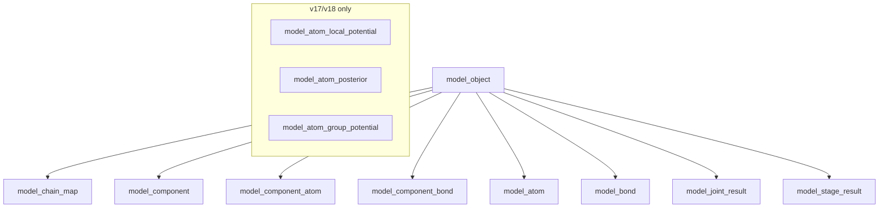

# DataObject I/O Architecture

This document describes the current typed file I/O and Model-only SQLite v19
boundary.

## 1. Public Surface

File I/O remains available for both object roots:

```cpp
std::unique_ptr<ModelObject> ReadModel(const std::filesystem::path & path);
void WriteModel(const std::filesystem::path & path, const ModelObject & model, int model_parameter = 1);

std::unique_ptr<MapObject> ReadMap(const std::filesystem::path & path);
void WriteMap(const std::filesystem::path & path, const MapObject & map);
```

SQLite persistence is deliberately narrower:

```cpp
DataRepository repository{ database_path };
repository.SaveModel(model, key_tag);
auto model = repository.LoadModel(key_tag);
```

`DataRepository` does not expose `SaveMap(...)` or `LoadMap(...)`. Maps remain supported through MRC and CCP4 files.

## 2. Supported File Formats

| Root | Read | Write |
|---|---|---|
| `ModelObject` | `.pdb`, `.cif`, `.mmcif`, `.mcif` | `.pdb`, `.cif` |
| `MapObject` | `.mrc`, `.map`, `.ccp4` | `.mrc`, `.map`, `.ccp4` |

Extension dispatch is case-insensitive. Public file functions add filename context and report failures as `std::runtime_error`.

## 3. Model Import

PDB and CIF parsers build a `ModelImportState`. The state owns atoms, bonds, chemical components, chain metadata, and key systems until parsing finishes. `TakeModelObject()` moves those values directly into `ModelObjectParts`, and `AssembleModelObject(...)` establishes owners, indexes, selection, and derived-state invariants.

Parser-only fields that were never consumed by the runtime are not collected. Import does not retain molecule-size counts, standalone entity-ID lists, or sheet-strand counts.

CIF/MMCIF numeric domain fields are parsed directly as `double`. PDB parsing likewise uses double-precision temporary fields. Coordinates, occupancy, temperature, and molecular weight therefore enter the runtime without an intermediate float representation.

## 4. Map Codecs

MRC and CCP4 keep separate headers and origin rules:

- MRC uses the explicit floating-point origin stored in its header.
- CCP4 derives origin from integer start indices multiplied by grid spacing.

They intentionally do not share a base class or format traits. `MapHelper` contains only mechanics common to both:

- positive voxel-dimension validation and voxel counting;
- validation that the file mode is float32 mode 2;
- float32 voxel seek/read and temporary float32 write buffers;
- file-axis to canonical XYZ voxel reordering;
- corresponding three-axis header-field reordering.

Any non-float32 mode is rejected before voxel allocation or decoding. A read widens the mode-2 payload immediately and performs axis normalization on a contiguous `double` array. A write narrows the `MapObject` double buffer only while encoding the mode-2 payload. Header geometry remains float32 because it is part of the MRC/CCP4 external format.

## 5. Repository Runtime

`DataRepository` owns:

- the resolved database path;
- one `SQLiteWrapper` connection;
- the per-repository mutex;
- transaction boundaries;
- schema creation and validation;
- the public Model save/load methods.

There is no intermediate persistence forwarding class. `ModelObjectStorage` remains separate because it maps the model graph and analysis payload to SQL rows.

Each save and load is serialized by the repository mutex and runs inside a transaction. An empty path still resolves to `database.sqlite`; parent directories are created before opening the database.

## 6. SQLite schema lifecycle

The accepted database states are intentionally strict:

1. An empty database with `PRAGMA user_version = 0` is initialized as v19.
2. Versions 17, 18, and 19 are accepted only after structural validation.
3. Other versions or unexpected structures are rejected without migration.

Opening a v17 or v18 database is read-only. Its legacy analysis tables are
adapted while loading. The first `SaveModel` migrates every stored model to the
canonical analysis representation and writes the requested model in the same
transaction. A failed conversion or save rolls back the schema and rows.
Conflicting legacy and neutral stage values are rejected. Versions 16 and
earlier are rejected without changing their versions, tables, or rows.

Schema validation checks the expected table set and ordered columns, primary
keys, selected-flag constraints, and direct cascading `key_tag` foreign keys
from child tables to `model_object(key_tag)`.

## 7. Current table topology

`model_object` is the direct root. Current v19 also has one canonical neutral
analysis document per model and a separate Joint result payload. The three
method-specific analysis tables remain only in accepted legacy v17/v18
databases; they are dropped during first-write migration.


```mermaid
flowchart TD
    M[model_object]
    M --> C[model_chain_map]
    M --> CC[model_component]
    M --> CA[model_component_atom]
    M --> CB[model_component_bond]
    M --> A[model_atom]
    M --> B[model_bond]
    M --> J[model_joint_result]
    M --> S[model_stage_result]
    subgraph legacy [v17/v18 only]
        AL[model_atom_local_potential]
        AP[model_atom_posterior]
        AG[model_atom_group_potential]
    end
```

Current v19 contains these nine tables:

- `model_object`;
- `model_chain_map`;
- `model_component`;
- `model_component_atom`;
- `model_component_bond`;
- `model_atom`;
- `model_bond`;
- `model_joint_result`;
- `model_stage_result`.

## 8. Canonical analysis data

The root stores model metadata but not `atom_size`; row counts are derived from
child tables. Atom and bond selection is restored from their structure rows.
Analysis values do not imply selection.

`model_stage_result(key_tag, result_json)` owns the canonical neutral analysis
document (format version 2). It stores per-atom First/Second stage estimates,
method and run provenance, availability reasons, uncertainty, raw samples and
geometry, paired peeling, group membership, group evidence and posterior
summaries. The encoder keeps Joint points separate from native OLS/MDPDE
diagnostics. Group membership is restored by its saved atom identities; legacy
group tables are adapted using the restored selection.

`model_joint_result(key_tag, result_json)` stores the Joint estimator snapshot
and its JSON schema-5 metadata, parameter layout, evidence and states. It is
distinct from the neutral stage view used by downstream analysis. Legacy v17/v18
analysis rows are read only for adaptation or migration; they are not canonical
in v19.

## 9. Save and load flow

### Save

1. Lock the repository and begin a transaction.
2. If the database is v17/v18, load and convert every model to neutral
   document version 2, create `model_stage_result`, drop the three legacy
   analysis tables, and set schema version 19.
3. Replace the requested model's child rows and root row.
4. Write its structure, optional Joint result, and canonical stage document.
5. Commit the migration and requested model save together.

### Load

1. Lock the repository and begin a read transaction.
2. Read and assemble model structure, metadata, and saved atom/bond selection.
3. Adapt legacy v17/v18 analysis or decode the canonical v19 stage document.
4. Decode the optional Joint snapshot and rebuild group membership.
5. Return the model and commit the read transaction.

A missing `key_tag` or conflicting legacy/canonical representation raises an
error; it does not produce an empty model.

## 10. Key Files

- `include/rhbm_gem/data/io/DataRepository.hpp`
- `src/data/io/DataRepository.cpp`
- `src/data/io/ModelMapFileIO.cpp`
- `src/data/io/file/ModelImportState.*`
- `src/data/io/file/MapHelper.*`
- `src/data/io/file/MrcFormat.*`
- `src/data/io/file/CCP4Format.*`
- `src/data/io/sqlite/ModelObjectStorage.*`
- `src/data/io/sqlite/SQLiteWrapper.hpp`

## Joint result payload

`model_joint_result(key_tag TEXT PRIMARY KEY, result_json TEXT NOT NULL)` has the
same direct cascading model-root foreign key as other child tables. Its schema-5
JSON codec is shared by SQLite and the public Joint file exporter; readers accept
schemas 3, 4, and 5. Finite doubles use precise parsing for round-trip
preservation. Nonfinite initialization diagnostics use null. Captured convergence
and scoped evidence are read as stored; decoding does not reassess numerically.
Missing fields, invalid enums or schema values, and inconsistent state/mapping
dimensions are rejected.

Joint result save/load shares the model transaction. Saving over a key replaces
its Joint payload; saving a model without a Joint outcome removes that key's
previous payload. Stored atom identities must match the model's non-hydrogen
atoms. Observations, support memberships, and prediction vectors are not stored.
