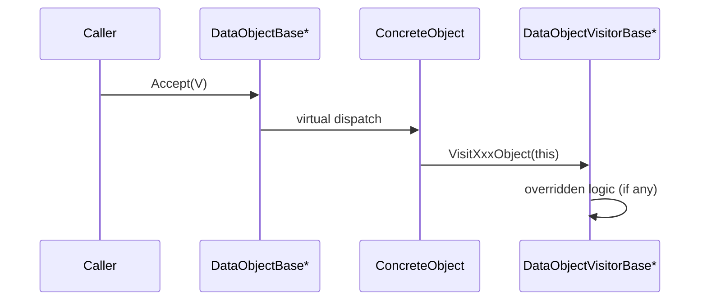

# DataObject Visitor Architecture Guide

This document summarizes the current Visitor architecture around `DataObjectBase` in this repository.

Use this document when you need to:

- understand how `Accept()` and `Visit*Object()` are wired
- add a new `DataObjectVisitorBase` implementation
- extend `DataObjectBase` with a new concrete type
- avoid behavior regressions caused by traversal order or silent no-op visits

Read with:

- [`./command-architecture.md`](./command-architecture.md)
- [`./dataobject-io-architecture.md`](./dataobject-io-architecture.md)

## 1. Scope

This guide focuses on runtime traversal and operation dispatch for:

- `DataObjectBase`
- `DataObjectVisitorBase`
- concrete data objects (`AtomObject`, `BondObject`, `ModelObject`, `MapObject`)
- manager-level traversal (`DataObjectManager::Accept`)
- current production visitor (`MapInterpolationVisitor`)

This guide does not cover persistence internals. See `dataobject-io-architecture.md` for DB/file pipelines.

## 2. Core Contracts

### 2.1 `DataObjectBase`

`DataObjectBase` defines a non-const Visitor entry point:

```cpp
virtual void Accept(DataObjectVisitorBase * visitor) = 0;
```

Current base contract (`include/data/DataObjectBase.hpp`):

- polymorphic clone (`Clone`)
- diagnostics (`Display`)
- mutable refresh (`Update`)
- visitor dispatch (`Accept`)
- key tag identity (`SetKeyTag`, `GetKeyTag`)

### 2.2 `DataObjectVisitorBase`

`DataObjectVisitorBase` declares one virtual method per known concrete type:

- `VisitAtomObject(AtomObject *)`
- `VisitBondObject(BondObject *)`
- `VisitModelObject(ModelObject *)`
- `VisitMapObject(MapObject *)`

Important design choice:

- all `Visit*` default to no-op, not pure virtual
- a new visitor can override only the types it needs
- missing overrides fail silently (no compile-time enforcement)

## 3. Dispatch Model (Double Dispatch)

The project uses classic OO double dispatch:

1. caller holds `DataObjectBase *` (or reference)
2. virtual dispatch chooses concrete `Accept(...)`
3. concrete `Accept(...)` calls `visitor->VisitXxxObject(this)`
4. visitor dynamic type chooses overridden `VisitXxxObject(...)`



## 4. Current `Accept()` Behavior by Type

| Concrete type | `Accept()` behavior | Traversal notes |
| --- | --- | --- |
| `AtomObject` | `visitor->VisitAtomObject(this)` | single-node dispatch |
| `BondObject` | `visitor->VisitBondObject(this)` | single-node dispatch |
| `MapObject` | `visitor->VisitMapObject(this)` | single-node dispatch |
| `ModelObject` | iterate `m_atom_list`, call each atom `Accept()`, then `VisitModelObject(this)` | visits atoms first, then model; does not visit bonds |

`ModelObject::Accept()` detail is important for extension:

- `BondObject` instances in `m_bond_list` are not traversed by model-level accept.
- A visitor expecting bond callbacks will not get them from `model_object.Accept(...)` today.

## 5. Manager-Level Traversal: `DataObjectManager::Accept`

`DataObjectManager` provides batch traversal over in-memory top-level objects.

Behavior summary:

- if `key_tag_list` is empty, visits all objects in `m_data_object_map`
- if `key_tag_list` is provided, visits only matched keys
- missing key logs warning and continues
- object pointers are copied under `m_map_mutex`, then visited after lock release

Implications:

- lock hold time is short (good for contention)
- traversal order for full-map mode follows `unordered_map` iteration (non-deterministic order)
- `visitor == nullptr` is not guarded and will crash when dereferenced

Current usage status:

- as of now, project runtime paths mostly call `typed_object->Accept(...)` directly
- `DataObjectManager::Accept(...)` exists as a generic extension point, but has no active core call site

## 6. Production Visitor Example: `MapInterpolationVisitor`

`MapInterpolationVisitor` (`include/core/MapInterpolationVisitor.hpp`) is the active Visitor implementation used in command workflows.

Design:

- derives from `DataObjectVisitorBase`
- overrides only `VisitMapObject(MapObject *)`
- keeps mutable per-call state:
  - sampler pointer (`SamplerBase *`)
  - sampling origin/axis
  - generated points and sampled map values

`VisitMapObject(...)` flow:

1. clear previous sampling output
2. validate `MapObject*` and sampler pointer
3. generate sample points (`sampler->GenerateSamplingPoints(...)`)
4. run tricubic interpolation per point
5. store `(distance, map_value)` list

Notable API semantics:

- `MoveSamplingDataList()` returns rvalue reference and transfers ownership
- callers usually consume once per sampling iteration

### 6.1 Runtime Call Chains

Main usages:

- `PotentialAnalysisCommand::RunAtomMapValueSampling`
- `PotentialAnalysisBondWorkflow::RunBondMapValueSampling`
- `MapVisualizationCommand::Run`

All three follow the same pattern:

1. configure sampler
2. set visitor input (`SetPosition`, optional `SetAxisVector`)
3. call `map_object->Accept(&visitor)`
4. consume result list

## 7. Threading and Lifetime Expectations

### 7.1 Visitor Instance Thread Safety

`MapInterpolationVisitor` is stateful and not thread-safe for shared concurrent use.

Current parallel code correctly uses one visitor instance per OpenMP thread (inside parallel region block scope).

### 7.2 Raw Pointer Contract

Visitor APIs use raw pointers for both visited object and external dependencies.

Caller responsibilities:

- never pass null visitor to `Accept`
- ensure visited object lifetime outlives `Accept` call
- ensure external dependency lifetimes (for example `SamplerBase`) outlive visitor use

## 8. Extension Guide

### 8.1 Add a New Visitor

1. Derive from `DataObjectVisitorBase`.
2. Override only required `Visit*Object` methods.
3. Keep visitor state explicit and reset per operation if reused.
4. Call through concrete object `Accept(...)` or `DataObjectManager::Accept(...)`.
5. Add focused tests for visited-type coverage and output state reset.

### 8.2 Add a New `DataObject` Type

1. Derive from `DataObjectBase` and implement all pure virtual methods.
2. Add a new `VisitNewTypeObject(NewTypeObject *)` method in `DataObjectVisitorBase`.
3. Implement `NewTypeObject::Accept(...)` to call that visitor method.
4. Update any aggregate traversals that should include this new type.
5. Update architecture docs and diagrams.

Compatibility note:

- because `DataObjectVisitorBase` methods default to no-op, existing visitors continue compiling after step 2.
- this also means new type handling can be accidentally omitted; add tests intentionally.

## 9. Known Constraints and Gotchas

- `Accept()` implementations do not guard `visitor == nullptr`.
- `ModelObject::Accept()` currently skips bond traversal.
- full-map traversal order in `DataObjectManager::Accept()` is not stable.
- default no-op `Visit*` methods can hide missing behavior.
- visitor interfaces are mutable-only today (`const` traversal is not modeled).

## 10. Key Files

Core interfaces:

- `include/data/DataObjectBase.hpp`
- `include/data/DataObjectVisitorBase.hpp`

Concrete dispatch:

- `src/data/AtomObject.cpp`
- `src/data/BondObject.cpp`
- `src/data/ModelObject.cpp`
- `src/data/MapObject.cpp`

Manager traversal:

- `include/core/DataObjectManager.hpp`
- `src/core/DataObjectManager.cpp`

Active visitor and call sites:

- `include/core/MapInterpolationVisitor.hpp`
- `src/core/MapInterpolationVisitor.cpp`
- `src/core/PotentialAnalysisCommand.cpp`
- `src/core/PotentialAnalysisBondWorkflow.cpp`
- `src/core/MapVisualizationCommand.cpp`
