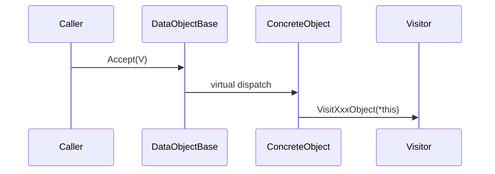

# DataObject Visitor Architecture Guide

This document describes the current Visitor architecture around `DataObjectBase`.

Use this document when you need to:

- understand how `Accept()` and `Visit*Object()` are wired
- add a new visitor implementation
- extend `DataObjectBase` with a new concrete type
- reason about traversal order and const/non-const visitation contracts

Read with:

- [`./command-architecture.md`](./command-architecture.md)
- [`./dataobject-io-architecture.md`](./dataobject-io-architecture.md)

## 1. Scope

This guide focuses on runtime traversal and operation dispatch for:

- `DataObjectBase`
- visitor interfaces (`DataObjectVisitor`, `ConstDataObjectVisitor`)
- concrete data objects (`AtomObject`, `BondObject`, `ModelObject`, `MapObject`)
- manager-level traversal (`DataObjectManager::Accept`)
- active map sampling visitor (`MapInterpolationVisitor`)

Persistence internals are out of scope. See `dataobject-io-architecture.md` for DB/file pipelines.

## 2. Core Contracts

### 2.1 `DataObjectBase`

`DataObjectBase` now exposes reference-based, non-null visitor APIs with both mutable and const paths:

```cpp
virtual void Accept(DataObjectVisitor & visitor) = 0;
virtual void Accept(ConstDataObjectVisitor & visitor) const = 0;
virtual void Accept(DataObjectVisitor & visitor, ModelVisitMode model_mode) = 0;
virtual void Accept(ConstDataObjectVisitor & visitor, ModelVisitMode model_mode) const = 0;
```

`model_mode` is consumed by `ModelObject` and ignored by non-model objects.

### 2.2 Visitor Interfaces

Two visitor interfaces are provided:

- `DataObjectVisitor` (mutable traversal)
- `ConstDataObjectVisitor` (read-only traversal)

Both are pure virtual and require full type coverage:

- `VisitAtomObject(...)`
- `VisitBondObject(...)`
- `VisitModelObject(...)`
- `VisitMapObject(...)`

Design implication:

- missing handler implementation is now a compile-time error
- there is no no-op default behavior

## 3. Dispatch Model

The project uses double dispatch:

1. caller holds `DataObjectBase` polymorphically
2. concrete `Accept(...)` resolves by object dynamic type
3. `Accept(...)` calls `visitor.VisitXxxObject(*this)`
4. concrete visitor logic resolves by visitor dynamic type



## 4. Concrete Object Behavior

| Concrete type | `Accept(visitor)` behavior | `model_mode` handling |
| --- | --- | --- |
| `AtomObject` | `VisitAtomObject(*this)` | ignored |
| `BondObject` | `VisitBondObject(*this)` | ignored |
| `MapObject` | `VisitMapObject(*this)` | ignored |
| `ModelObject` | legacy default = `AtomsThenSelf` | applies selected `ModelVisitMode` |

## 5. `ModelObject` Traversal Policy

`ModelVisitMode` values:

- `AtomsThenSelf` (legacy default)
- `BondsThenSelf`
- `AtomsAndBondsThenSelf`
- `SelfOnly`

Compatibility rule:

- existing `model.Accept(visitor)` still maps to `AtomsThenSelf`

Both mutable and const visitor flows support the same policy matrix.

## 6. Manager Traversal (`DataObjectManager`)

Public APIs:

```cpp
void Accept(DataObjectVisitor & visitor,
            const std::vector<std::string> & key_tag_list = {},
            const VisitOptions & options = {});

void Accept(ConstDataObjectVisitor & visitor,
            const std::vector<std::string> & key_tag_list = {},
            const VisitOptions & options = {}) const;
```

`VisitOptions`:

- `bool deterministic_order = true`
- `ModelVisitMode model_visit_mode = ModelVisitMode::AtomsThenSelf`

Behavior:

- snapshot uses `shared_ptr` under lock, traversal runs after lock release
- empty `key_tag_list`:
  - `deterministic_order = true`: key-sorted traversal
  - `deterministic_order = false`: underlying map iteration order
- non-empty `key_tag_list`: preserve caller-provided order
- missing key logs warning and continues
- manager dispatches through policy-aware base `Accept(...)` without RTTI branching

## 7. `MapInterpolationVisitor`

`MapInterpolationVisitor` is a `ConstDataObjectVisitor` implementation used by map analysis workflows.

Contract:

- only `VisitMapObject(const MapObject &)` is supported
- `VisitAtomObject`, `VisitBondObject`, `VisitModelObject` throw `std::logic_error`

State/output API:

- `GetSamplingDataList()` for read-only access
- `ConsumeSamplingDataList()` for move-out transfer

`MoveSamplingDataList()` has been removed.

## 8. Extension Guide

### 8.1 Add a New Visitor

1. Derive from `DataObjectVisitor` or `ConstDataObjectVisitor`.
2. Implement all required `Visit*Object(...)` methods.
3. Keep visitor state explicit and reset on each logical run.
4. Add tests for visited-type coverage and traversal order assumptions.

### 8.2 Add a New `DataObject` Type

1. Derive from `DataObjectBase` and implement all required `Accept(...)` variants.
2. Add new pure-virtual visit methods to both visitor interfaces.
3. Update all visitors and tests to satisfy the new compile-time contract.
4. Update architecture docs and diagrams.

## 9. Migration Notes (Breaking)

- `DataObjectVisitorBase` and `StrictDataObjectVisitorBase` are removed.
- Visitor passing changed from pointer to reference.
- Null visitor checks are removed as a runtime concern; non-null is a type-level guarantee.
- `MapInterpolationVisitor::MoveSamplingDataList()` is removed; use `ConsumeSamplingDataList()`.

## 10. Known Constraints

- visitor interfaces require explicit full coverage, which increases boilerplate for small visitors
- map iteration non-determinism is still possible when `deterministic_order=false`
- const and non-const visitor implementations are separate contracts by design

## 11. Key Files

Core interfaces:

- `include/data/DataObjectBase.hpp`
- `include/data/DataObjectVisitorBase.hpp`
- `include/data/ModelVisitMode.hpp`

Concrete dispatch:

- `src/data/AtomObject.cpp`
- `src/data/BondObject.cpp`
- `src/data/ModelObject.cpp`
- `src/data/MapObject.cpp`

Manager traversal:

- `include/core/DataObjectManager.hpp`
- `src/core/DataObjectManager.cpp`

Active visitor and call sites:

- `include/core/MapInterpolationVisitor.hpp`
- `src/core/MapInterpolationVisitor.cpp`
- `src/core/PotentialAnalysisCommand.cpp`
- `src/core/PotentialAnalysisBondWorkflow.cpp`
- `src/core/MapVisualizationCommand.cpp`
