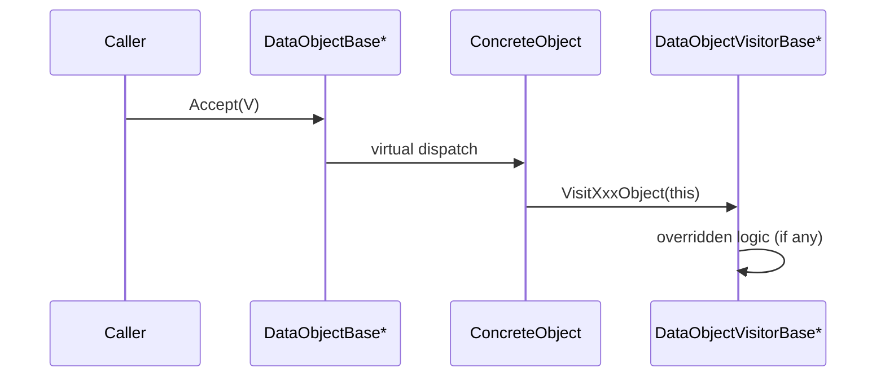

# DataObject Visitor Architecture Guide

This document summarizes the current Visitor architecture around `DataObjectBase` in this repository.

Use this document when you need to:

- understand how `Accept()` and `Visit*Object()` are wired
- add a new `DataObjectVisitorBase` implementation
- extend `DataObjectBase` with a new concrete type
- avoid behavior regressions caused by traversal order or silent no-op visits

Read with:

- [`./command-architecture.md`](./command-architecture.md)
- [`./dataobject-io-architecture.md`](./dataobject-io-architecture.md)

## 1. Scope

This guide focuses on runtime traversal and operation dispatch for:

- `DataObjectBase`
- `DataObjectVisitorBase` and `StrictDataObjectVisitorBase`
- concrete data objects (`AtomObject`, `BondObject`, `ModelObject`, `MapObject`)
- manager-level traversal (`DataObjectManager::Accept`)
- current production visitor (`MapInterpolationVisitor`)

This guide does not cover persistence internals. See `dataobject-io-architecture.md` for DB/file pipelines.

## 2. Core Contracts

### 2.1 `DataObjectBase`

`DataObjectBase` defines a non-const Visitor entry point:

```cpp
virtual void Accept(DataObjectVisitorBase * visitor) = 0;
```

Current base contract (`include/data/DataObjectBase.hpp`):

- polymorphic clone (`Clone`)
- diagnostics (`Display`)
- mutable refresh (`Update`)
- visitor dispatch (`Accept`)
- key tag identity (`SetKeyTag`, `GetKeyTag`)

Null-safety rule:

- concrete `Accept()` implementations now validate `visitor != nullptr`
- invalid input throws `std::invalid_argument` with method context

### 2.2 Visitor Base Types

`DataObjectVisitorBase` declares one virtual method per known concrete type:

- `VisitAtomObject(AtomObject *)`
- `VisitBondObject(BondObject *)`
- `VisitModelObject(ModelObject *)`
- `VisitMapObject(MapObject *)`

By design, these default to no-op. This keeps visitor extension low-friction, but missing overrides can fail silently.

To make this safer, the project also provides `StrictDataObjectVisitorBase`:

- derives from `DataObjectVisitorBase`
- overrides all `Visit*Object(...)`
- default behavior is fail-fast (`std::logic_error`)

Recommended usage:

- derive from `StrictDataObjectVisitorBase` for new logic-heavy visitors
- derive from `DataObjectVisitorBase` only when intentional no-op coverage is required

## 3. Dispatch Model (Double Dispatch)

The project uses classic OO double dispatch:

1. caller holds `DataObjectBase *` (or reference)
2. virtual dispatch chooses concrete `Accept(...)`
3. concrete `Accept(...)` calls `visitor->VisitXxxObject(this)`
4. visitor dynamic type chooses overridden `VisitXxxObject(...)`



## 4. Current `Accept()` Behavior by Type

| Concrete type | `Accept()` behavior | Traversal notes |
| --- | --- | --- |
| `AtomObject` | `visitor->VisitAtomObject(this)` | single-node dispatch |
| `BondObject` | `visitor->VisitBondObject(this)` | single-node dispatch |
| `MapObject` | `visitor->VisitMapObject(this)` | single-node dispatch |
| `ModelObject` | legacy default = atoms then model | backward-compatible default remains |

### 4.1 `ModelObject` Traversal Policy

`ModelObject` now has explicit traversal control:

```cpp
void Accept(DataObjectVisitorBase * visitor, ModelVisitMode mode);
```

`ModelVisitMode` values:

- `AtomsThenSelf` (legacy default)
- `BondsThenSelf`
- `AtomsAndBondsThenSelf`
- `SelfOnly`

Compatibility rule:

- existing `ModelObject::Accept(visitor)` calls remain unchanged and map to `AtomsThenSelf`

## 5. Manager-Level Traversal: `DataObjectManager::Accept`

`DataObjectManager` provides batch traversal over in-memory top-level objects.

Public APIs:

```cpp
void Accept(DataObjectVisitorBase * visitor,
            const std::vector<std::string> & key_tag_list = {});

void Accept(DataObjectVisitorBase * visitor,
            const std::vector<std::string> & key_tag_list,
            const VisitOptions & options);
```

`VisitOptions`:

- `bool deterministic_order`
- `ModelVisitMode model_visit_mode`

Behavior summary:

- `visitor == nullptr` throws `std::invalid_argument`
- traversal takes a `std::shared_ptr<DataObjectBase>` snapshot under lock
- snapshot is visited after lock release (prevents use-after-free when map mutates concurrently)
- if `key_tag_list` is empty:
  - `deterministic_order == false`: follow `unordered_map` iteration (not stable)
  - `deterministic_order == true`: sort by key tag before visiting
- if `key_tag_list` is provided:
  - process in caller-provided order
  - missing key logs warning and continues

Model-specific behavior in manager traversal:

- when visiting a `ModelObject`, manager applies `options.model_visit_mode`
- non-model objects use their normal `Accept(visitor)` path

## 6. Production Visitor Example: `MapInterpolationVisitor`

`MapInterpolationVisitor` (`include/core/MapInterpolationVisitor.hpp`) is the active Visitor implementation used in command workflows.

Design:

- derives from `StrictDataObjectVisitorBase`
- overrides only `VisitMapObject(MapObject *)`
- keeps mutable per-call state:
  - sampler pointer (`SamplerBase *`)
  - sampling origin/axis
  - generated points and sampled map values

`VisitMapObject(...)` flow:

1. clear stale outputs (`m_sampling_data_list`, `m_point_list`)
2. handle null map pointer (return after clear)
3. validate sampler pointer
4. generate sample points (`sampler->GenerateSamplingPoints(...)`)
5. run tricubic interpolation per point
6. store `(distance, map_value)` list

Output APIs:

- `GetSamplingDataList()` for read-only access
- `ConsumeSamplingDataList()` for move-out by value (recommended)
- `MoveSamplingDataList()` kept for compatibility

### 6.1 Runtime Call Chains

Main usages:

- `PotentialAnalysisCommand::RunAtomMapValueSampling`
- `PotentialAnalysisBondWorkflow::RunBondMapValueSampling`
- `MapVisualizationCommand::Run`

Sampling workflows now consume output via `ConsumeSamplingDataList()`.

## 7. Threading and Lifetime Expectations

### 7.1 Visitor Instance Thread Safety

`MapInterpolationVisitor` is stateful and not thread-safe for shared concurrent use.

Current parallel code correctly uses one visitor instance per OpenMP thread (inside parallel region block scope).

### 7.2 Raw Pointer Contract

Visitor APIs use raw pointers for visited objects and external dependencies.

Caller responsibilities:

- never pass null visitor to `Accept`
- ensure visited object lifetime outlives `Accept` call
- ensure external dependency lifetimes (for example `SamplerBase`) outlive visitor use

## 8. Extension Guide

### 8.1 Add a New Visitor

1. Derive from `StrictDataObjectVisitorBase` (recommended) or `DataObjectVisitorBase`.
2. Override required `Visit*Object` methods.
3. Keep visitor state explicit and reset per operation if reused.
4. Call through concrete object `Accept(...)` or `DataObjectManager::Accept(...)`.
5. Add focused tests for visited-type coverage, ordering, and state reset.

### 8.2 Add a New `DataObject` Type

1. Derive from `DataObjectBase` and implement all pure virtual methods.
2. Add a new `VisitNewTypeObject(NewTypeObject *)` method in both visitor base classes.
3. Implement `NewTypeObject::Accept(...)` to call that visitor method.
4. Update aggregate traversals/policies that should include this new type.
5. Update architecture docs and diagrams.

## 9. Migration Notes

- Existing code calling `ModelObject::Accept(visitor)` remains valid.
- Existing code calling `DataObjectManager::Accept(visitor, keys)` remains valid.
- Existing code calling `MapInterpolationVisitor::MoveSamplingDataList()` remains valid.
- New code should prefer:
  - `ModelObject::Accept(visitor, mode)` when traversal semantics matter
  - `DataObjectManager::Accept(..., options)` when deterministic ordering or model policy is required
  - `MapInterpolationVisitor::ConsumeSamplingDataList()` for safe move-out semantics

## 10. Known Constraints and Gotchas

- Base visitor no-op methods can still hide missing behavior if non-strict base is used.
- `unordered_map` order remains non-deterministic unless `deterministic_order=true`.
- Visitor interfaces are mutable-only today (`const` traversal is not modeled).

## 11. Key Files

Core interfaces:

- `include/data/DataObjectBase.hpp`
- `include/data/DataObjectVisitorBase.hpp`
- `include/data/ModelVisitMode.hpp`

Concrete dispatch:

- `src/data/AtomObject.cpp`
- `src/data/BondObject.cpp`
- `src/data/ModelObject.cpp`
- `src/data/MapObject.cpp`

Manager traversal:

- `include/core/DataObjectManager.hpp`
- `src/core/DataObjectManager.cpp`

Active visitor and call sites:

- `include/core/MapInterpolationVisitor.hpp`
- `src/core/MapInterpolationVisitor.cpp`
- `src/core/PotentialAnalysisCommand.cpp`
- `src/core/PotentialAnalysisBondWorkflow.cpp`
- `src/core/MapVisualizationCommand.cpp`
