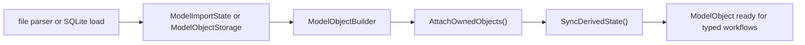
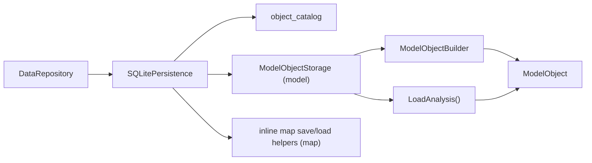

# Object Architecture

This document explains how the current project's object system is structured, how object state moves through import, runtime, and persistence, and which internal helpers are responsible for keeping object invariants valid.

Related references:

- [`/docs/developer/architecture/dataobject-io-architecture.md`](/docs/developer/architecture/dataobject-io-architecture.md)
- [`/docs/developer/architecture/command-architecture.md`](/docs/developer/architecture/command-architecture.md)
- [`/docs/developer/adding-dataobject-operations.md`](/docs/developer/adding-dataobject-operations.md)

## 1. Mental Model

The object system has two public top-level roots:

- `ModelObject`
- `MapObject`

Everything else is either:

- model-owned domain data
- model-owned analysis/runtime state
- internal construction or persistence machinery

`ModelObject` is the center of the system. It owns the structural model payload, selection state, chemical-component metadata, key registries, analysis results, and model-level derived caches.

`MapObject` is much simpler. It is a self-contained volumetric grid object with geometry metadata and a dense voxel-value array.

## 2. Public Object Surface

The current public object headers are:

- [`/include/rhbm_gem/data/object/ModelObject.hpp`](/include/rhbm_gem/data/object/ModelObject.hpp)
- [`/include/rhbm_gem/data/object/MapObject.hpp`](/include/rhbm_gem/data/object/MapObject.hpp)
- [`/include/rhbm_gem/data/object/AtomObject.hpp`](/include/rhbm_gem/data/object/AtomObject.hpp)
- [`/include/rhbm_gem/data/object/BondObject.hpp`](/include/rhbm_gem/data/object/BondObject.hpp)
- [`/include/rhbm_gem/data/object/ChemicalComponentEntry.hpp`](/include/rhbm_gem/data/object/ChemicalComponentEntry.hpp)

Only `ModelObject` and `MapObject` are top-level file and SQLite roots.

`AtomObject`, `BondObject`, and `ChemicalComponentEntry` are model-domain objects. They are public for typed workflows, but they are not independent persistence roots.

## 3. Object Roles

| Type | Kind | Ownership | Main responsibility |
| --- | --- | --- | --- |
| `ModelObject` | top-level root | owned by caller | model structure, selection, key registries, analysis, model caches |
| `MapObject` | top-level root | owned by caller | volumetric grid geometry, raw voxel values, map statistics |
| `AtomObject` | model leaf | owned by `ModelObject` | atom identity, position, occupancy, structural annotations |
| `BondObject` | model leaf | owned by `ModelObject` | bond identity and references to the two endpoint atoms |
| `ChemicalComponentEntry` | model metadata | owned by `ModelObject` | per-component metadata plus atom/bond templates keyed by component/atom/bond keys |

## 4. ModelObject Anatomy

[`ModelObject`](/include/rhbm_gem/data/object/ModelObject.hpp) mixes five categories of state.

### 4.1 Structural payload

- `m_atom_list`
- `m_bond_list`
- `m_key_tag`, `m_pdb_id`, `m_emd_id`
- `m_resolution`, `m_resolution_method`
- `m_chain_id_list_map`
- `m_chemical_component_entry_map`

This is the durable model content that comes from import or persistence.

### 4.2 Selection state

- per-object private flags on `AtomObject` and `BondObject`
- `m_selected_atom_list`
- `m_selected_bond_list`

The selected lists are cached views rebuilt from the per-object flags. They are not the source of truth by themselves.

### 4.3 Key registries

- `m_component_key_system`
- `m_atom_key_system`
- `m_bond_key_system`

These registries translate between string ids and compact numeric keys used throughout model payload and persistence. Built-in chemical data is pre-registered, and additional dynamic keys are added during import or DB load.

### 4.4 Derived runtime caches

- `m_serial_id_atom_map`
- `m_center_of_mass_position`
- `m_model_position_range`
- `m_spatial_cache`

These are rebuildable caches derived from owned structural data.

### 4.5 Analysis-owned state

- `m_analysis_data`

Analysis data is intentionally not exposed on the public `ModelObject` surface. Internal code reaches it through [`/src/data/detail/ModelAnalysisAccess.hpp`](/src/data/detail/ModelAnalysisAccess.hpp).

## 5. Ownership and Invariants

The most important ownership rules are:

- `ModelObject` owns atoms and bonds through `std::unique_ptr`
- `BondObject` stores raw pointers to its two endpoint atoms
- `AtomObject` and `BondObject` also store a raw `m_owner_model`
- these raw pointers are valid only after `ModelObject::AttachOwnedObjects()`

That is why structural mutation is private to friend-only helpers such as:

- `ModelObjectBuilder`
- `ModelObjectStorage`
- `ModelAnalysisAccess`
- `ModelSelectionAccess`

The key invariant is:

- after atoms or bonds are replaced or moved, the model must re-attach owned pointers and re-sync derived state

The current build/sync path is:

1. populate owned containers
2. `AttachOwnedObjects()`
3. `SyncDerivedState()`
4. `SyncDerivedState()` invalidates derived caches and rebuilds indices/selection

This is the reason the public surface keeps direct structural setters private while still exposing selection and query APIs.

## 6. ModelObject Lifecycle

### 6.1 Import construction

Model import uses [`/src/data/io/file/ModelImportState.*`](/src/data/io/file/ModelImportState.hpp) as a staging object.

`ModelImportState` accumulates:

- atoms grouped by model number
- tuple-based atom lookup for bond resolution
- bonds
- entity and chain metadata
- secondary-structure ranges
- chemical component entries
- component/atom/bond key systems

When import finishes, `TakeModelObject(...)`:

1. chooses the requested model number or falls back to the first available one
2. moves that model's atom list out of the staging state
3. filters bonds so only bonds whose endpoints belong to the chosen atom set survive
4. transfers chain metadata, chemical component entries, and key systems into `ModelObjectBuilder`
5. builds a `ModelObject`
6. applies top-level metadata such as PDB id, EMD id, and resolution

The file formats that feed this workflow are:

- [`/src/data/io/file/PdbFormat.cpp`](/src/data/io/file/PdbFormat.cpp)
- [`/src/data/io/file/CifFormat.cpp`](/src/data/io/file/CifFormat.cpp)

### 6.2 Runtime mutation

The public `ModelObject` API is intentionally narrow. Runtime code mainly does:

- query structural data
- query key-based metadata
- select atoms or bonds
- filter selection by symmetry

Structural rebuild workflows stay internal to builder/storage code.

### 6.3 Copy and move behavior

`ModelObject` implements custom copy and move operations because a shallow copy would break owner pointers and bond-to-atom references.

Current behavior:

- copying clones atoms first, then rebuilds bonds against the cloned atoms
- copying also clones chemical-component entries
- copying also deep-copies persisted analysis data and fit-state data into the new model
- moving reuses owned payload where possible, then re-attaches owner pointers and re-syncs derived state

This is why raw pointer fields inside `AtomObject` and `BondObject` remain safe after copy or move.

## 7. Selection Model

Selection in the current object system is not a separate manager object.

The source of truth is:

- `AtomObject::m_is_selected`
- `BondObject::m_is_selected`

The query surface is:

- `GetSelectedAtoms()`
- `GetSelectedBonds()`
- `GetSelectedAtomCount()`
- `GetSelectedBondCount()`

The cached selected lists are refreshed through:

- `RebuildSelection()`
- `BuildSelectedAtomList()`
- `BuildSelectedBondList()`

Public mutation entry points are:

- `SelectAllAtoms(...)`
- `SelectAllBonds(...)`
- `SelectAtoms(predicate)`
- `SelectBonds(predicate)`
- `SetAtomSelected(serial_id, selected)`
- `SetBondSelected(atom_serial_id_1, atom_serial_id_2, selected)`

`ApplySymmetrySelection(false)` is a special post-filter. It keeps only atoms and bonds whose chain id matches the first chain recorded for each entity in `m_chain_id_list_map`. If chain metadata is absent, the method warns and leaves selection unchanged.

## 8. Analysis Architecture

Analysis state is model-owned, but it is intentionally hidden behind an internal access layer.

Internal entry point:

- [`/src/data/detail/ModelAnalysisAccess.hpp`](/src/data/detail/ModelAnalysisAccess.hpp)

Storage type:

- [`/src/data/detail/ModelAnalysisData.hpp`](/src/data/detail/ModelAnalysisData.hpp)

Current split:

- `AtomAnalysisStore`
- `BondAnalysisStore`

Each store owns:

- group entries keyed by `class_key`
- local potential entries keyed by object identity
- fit-state entries keyed by object identity

Keying rules:

- atom analysis keys use atom `serial_id`
- bond analysis keys use `(atom_serial_id_1, atom_serial_id_2)`

Important analysis objects:

- [`/src/data/detail/LocalPotentialEntry.hpp`](/src/data/detail/LocalPotentialEntry.hpp)
- [`/src/data/detail/GroupPotentialEntry.hpp`](/src/data/detail/GroupPotentialEntry.hpp)
- [`/src/data/detail/LocalPotentialFitState.hpp`](/src/data/detail/LocalPotentialFitState.hpp)

Design rules enforced by the current codebase:

- public data headers do not expose mutable analysis internals
- owner lookup stays inside `ModelAnalysisAccess`
- local/group entry reads and writes should use `ModelAnalysisAccess`
- new public forwarding wrappers for analysis data should not be added

## 9. Spatial Access

There are two different spatial mechanisms in the current object system.

### 9.1 Model spatial cache

`ModelObject` owns a private `ModelSpatialCache` containing a KD-tree over atom pointers.

- builder or callers do not manage it directly
- it is created lazily through `EnsureKDTreeRoot()`
- it is invalidated by `InvalidateDerivedCaches()`

This cache is used through `ModelAnalysisAccess::FindAtomsInRange(...)`.

### 9.2 Map spatial index

`MapObject` does not own a persistent KD-tree.

Instead, callers build an external [`MapSpatialIndex`](/src/data/detail/MapSpatialIndex.hpp) around a `MapObject` when spatial voxel queries are needed. This keeps `MapObject` itself closer to a self-contained value object.

## 10. MapObject Architecture

[`MapObject`](/include/rhbm_gem/data/object/MapObject.hpp) is intentionally flatter than `ModelObject`.

It owns:

- grid size
- grid spacing
- origin
- derived map bounds and lengths
- dense voxel array
- map statistics: min, max, mean, standard deviation

Key behavior:

- constructors compute geometry-derived bounds
- replacing the value array through `SetMapValueArray(...)` recomputes statistics
- `MapValueArrayNormalization()` divides all values by the current standard deviation, then recomputes statistics
- spatial index data is not stored inside the object

Unlike `ModelObject`, `MapObject` does not have a builder, analysis store, or command-private friend access layers.

## 11. Persistence Topology

Top-level routing lives in:

- [`/include/rhbm_gem/data/io/DataRepository.hpp`](/include/rhbm_gem/data/io/DataRepository.hpp)
- [`/src/data/io/sqlite/SQLitePersistence.cpp`](/src/data/io/sqlite/SQLitePersistence.cpp)

Model-specific persistence lives in:

- [`/src/data/io/sqlite/ModelObjectStorage.cpp`](/src/data/io/sqlite/ModelObjectStorage.cpp)

The SQLite catalog distinguishes only two object types:

- `model`
- `map`

### 11.1 What is persisted for ModelObject

Directly persisted model payload:

- top-level model metadata
- chain map
- chemical component entries
- component atom entries
- component bond entries
- atoms
- bonds
- local atom/bond potential entries
- posterior annotations
- atom and bond group potentials

Reconstructed during load rather than stored as dedicated payload:

- component/atom/bond key systems
- owner pointers
- serial-id lookup map
- selected-atom and selected-bond lists
- model KD-tree cache
- center-of-mass cache
- position-range cache

### 11.2 Selection restoration rule

Selection is indirectly restored from persisted local potential entries.

During load:

1. local entries are loaded into temporary maps
2. entries are attached to the matching atoms and bonds
3. `ModelSelectionAccess` bulk-selects exactly those atoms and bonds that received local entries

This means persisted analysis presence currently drives loaded selection state.

### 11.3 Analysis fit-state rule

`LocalPotentialFitState` lives inside `ModelAnalysisData`, but it is not written to SQLite by `ModelObjectStorage`.

Current implication:

- local entries, annotations, and group aggregates persist
- fit-state datasets and fit results are runtime-only

## 12. Command Runtime Integration

Commands do not invent another shared object abstraction.

Command-side integration uses:

- [`/src/core/command/detail/CommandBase.hpp`](/src/core/command/detail/CommandBase.hpp)
- [`/src/core/command/detail/CommandObjectCache.hpp`](/src/core/command/detail/CommandObjectCache.hpp)

Current pattern:

1. `LoadInputFile<T>(...)` reads a typed file object and assigns a command-local `key_tag`
2. `LoadPersistedObject<T>(...)` loads a typed object from `DataRepository`
3. both routes store a `shared_ptr<ModelObject>` or `shared_ptr<MapObject>` in `CommandObjectCache`
4. `SaveStoredObject(...)` switches on cached object kind and forwards to typed repository save

`CommandObjectCache` is a command-private orchestration helper. It should not be promoted into the shared data-layer API.

## 13. Where to Change Things

Use this as a quick routing guide when modifying the object system.

- Change public typed object behavior:
  [`/include/rhbm_gem/data/object/**`](/include/rhbm_gem/data/object/ModelObject.hpp),
  [`/src/data/object/**`](/src/data/object/ModelObject.cpp)
- Change model import assembly:
  [`/src/data/io/file/ModelImportState.*`](/src/data/io/file/ModelImportState.hpp),
  format parsers under [`/src/data/io/file/`](/src/data/io/file/ModelMapFileIO.cpp)
- Change model persistence:
  [`/src/data/io/sqlite/ModelObjectStorage.*`](/src/data/io/sqlite/ModelObjectStorage.hpp)
- Change object I/O routing:
  [`/src/data/io/file/ModelMapFileIO.cpp`](/src/data/io/file/ModelMapFileIO.cpp),
  [`/src/data/io/sqlite/SQLitePersistence.cpp`](/src/data/io/sqlite/SQLitePersistence.cpp)
- Change analysis-owned state:
  [`/src/data/detail/ModelAnalysisAccess.*`](/src/data/detail/ModelAnalysisAccess.hpp),
  [`/src/data/detail/ModelAnalysisData.*`](/src/data/detail/ModelAnalysisData.hpp)
- Change command-side loading/persistence orchestration:
  [`/src/core/command/detail/CommandBase.hpp`](/src/core/command/detail/CommandBase.hpp),
  [`/src/core/command/detail/CommandObjectCache.hpp`](/src/core/command/detail/CommandObjectCache.hpp)

## 14. Common Gotchas

- Do not mutate `ModelObject` structural containers directly outside friend-only build/storage helpers.
- If atoms or bonds are replaced internally, owner pointers and derived caches must be re-synced.
- `BondObject` identity and analysis keys depend on the ordered serial-id pair of its endpoint atoms.
- `GetSelectedAtoms()` and `GetSelectedBonds()` are cached projections, not the fundamental selection flags.
- loaded analysis data can change selection state because selection is reconstructed from persisted local entries.
- `ModelAnalysisAccess` is the intended boundary for owner lookup, local/group entry access, fit-state clearing, and atom-range lookup.
- `MapSpatialIndex` is external to `MapObject`; do not add map KD-tree state to the public map object unless the architecture intentionally changes.
