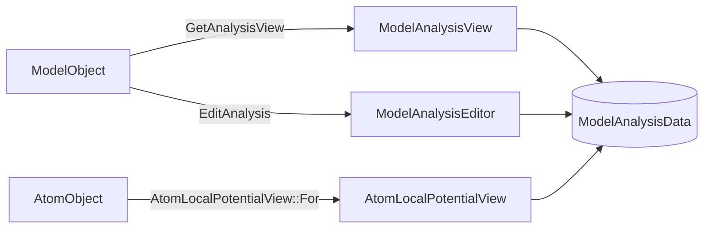

# Object Architecture

This document describes the current object boundaries after the analysis and persistence simplification. `ModelObject` and `MapObject` remain the two top-level runtime roots. Model analysis is owned by `ModelObject` and exposed only through typed, non-owning facades.

## 1. Top-Level Roots

`ModelObject` owns the complete atomic-model graph:

- atoms and bonds;
- chemical-component definitions and chain metadata;
- atom, bond, and component key registries;
- atom and bond selection;
- derived indexes and spatial-query state;
- atom-local and atom-group analysis data.

`MapObject` owns a dense double-precision voxel array plus grid dimensions, spacing, and origin. It is independent from `ModelObject`; commands coordinate the two roots when an operation needs both.

Runtime domain scalars use `double` consistently. This includes atom and bond positions, alternate coordinates, occupancy, temperature, chemical-component molecular weight, model-derived spatial state, map geometry and statistics, and sampling distance/position/response. Input codecs widen external values at their boundary before constructing or mutating runtime objects.

Neither individual atoms, bonds, analysis entries, nor analysis facades are independent persistence roots.

## 2. Model Construction Boundary

Model construction intentionally retains two internal types:

- `ModelObjectParts` holds imported ownership before a valid model exists.
- `AssembleModelObject(...)` consumes those parts, attaches owners, rebuilds key registries and serial indexes, initializes selection, and establishes derived-state invariants.

File parsers populate `ModelImportState`. `TakeModelObject()` moves its owned parts directly into `ModelObjectParts` and assembles the result. The import state does not retain parser-only values that the runtime never reads, such as molecule counts, entity-ID lists, or sheet-strand counts.

This boundary should not be bypassed by manually filling `ModelObject` containers: owner attachment and index reconstruction are part of construction correctness, not optional post-processing.

## 3. Selection and Derived State

Atom and bond selection are stored on their owned objects and mirrored by the model's selected-object lists. Public bulk or predicate-based selection APIs update flags and rebuild those lists together.

Selection is independent from analysis availability. An unselected atom may have analysis data, and a selected atom may not. Persistence therefore stores `is_selected` directly on atom and bond rows; loading analysis never changes selection.

Derived runtime state includes serial lookup and spatial-query caches. It is rebuilt during assembly and invalidated or refreshed by the relevant model mutations. It is not serialized as an independent payload.

## 4. Analysis Ownership

The internal `ModelAnalysisData` contains:

- atom-local entries keyed by atom serial ID;
- one concrete `AtomGroupPotentialEntry` for atom groups.

There is no bond-group analysis alias or bond-analysis storage path. Both local and group results have exactly three fitting stages. They use fixed-length `std::array` storage and a shared checked stage-to-index conversion.

The public access flow is:

```mermaid
flowchart LR
    M[ModelObject] -->|GetAnalysisView| V[ModelAnalysisView]
    M -->|EditAnalysis| E[ModelAnalysisEditor]
    A[AtomObject] -->|AtomLocalPotentialView::For| L[AtomLocalPotentialView]
    V --> D[(ModelAnalysisData)]
    E --> D
    L --> D
```

`ModelAnalysisView` and `ModelAnalysisEditor` constructors are private. Callers obtain them only from their owning `ModelObject`, so a facade cannot be constructed against arbitrary storage.

### 4.1 Read access

`ModelAnalysisView` provides typed atom-group queries only: group keys, membership, means, robust estimates, priors, uncertainty, and alpha values. It does not format summaries or CSV output.

`AtomLocalPotentialView::For(atom)` is the only atom-local view factory. `IsAvailable()` supports optional probing. All data getters use one consistent missing-entry check and throw when the atom is detached or its entry does not exist.

Views are lightweight value objects containing a non-owning model or atom reference. Consumers, including painters, store them by value rather than allocating them through `unique_ptr`.

### 4.2 Mutation access

`ModelAnalysisEditor` owns all supported analysis mutation operations. Its direct atom-local setters are:

- `SetAtomLocalRawSamplingEntries(...)`;
- `SetAtomLocalPeelingSamplingEntries(...)`;
- `SetAtomLocalGaussianResult(...)`;
- `SetAtomLocalAlphaR(...)`;
- `SetAtomLocalNeighborCountForPeeling(...)`.

Each setter creates the atom-local entry when it is missing. Composite operations remain where they enforce a real invariant, including second-stage local updates, group-result application, stage copying, and group-alpha updates.

`InitializeFromSelection()` is the single analysis initialization operation. It clears previous analysis, rebuilds atom groups from current selection, creates the selected atoms' local entries, and initializes local and group alpha values for all three stages.

Transient fitting state is cleared through `ModelAnalysisEditor`; `ModelObject` does not provide a forwarding wrapper.

## 5. Presentation Boundary

Analysis facades return typed data, not presentation strings. Text that is used once stays close to its consumer:

- selection-count and group-count summaries live in `PotentialAnalysisCommand`;
- group-prior summaries and local-fitting CSV serialization live in `GaussianEstimator`.

This keeps formatting changes out of the object API while preserving command output and numerical behavior.

## 6. Sampling and Parallelism

`MapSampler` computes atom sampling results into an indexed temporary result vector in parallel. After workers finish, it writes results through `ModelAnalysisEditor` in a sequential pass.

The separation is deliberate: map reads and local calculations are parallel, while mutation of the analysis entry map is serialized. No concurrent entry-map insertion is permitted.

## 7. MapObject

`MapObject` stores:

- `std::array<int, 3>` grid dimensions;
- `std::array<double, 3>` spacing;
- `std::array<double, 3>` origin;
- a contiguous `double` voxel buffer and double-precision statistics.

The canonical in-memory voxel order is X, then Y, then Z. MRC and CCP4 codecs normalize file axis mappings before constructing the object. Their required float32 headers and mode-2 payloads are external-format details: reads widen each voxel to `double` before axis normalization and construction, and writes narrow temporary values only inside the codec. Their distinct header and origin rules remain in the codecs; shared boundary mechanics live in `MapHelper`.

## 8. Persistence Boundary

`DataRepository` is the only public SQLite entry point and supports `SaveModel(...)` and `LoadModel(...)`. It owns the SQLite connection, mutex, transactions, and schema lifecycle directly.

`ModelObjectStorage` remains internal because it performs real domain-to-row mapping. During load it:

1. reads owned structure into `ModelObjectParts`;
2. assembles a valid `ModelObject`;
3. restores atom and bond selection from structure rows;
4. loads model metadata and analysis;
5. rebuilds group membership from restored selected atoms.

Map persistence is file-only. See [DataObject I/O Architecture](dataobject-io-architecture.md) for schema and codec details.

## 9. Change Guide

- Change durable model ownership or assembly invariants in `ModelObjectParts`, `AssembleModelObject`, and `ModelObject`.
- Add typed analysis queries to `ModelAnalysisView` or `AtomLocalPotentialView`.
- Add invariant-preserving analysis mutations to `ModelAnalysisEditor`.
- Keep one-off logs, summaries, and serializers in their command or estimator consumer.
- Change SQLite row mapping in `ModelObjectStorage`; change lifecycle validation in `DataRepository`.
- Change shared MRC/CCP4 float32 boundary mechanics in `MapHelper`; keep their header semantics in the individual codecs and keep runtime map data as `double`.

## 10. Key Files

- `include/rhbm_gem/data/object/ModelObject.hpp`
- `include/rhbm_gem/data/object/ModelAnalysisView.hpp`
- `include/rhbm_gem/data/object/ModelAnalysisEditor.hpp`
- `include/rhbm_gem/data/object/AtomLocalPotentialView.hpp`
- `src/data/detail/ModelAnalysisData.*`
- `src/data/detail/LocalPotentialEntry.hpp`
- `src/data/detail/GroupPotentialEntry.hpp`
- `src/data/detail/ModelObjectParts.*`
- `src/data/io/file/ModelImportState.*`
- `src/data/io/sqlite/ModelObjectStorage.*`
