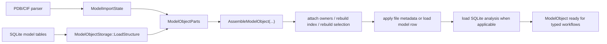
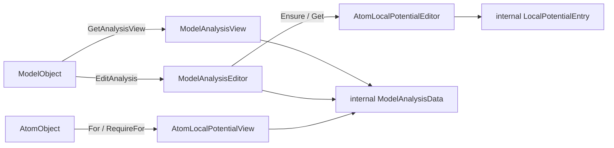
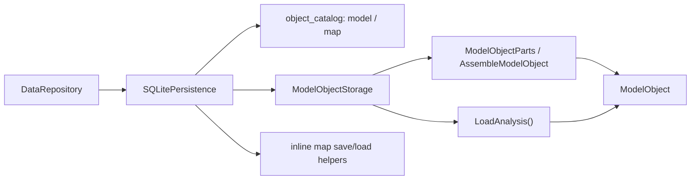

# Object Architecture

This document explains how the current project's object system is structured, how object state moves through import, runtime, and persistence, and which helpers are responsible for keeping object invariants valid.

Related references:

- [`/docs/developer/architecture/dataobject-io-architecture.md`](/docs/developer/architecture/dataobject-io-architecture.md)
- [`/docs/developer/architecture/command-architecture.md`](/docs/developer/architecture/command-architecture.md)
- [`/docs/developer/adding-dataobject-operations.md`](/docs/developer/adding-dataobject-operations.md)

## 1. Mental Model

The object system has two public top-level roots:

- `ModelObject`
- `MapObject`

Everything else is one of:

- model-owned domain data
- a non-owning public view/editor over model-owned analysis data
- internal construction, derived-state, or persistence machinery

`ModelObject` is the center of the system. It owns the structural model payload, selection state, chemical-component metadata, key registries, analysis results, and model-level derived caches.

`MapObject` is much simpler. It is a self-contained volumetric grid object with geometry metadata and a dense voxel-value array.

## 2. Public Object Surface

The current public object headers fall into three groups.

Top-level roots:

- [`/include/rhbm_gem/data/object/ModelObject.hpp`](/include/rhbm_gem/data/object/ModelObject.hpp)
- [`/include/rhbm_gem/data/object/MapObject.hpp`](/include/rhbm_gem/data/object/MapObject.hpp)

Model-domain objects:

- [`/include/rhbm_gem/data/object/AtomObject.hpp`](/include/rhbm_gem/data/object/AtomObject.hpp)
- [`/include/rhbm_gem/data/object/BondObject.hpp`](/include/rhbm_gem/data/object/BondObject.hpp)
- [`/include/rhbm_gem/data/object/ChemicalComponentEntry.hpp`](/include/rhbm_gem/data/object/ChemicalComponentEntry.hpp)

Analysis access facades:

- [`/include/rhbm_gem/data/object/ModelAnalysisView.hpp`](/include/rhbm_gem/data/object/ModelAnalysisView.hpp)
- [`/include/rhbm_gem/data/object/ModelAnalysisEditor.hpp`](/include/rhbm_gem/data/object/ModelAnalysisEditor.hpp)
- [`/include/rhbm_gem/data/object/AtomLocalPotentialView.hpp`](/include/rhbm_gem/data/object/AtomLocalPotentialView.hpp)
- [`/include/rhbm_gem/data/object/AtomLocalPotentialEditor.hpp`](/include/rhbm_gem/data/object/AtomLocalPotentialEditor.hpp)

Only `ModelObject` and `MapObject` are top-level file and SQLite roots. Domain objects and analysis facades are not independent persistence roots.

The analysis facade objects do not own analysis state. They hold references or pointers into a `ModelObject`, an `AtomObject`, or an internal local entry, so they must not outlive the corresponding owner or entry.

## 3. Object Roles

| Type | Kind | Ownership | Main responsibility |
| --- | --- | --- | --- |
| `ModelObject` | top-level root | owned by caller | model structure, selection, key registries, analysis, model caches |
| `MapObject` | top-level root | owned by caller | volumetric grid geometry, raw voxel values, map statistics |
| `AtomObject` | model leaf | owned by `ModelObject` | atom identity, position, occupancy, standard Q-score, structural annotations |
| `BondObject` | model leaf | owned by `ModelObject` | bond identity and references to the two endpoint atoms |
| `ChemicalComponentEntry` | model metadata | owned by `ModelObject` | per-component metadata plus atom/bond templates keyed by component/atom/bond keys |
| `ModelAnalysisView` | read facade | non-owning reference to `ModelObject` | group analysis queries and formatted summaries |
| `ModelAnalysisEditor` | write facade | non-owning reference to `ModelObject` | controlled local/group analysis mutation |
| `AtomLocalPotentialView` | read facade | non-owning pointer to `AtomObject` | optional or required per-atom local-analysis queries |
| `AtomLocalPotentialEditor` | write facade | non-owning pointer to a local entry | controlled mutation of one atom's local-analysis entry |

## 4. ModelObject Anatomy

[`ModelObject`](/include/rhbm_gem/data/object/ModelObject.hpp) mixes five categories of state.

### 4.1 Durable model payload

- `m_atom_list`
- `m_bond_list`
- `m_key_tag`, `m_pdb_id`, `m_emd_id`
- `m_resolution`, `m_resolution_method`
- `m_standard_average_qscore`
- `m_reference_height`, `m_reference_offset`
- `m_chain_id_list_map`
- `m_chemical_component_entry_map`

Atoms also carry their own `m_standard_qscore`. These model- and atom-level values are durable SQLite payload together with the structural data.

### 4.2 Selection state

- per-object private flags on `AtomObject` and `BondObject`
- `m_selected_atom_list`
- `m_selected_residue_id_atom_list_map`
- `m_selected_bond_list`

The selected lists and residue lookup are cached projections rebuilt from the per-object flags. They are not the source of truth by themselves.

### 4.3 Key registries

- `m_component_key_system`
- `m_atom_key_system`
- `m_bond_key_system`

These registries translate between string ids and compact numeric keys used throughout model payload and persistence. Built-in chemical data is pre-registered, and additional dynamic keys are reconstructed during import or DB load.

### 4.4 Derived runtime state

- `m_serial_id_atom_map`
- mutable `m_sequence_id_list`, refreshed as a sorted unique projection by `GetSequenceIDList()`
- `m_derived_state`

`m_derived_state` points to `ModelDerivedState`, which owns the lazily-built atom KD-tree, its mutex, the cached center-of-mass position, and per-axis position ranges. These values are rebuildable from structural data and are not persisted.

### 4.5 Analysis-owned state

- `m_analysis_data`

`ModelAnalysisData` remains an internal storage type. The supported public access paths are `ModelObject::GetAnalysisView()`, `ModelObject::EditAnalysis()`, and `AtomLocalPotentialView::For(...)` / `RequireFor(...)`. Public callers can therefore read and mutate analysis through typed facades without receiving the internal owning containers.

## 5. Ownership and Invariants

The most important ownership rules are:

- `ModelObject` owns atoms and bonds through `std::unique_ptr`
- `BondObject` stores raw pointers to its two endpoint atoms
- `AtomObject` and `BondObject` store a raw `m_owner_model`
- analysis views/editors are non-owning handles into model-owned state
- endpoint and owner pointers are valid only after the assembled model has attached its owned objects

Structural assembly is centralized in `ModelObjectParts` and `AssembleModelObject(...)`. The current `ModelObject` friend surface is limited to `ModelDerivedState`, `ModelAnalysisData`, `AtomObject`, and the assembly function; `ModelObjectStorage` builds a `ModelObjectParts` value instead of mutating structural containers directly.

The key invariant is:

- after atoms or bonds are replaced, copied, or moved, the model must re-attach owner pointers and re-sync derived state

The current assembly path is:

1. populate `ModelObjectParts`
2. move the parts into `ModelObject`
3. `AttachOwnedObjects()`
4. `InvalidateDerivedState()`
5. `RebuildObjectIndex()` and `RebuildSelection()`

Changing an attached atom position through `AtomObject::SetPosition(...)` invalidates the owning model's derived state automatically.

## 6. ModelObject Lifecycle

```mermaid
flowchart LR
    A["PDB/CIF parser"] --> B["ModelImportState"]
    C["SQLite model tables"] --> D["ModelObjectStorage::LoadStructure"]
    B --> E["ModelObjectParts"]
    D --> E
    E --> F["AssembleModelObject(...)"]
    F --> G["attach owners / rebuild index / rebuild selection"]
    G --> H["apply file metadata or load model row"]
    H --> I["load SQLite analysis when applicable"]
    I --> J["ModelObject ready for typed workflows"]
```

### 6.1 Import construction

Model import uses [`/src/data/io/file/ModelImportState.*`](/src/data/io/file/ModelImportState.hpp) as a staging object.

`ModelImportState` accumulates:

- atoms grouped by model number
- tuple-based atom lookup for bond resolution
- bonds
- entity and chain metadata
- secondary-structure ranges
- chemical component entries
- component/atom/bond key systems

When import finishes, `TakeModelObject(...)`:

1. chooses the requested model number or falls back to the first available one
2. moves that model's atom list out of the staging state
3. filters bonds so only bonds whose endpoints belong to the chosen atom set survive
4. transfers chain metadata, chemical component entries, and key systems into `ModelObjectParts`
5. builds a `ModelObject` via `AssembleModelObject(...)`
6. applies top-level metadata such as PDB id, EMD id, resolution, and resolution method

The file formats that feed this workflow are:

- [`/src/data/io/file/PdbFormat.cpp`](/src/data/io/file/PdbFormat.cpp)
- [`/src/data/io/file/CifFormat.cpp`](/src/data/io/file/CifFormat.cpp)

### 6.2 Runtime mutation

The public `ModelObject` API supports:

- structural, sequence, key-based, and chemical-component queries
- atom and bond selection plus selection post-filters
- atom-neighbor queries backed by derived state
- model and atom Q-score metadata
- simulation/reference metadata
- controlled analysis initialization, reads, and edits through the facade types

Direct replacement of the atom, bond, key-system, chain, or component containers remains internal to assembly and storage code.

### 6.3 Copy and move behavior

`ModelObject` implements custom copy and move operations because a shallow copy would break owner pointers, group-member pointers, and bond-to-atom references.

Current behavior:

- copying clones atoms first, then rebuilds bonds against the cloned atoms
- copying clones chemical-component entries and key registries
- copying deep-copies all three stages of atom group data and rebinds group members to cloned atoms
- copying deep-copies atom local entries, including samples and any runtime-only `fit_result`
- moving reuses owned payload where possible, then re-attaches owner pointers, invalidates derived state, and rebuilds indexes and selection projections

## 7. Selection Model

Selection is not a separate manager object.

The source of truth is:

- `AtomObject::m_is_selected`
- `BondObject::m_is_selected`

The query surface is:

- `GetSelectedAtoms()`
- `GetSelectedAtomList(residue_id)`
- `GetSelectedBonds()`
- `GetSelectedAtomCount()`
- `GetSelectedBondCount()`

`GetSequenceIDList()` is related but separate: it returns the sorted unique sequence ids of all model atoms, not only selected atoms.

The cached selection projections are refreshed through:

- `RebuildSelection()`
- `BuildSelectedAtomList()`
- `BuildSelectedBondList()`

Public mutation entry points are:

- `SelectAllAtoms(...)`
- `SelectAllBonds(...)`
- `SelectAtoms(predicate)`
- `SelectBonds(predicate)`
- `SetAtomSelected(serial_id, selected)`
- `SetBondSelected(atom_serial_id_1, atom_serial_id_2, selected)`

Selection post-filters never widen the current selection:

- `ApplySymmetrySelection(false)` keeps atoms and bonds whose chain id matches the first chain recorded for an entity; `true` is a no-op
- `ApplyElementSelection(element, true)` deselects matching atoms
- `ApplySpotSelection(spot, true)` deselects matching atoms
- `ApplyBackboneSelection(true)` keeps only currently selected atoms whose spot is in the backbone set
- `ApplyComponentIDSelection(id, true)` deselects matching atoms
- the four `is_exclusion == false` filter calls are no-ops

If symmetry chain metadata is absent, symmetry filtering warns and leaves selection unchanged.

## 8. Analysis Architecture

Analysis storage is model-owned and internal, while the supported read/write interfaces are public facades.

### 8.1 Internal storage shape

[`/src/data/detail/ModelAnalysisData.hpp`](/src/data/detail/ModelAnalysisData.hpp) currently owns:

- one atom-local entry map keyed by atom `serial_id`
- one `AtomGroupPotentialEntry` whose group maps are separate for `FittingStage::First`, `Second`, and `Third`

Each atom-local entry stores:

- raw sampling entries
- peeling sampling entries
- peeling neighbor count
- independent local Gaussian results for the three fitting stages

Each stage-local Gaussian result contains OLS and MDPDE estimates, `alpha_r`, an optional posterior, outlier/statistical-distance annotations, and an optional runtime `fit_result`.

Each atom-group bucket is keyed by a `GroupKey` derived from the atom's component and atom keys. It stores member pointers, mean, MDPDE, prior with uncertainty, and `alpha_g`, independently for each fitting stage.

The active model-owned analysis graph is atom-only. `BondGroupPotentialEntry` remains a template alias and SQLite retains legacy bond-analysis tables, but `ModelAnalysisData`, `SaveAnalysis()`, and `LoadAnalysis()` do not currently own, save, or load bond analysis.

### 8.2 Public access paths

```mermaid
flowchart LR
    A["ModelObject"] -->|GetAnalysisView| B["ModelAnalysisView"]
    A -->|EditAnalysis| C["ModelAnalysisEditor"]
    D["AtomObject"] -->|For / RequireFor| E["AtomLocalPotentialView"]
    C -->|Ensure / Get| F["AtomLocalPotentialEditor"]
    B --> G["internal ModelAnalysisData"]
    C --> G
    E --> G
    F --> H["internal LocalPotentialEntry"]
```

- `ModelAnalysisView` reads stage-specific atom groups, priors, alpha values, and formatted summaries/CSV
- `AtomLocalPotentialView::For(...)` can represent a missing entry and exposes `IsAvailable()`
- `AtomLocalPotentialView::RequireFor(...)` throws if the atom is detached or has no local entry
- `ModelAnalysisEditor` owns workflow-level mutations such as initialization, group rebuild, stage copy, result application, and cleanup
- `AtomLocalPotentialEditor` can only be obtained through `ModelAnalysisEditor` and mutates one local entry

These facade objects are cheap non-owning handles. Do not retain them across model destruction, model replacement, or analysis clearing that invalidates their referenced entry.

### 8.3 Initialization and stage flow

`ModelObject::LocalPotentialInitialization()`:

1. clears all existing analysis data
2. rebuilds atom groups from the current selected atoms for all three stages
3. creates local entries for selected atoms while initializing `alpha_r` to zero for all stages
4. initializes group `alpha_g` to zero for all stages

`ModelAnalysisEditor` also supports copying local results, group state, or both from one fitting stage to another. `ClearTransientFitStates()` removes only each stage's optional `fit_result`; it preserves entries, samples, Gaussian estimates, posterior data, and group state.

## 9. Spatial Access

There are two different spatial mechanisms in the current object system.

### 9.1 Model spatial cache

`ModelObject` owns private `ModelDerivedState` storage containing a lazily-built KD-tree over atom pointers plus cached center-of-mass and position-range values.

- callers do not manage it directly
- the KD-tree is created lazily through `EnsureKDTreeRoot()`
- `InvalidateDerivedState()` clears the tree and geometry caches
- attached atom coordinate changes trigger invalidation automatically
- the tree build is protected by a mutex

The public `ModelObject::FindNeighborAtoms(...)` validates radius and atom ownership, queries `ModelDerivedState`, optionally removes the center atom, and returns results deterministically sorted by distance and then serial id. `AtomObject::FindNeighborAtoms(...)` forwards to its attached owner model.

### 9.2 Map grid access

`MapObject` does not own a persistent spatial index.

For regular-grid voxel range queries, command code derives bounded grid index ranges directly from `MapObject` geometry (`grid size`, `grid spacing`, and `origin`) and then filters by distance. This keeps `MapObject` itself close to a self-contained value object and avoids shared KD-tree lifetime concerns for dense regular maps.

## 10. MapObject Architecture

[`MapObject`](/include/rhbm_gem/data/object/MapObject.hpp) is intentionally flatter than `ModelObject`.

It owns:

- grid size
- grid spacing
- origin
- derived map bounds and lengths
- dense voxel array
- map statistics: min, max, mean, standard deviation

Key behavior:

- the grid-geometry constructors compute derived bounds; the default constructor initializes its placeholder geometry directly
- a constructor receiving values computes statistics immediately
- replacing the value array through `SetMapValueArray(...)` recomputes statistics
- `ClearMapValueArray()` zeros all voxels and recomputes statistics
- `MapValueArrayNormalization()` divides values by the current standard deviation and recomputes statistics; zero standard deviation produces a warning and leaves values unchanged
- spatial query/index data is not stored inside the object

Unlike `ModelObject`, `MapObject` does not have a builder, analysis store, or friend-based internal mutation layer.

## 11. Persistence Topology

```mermaid
flowchart LR
    A["DataRepository"] --> B["SQLitePersistence"]
    B --> C["object_catalog: model / map"]
    B --> D["ModelObjectStorage"]
    B --> E["inline map save/load helpers"]
    D --> F["ModelObjectParts / AssembleModelObject"]
    F --> G["ModelObject"]
    D --> H["LoadAnalysis()"]
    H --> G
```

Top-level routing lives in:

- [`/include/rhbm_gem/data/io/DataRepository.hpp`](/include/rhbm_gem/data/io/DataRepository.hpp)
- [`/src/data/io/sqlite/SQLitePersistence.cpp`](/src/data/io/sqlite/SQLitePersistence.cpp)

Model-specific persistence lives in:

- [`/src/data/io/sqlite/ModelObjectStorage.cpp`](/src/data/io/sqlite/ModelObjectStorage.cpp)

The current SQLite schema version is `12`, and the catalog distinguishes only `model` and `map` roots.

### 11.1 Model persistence boundary

| State | Current SQLite behavior |
| --- | --- |
| model metadata | persists PDB/EMD ids, resolution/method, standard average Q-score, reference height, and reference offset |
| structural payload | persists chain map, chemical components/templates, atoms (including standard Q-score), and bonds |
| atom local analysis | persists raw/peeling samples, sample selection bits, peeling neighbor count, and OLS/MDPDE model parameters plus `alpha_r` for all three stages |
| atom posterior | persists the third-stage posterior, posterior uncertainty, outlier flag, and statistical distance |
| atom group analysis | persists mean, MDPDE, prior with uncertainty, and `alpha_g` for all three stages, keyed by the third-stage group-key set |
| local fit internals | does not persist `fit_result` or local OLS/MDPDE uncertainty components |
| bond analysis | legacy tables remain in the canonical schema, but the active runtime save/load path does not use them |
| selection and caches | not stored as independent payload; rebuilt during load |

Posterior and group rows are written only when third-stage group data exists. The current group-persistence invariant therefore expects a persisted third-stage group key to have corresponding first- and second-stage group state.

Map persistence stores geometry and the dense value array. `MapObject` recomputes statistics when the stored values are loaded.

### 11.2 Load reconstruction

The following are reconstructed rather than stored as dedicated payload:

- component/atom/bond key-system lookup state
- atom and bond owner pointers
- bond endpoint pointers
- serial-id atom lookup
- selected atom, selected-by-residue, and selected bond projections
- atom group member pointers
- sequence-id projection
- model KD-tree, center-of-mass, and position-range caches
- map statistics

For model analysis, `LoadAnalysis()` clears the current store, loads atom-local entries into a temporary map, attaches entries whose serial ids match loaded atoms, derives atom selection from those matches, and then rebuilds group membership from the selected atoms' `GroupKey` values.

### 11.3 Selection restoration rule

Only atom selection is indirectly restored from persisted analysis:

1. each persisted atom-local row is matched to a loaded atom by `serial_id`
2. `SelectAtoms(...)` selects exactly those matching atoms
3. selected-atom caches and selected-by-residue lookup are rebuilt
4. group members are reconstructed from that atom selection

Bond selection is not restored by the current load path. The private `RestoreBondSelectionBulk(...)` helper remains present, but it has no production caller, and bond-analysis rows are not hydrated.

## 12. Command Runtime Integration

Commands do not introduce another shared object abstraction.

Current pattern:

1. file-backed commands call `ReadModel(...)` or `ReadMap(...)` directly and assign a command-local `key_tag` when needed
2. repository-backed commands construct `DataRepository` inside the command workflow and call typed load methods directly
3. concrete command workflows own loaded roots through `std::unique_ptr<ModelObject>`, `std::unique_ptr<MapObject>`, or containers of those pointers
4. persistence calls use the typed `DataRepository::SaveModel(...)` / `SaveMap(...)` APIs directly

[`/src/core/command/detail/CommandBase.hpp`](/src/core/command/detail/CommandBase.hpp) supplies request normalization, validation, execution lifecycle, and diagnostics. It does not own or load data objects; concrete command source files perform object I/O and ownership explicitly.

## 13. Where to Change Things

Use this as a quick routing guide when modifying the object system.

- Public object/domain behavior:
  [`/include/rhbm_gem/data/object/`](/include/rhbm_gem/data/object/ModelObject.hpp) and
  [`/src/data/object/`](/src/data/object/ModelObject.cpp)
- Internal model assembly:
  [`/src/data/detail/ModelObjectParts.*`](/src/data/detail/ModelObjectParts.hpp)
- Model import staging and parsing:
  [`/src/data/io/file/ModelImportState.*`](/src/data/io/file/ModelImportState.hpp),
  [`/src/data/io/file/PdbFormat.*`](/src/data/io/file/PdbFormat.hpp), and
  [`/src/data/io/file/CifFormat.*`](/src/data/io/file/CifFormat.hpp)
- Analysis facade behavior:
  `ModelAnalysisView`, `ModelAnalysisEditor`, `AtomLocalPotentialView`, and `AtomLocalPotentialEditor` under the public/source object directories
- Internal analysis storage:
  [`/src/data/detail/ModelAnalysisData.*`](/src/data/detail/ModelAnalysisData.hpp),
  [`/src/data/detail/LocalPotentialEntry.hpp`](/src/data/detail/LocalPotentialEntry.hpp), and
  [`/src/data/detail/GroupPotentialEntry.hpp`](/src/data/detail/GroupPotentialEntry.hpp)
- Derived spatial/cache state:
  [`/src/data/detail/ModelDerivedState.*`](/src/data/detail/ModelDerivedState.hpp)
- Model persistence payload:
  [`/src/data/io/sqlite/ModelObjectStorage.*`](/src/data/io/sqlite/ModelObjectStorage.hpp)
- Catalog, schema validation, and migrations:
  [`/src/data/io/sqlite/SQLitePersistence.cpp`](/src/data/io/sqlite/SQLitePersistence.cpp)
- Typed file I/O routing:
  [`/src/data/io/ModelMapFileIO.cpp`](/src/data/io/ModelMapFileIO.cpp)
- Command-side object orchestration:
  concrete sources under [`/src/core/command/`](/src/core/command/PotentialAnalysisCommand.cpp)

The primary verification suites are:

- [`/tests/data/DataObjectModelAnalysis_test.cpp`](/tests/data/DataObjectModelAnalysis_test.cpp)
- [`/tests/data/DataObjectAssemblySpatialQuery_test.cpp`](/tests/data/DataObjectAssemblySpatialQuery_test.cpp)
- [`/tests/data/DataObjectMapBehavior_test.cpp`](/tests/data/DataObjectMapBehavior_test.cpp)
- [`/tests/data/DataObjectPersistence_test.cpp`](/tests/data/DataObjectPersistence_test.cpp)
- [`/tests/data/DataObjectSchemaLifecycle_test.cpp`](/tests/data/DataObjectSchemaLifecycle_test.cpp)
- [`/tests/data/DataObjectSchemaValidation_test.cpp`](/tests/data/DataObjectSchemaValidation_test.cpp)

## 14. Common Gotchas

- Do not mutate `ModelObject` structural containers outside the internal assembly path.
- If atoms or bonds are replaced internally, owner pointers, bond endpoints, indexes, selection projections, and derived caches must be re-synced.
- `BondObject` identity depends on the ordered serial-id pair of its endpoint atoms.
- `GetSelectedAtoms()`, `GetSelectedAtomList(residue_id)`, and `GetSelectedBonds()` are cached projections, not the fundamental selection flags.
- `LocalPotentialInitialization()` clears all existing analysis state before rebuilding entries and groups from current selection.
- Analysis views/editors are non-owning; an `AtomLocalPotentialEditor` becomes invalid if its local entry is cleared.
- Loaded atom selection is reconstructed from atom-local analysis rows; bond selection is not currently restored.
- The SQLite schema still contains legacy bond-analysis tables even though active runtime analysis is atom-only.
- Group persistence is driven by third-stage group keys and expects matching first-/second-stage group state.
- Map spatial helpers stay outside `MapObject`; do not add map KD-tree state unless the architecture intentionally changes.
