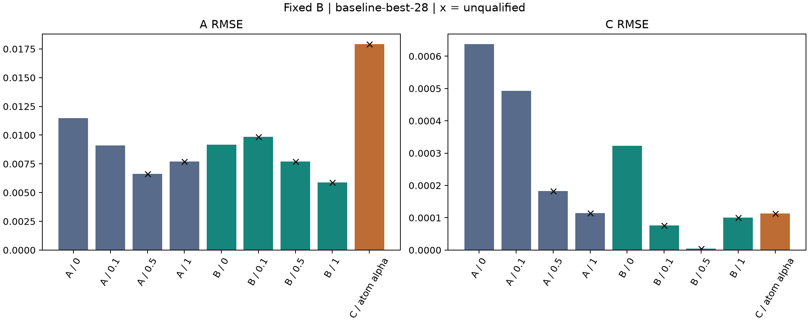
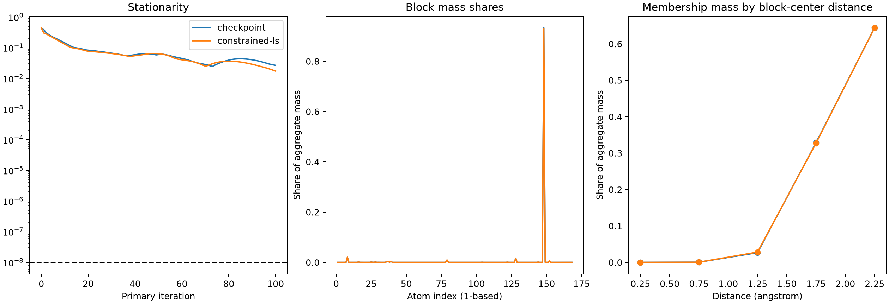
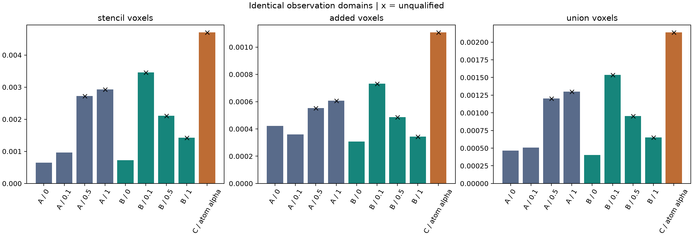

# Experiment C — Atom-block grid composite MDPDE

本實驗僅連結 testing executable，在 baseline-best-28 固定 B 下，聯合估計全部 168 原子的 A/C。
使用與 [Experiment B](atom-centered-voxel-union-experiment.md) 相同的 2.5 Å voxel 聯集，
每個原子保留自己的 checkpoint alpha 與自由正 variance，以可重疊的 blocks 定義 composite criterion。
本輪只執行一次正式 Joint 問題、兩個起點，**不另做獨立重跑**。
Production API、CLI、schema 與 fitting workflow 不變。

<!-- RESULTS-BEGIN -->
## 本輪結果

正式 **1/1 案例已完成**，選定終點為 `budget-exhausted`，起點為 `checkpoint`。兩起點皆保存完整軌跡；本輪未獨立重跑。

| 方法 | alpha | 數值資格 | A RMSE | C RMSE | A／C 誤差<0.01 |
| --- | --- | --- | ---: | ---: | --- |
| A | 0 | qualified | 0.011471954 | 0.00063732864 | 115/168；168/168 |
| A | 0.1 | qualified | 0.0091138914 | 0.00049314988 | 115/168；168/168 |
| A | 0.5 | budget-exhausted | 0.0066220377 | 0.00018292652 | 159/168；168/168 |
| A | 1 | budget-exhausted | 0.0077174772 | 0.00011406691 | 146/168；168/168 |
| B | 0 | qualified | 0.0091707311 | 0.00032313699 | 129/168；168/168 |
| B | 0.1 | budget-exhausted | 0.0098675745 | 7.5661813e-05 | 150/168；168/168 |
| B | 0.5 | budget-exhausted | 0.0077134879 | 4.7769684e-06 | 145/168；168/168 |
| B | 1 | budget-exhausted | 0.0058927186 | 0.00010023188 | 150/168；168/168 |
| C | checkpoint | budget-exhausted | 0.017916446 | 0.00011271024 | 113/168；168/168 |

**本輪尚未取得合格的 C estimator endpoint。** 兩個起點都用完 100 次主預算，因此沒有進入精化，也沒有通過終點線性解的 SVD 資格驗證；另行計算的 weighted spectrum 只是診斷。選定終點的 A RMSE 約 0.01792，且有 55/168 個原子的 A 誤差不小於 0.01，最大約 0.10425。C 誤差全部小於 0.01，但不能用這項精度取代數值資格。



| 起點 | 主／精化次數 | 停止原因 | Stationarity | Weighted rank／condition | ESS/N | 最大 block／占比 |
| --- | --- | --- | ---: | --- | ---: | --- |
| checkpoint | 100／0 | budget-exhausted | 0.026667553 | 336／9.2253702 | 0.8983% | 148／93.3488% |
| constrained-ls | 100／0 | budget-exhausted | 0.017256217 | 336／9.3474884 | 0.9034% | 148／93.0619% |

**Atom-block 權重集中仍然存在。** 選定終點的 serial 148（alpha=1）block 占 93.35% mass，最高 1% unique rows 占 93.75%，aggregate ESS 約 33,854，只占 3,768,656 rows 的 0.898%。28 個 alpha=0 blocks 合計 share 約 3.76e-10。舊 matched baseline 的最大 block share 約 87.2%，但因觀測域與預算不同，只作描述性背景。

C 的新增區域承接約 97.06% aggregate weight；距最近原子 1.5–2.5 Å 的 rows 承接約 96.89%。以各 membership 所屬 block 中心計算，1.5–2.5 Å 的 share 約 97.32%。這兩種距離定義不同，不能混用。矩陣仍滿秩、欄正規化 condition 約 9.23，但係數方程最大殘差約 0.00340，variance 方程最大殘差約 0.02667（serial 52、alpha=0.2）；因此 rank／condition 良好並不代表已收斂。



### 共同觀測域

| 方法 | alpha | A 原 voxels RMSE | 新增 voxels RMSE | 完整 B RMSE | 原 samples RMSE |
| --- | --- | ---: | ---: | ---: | ---: |
| A | 0 | 0.00064650161 | 0.00042200868 | 0.00046526514 | 0.00087532326 |
| A | 0.1 | 0.0009621802 | 0.00035973647 | 0.00050678725 | 0.0015027215 |
| A | 0.5 | 0.0027244033 | 0.00055238425 | 0.0012016266 | 0.0041241973 |
| A | 1 | 0.0029318876 | 0.000607813 | 0.0012983463 | 0.0044599576 |
| B | 0 | 0.0007227265 | 0.00030803574 | 0.00040407768 | 0.0011555523 |
| B | 0.1 | 0.0034605235 | 0.00073252926 | 0.0015384438 | 0.0051403005 |
| B | 0.5 | 0.0021070969 | 0.00048662761 | 0.00095357525 | 0.0032245661 |
| B | 1 | 0.0014263382 | 0.00034457563 | 0.00065211257 | 0.0022838802 |
| C | checkpoint | 0.0047029965 | 0.0011072908 | 0.0021374943 | 0.0068100364 |

相較 B 的合格 alpha=0 結果，C 此未合格終點的 A RMSE、完整 union 與原 samples residual 均較大；C 參數 RMSE 則較小。現有證據不足以支持採用這套 atom-block 方法取代 B，也不能在未加入 C 共同 alpha 對照的情況下，將問題單獨歸因於 alpha_i。



### 驗證與資源

- 正式 C++ 執行耗時 16.74 分鐘，peak child RSS 約 1.92 GiB；包含 forward、歷史重播、擬合及輸出，Python 檢查另計。
- 完整 union／memberships、coverage、sample replay、獨立 generator、Python composite objective／stationarity／權重重建均通過。
- B 四組重播的 objective、stationarity 與 grid RMSE 差為零；獨立加權線性解的最大尺度化差約 4.98e-13。
- 45 項相關 C++ tests、75 項 Python tests、10 個 CTest 群組、repository lint、文件連結、PDF 版面及 BUILD_TESTING=OFF 隔離檢查通過。
- 不追加迭代，不要求數值合格或參數改善；原 A/B 產物保持原樣。
- 初次後處理有 554 個 voxels 超出固定權重比對誤差，最大差 1.72e-10。核對後確認為 `y-X*beta` 與 `y-(X*beta)` 的 residual 捨入差，所有點均落在既有 residual roundoff 經各 block exponential 傳播後的界限內。修正僅限 Python 驗證器，新增可拒絕實際權重改動的回歸測試；正式 fit 與數值資格門檻未改動，未重跑。
- [後處理來源記錄](figures/atom-block-grid-composite/postprocessing-provenance.json) 保存修正後來源 hashes；正式執行使用的兩份 Python 原始版本保存在 raw 的 `source-at-fit`，並核對原 provenance hashes。

產物：[結果 JSON](figures/atom-block-grid-composite/results.json)、[誤差統計](figures/atom-block-grid-composite/statistics.csv)、[逐原子結果](figures/atom-block-grid-composite/estimates.csv)、[block 診斷](figures/atom-block-grid-composite/blocks.csv)、[區域診斷](figures/atom-block-grid-composite/regions.csv)、[兩起點終點](figures/atom-block-grid-composite/branch-diagnostics.json)、[完整軌跡](figures/atom-block-grid-composite/full-trajectories.json)。

驗證：[檢查索引](figures/atom-block-grid-composite/validation.json)、[獨立數值重建](figures/atom-block-grid-composite/numerical-validation.json)、[來源與執行檔](figures/atom-block-grid-composite/provenance.json)、[輸入 hashes](figures/atom-block-grid-composite/input-hashes.json)、[raw artifact 索引](figures/atom-block-grid-composite/raw-artifact-index.json)、[公開產物 hashes](figures/atom-block-grid-composite/artifact-index.json)。

PDF：[參數誤差](figures/atom-block-grid-composite/parameter-errors.pdf)、[共同域 residual](figures/atom-block-grid-composite/common-domain-residuals.pdf)、[迭代與 block 診斷](figures/atom-block-grid-composite/solver-and-block-diagnostics.pdf)。
<!-- RESULTS-END -->

## 資料與 block 定義

每個 block i 包含 manifest 生成幾何下、距 checkpoint 原子中心不大於 2.5 Å 的 voxels。
逐球枚舉 bounding box、裁切 map 邊界、以平方距離判定；依 global index 排序，不對球外位置 clamp 複製。
保存 header 幾何供原 samples 的 cubic stencil replay。

Unique union 為 3,768,656 rows，與 B 完全相同；保留 [Experiment A](unique-stencil-grid-experiment.md) 的全部 602,995 voxels。
168 個 blocks 共 10,995,198 memberships，每 block 65,354–65,564 rows，每 voxel 最多被 11 個 blocks 包含。
每個 unique voxel 只保存一份原 map value，保留負／零值；每個 membership 都參與其 block criterion。
不指定唯一 owner，不除以覆蓋次數，不依 selected flag、訊號大小、A/C 或 basis 是否下溢篩選。
Membership 由幾何獨立建立，不能從設計矩陣非零位置反推。

每個 row 的 prediction 都包含全部原子：`y_hat = X(B) beta`，`beta=[A_1,C_1,...,A_168,C_168]`。
沿用 generator cutoff 和近零距離規則；A≥0、C 不限符號，B 逐位保留，不新增 intercept、ridge 或 charge-sum constraint。
Truth 僅供獨立 generator forward check 與事後評分，不進入 fitting、初始化或選解。
此無額外注入噪聲的 map 仍有固定 B 誤差及 float32 量化 residual，不是新增的污染／抗離群值測試。

## Criterion 與重疊權重

沿用[既有 matched atom-block criterion](matched-joint-ac-experiment.md)，令 r_g=y_g-X_g beta：

\[
Q=\frac1{168}\sum_iQ_i,\qquad
Q_i=(2\pi v_i)^{-\alpha_i/2}
\left[(1+\alpha_i)^{-1/2}-\frac{1+\alpha_i}{\alpha_i n_i}
\sum_{g\in V_i}e^{-\alpha_i r_g^2/(2v_i)}\right]+\frac1{\alpha_i}.
\]

alpha_i=0 使用 `Q_i=0.5*(log(2*pi*v_i)+RSS_i/(n_i*v_i))`；正 alpha 以 expm1 等價計算。
Alpha 按完整 atom identity 從 checkpoint 讀取，不重新訓練、置換或四捨五入，168 個值中有 28 個為零。
既有 alpha 來自舊 fitting 問題，本輪不把它視為此 grid criterion 的最佳 tuning。
所有 terms 使用原 map 單位；不同 alpha 的 terms 對 response 單位敏感。

\[
w_{ig}=e^{-\alpha_i r_g^2/(2v_i)},\quad
q_i=\frac{1+\alpha_i}{168n_iv_i}(2\pi v_i)^{-\alpha_i/2},\quad
\omega_g=\sum_{i:g\in V_i}q_iw_{ig}.
\]

同一 residual 可以透過不同 alpha_i、v_i 產生不同 membership weights。
只有係數 weighted LS 使用累加後 omega；每個 variance 仍用自身 w 更新：

\[
v_{i,trial}=\frac{\sum_{g\in V_i}w_{ig}r_{trial,g}^2}
{\sum_{g\in V_i}w_{ig}-n_i\alpha_i(1+\alpha_i)^{-3/2}}.
\]

q 以 log 計算後共用一個全域縮放，保存原始 log(q_i) 及縮放 offset；不作逐 block 等量化、floor 或 clipping。
等權 lambda 不代表最後影響力相等。所有 alpha=0 且 block variances 自由時，仍不是 ordinary LS。
重複 memberships 是明確指定的 composite terms，不作獨立 observations 或獨立樣本數解讀。

## 計算與數值資格

直接建立 unique sparse X，保存精確非零係數、memberships 及各 membership 的 w。
不配置完整密集 X，也不建立重複 rows 的大型展開設計；全設計只有 336 欄。
新增明確的 `EvaluateComposite`／`FitComposite` testing 入口；既有 partition 入口仍拒絕重疊 blocks。
約束 active-set、回溯、主／精化迭代與資格判定共用原求解邏輯。

兩起點為 checkpoint A/C 與 unique union 上等權 constrained LS，各以自身 RSS_i/n_i 初始化 variances。
主更新沿用 1,024-row 局部 Householder QR 加 SparseQR；獨立核對重新累加終點 weights，
從原始 sparse X 建立 8,192-row 完整欄 Householder QR，再以 SVD 解 constrained linear subproblem。
不重用主 QR 的 R、不形成 normal equations；欄尺度沿用 B，rank 門檻使用原始 unique row 數。

令 s_g=sum_i q_i、T=sum_i n_i*q_i*v_i，係數方程為：

\[
g_k=\frac{\sum_g\omega_gX_{gk}r_g}
{\sqrt T\sqrt{\sum_gs_gX_{gk}^2}},\qquad
h_i=\frac1{n_i}\sum_{g\in V_i}w_{ig}(r_g^2/v_i-1)
+\alpha_i(1+\alpha_i)^{-3/2}.
\]

Stationarity 為全部 336 個係數與 168 個 variance 方程的最大殘差；A=0 使用單側 KKT 方程。
每起點主迭代最多 100 次至 1e-8；通過後精化最多 100 次至 1e-10。
主／精化及精化／獨立 SVD 的尺度化係數差須≤1e-6，最大主／精化 log-variance 差亦須≤1e-6。
沿用 exact-fit-boundary、variance-boundary、invalid-denominator、rank-deficient、stalled、budget-exhausted、reference-unverified。
即使只有一個 block exact fit，也不能視為一般正尺度解。不追加預算或放寬門檻。

只有合格分支才能依同一 native objective 選解；皆未合格時保留 checkpoint 分支作描述性 selected endpoint。
Branch-sensitive 只在兩分支皆合格時判定，未合格案例的 false 不證明兩分支一致。
保留 primary／reference 的完整 beta、variances、方程、objective、迭代及回溯軌跡。
`uncertainty` 是數值解差，不是統計標準誤；未合格終點沒有完成的精化／SVD 不賦予精度證明。

## 比較及診斷語意

使用 A/B 已保存的 baseline-best-28 四組 alpha，不補跑歷史案例。
所有估計都評分於 A 原 voxels、B 新增區域、完整 B union 與原 33,600 samples；interpolation 僅用於最後一項。
A 的 alpha=0.5、1 與 B 的 alpha=0.1、0.5、1 明確標示未合格。
舊 matched Joint 的 block concentration 只作描述性背景，其 observation 和迭代預算皆不同。

A/C 統計固定 168 個原子為分母，列 bias、RMSE、p99、最大絕對誤差、逐原子值及 |error|<0.01 的數量。
固定 B 誤差僅是輸入背景；RMSE<0.01 不代表全部原子誤差<0.01，亦不保證四捨五入到兩位小數一致。

Block share 定義為 `q_i*sum(w_ig)/sum(omega_g)`，總和為 1。
不能把 block 中 aggregate omega 相加當作其 share，否則會再次算入其他 blocks 的 mass。
各 block 保存 alpha、variance、方程、分母 margin、權重分位數、ESS_i/n_i、最高 1% membership share，
另按距該 block 中心 `[0,.5)、[.5,1)、[1,1.5)、[1.5,2)、[2,2.5]` Å 分組。
Unique-row omega 另列 ESS/N、最大單點、最高 1% share、覆蓋數及最近原子距離分組。
未加權及各分支 primary 終點 weighted spectrum 按欄正規化；診斷不改變其數值資格。

C 與 A/B 同時改變 alpha、variance 結構及重疊計權，本輪沒有共同 alpha 的 C 對照。
因此只比較整套方法，不把差異單獨歸因於 atom-specific alpha；不同 criterion 的 native objective 不排序。
單一 checkpoint、一次正式執行，不宣稱跨樣本泛化或獨立執行重現性。

## 重跑與產物

沿用 B 的 Release／SYSTEM、BUILD_TESTING=ON、audit ON、UMAP／Python bindings OFF 建置，NumPy 用於獨立驗證，Matplotlib 用於圖表。
MODEL、MAP、BASELINE、REFINED、A_REFERENCE、B_REFERENCE 指向前兩實驗相同輸入及已保存結果；OUTPUT 必須為全新目錄。

```sh
python3 tests/integration/atom_block_grid_composite.py run \
  --executable build/observation-matching/on/bin/mdpde_experiment \
  --model "$MODEL" --map "$MAP" --manifest "$MAP.simulation.json" \
  --baseline-run "$BASELINE" --refined-run "$REFINED" \
  --reference-a "$A_REFERENCE" --reference-b "$B_REFERENCE" \
  --state baseline-best-28 --output "$OUTPUT"

python3 tests/integration/atom_block_grid_composite.py summarize "$OUTPUT"
python3 tests/integration/atom_block_grid_composite.py plots "$OUTPUT" \
  --output docs/developer/figures/atom-block-grid-composite

# 僅供未來有兩份完整執行時使用；本輪不執行獨立重跑。
python3 tests/integration/atom_block_grid_composite.py compare \
  --left "$LEFT" --right "$RIGHT" --output "$COMPARISON"
```

Runner 驗證完整集合、memberships、coverage、alpha／B、兩分支及資格證據；逐案例記錄完成狀態。
Numerical failure 與 technical failure／user interruption 分開保存。
執行前後核對 source、binary、inputs hashes，記錄單工作程序、單執行緒耗時與峰值 RSS。
完整原始資料保存在 `build/atom-block-grid-composite/final`，精簡產物及 raw hashes 索引發布於文件 figures 目錄。
Membership CSV 與 dataset 幾何、各 endpoint beta／variances／log-prefactor 可重建所有 membership weights，不需另存重複的逐 membership residual。
