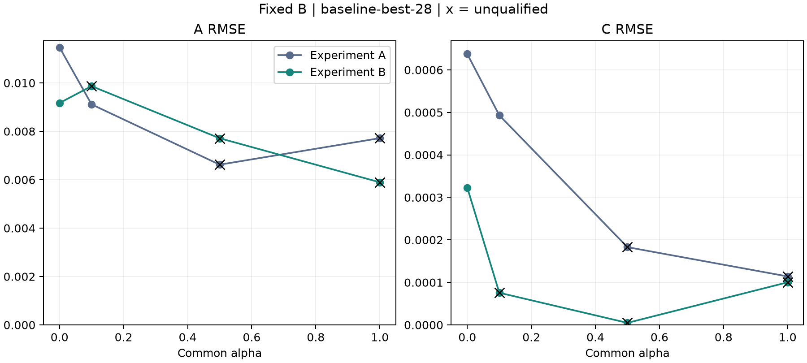
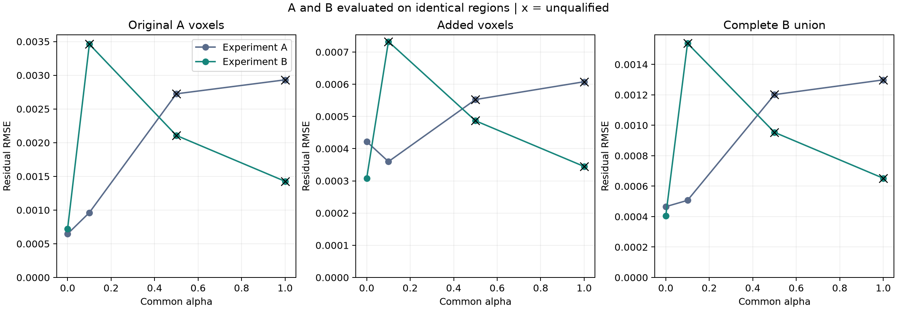
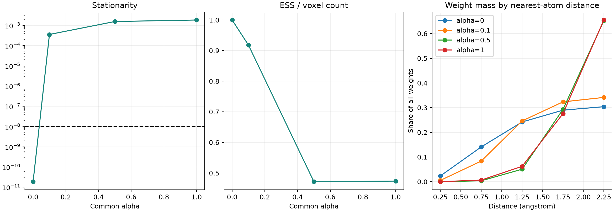

# Experiment B — Atom-centered voxel union

本實驗僅連結 testing executable，固定 baseline-best-28 的 B，聯合估計全部 168 原子的 A/C。
目的為比較 [Experiment A](unique-stencil-grid-experiment.md) 與完整原子周圍 voxel 聯集：相同共同 alpha、單一 variance、兩起點與 100／100 次預算下，擴大觀測範圍如何影響精度、stationarity 和權重分布。
Production API、CLI、schema 與 fitting workflow 不變。

## 本輪結果

正式四組已完成：**1/4 數值合格**。alpha=0 的獨立重跑已完成，科學輸出比對通過；其餘 alpha 未另做獨立重跑。

| alpha | B 資格 | A 實驗：A RMSE | B 實驗：A RMSE | A 實驗：C RMSE | B 實驗：C RMSE | B：A／C 誤差<0.01 |
| ---: | --- | ---: | ---: | ---: | ---: | --- |
| 0 | qualified | 0.011471954 | 0.0091707311 | 0.00063732864 | 0.00032313699 | 129/168；168/168 |
| 0.1 | budget-exhausted | 0.0091138914 | 0.0098675745 | 0.00049314988 | 7.5661813e-05 | 150/168；168/168 |
| 0.5 | budget-exhausted | 0.0066220377 | 0.0077134879 | 0.00018292652 | 4.7769684e-06 | 145/168；168/168 |
| 1 | budget-exhausted | 0.0077174772 | 0.0058927186 | 0.00011406691 | 0.00010023188 | 150/168；168/168 |

A 的 alpha=0、0.1 為合格歷史終點；alpha=0.5、1 為 `budget-exhausted`，其精度只作描述性參照。B 的未合格終點亦採相同標示，不能以較低參數誤差取代數值資格。

**目前能正式確認的是 alpha=0 的改善。** 相較 A 的同 alpha 合格結果，A／C RMSE 分別下降約 20.1%／49.3%。A RMSE 已低於 0.01，但仍有 39/168 個原子的 A 絕對誤差不小於 0.01，最大誤差約 0.04355；C 則全部 168 個原子小於 0.01。固定 B 的輸入 RMSE 為 0.00036424，這不是本實驗重新估計 B 的成果。

擴大 ROI 並未讓這個 100 次預算下的 robust MDPDE 更容易取得資格：A 的 alpha=0.1 原本合格，B 的 alpha=0.1 兩起點皆耗盡預算。三組未合格 B 終點的加權矩陣仍為滿秩，顯示矩陣 rank／condition 良好不能取代 estimating-equation stationarity。




### 共同觀測域與權重

| alpha | 方法 | A 原 voxels RMSE | 新增 voxels RMSE | 完整 B RMSE | 原 samples RMSE |
| ---: | --- | ---: | ---: | ---: | ---: |
| 0 | A | 0.00064650161 | 0.00042200868 | 0.00046526514 | 0.00087532326 |
| 0 | B | 0.0007227265 | 0.00030803574 | 0.00040407768 | 0.0011555523 |
| 0.1 | A | 0.0009621802 | 0.00035973647 | 0.00050678725 | 0.0015027215 |
| 0.1 | B | 0.0034605235 | 0.00073252926 | 0.0015384438 | 0.0051403005 |
| 0.5 | A | 0.0027244033 | 0.00055238425 | 0.0012016266 | 0.0041241973 |
| 0.5 | B | 0.0021070969 | 0.00048662761 | 0.00095357525 | 0.0032245661 |
| 1 | A | 0.0029318876 | 0.000607813 | 0.0012983463 | 0.0044599576 |
| 1 | B | 0.0014263382 | 0.00034457563 | 0.00065211257 | 0.0022838802 |

同一欄使用完全相同的 observations。A 在完整 B／新增區域的分數由其既有 A/C 直接預測，沒有重新 fitting。



| alpha | variance | stationarity | 欄正規化 weighted rank／condition | ESS/N | 新增區域權重占比 |
| ---: | ---: | ---: | --- | ---: | ---: |
| 0 | 1.6327877e-07 | 1.8865155e-11 | 336／8.2379187 | 100.0000% | 83.9997% |
| 0.1 | 8.7765261e-09 | 0.00035669447 | 336／7.6282386 | 91.7833% | 88.2694% |
| 0.5 | 1.8128087e-11 | 0.0015552872 | 336／4.3064205 | 47.1723% | 96.5286% |
| 1 | 8.0836559e-11 | 0.0018496894 | 336／6.3485229 | 47.3605% | 96.3260% |

新增區域占全部 rows 的約 84%，其 residual 與權重占比能直接觀察擴大 ROI 後的影響；ESS 的絕對值會受 row 數增加影響，因此同時報告 ESS/N。

alpha=1 的未合格終點中，距最近原子 1.5–2.5 Å 的區域承接約 93.1% 權重，而 0–0.5 Å 只承接約 0.020%。因此，高 alpha 下較小的部分參數誤差，必須連同原子附近資料被大幅降權、以及尚未收斂一起解讀。alpha=0 則呈現另一種取捨：完整 B 聯集 residual 改善，但 A 原 voxels 與原 samples 的 residual 增加；不能以單一觀測域的分數概括所有改善。



### 驗證、資源與產物

- 正式批次耗時 41.39 分鐘，child peak RSS 約 3.21 GiB；alpha=0 重跑耗時 4.76 分鐘，peak RSS 約 3.18 GiB。這些為 C++ 執行耗時，獨立 Python 整理／驗證另計。
- 全部 3,768,656 voxels 的獨立集合、覆蓋數、最近距離、A subset、量化與 sample replay 檢查通過。獨立 generator double 最大差約 1.78e-15，float32 map 差為 0。
- A 四組終點重播通過；最大 prediction 差約 2.22e-15，尺度化加權線性解差最大約 2.28e-13。
- 38 項針對性 C++ tests、68 項 Python tests、9 個相關 CTest 群組、repository lint 與 BUILD_TESTING=OFF 隔離檢查通過。
- 兩次執行前後來源、輸入與執行檔 hashes 均一致。重跑只驗證 alpha=0，不宣稱其餘三組 alpha 的批次重現性。

產物：[結果 JSON](figures/atom-centered-voxel-union/results.json)、[fits CSV](figures/atom-centered-voxel-union/fits.csv)、[誤差統計](figures/atom-centered-voxel-union/statistics.csv)、[逐原子結果](figures/atom-centered-voxel-union/estimates.csv)、[區域診斷](figures/atom-centered-voxel-union/regions.csv)、[兩分支證據](figures/atom-centered-voxel-union/branch-diagnostics.json)、[迭代軌跡摘要](figures/atom-centered-voxel-union/trajectory.csv)。

驗證：[獨立重跑](figures/atom-centered-voxel-union/reproducibility.json)、[檢查索引](figures/atom-centered-voxel-union/validation.json)、[來源與執行檔](figures/atom-centered-voxel-union/provenance.json)、[輸入 hashes](figures/atom-centered-voxel-union/input-hashes.json)、[完整 raw artifact 索引](figures/atom-centered-voxel-union/raw-artifact-index.json)、[公開產物 hashes](figures/atom-centered-voxel-union/artifact-index.json)。

PDF：[參數誤差](figures/atom-centered-voxel-union/parameter-errors.pdf)、[共同域 residual](figures/atom-centered-voxel-union/common-domain-residuals.pdf)、[數值與空間診斷](figures/atom-centered-voxel-union/solver-and-spatial-diagnostics.pdf)。完整兩分支 beta／variance／stationarity 軌跡與逐 voxel CSV 保存在 `build/atom-centered-voxel-union/final`；獨立重跑在 `build/atom-centered-voxel-union/repeat-alpha-0`。

## 觀測集合與幾何

以全部 168 個固定原子位置為球心，取距離平方不大於 2.5² Ų 的 map voxels 聯集。
球形集合不依原 samples、selected flag、原子 owner、A/C truth 或估計值建立。
逐球枚舉 bounding box、裁切至 map 邊界，再作球內判定；不將球外位置 clamp 成邊界 observation。
依 global voxel index 排序去重，每 voxel 一個 observation，直接讀取原 map value，保留負／零值。
重疊覆蓋數、最近原子距離和 A 集合 membership 僅作診斷，不作重複觀測或權重。

此 fixture 的聯集為 **3,768,656 voxels**，包含 A 的 **602,995 voxels**，新增 **3,165,661 voxels**。
C++ 與 Python 分別重建完整集合、覆蓋數及最近距離；數量相同不足以取代集合比對。
ROI 與 prediction 使用 manifest 生成座標；另保存讀回 map 的 header 幾何，以重播原 cubic stencils。
球半徑 2.5 Å 與生成器整體 cutoff 相同，故本輪包含所有原子 kernel 支撐範圍。
零觀測不代表該 row 必須移除：多原子貢獻可能相消。

模型為 `y=X(B) beta`，其中 `beta=[A_1,C_1,...,A_168,C_168]`，A≥0、C 不限符號。
沿用 voxel basis、generator cutoff 與近零距離規則；B 與 checkpoint 逐位一致。
不新增 intercept、ridge、charge-sum constraint、B 搜尋或 production component 拆分。
Truth 只用於獨立 forward 驗證及事後評分，不用於 fitting、初始化、選解或停止。
本輪沿用無額外注入噪聲的 simulation map；固定 checkpoint B 與生成 B 的差異、以及 float32 量化仍會留下 residual。
因此這是 ROI 與固定 B estimator 的比較，並非新增的污染／抗離群值測試。

## 稀疏求解與獨立驗證

重用 [固定 B 的 constrained linear MDPDE](matched-joint-ac-experiment.md)，全部 rows 屬於唯一 global block，lambda=1，共同 alpha、單一自由正 variance。
alpha=0 為 constrained LS，variance=RSS/N。兩起點分別為 checkpoint 與 constrained-LS，各以自身 RSS/N 初始化 variance。
各 alpha 獨立啟動，不跨 alpha 暖啟動。

每個起點主迭代最多 100 次，stationarity≤1e-8；主迭代通過後，精化最多 100 次至 1e-10。
精化與主終點的尺度化係數差、獨立 SVD 與精化解的尺度化係數差，以及主／精化 log-variance 差，均須≤1e-6。
保留既有 rank、scale boundary、invalid denominator、stalled、budget-exhausted、reference-unverified 與 branch-sensitive 分類。
有合格分支時選擇 native objective 較低的合格主終點；全部未合格時保留 checkpoint 分支作描述性 selected endpoint。
所有分支及完整主／精化軌跡都保存，不追加預算或放寬門檻。
`branch-sensitive` 僅在兩起點皆合格時判定；未合格案例的 false 不代表兩分支已驗證一致。
既有 `uncertainty` 欄位來自主／精化／SVD 解的差異，代表數值解析度，不是統計標準誤或 confidence interval。

直接建立精確 sparse X，四組 alpha 共用，不先配置約 9.43 GiB 的完整密集 B design。
所有非零 basis 都保存，不以數值門檻截斷。主更新沿用 1,024-row 局部 Householder QR 加 SparseQR／COLAMD。
SparseQR 絕對 pivot 門檻沿用 `epsilon × max(original rows, columns) × 最大加權正規化欄 norm`。
Objective、variance、line search、stationarity 與 residual 都回到全部原始 rows 計算。

獨立驗證從原始 sparse design 重建 8,192-row、完整欄數的密集小塊，以 Householder QR 逐塊合併 R 與 Qᵀy，再由 SVD 解約束線性問題。
每個原始 row 都參與此獨立正交變換，不重用主求解的 R，不形成 normal equations，不建立高矩陣左奇異向量。
丟棄的 Qᵀy 尾部只影響與係數無關的 LS 常數；目標函數與方程仍由原始 rows 計算。
Rank 判定使用原始 observation 數，不能改用縮減後 R 的 row count。
未加權與各分支終點的 weighted spectrum 均按欄正規化，保存 rank、condition number 與最小奇異值。
未合格終點的 spectrum 只作診斷，不使其合格。欄正規化後的 condition 不能單獨當作參數精度或資訊量的指標。

A 重播檢查暫時配置約 1.51 GiB 的 A 密集 design，核對原 A 終點的 prediction、objective、stationarity 與稀疏／密集入口的加權線性解；完成即釋放。
這不是建立 B 的完整密集 design，也不重新擬合 A 的未完成批次。小型測試另核對 TSQR/SVD 與直接密集 SVD 的一致性。

## 比較與輸出語意

每個 alpha 都將 A、B 的估計評分於三個相同觀測域：A 原 voxels、B 新增 voxels、完整 B 聯集。
另將 prediction 投影至原 33,600 samples，計算 matched residual；interpolation 僅用於評分。
A 在新增區域的 residual 是外推評分，不代表 A 曾使用那些 rows 擬合；不替 A 在新區域虛構原生權重。

A/C 報告 bias、RMSE、p99、最大絕對誤差、逐原子結果及 `|error|<0.01` 的數量，分母固定 168。
B 誤差只作固定輸入背景。RMSE<0.01 與每個原子的絕對誤差<0.01 分開判斷；此絕對誤差門檻也不保證四捨五入到兩位小數一致。
數值資格與參數精度分開呈現；A 的 alpha=0.5、1 是歷史未合格終點。
不同 alpha 或不同 ROI 的 native objective 不排序，單 checkpoint 不代表跨樣本泛化證據。

B 權重診斷包含 variance、ESS、ESS/N、權重分位數、最大單點及最高 1% rows 的占比。
另按 A／新增區域及最近原子距離 `[0,.5)、[.5,1)、[1,1.5)、[1.5,2)、[2,2.5]` 分組，保存 row 數、residual RMSE、權重占比與組內 ESS。
唯一 block 占比固定 100%，不拿此數字與舊 atom-block concentration 比較。

每個完成案例立即寫出完整 fit JSON、逐 voxel／sample residual CSV 及 completion 狀態。
Runner 拒絕覆寫輸出與缺案例，區分 numerical failure、technical failure 及使用者中止。
單工作程序、單執行緒，保存建構、驗證、求解與 residual 輸出耗時及 child peak RSS。
來源、輸入與執行檔 hashes 在執行前後核對；精簡 JSON／CSV、PNG／PDF 圖表與 raw artifact 索引另存於文件 figures 目錄。
完整逐點資料留在 build 目錄，需另行備份。

## 重跑

使用 Release／SYSTEM、BUILD_TESTING=ON、second-stage audit ON、UMAP／Python bindings OFF 的既有實驗建置。
Runner 的完整集合檢查需要 NumPy；圖表需要 Matplotlib。
MODEL、MAP、BASELINE、REFINED 為 A 所使用的相同輸入與 checkpoint 來源；A_REFERENCE 指向 A 已完成 raw artifacts。

```sh
python3 tests/integration/atom_centered_voxel_union.py run \
  --executable build/observation-matching/on/bin/mdpde_experiment \
  --model "$MODEL" --map "$MAP" --manifest "$MAP.simulation.json" \
  --baseline-run "$BASELINE" --refined-run "$REFINED" \
  --reference-a "$A_REFERENCE" \
  --output build/atom-centered-voxel-union/new-full

# 使用相同來源與全新 output，獨立重跑 alpha=0。
python3 tests/integration/atom_centered_voxel_union.py run \
  --executable build/observation-matching/on/bin/mdpde_experiment \
  --model "$MODEL" --map "$MAP" --manifest "$MAP.simulation.json" \
  --baseline-run "$BASELINE" --refined-run "$REFINED" \
  --reference-a "$A_REFERENCE" --alpha 0 \
  --output build/atom-centered-voxel-union/new-repeat

python3 tests/integration/atom_centered_voxel_union.py compare \
  --left build/atom-centered-voxel-union/new-full \
  --right build/atom-centered-voxel-union/new-repeat \
  --output build/atom-centered-voxel-union/new-comparison.json

python3 tests/integration/atom_centered_voxel_union.py summarize \
  build/atom-centered-voxel-union/new-full

python3 tests/integration/atom_centered_voxel_union.py plots \
  build/atom-centered-voxel-union/new-full \
  --output build/atom-centered-voxel-union/new-figures
```

預設 state 為 baseline-best-28；未指定 `--alpha` 時固定跑 0、0.1、0.5、1。
獨立比較要求 alpha=0 的完整科學輸出相同，只排除時間、資源及執行位置；不宣稱其他三組 alpha 已獨立重跑。
完成條件為本輪四組正式案例與一次獨立重跑均有完整可核對紀錄，不要求全部收斂或精度改善。
