# Potential Analysis Command

This page documents `potential_analysis` as the canonical example of the current command system. It touches the manifest-driven registration path, CLI binding, public request and `Run*` API exposure, `CommandBase` validation semantics, database-backed execution, optional alpha-training report emission, and the compile-time experimental bond-analysis hook.

## Where It Fits In The Command System

The top-level source of truth for command membership is [`/include/rhbm_gem/core/command/CommandList.def`](/include/rhbm_gem/core/command/CommandList.def). The `PotentialAnalysis` entry there is expanded with X-macros into the current command surfaces:

- [`/include/rhbm_gem/core/command/CommandMetadata.hpp`](/include/rhbm_gem/core/command/CommandMetadata.hpp) for `CommandId` and shared option-profile metadata
- [`/include/rhbm_gem/core/command/CommandApi.hpp`](/include/rhbm_gem/core/command/CommandApi.hpp) for `RunPotentialAnalysis(...)`
- [`/src/core/command/CommandApi.cpp`](/src/core/command/CommandApi.cpp) for the concrete `RunPotentialAnalysis(...)` definition
- [`/src/core/command/CommandCatalog.cpp`](/src/core/command/CommandCatalog.cpp) for CLI registration
- [`/src/python/CommandApiBindings.cpp`](/src/python/CommandApiBindings.cpp) for Python exposure

`potential_analysis` is registered with the `DatabaseWorkflow` profile, so it inherits the shared command options controlled by `CommonOptionProfile`:

- `-j,--jobs`
- `-v,--verbose`
- `-d,--database`
- `-o,--folder`

The CLI entrypoint starts in [`/src/main.cpp`](/src/main.cpp), which calls `ConfigureCommandCli(...)`. That delegates to `RegisterCommandSubcommands(...)`, which registers the `potential_analysis` subcommand and routes execution to `RunPotentialAnalysis(...)`. Python bindings converge on the same `RunPotentialAnalysis(...)` function rather than maintaining a separate execution path.

## Registration And Public Surface

The manifest entry in [`/include/rhbm_gem/core/command/CommandList.def`](/include/rhbm_gem/core/command/CommandList.def) currently declares:

```cpp
RHBM_GEM_COMMAND(
    PotentialAnalysis,
    "potential_analysis",
    "Run potential analysis",
    DatabaseWorkflow)
```

The public request surface is handwritten in [`/include/rhbm_gem/core/command/CommandApi.hpp`](/include/rhbm_gem/core/command/CommandApi.hpp) as `PotentialAnalysisRequest`. Its fields are easier to maintain when viewed in groups:

- Common command options: `common.thread_size`, `common.verbose_level`, `common.database_path`, `common.folder_path`
- Input paths: `model_file_path`, `map_file_path`
- Runtime switches: `simulation_flag`, `saved_key_tag`, `training_report_dir`, `training_alpha_flag`, `asymmetry_flag`, `simulated_map_resolution`
- Sampling controls: `sampling_size`, `sampling_range_min`, `sampling_range_max`, `sampling_height`
- Fit controls: `fit_range_min`, `fit_range_max`
- Alpha controls: `alpha_r`, `alpha_g`

The shared execution contract comes from [`/include/rhbm_gem/core/command/CommandContract.hpp`](/include/rhbm_gem/core/command/CommandContract.hpp). `ExecutionReport` communicates whether preparation and execution succeeded and carries the collected `ValidationIssue` list.

CLI binding for command-specific fields lives in [`/src/core/command/CommandCatalog.cpp`](/src/core/command/CommandCatalog.cpp) inside `BindPotentialAnalysisRequestOptions(...)`. That binder makes `--model` and `--map` required and wires the rest of the request fields directly into the request object used by the subcommand callback.

One important maintenance distinction is that request structs and per-command CLI binders are handwritten, while `Run*` declarations, `Run*` definitions, command descriptors, and Python `Run*` exports are generated from the manifest entry.

## Lifecycle For This Command

```mermaid
flowchart LR
    A["CLI / Python request"] --> B["RunPotentialAnalysis(...)"]
    B --> C["PotentialAnalysisCommand(profile)"]
    C --> D["ApplyRequest(...)"]
    D --> E["PrepareForExecution()"]
    E --> F["Execute()"]
    F --> G["BuildDataObject"]
    G --> H["Preprocess map/model"]
    H --> I["Sample, fit, save"]
```



`RunPotentialAnalysis(...)` is emitted in [`/src/core/command/CommandApi.cpp`](/src/core/command/CommandApi.cpp) through the shared `RunCommand(...)` template. That template constructs the concrete command with the manifest profile, calls `ApplyRequest(...)`, runs `PrepareForExecution()`, and then calls `Execute()` only when preparation succeeds.

Inside `PotentialAnalysisCommand::ApplyRequest(...)`, [`/src/core/command/PotentialAnalysisCommand.cpp`](/src/core/command/PotentialAnalysisCommand.cpp) first delegates shared fields through `ApplyCommonRequest(...)`, then applies command-specific setters for paths, sampling, fitting, alpha values, and execution switches.

Validation happens in two phases:

- Parse-phase validation is typically attached to setters and captures malformed or normalized request values as the request is applied.
- Prepare-phase validation runs in `ValidateOptions()` and checks cross-field invariants that depend on the final option set.

`CommandBase` owns the generic preparation lifecycle in [`/src/core/command/CommandBase.cpp`](/src/core/command/CommandBase.cpp). For `potential_analysis`, that means output-folder preflight is handled centrally, but the database is not opened during generic preparation. `DataObjectManager::SetDatabaseManager(...)` is deferred until `BuildDataObject()`, which is part of command execution.

## Command-Specific Option Semantics

The behaviors below are worth documenting because they are encoded in setters rather than in the CLI layer:

- `SetModelFilePath(...)` and `SetMapFilePath(...)` use `SetRequiredExistingPathOption(...)`, so both inputs are required existing paths.
- `SetSavedKeyTag(...)` treats an empty string as a parse error, resets the value to `"model"`, and records a `ValidationIssue`.
- `SetSamplingSize(...)` uses normalized scalar handling. Non-positive values are reset to `1500` with a parse warning instead of a hard failure.
- `SetSamplingRangeMinimum(...)`, `SetSamplingRangeMaximum(...)`, `SetFitRangeMinimum(...)`, `SetFitRangeMaximum(...)`, `SetAlphaR(...)`, and `SetAlphaG(...)` use the validated scalar helpers from `CommandBase`, so non-finite or out-of-range values fall back to safe defaults and record parse errors.
- `SetSimulatedMapResolution(...)` accepts finite non-negative input at parse time, but `ValidateOptions()` still requires a strictly positive value when `--simulation true` is enabled.
- `ValidateOptions()` enforces `--sampling-min <= --sampling-max`.
- `ValidateOptions()` enforces `--fit-min <= --fit-max`.
- `training_report_dir` is optional. It only affects PDF emission for alpha-training studies and does not participate in core execution validity.

## Execution Workflow Inside `PotentialAnalysisCommand`

`PotentialAnalysisCommand::ExecuteImpl()` runs the workflow in a fixed order:

1. `BuildDataObject()`
2. map normalization
3. model preparation and symmetry filtering
4. atom map-value sampling
5. atom grouping and classification
6. alpha training or direct local fitting
7. atom potential fitting
8. optional experimental bond workflow
9. database save and sampled-point cleanup

The boundary between shared helpers and command-owned orchestration is intentional:

- [`/src/core/command/CommandDataSupport.cpp`](/src/core/command/CommandDataSupport.cpp) owns reusable model/map helpers such as `NormalizeMapObject(...)` and `PrepareModelObject(...)`.
- [`/src/core/command/PotentialAnalysisCommand.cpp`](/src/core/command/PotentialAnalysisCommand.cpp) owns the high-level orchestration and the command-specific option semantics.
- [`/src/core/experimental/PotentialAnalysisBondWorkflow.cpp`](/src/core/experimental/PotentialAnalysisBondWorkflow.cpp) isolates the bond-analysis path so the primary atom workflow remains readable.

Two command-specific preparation details matter during maintenance:

- `RunModelObjectPreprocessing()` enables both atom and bond selection, applies symmetry filtering unless `--asymmetry true` bypasses it, initializes local potential entries, and warns if symmetry filtering removes every atom.
- `RunAtomAlphaTraining()` is not just a reporting path. It studies alpha candidates, writes optional PDFs when requested, chooses trained values, and then continues into the normal local-fitting flow.

## Data Loading And Persistence

`PotentialAnalysisCommand` keeps two internal transient key tags:

- `m_model_key_tag = "model"`
- `m_map_key_tag = "map"`

These are used for in-memory and database-manager interaction during execution. File ingestion happens in `BuildDataObject()` through the typed helpers in `command_data_loader`:

- `ProcessModelFile(...)` for the model input
- `ProcessMapFile(...)` for the map input

`BuildDataObject()` also calls `DataObjectManager::SetDatabaseManager(...)`, which means database manager setup is part of execution-time data loading rather than generic command preparation.

Persistence happens in `SaveDataObject()`, which writes the processed model object from the internal `"model"` key to the user-facing `saved_key_tag`. After saving, the command clears sampled distance/map-value lists only for selected atoms that still own a local potential entry. That cleanup keeps persisted analytical results while dropping bulky transient sampling data.

## Experimental Bond Workflow

The bond-analysis branch is guarded by `RHBM_GEM_ENABLE_EXPERIMENTAL_BOND_ANALYSIS`. In [`/src/core/command/PotentialAnalysisCommand.cpp`](/src/core/command/PotentialAnalysisCommand.cpp), `RunExperimentalBondWorkflowIfEnabled()` compiles to a no-op when the feature flag is disabled.

Even when the flag is enabled, the command only enters the bond workflow if both the model and map objects were built successfully. The implementation then delegates bond sampling, grouping, local fitting, and group fitting to [`/src/core/experimental/PotentialAnalysisBondWorkflow.cpp`](/src/core/experimental/PotentialAnalysisBondWorkflow.cpp).

The separation is mostly about maintainability. The atom workflow remains the default mental model for the command, while the bond workflow stays isolated behind a compile-time gate. Tests should continue validating feature reachability through public command behavior rather than by including private workflow headers directly.

## Testing And Maintenance Checklist

- Update [`/tests/core/command/PotentialAnalysisCommand_test.cpp`](/tests/core/command/PotentialAnalysisCommand_test.cpp) when validation semantics or fallback behavior change.
- Update [`/tests/core/command/PotentialAnalysisExperimentalBondGate_test.cpp`](/tests/core/command/PotentialAnalysisExperimentalBondGate_test.cpp) when the compile-time bond-gate behavior changes.
- Update [`/tests/core/command/CommandApi_test.cpp`](/tests/core/command/CommandApi_test.cpp) if the public `RunPotentialAnalysis(...)` request/report behavior changes.
- Keep `PotentialAnalysisRequest`, `BindPotentialAnalysisRequestOptions(...)`, and the Python binding in `src/python/CommandApiBindings.cpp` synchronized.
- If command membership, manifest order, or workflow profile changes, expect [`/tests/core/contract/CommandCatalog_test.cpp`](/tests/core/contract/CommandCatalog_test.cpp) coverage to matter.

## Related References

- [`/docs/developer/adding-a-command.md`](/docs/developer/adding-a-command.md)
- [`/docs/developer/architecture/command-architecture.md`](/docs/developer/architecture/command-architecture.md)
- [`/resources/README.md`](/resources/README.md)
