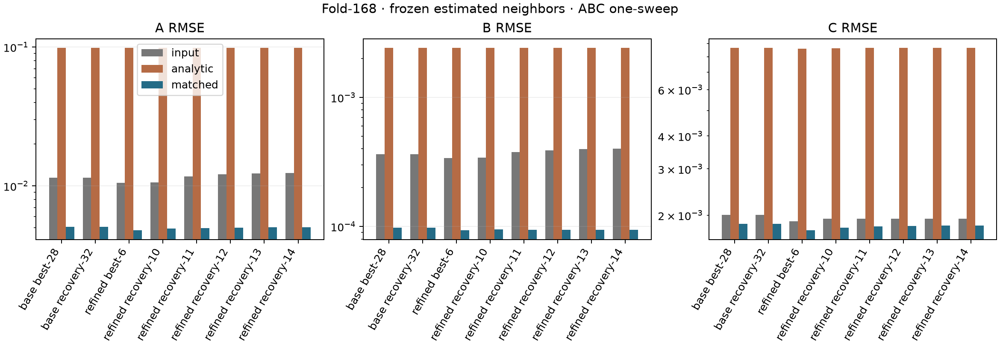
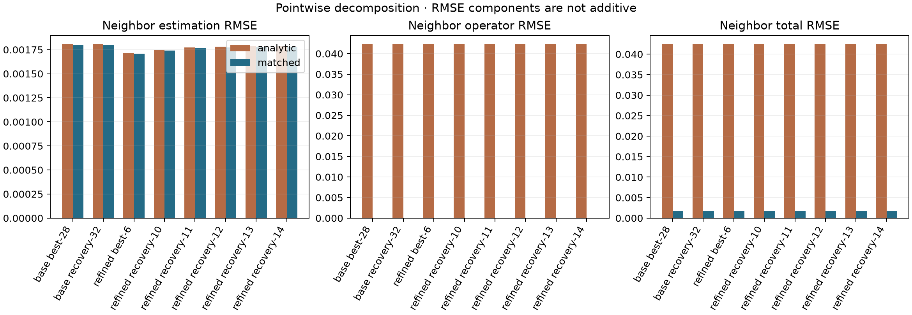
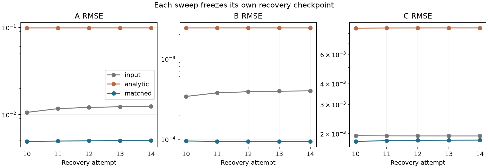

# Estimated-neighbor paired one-sweep 實驗

日期：2026-09-16。基準為 `90323eb4` 加本輪 testing-only 實驗；完整來源與執行檔雜湊見各 run provenance。

## 結論

**在八個實際 checkpoint 的估計鄰居下，matched ABC 的 A／B／C RMSE 均優於 paired analytic，
也均優於輸入 checkpoint。** 相對 analytic 的 RMSE 改善倍數為 A `19.48～20.65`、
B `24.66～26.00`、C `4.66～4.91`；相對輸入的 RMSE 降幅分別為 `53.6～59.4%`、
`72.0～76.4%`、`5.6～7.8%`。

因此 observation matching 的優勢沒有因估計鄰居而消失，但前次 truth-neighbor 的約六個數量級優勢
已縮小成上述倍數。殘餘的 matched 鄰居誤差約 `0.0017～0.0018`，C 的逐原子改善尤其不一致。
本輪支持進入 testing-only 的完整 matched operator 實驗；下一輪應把鄰居耦合與 C 的聯合更新列為重點，
不預期直接重複本輪凍結 sweep 就能收斂。

## 問題與輸入

本輪解除 [前次 observation-matched 實驗](observation-matched-prediction-experiment.md) 的 truth-neighbor 條件，
比較實際 checkpoint 中的估計鄰居，對 analytic／matched raw least-squares 局部擬合的影響。
不執行完整 peeling、joint offsets、recovery trials 或 production 更新。

| State ID | 來源 run | 參數／context 語義 |
| --- | --- | --- |
| baseline-best-28 | endpoint-refinement/baseline-run | best-28 參數，final attempt 32 certification context |
| baseline-recovery-32 | 同上 | attempt 32 recovery-current |
| failed-only-best-6 | endpoint-refinement/failed-only-audit | best-6 參數，final attempt 14 certification context |
| failed-only-recovery-10～14 | 同上 | 五個各自獨立的 recovery-current |

Final 不是 best iteration 當時的完整歷史 context。每個 state 的 ID、phase、attempt、best iteration、
原始 context 路徑與 SHA-256 都列入 state index，即使部分參數相同也不合併。
Runner 將八份 context 的 hash 固定為前次保存的證據，核對 final capture 與既有保存結果的 A/B/C。

CIF／map／manifest 的 SHA-256 分別為
`156d35aa326f0d4408d726a999329d2ffede775489aeaa5d99a2cc9b9f663cab`、
`cc9e76f94aa524b0f444bd8120ebe1adc3c364d4a277e9d805e0088677dc0a8c`、
`b9c882e41f4ee6349ed988861d4e63a078349da9a21bbc3560cae4d4deba7de1`。
八個 state 均有完整 168 原子、相同身分、採樣座標與逐點 observations。
每原子 200 點，中心距離不超過 1 Å 的 100 點供 AB 使用。

## 方法與隔離

每個 target 使用 context 的 `state` 中其他原子的估計 A/B/C，整輪凍結；不讀取
`background_models`、`background_response` 或 log-MDPDE adjusted response。
每個原子的結果另存，不回填後續 target，analytic／matched 也不串接。

| 組別 | 自由參數 | 固定參數 | 樣本 |
| --- | --- | --- | ---: |
| ABC 主分析 | A、B、C | 估計鄰居 | 全部 200 點 |
| AB 診斷 | A、B | 估計鄰居、目標 checkpoint C | 中心 100 點 |

合計 8 states × 168 atoms × 2 prediction modes × 2 fit types = **5,376 fits**。
兩個模式各自在同一 prediction contract 下計算 self 與 neighbors，使用相同 raw LS 與既有 profile solver。
Matched 保留生成 voxel 座標、讀回插值幾何、64-slot cubic stencil、負係數、clamp 與 generator support。
Contributor 從全部其他原子依 voxel support 判定，不使用 sample-center 的 production 鄰居清單截斷。
Float32 rounding 僅用於 forward checks；擬合使用 double prediction。

AB 固定的是 checkpoint C，charge basis 仍隨 B 更新。兩組都不依 response 正負或 selected flag 刪點。
維持 B 範圍 `[0.1,2.0] Å`、129 點 QR primary／257 點 SVD reference、Brent 128 次預算、A 非負、C 可正可負，
stationarity `<=1e-8`、reference 尺度化參數差 `<=1e-6` 及原有 rank／boundary／budget／ambiguity 分型。
Fit API 不接受 target 自由參數真值；truth 只在獨立 forward control 與事後 scoring 使用。

## 指標與解讀

每個 state／fit type 分開保存輸入、analytic、matched 的參數 bias／RMSE／p99／最大絕對誤差，
以及 analytic→matched、input→analytic、input→matched 的逐原子配對。
改善需超過相關 primary/reference 差異之和；未合格 pair 不計作已驗證改善。
所有 168 個原子保留在分母，缺值另外計數，不將部分可評分結果稱為完整母體 RMSE。
AB 的 C 只列固定值誤差，不列擬合改善。

Neighbor subtraction 的共同參照是 matched truth-neighbor prediction，逐點分解為：

\[
N_m(S)-N_{\mathrm{matched}}(S^\star)
=\left[N_m(S)-N_m(S^\star)\right]
+\left[N_m(S^\star)-N_{\mathrm{matched}}(S^\star)\right].
\]

右側依序是同模式的鄰居估計誤差及 truth-neighbor prediction 的模式差異。
各項另算 RMSE，不能直接相加 RMSE；兩項可能相互抵消。
保留全部逐點數值、signal／tail、cutoff-crossing／smooth-stencil、map-boundary／interior 分組，
逐原子摘要、serial 100 與每個 state 各參數最嚴重的五個 ABC analytic→matched 退步案例。

Conditional loss 是固定其他原子時的局部 loss；一次凍結 sweep 的局部 loss 下降，不保證
將所有 fitted targets 同時組合後的全系統 objective 下降。本輪不評估 production fixed point 或收斂。
八份 checkpoints 與 168 原子也不是獨立蛋白或獨立模擬資料集。

## 實際結果

### ABC：主要配對比較

以下均為 168 原子的 RMSE，B 單位為 Å；各原子的完整 identity、估計、誤差與 solver 證據另存。

| State | 輸入 A／B／C | Analytic A／B／C | Matched A／B／C |
| --- | --- | --- | --- |
| baseline best-28 | 0.01143769 / 0.000364241 / 0.002004025 | 0.09871792 / 0.002424129 / 0.008653401 | 0.005068844 / 0.000098308 / 0.001856601 |
| baseline recovery-32 | 0.01143630 / 0.000364213 / 0.002004091 | 0.09871715 / 0.002424125 / 0.008653168 | 0.005067386 / 0.000098289 / 0.001856458 |
| failed-only best-6 | 0.01052020 / 0.000340425 / 0.001899537 | 0.09869899 / 0.002425598 / 0.008591367 | 0.004779215 / 0.000093308 / 0.001750945 |
| failed-only recovery-10 | 0.01059516 / 0.000341134 / 0.001941777 | 0.09871888 / 0.002425199 / 0.008622387 | 0.004914336 / 0.000095367 / 0.001795688 |
| failed-only recovery-11 | 0.01170092 / 0.000378232 / 0.001939331 | 0.09878582 / 0.002425578 / 0.008648391 | 0.004962465 / 0.000094062 / 0.001816492 |
| failed-only recovery-12 | 0.01208879 / 0.000390379 / 0.001938501 | 0.09880453 / 0.002425744 / 0.008654300 | 0.004999019 / 0.000094097 / 0.001823525 |
| failed-only recovery-13 | 0.01229441 / 0.000396741 / 0.001938080 | 0.09881409 / 0.002425834 / 0.008657196 | 0.005019869 / 0.000094159 / 0.001827232 |
| failed-only recovery-14 | 0.01239978 / 0.000399985 / 0.001937872 | 0.09881891 / 0.002425881 / 0.008658631 | 0.005030866 / 0.000094200 / 0.001829130 |



每個 state 的 analytic→matched 改善原子數為 A `164/168`、B `164～165/168`、C `145～147/168`。
所有這些分類均超過 primary/reference 數值差異，沒有 unresolved pair。
相對輸入時，A 改善 `125～131/168`、B `139～143/168`、C `92～98/168`；
**C 每個 state 仍有 70～76 個原子退步**。全體 RMSE 改善不能替代逐原子檢查。

Analytic raw-LS 的 RMSE 高於輸入；既有 production state 使用不同 loss／更新流程。
本輪因果比較是同 loss／samples／solver 的 analytic→matched，不把 production 與 raw-LS 當成等價估計器。

### AB：固定估計 C 的診斷

| State | Analytic A／B RMSE | Matched A／B RMSE |
| --- | --- | --- |
| baseline best-28 | 0.05193826 / 0.001762118 | 0.007742226 / 0.000137939 |
| failed-only best-6 | 0.05181236 / 0.001761980 | 0.007241175 / 0.000129442 |

AB 的 C 誤差完全等於輸入，不使用 truth C。這兩個 best states 的 matched ABC 比 matched AB
具有較小 A/B RMSE，但 ABC 使用 200 點、AB 使用中心 100 點，不能僅將差異歸因於是否自由估計 C。
其餘六狀態、兩種 fit type 的逐參數統計全部保留於結果 JSON。

### 鄰居誤差與 cutoff

Baseline best-28 的 33,600 點鄰居扣除誤差為：

| Prediction | 同模式估計誤差 RMSE | 模式差異 RMSE | 對 matched truth neighbors 的總誤差 RMSE |
| --- | ---: | ---: | ---: |
| analytic | 0.001809312 | 0.042351819 | 0.042480386 |
| matched | 0.001802253 | 0（定義上相同） | 0.001802253 |

Matched 欄的模式差異為零是分解定義，不是另一次獨立 forward 驗證的結論。
獨立檢查中，float32 compact prediction 與實際 map sampler 的最大差為 `5.32907e-15`，
全部 33,600 點通過浮點容差及量化誤差傳播上界。八狀態的逐點分解共 268,800 行，
最大分解恆等式誤差為 `5.55112e-17`。

相同採樣幾何中，27,774 點跨越至少一個原子的 support cutoff，5,826 點屬平滑 stencil。
Baseline best-28 的 analytic 鄰居模式差異 RMSE 分別為 `0.0465824` 與 `0.000149934`；
matched 的鄰居估計誤差則為 `0.00185547` 與 `0.00152320`。
因此修正最大的部分仍集中於 hard cutoff 附近，而修正後在平滑區也留下真實的估計鄰居誤差。
這些結果仍限於當前 generator support，不能外推到不同 cutoff 或真實 cryo-EM map。



### Recovery 與具體退步案例

Failed-only recovery-10→14 的 matched 鄰居誤差由 `0.00174146` 增至 `0.00178249`；
對應 sweep 的 A RMSE 由 `0.00491434` 增至 `0.00503087`，C 由 `0.00179569` 增至 `0.00182913`。
B 在 attempt 11 降低後略增。原 recovery 軌跡的 nominal residual 下降，
不表示其 checkpoint 的鄰居或本輪 matched 局部參數準確性也單調改善。



Baseline best-28 的代表性 analytic→matched 退步（signed parameter error）如下：

| Serial／原子 | 參數 | Analytic error | Matched error |
| --- | --- | ---: | ---: |
| 120／A GLN 13 CD | A | -0.00157043 | -0.00879392 |
| 90／A TYR 10 CZ | A | 0.000227973 | -0.00731448 |
| 53／A GLU 6 CB | A | -0.0184775 | -0.0212178 |
| 29／A ARG 3 NH1 | B | 0.0000326706 | -0.000124231 |
| 28／A ARG 3 CZ | C | -0.00191878 | 0.00497940 |

既有 blocker **serial 100／A TRP 11 NE1** 在八個 state 的 ABC A/B/C analytic→matched 配對全部改善。
Baseline best-28 的三項 signed errors 從 `[-0.0300040,-0.00111627,0.00311771]`
降至 `[-0.000541193,0.00000125102,0.000178803]`。
這是新 raw-LS 局部問題的結果，並不表示原 MDPDE solver blocker 或 production certificate 被修復。

## 下一步

建議進入獨立 testing-only 的完整 matched operator，讓 neighbor subtraction、local fitting、
joint offset、objective、nominal evaluation 與 certificate 共享同一 prediction contract。
本輪已支持 estimated-neighbor 下的整體準確性收益；但 C 的小幅整體改善、大量逐原子退步與
recovery 沿途的誤差增加，要求下一輪優先量測鄰居耦合及 joint/component update，
並保留一致 objective 下的接受與收斂檢查。不要將 5,376 個合格局部解當作完整 operator 合格，
也不要把重複 Jacobi sweep 當作已驗證的 production 替代方案。

## 驗證與工作量

全部 **5,376/5,376 fits 合格**，沒有缺值、rank deficiency、boundary、budget exhaustion 或 ambiguous minima。
最大 fresh stationarity 為 `4.36829e-9`，最大 primary/reference 尺度化參數差為 `7.90947e-8`，
最大 column-normalized Jacobian condition number 約 `18.48`。全部 conditional loss 不高於各自輸入 loss。
這些數字支持本輪局部求解可靠，但不是全系統 coupling conditioning 或全域唯一解證明。

- j1／j4 各完整執行一次；5,376 fits 的參數、資格、profiles、minima、工作量、268,800 行逐點分解與
  所有科學摘要完全一致，僅排除 elapsed time。
- 437 項相關 C++ tests 通過，包括兩項新增 frozen-neighbor 測試與既有精確 solver replay；提供實際
  capture 路徑，沒有 skip。另有 3 項文件結構／Markdown 連結 tests 通過。
- 8 項新增 Python tests、6 項 observation-matching、3 項 endpoint、2 項 MDPDE、19 項 fold scorer tests 通過。
- 原 truth-neighbor 完整 2,928 fits 與 forward cases 重跑，與前次保存結果完全一致（排除時間）。
- `BUILD_TESTING=OFF` production target 建置通過，CLI 與 library 均未含新增 sweep 函式。
- `lint_repo`、Markdown 連結與 whitespace 檢查通過；兩個完整 run 的各 1,365 份 artifact 雜湊重新核對一致。

j4／j1 的 executable wall time 分別為 **74.86／216.16 秒**，包含準備、forward checks、求解與檔案輸出。
各 fit elapsed time 的 j4 總和為 analytic `7.45 秒`、matched `260.52 秒`；平行 worker 時間總和不等於 wall time。
Analytic／matched 的 primary profile evaluations 為 `371,498／370,531`，reference 為 `715,240／716,096`。
本輪沿用既有 kernel，未做 production 性能最佳化，也不以這些時間保證 production 成本。

版本化交付為 [結果與驗證索引](figures/estimated-neighbor-sweep/results.json)、
[5,376 fits 的逐原子表](figures/estimated-neighbor-sweep/fits.csv)、
[逐原子鄰居誤差](figures/estimated-neighbor-sweep/neighbor-atoms.csv)，以及上列 PNG／PDF 圖表。
完整 `build/estimated-neighbor-sweep/final-j4`／`final-j1` 保存所有 profiles／minima、20,160 筆逐參數配對、
逐點 CSV、state index、truth scorer 輸入、source／binary／input hashes 與 artifact index。
另保留 truth-neighbor regression run、thread comparison、production isolation 與測試紀錄。
這些 build 目錄未納入版本控制，版本化 JSON 記錄其證據索引雜湊；應另行備份。

## 重跑

使用 Release／SYSTEM／OpenMP、`BUILD_TESTING=ON`、audit ON、UMAP／Python bindings OFF 建置
`mdpde_experiment` 與 `rhbm_tests`。`MODEL`、`MAP` 指向上述固定輸入；下列來源目錄是既有保存資料。

```sh
python3 tests/integration/estimated_neighbor_sweep.py run \
  --executable build/observation-matching/on/bin/mdpde_experiment \
  --model "$MODEL" --map "$MAP" --manifest "$MAP.simulation.json" \
  --baseline-run build/endpoint-refinement/baseline-run \
  --refined-run build/endpoint-refinement/failed-only-audit \
  --output build/estimated-neighbor-sweep/new-j4 --jobs 4

# 使用新的 output 目錄，以 --jobs 1 再執行一次。
python3 tests/integration/estimated_neighbor_sweep.py compare \
  --left build/estimated-neighbor-sweep/new-j4 \
  --right build/estimated-neighbor-sweep/new-j1 \
  --output build/estimated-neighbor-sweep/new-thread-comparison.json

# 使用已安裝 Matplotlib 的 Python 環境。
python3 tests/integration/estimated_neighbor_sweep.py plots \
  build/estimated-neighbor-sweep/new-j4 \
  --output build/estimated-neighbor-sweep/new-figures
```

Runner 拒絕覆寫 output，執行前後核對 source／binary／inputs，缺件或不一致時停止。
Matched 未改善或 fit 未合格會保留為科學結果，不因結果調整數值門檻。
原 truth-neighbor runner、正式 CLI／公開 C++ API、資料庫 schema、production solver／policy／quality gate 均不變。
