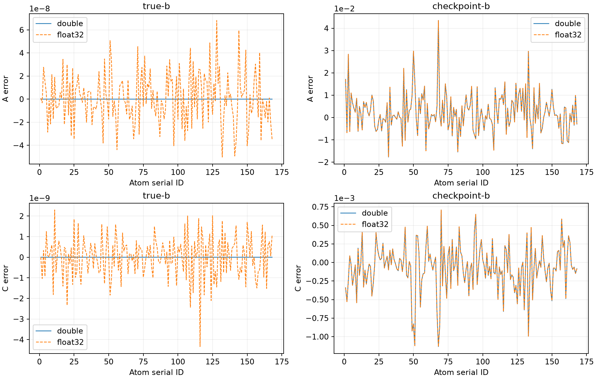

# 固定 B 的 oracle／quantization 控制實驗

本輪以 Experiment B 的 2.5 Å unique voxel union 為主線，只做 alpha=0、A≥0、C 不限符號的完整 168 原子 joint A/C least squares。四格正式實驗皆數值合格，true-B＋double 通過參數恢復；四格獨立重跑的科學輸出完全相同。

**在這份 noiseless fixture 中，剩餘 A/C 誤差主要來自固定 checkpoint B 的偏差。** 正確 B 下，float32 的 A 參數誤差約為 2.2e-8；使用 checkpoint B 後約為 9.17e-3。這支持下一輪使用同一粗網格、固定 ROI 的 alpha=0 joint A/C/B profile experiment，尚不代表 B 的可識別性或非線性求解器已驗證。

## 四格結果

| Case | A RMSE | C RMSE | Voxel residual RMSE | A／C 絕對誤差<0.01 | Qualified |
| --- | ---: | ---: | ---: | --- | --- |
| true-b-double | 3.4109075e-14 | 2.7438738e-15 | 2.9746493e-15 | 168/168；168/168 | 是 |
| true-b-float32 | 2.1927939e-8 | 1.0115744e-9 | 1.5216388e-8 | 168/168；168/168 | 是 |
| checkpoint-b-double | 0.0091668425 | 0.00032297938 | 0.00040415319 | 129/168；168/168 | 是 |
| checkpoint-b-float32 | 0.0091668426 | 0.00032297936 | 0.00040415316 | 129/168；168/168 | 是 |

True-B＋double 的最大尺度化 A/C 誤差為 **1.5987e-14**，relative residual 為 **4.9139e-15**。四例 projected KKT 最大為 **1.5821e-15**；QR／獨立 TSQR-SVD 的最大尺度化係數差不超過 **2.5659e-14**。所有 A 均位於非負約束內部。

兩個 design 均為 rank 336。欄正規化 condition number 分別為 true-B **8.2599373**、checkpoint-B **8.2599357**；最小奇異值約 **0.27568**。此處只能評估固定 B 的 A/C design，不能由此認定完整 A/C/B 可識別。



## 誤差來源

以下先計算逐係數向量差，再彙整 RMSE，沒有相減兩個 RMSE 當成貢獻量。

| 向量對照 | A 差值 RMSE | C 差值 RMSE |
| --- | ---: | ---: |
| Oracle recovery：true-B double − truth | 3.4109075e-14 | 2.7438738e-15 |
| Quantization：true-B float32 − double | 2.1927942e-8 | 1.0115742e-9 |
| Width：checkpoint-B double − true-B double | 0.0091668425 | 0.00032297938 |
| Quantization：checkpoint-B float32 − double | 2.1933366e-8 | 1.0116607e-9 |
| Interaction：兩組 quantization 向量之差 | 2.1871162e-11 | 1.0883436e-12 |

對每個差值，使用兩端 QR/SVD 係數差的絕對值總和作為經驗數值解析度；interaction 使用四端總和。兩組 quantization 的全部 A/C 差值均超過此解析度；interaction 有 5 個 A、1 個 C 未解析。這是數值比較指標，不是嚴格的浮點誤差上界、統計標準誤或信賴區間。

Checkpoint B 的 RMSE 為 0.0003642412、最大誤差 0.0017682695 Å，範圍為 0.4992870702–0.5017682695 Å。其 A 最大誤差約 0.04349，仍有 39/168 原子的 A 絕對誤差不小於 0.01。較好的平均 RMSE 不等於每個原子均達標。

Float32 觀測量化差的 RMSE 為 1.5322883e-8、最大絕對值為 2.3298826e-7；儲存帶正負號的差值，不把量化當成額外獨立 Gaussian noise。

## 資料、求解與資格契約

- 使用 `sim_map_gaus_grid0.30_charge1_bw0.50.map` 及其 manifest；model 為 `fold_test_model_0.cif`。輸入內容由獨立 fixture hashes 鎖定，原檔名只作 provenance。
- Grid 為 82×125×67，生成 spacing 為 0.3 Å，origin 為 (-12.6,-16.8,-12)。聯集共有 **139,551** unique voxels、407,237 次球覆蓋；coverage 僅供核對，不重複計權。原子、位置、kernel 與舊 0.10 Å fixture 一致，grid origin 也隨新 map 改變。
- ROI 與 basis 都用 manifest 生成座標，不以 float32 header 幾何替代。C++ 與 Python 分別重建完整 voxel IDs、coverage、nearest distance；負值與零值保留。
- Double observations 來自既有 simulation generator，以 manifest preparation order、單執行緒重新生成，沒有用待驗證的 X 乘 truth 建立 observations。全部 ROI 均須滿足 `float32(reference_double)==map_value`，Python 另讀 map bytes 核對。
- 沿用 `baseline-best-28` 的 checkpoint B，按原子完整身分配對並逐位保留。舊 samples、responses、A/C、alpha 與 background 不進入 fitting。
- 每個 B source 建一次 sparse X，double／float32 共用。所有非零 basis 保留；沒有 intercept、ridge、charge-sum constraint、B 搜尋或 component 切割。
- 主解使用既有 1,024-row Householder reduction＋SparseQR；reference 由原始 rows 重新作 8,192-row 全欄 TSQR＋SVD，不共用主解 R，不形成 normal equations。
- 求解目標為 `0.5*RSS`。`RSS/N` 僅為描述性 residual scale，允許為零，不套用 MDPDE 的正 variance／exact-fit-boundary 資格。

令 `D_jj=||X_j||₂`、`s=max(1,||y||₂)`、`Z=XD⁻¹`、`u=Dβ/s`。Projected KKT 定義為 `||u−Π_C(u−Zᵀ(Zu−y/s))||∞`，其中 C 只限制 A≥0。主解與 reference 均須有限、可行且 KKT≤1e-10；最大尺度化係數差 `|β−βref|/(1+max(|β|,|βref|))` 須≤1e-10。

Rank 以原始 N 計算相對門檻 `epsilon*max(N,p)`，要求完整 rank 336。True-B double 另外要求對 truth 的同一定義尺度化係數差≤1e-10，以及 `||r||₂/max(1,||y||₂)≤1e-12`。所有門檻事前固定；數值資格、oracle recovery 與 execution completion 分開儲存。

所有 objective／residual／KKT 回原始 rows 計算。Python 以獨立解析 columns 重算 prediction 與 KKT，並核對逐 voxel residual CSV 的全部統計；p99 使用絕對誤差 nearest-rank 分位數。

## 驗證與資源

- 121 項相關 C++ tests、61 項 Python tests（8 個 CTest 群組）通過；包含新增的 4 項 C++、9 項 runner tests。
- Repository lint 通過；BUILD_TESTING=OFF 的 production library 建置通過，沒有 experiment/test targets 或 fixed-B symbols。
- 全部 139,551 voxels 的 forward、量化、集合及獨立 Python 核對通過；generator 與解析模型最大 double 差為 1.3323e-15，量化後 map 差為零。
- 正式 C++ 執行 13.15 秒、peak RSS 211.09 MiB；獨立重跑 12.73 秒、peak RSS 175.58 MiB。Python 全量核對另計；各階段時間保存在原始產物。
- 兩次執行前後 source、binary 與 inputs hashes 均一致。來源是以 `65aa1952` 為基底的本輪工作樹，新增程式以 provenance 中的 source hashes 辨識。
- 四例 JSON 科學欄位與 CSV bytes 完全重現；只排除時間、資源與執行目錄。

## 重跑與產物

使用既有 Release／SYSTEM、BUILD_TESTING=ON 的實驗建置。Python runner 需要 NumPy；繪圖另需 Matplotlib。以下 `SIMULATION_DIR` 指向使用者的 simulation 目錄。

```sh
cmake --build build/observation-matching/on --target mdpde_experiment rhbm_tests -j 4

python3 tests/integration/fixed_b_oracle.py run \
  --executable build/observation-matching/on/bin/mdpde_experiment \
  --model "$SIMULATION_DIR/fold_test_model_0.cif" \
  --map "$SIMULATION_DIR/sim_map_gaus_grid0.30_charge1_bw0.50.map" \
  --manifest "$SIMULATION_DIR/sim_map_gaus_grid0.30_charge1_bw0.50.map.simulation.json" \
  --checkpoint build/endpoint-refinement/baseline-run/solver-failures/contexts/final-32-33.json \
  --output build/fixed-b-oracle/new-formal

# 使用相同輸入及全新 --output，再獨立執行四例。
python3 tests/integration/fixed_b_oracle.py compare \
  --left build/fixed-b-oracle/final --right build/fixed-b-oracle/repeat \
  --output build/fixed-b-oracle/reproducibility.json

python3 tests/integration/fixed_b_oracle.py summarize build/fixed-b-oracle/final
python3 tests/integration/fixed_b_oracle.py plots build/fixed-b-oracle/final \
  --output build/fixed-b-oracle/figures
```

Testing executable 子命令為 `fixed-b-oracle MANIFEST MAP CHECKPOINT OUTPUT`。固定四例與 alpha=0，沒有新增 production API、CLI、schema 或 Python binding。Runner 拒絕覆寫；中止／technical failure 保留已完成案例，數值不合格不偽裝成 technical failure。

完整 raw 資料在 `build/fixed-b-oracle/final` 與 `build/fixed-b-oracle/repeat`，沒有納入版本控制，需另外備份。版本化交付：

- [結果 JSON](figures/fixed-b-oracle/results.json)、[四格比較 CSV](figures/fixed-b-oracle/comparison.csv)、[逐原子估計](figures/fixed-b-oracle/estimates.csv)、[誤差向量分解](figures/fixed-b-oracle/decomposition.csv)。
- [重現性比對](figures/fixed-b-oracle/reproducibility.json)、[驗證摘要](figures/fixed-b-oracle/validation.json)、[來源與執行檔](figures/fixed-b-oracle/provenance.json)、[輸入 hashes](figures/fixed-b-oracle/input-hashes.json)。
- [完整 raw 索引](figures/fixed-b-oracle/raw-artifact-index.json)、[公開產物 hashes](figures/fixed-b-oracle/artifact-index.json)、[參數誤差 PDF](figures/fixed-b-oracle/parameter-errors.pdf)。

舊 0.10 Å 結果僅作背景；本輪不把新舊結果差異歸因為單獨的 spacing effect。下一輪須另外處理 B 的 projected sensitivity、外層 stationarity 及多起點，不能沿用本輪固定 B certificate 當作完整 joint convergence。
