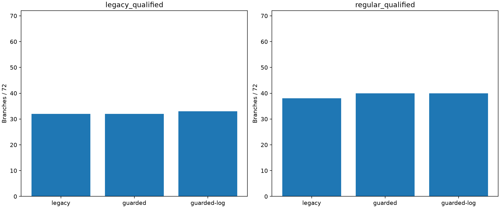
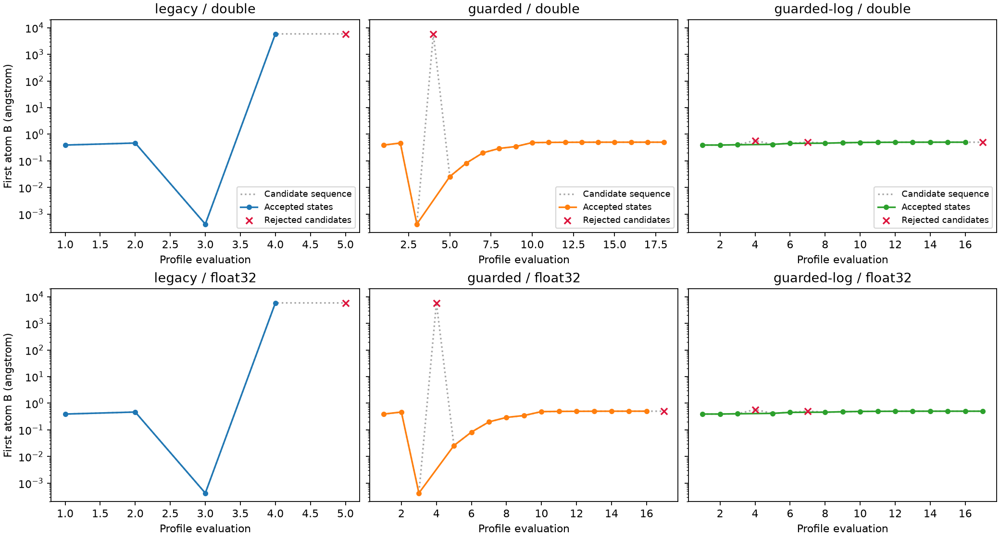
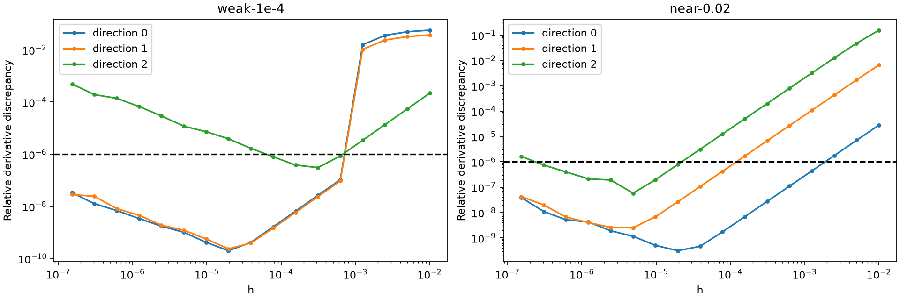
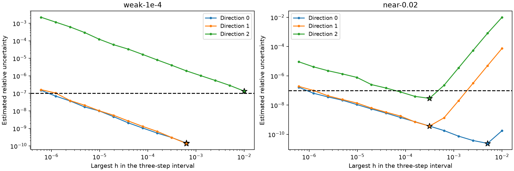
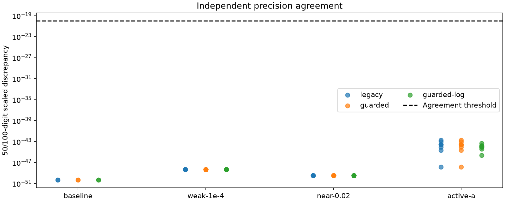
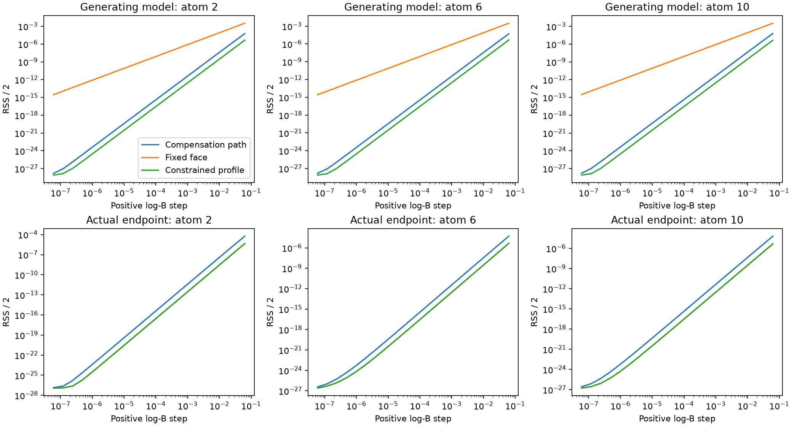

# Joint-ABC certification and difficult-case stabilization

The paired experiment preserves the equal-weight least-squares objective and the frozen `ecf55f45` coverage inputs. It separates numerical optimality, derivative evidence, local identifiability and simulation truth recovery. Production changes are limited to simulation metadata and its explicit arithmetic contract; the solver, instrumented LM adapter and multiprecision audits remain testing-only.

The two guarded variants recover the previously pathological `near-0.02/narrower` branches within the original search budget. All 72 Legacy branches reproduce their frozen numerical records, including the original 32 qualified branches and failures. Neither guarded variant regresses those 32 branches. Weak-signal and boundary difficulties remain visible rather than being converted into generic success.

| Search version | Original `joint_qualified` | Regular certificate v2 |
|---|---:|---:|
| Legacy | 32 / 72 | 38 / 72 |
| Guarded | 32 / 72 | 40 / 72 |
| Guarded-log | 33 / 72 | 40 / 72 |

The six additional Legacy certificates are the recovered `near-0.02` endpoints whose derivative evidence is now resolved. Each guarded variant adds the two repaired narrower endpoints. Guarded-log's additional legacy-qualified `weak-1e-4/mixed-float32` branch does **not** pass the complete new step-selection evidence, so it does not receive a regular certificate.

## Contract and implementation

The [versioned contract](joint_abc_certification_contract.md) specifies input identity, width policy, observation snapshots, search validity, certificate checks, independent reference calculations and accounting. The nine datasets use one first-stage MDPDE B initialization each; its values are shared across both precisions and all three search versions. No truth value participates in search, step selection or representative selection.

Simulation manifest v2 records per-atom Gaussian and charge widths from the same decision function used by the generator. The supplied 168-atom map regenerates byte-for-byte, with O/N/other widths 0.40/0.45/0.50 Å. Its domain remains 139,551 rows and 407,237 memberships. The `near-0.10` domain remains 7,243 rows and 29,595 memberships. Coordinates and squared distances use the documented FMA order; support membership retains the exact cutoff comparison.

The original manifests, maps, uniform-width fixture and coverage report are unchanged. Known v1 inputs require their frozen hash contract; unknown v1 inputs are rejected. Historical readers that assume uniform widths explicitly reject v2.

An additional Release-compiled replay compares the original distance loop with the explicit FMA implementation for every atom/voxel pair in all nine datasets. Both runs have zero membership, squared-distance or contributor-CSR differences. This checks the complete domain, including the sensitive `near-0.10` boundary, rather than relying only on equal membership counts.

## Pathological search and its repair

The Legacy narrower trajectory first loses width sensitivity at trial 3, where the first width falls to approximately 0.000419 Å. Trial 4 then proposes and accepts approximately 5,852 Å. Independent reference/replay evidence becomes invalid at this acceptance, with a cancellation ratio around 2.44 million. Trial 5 stops on an inner KKT failure. Full numerical rank at the earlier point does not establish trustworthy evaluation at the later one.

Guarded retains the original LM scaling and rejects the untrusted fourth trial before it can replace accepted parameters, residual or Jacobian. It shrinks the trust radius by four and recovers. Guarded-log uses the same validity gates with the identity metric in log-B space; these narrower runs do not propose an untrusted candidate. Neither method clips widths or imposes new bounds.

| Version | Double profile evaluations | Float32 profile evaluations | Narrower outcome |
|---|---:|---:|---|
| Legacy | 5 | 5 | Untrusted acceptance, then inner KKT failure |
| Guarded | 18 | 17 | Recovered within budget |
| Guarded-log | 17 | 17 | Recovered within budget |

Both guarded variants reach approximately 0.50 Å in double and 0.500000092 Å in float32 for the first atom. Independent raw-row replay verifies every accepted guarded state. The accepted-state cancellation ratio in these runs stays below 2.34. Recovery, termination and certificate qualification are recorded separately.

## What the endpoint audits establish

The six previously recovered `near-0.02` endpoints acquire trustworthy derivative evidence from an independently selected Richardson interval and a 50/100-digit reference. Their high-precision local corrections also pass the unchanged threshold. Thus the old two-step derivative test had insufficient resolution for these endpoints.

The frozen `weak-1e-4` endpoints remain resolution-limited under the stronger derivative audit. Three float32 endpoints also fail the independently computed local-correction threshold; a derivative diagnosis alone would have hidden this second issue. The 50/100-digit references agree, so their agreement is not itself a stationarity certificate.

The step plots below show the Legacy first-stage double endpoint for each dataset; complete ladders for every audited endpoint are retained in the record bundle. The precision plot includes all registered endpoints.

The 1e-6 line in the first plot is only the derivative-agreement threshold. A visually close raw central difference is insufficient: the independently selected interval must also have estimated uncertainty at most 1e-7 and both Richardson extrapolations must pass. Stars in the second plot show the selected intervals using only truncation/noise estimates, without inspecting truth or analytic agreement.

The `active-a` cases retain exact active sets, small positive A values, slack, dual gradients and complementarity. Fixed-face derivatives, feasible positive compensation directions and re-constrained profiles are distinct evidence. Some endpoints have very small residuals but substantial high-precision local corrections. Cross-face or one-sided evidence does not establish a regular certificate.

At generating truth, the smallest-step prediction slopes are about 1.99999994 for all three compensation directions. The actual near-zero branch leaves first-order norms of approximately 9.4×10⁻³² to 3.7×10⁻³¹ on these stored coordinates; they are retained explicitly, rather than claiming an exactly flat analytic direction for every kernel row. At the first-stage double endpoint the corresponding slopes are about 1.81, 1.25 and 1.33, because its fitted A values are small positive numbers. These differences explain why a fixed-face rank check alone does not settle boundary regularity.

The zero-signal and duplicate controls retain generating-model rank and flat-direction evidence separately from endpoint numerical rank. Quantization can perturb an endpoint into full numerical rank without making the generating model identifiable. Truth recovery of intrinsically unidentifiable individual parameters is not an acceptance requirement.

## Limits on the next experiment

The narrower failures no longer prevent testing exact-component equivalence with a trustworthy search path. The next experiment should compare monolithic and exactly decomposed objectives, predictions and valid local derivatives on the same immutable snapshot, then compare certificates and identifiable parameter combinations. It must preserve the separate failure states introduced here.

Construct connectivity from shared contributor rows in the saved CSR. Numerical underflow or a fitted zero coefficient must not silently remove a structural edge. Preserve the global observation scaling and explicitly compare rank thresholds: changing matrix dimensions or normalizing each component separately can change a certificate even when the summed objective is algebraically identical.

Weak-signal derivative resolution, boundary nonregularity and structural nonidentifiability remain limitations on parameter-level equivalence claims. A decomposition experiment should not require those controls to become regular-qualified, nor hide discrepancies by selecting a branch using truth error. Production fitting integration and memory restructuring remain outside this change.

## Reproduction and deliverables

All acceptance gates in [scientific-validation.json](figures/joint-abc-certification/scientific-validation.json) pass. The two fresh search matrices and independently computed audits have **1,724 identical scientific JSON/CSV files** after the specified exclusions; the [repeat record](figures/joint-abc-certification/reproducibility.json) includes a hash of the scientific file catalog. Failures are included in that comparison.

Engineering validation includes 65 related C++ tests, 19 simulation/charge tests with OpenMP disabled, 28 Python joint-estimator tests and all 12 Python runner suites. The final audit-scope correction additionally passes the eight certification C++ tests. Lint, the production build and inspection for accidental experiment/high-precision linkage pass. The [engineering record](figures/joint-abc-certification/engineering-validation.json) and [v2 map-equivalence record](figures/joint-abc-certification/manifest-v2-validation.json) retain the checks.

| Run | 216 searches | Original endpoint audit | Targeted audit correction | Search peak RSS | Native audit peak RSS |
|---|---:|---:|---:|---:|---:|
| First | 1,660.74 s | 3,557.67 s | 61.01 s | 1.206 GB | 0.998 GB |
| Repeat | 1,717.27 s | 1,217.62 s | 60.99 s | 1.203 GB | 0.999 GB |

The audit elapsed times reflect different orchestration and overlapping machine load; they are not a controlled speed benchmark. Peak RSS is per process, and the repeat's aggregate concurrent memory was not measured. The per-case [phase costs](figures/joint-abc-certification/phase-costs.csv) separate initialization, search, included reference time, endpoint audits and included precision time; nested timings must not be added twice.

The reviewable artifacts are:

- [Failure matrix](figures/joint-abc-certification/failure-matrix.csv) and [every numerical check with its evidence source](figures/joint-abc-certification/failure-matrix-evidence.csv).
- [Per-atom estimates](figures/joint-abc-certification/estimates.csv), [fixed-B comparisons](figures/joint-abc-certification/fixed-b-comparison.csv), [multi-start comparisons](figures/joint-abc-certification/multistart.csv) and [separate representative selections](figures/joint-abc-certification/representatives.csv).
- [Complete scientific record archive](figures/joint-abc-certification/scientific-records.tar.gz), including every fit/trace/audit and one frozen observation/contributor snapshot per dataset. Redundant residual tables remain in the raw run directories and can be regenerated from the retained rows and coefficients; their hashes are in the [raw inventory](figures/joint-abc-certification/raw-artifact-index.json).
- [Frozen endpoint diagnostics before search changes](figures/joint-abc-certification/frozen-diagnostics/frozen-endpoint-records.tar.gz), [boundary summary](figures/joint-abc-certification/boundary-summary.csv), [trajectory replay](figures/joint-abc-certification/trajectory-audit.json), and [domain equivalence](figures/joint-abc-certification/domain-equivalence.json).
- [Input hashes](figures/joint-abc-certification/input-hashes.json), [search source/build hashes](figures/joint-abc-certification/provenance.json), [final audit hashes](figures/joint-abc-certification/audit-provenance.json) and the [delivered artifact inventory](figures/joint-abc-certification/artifact-index.json).

The testing commands and independent Python runner are documented in the contract. Complete raw runs remain under `build/joint-abc-certification/`; the versioned result bundle under `figures/joint-abc-certification/` preserves the scientific records, frozen-domain rows, input/source hashes, diagnostics and figures. Resource records distinguish initialization, search, reference solves and endpoint audits. Process peak RSS is a high-water mark, not an isolated allocation measurement for each phase.

The two 216-search matrices were frozen before one audit-only scope correction: the full ladder is mandatory for every registered precision target, including seven targets that passed the legacy two-step check. Their original diagnostics are retained, and each run independently recomputes the seven corrected audits. `provenance.json` identifies the original search and audit sources; `audit-provenance.json` identifies the final targeted audit, with exact scope and before/after scientific hashes in `audit-revision.json`. The three earlier source files are preserved under `search-source/`. Search, kernels, initialization and tolerances are unchanged by this correction. A new run with the final runner performs the corrected audit directly.

The first audit runs serially. The repeated audit uses independent single-threaded processes, splitting `active-a` only after confirming that there are no cross-case endpoint-cache matches. Duplicate generating-model scans are compared exactly and their extra elapsed cost is recorded. This orchestration changes neither the numerical operations within an endpoint nor the scientific comparison criteria.

The supplementary `precision_boundary_plots.py` and `trajectory_plot.py` scripts in the artifact directory reproduce the report's precision/boundary figures and the separate accepted/rejected trajectory panels after the runner's `plots` command.
