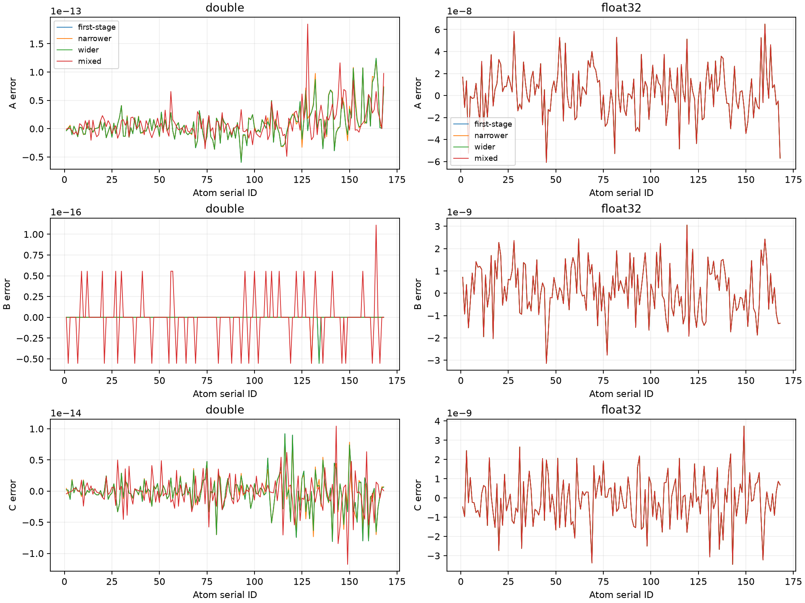
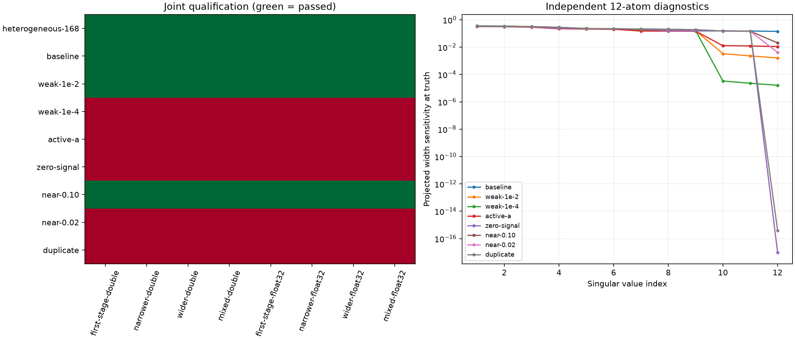

# Joint-LS 第一階段：異質 width、第一階段初始化與困難案例

本實驗沿用 joint A/C/B variable projection 與完整 profile Jacobian；alpha=0、A≥0、B>0、C 不限符號，等權 observations、固定位置、固定 2.5 Å support，沒有額外噪聲。搜尋器、200 次 profile evaluations／100 次接受更新預算及既有資格門檻保持不變。實作限於 testing executable；production API 與 fitting workflow 不變。

## 輸入與初始化

主資料是 `sim_map_gaus_grid0.30_charge1_width_bw0.50.map`、同目錄的 `.simulation.json` 與 `fold_test_model_0.cif`。原始檔案保持不變；[凍結 fixture](../../tests/benchmarks/joint_abc_coverage.json) 保存 hashes、geometry 與補充的元素 width 契約。原 manifest 的 `effective_charge_width=0.5` 不是這份 map 的逐原子真值；其 output 檔名與實際檔名不同，但 map hash 相符。

真值為 A=atomic number、C=`charge_used`；氧 30 個 B=0.40 Å、氮 29 個 B=0.45 Å、其餘 109 個 B=0.50 Å。Double observations 由目前 production generator 按 manifest 順序、單執行緒生成，float32 observations 直接讀指定 map。C++ 核對整張 map 的解析 forward 與 float32 cast，Python 另核對原始 map bytes、解析 forward 及 ROI。固定 ROI 包含 139,551 個 unique voxels、407,237 次球覆蓋；100,883 個負值 voxel 全數保留。

初始化讀取指定 float32 map，選取全部非氫原子、`InitializeFromSelection()`、原本的 `FibonacciDeterministic` sampling、`InitializeLocalFittingSeedModels()`，再依序呼叫：

```cpp
RunLocalAlphaTraining(model_object, options, FittingStage::First);
RunFixedOffsetLocalFitting(model_object, options, FittingStage::First);
```

在此停止，不進入 second stage 或 group fitting。保存所有原子的 OLS／MDPDE A/B/C、alpha、sample 數、native status、求解資格與局部診斷。只有 MDPDE B 用作非線性初始值；A/C 在首次 profile evaluation 重新求解，並與同 observations 的固定 B0 control 比對。初始 alpha 不進入 joint-LS objective。

非法 B 記為初始化失敗，所有預定分支仍有失敗紀錄，沒有 truth／checkpoint fallback。有限合法 B 即使局部求解未 qualified 仍可啟動，該警示另行保存。初值完全由資料得到，不以真值選取、裁切或修正。

## 固定實驗矩陣

每份資料各有四種起點：first-stage B0、0.8B0、1.2B0，以及 serial ID 奇數 0.8B0／偶數 1.2B0。Double 與 float32 共用同一份第一階段初值；不同資料各自重新初始化。主資料 8 例，加上 8 組合成資料各 8 例，共 72 例。另對主資料執行 true-B／first-stage-B × double／float32 四個 fixed-B controls。

合成資料是 3×2×2、間距 1.2 Å 的 12 原子模型，ID=`1+x+3y+6z`；元素循環 C/N/O，A=atomic number、B 沿用元素規則、C=奇數 +0.2／偶數 −0.2。Grid 為 33×29×29、spacing 0.30 Å、origin=(-3.6,-3.6,-3.6)。所有 observations 由獨立解析 forward 生成；float32 為逐 voxel cast。

| 資料 | 相對基準的修改 |
| --- | --- |
| baseline | 無 |
| weak-1e-2、weak-1e-4 | ID 2、6、10 的 A/C 同乘 10⁻²、10⁻⁴ |
| active-a | ID 2、6、10 設 A=0、C=+0.2 |
| zero-signal | ID 6 設 A=C=0 |
| near-0.10、near-0.02 | ID 4 移到 ID 1+(0.10,0,0)、+(0.02,0,0) Å |
| duplicate | ID 4 與 ID 1 完全同位置，true B 相同 |

「近共線」在此指 basis columns 趨近共線，由靠近的同-width atoms 建構。各資料的 ROI 由其 geometry 決定，一次求解期間固定。

本次 Release/AppleClang 的 grid 座標採融合乘加。Python 以 `math.fma(index, spacing, origin)` 獨立重建座標；接近 cutoff 的平方距離也依原本融合累加次序計算，仍嚴格使用 `r²≤6.25`，沒有 support tolerance。近重合 0.10 Å fixture 恰有邊界 voxel；若改用分開乘加，六筆 contributor memberships 會不同，總數相差二。驗證器要求座標精確一致，因此其他算術契約會明確失敗，不能默默換 observation domain。

## 資格、識別性與驗證

沿用 [joint-ABC baseline](joint-abc-profile-experiment.md) 的資格門檻：A/C projected KKT 與主解/reference 尺度化差 ≤1e-10；B gradient infinity norm ≤1e-12；未阻尼 log-B 修正 ≤1e-10；完整 design 與 width rank；方向差分 relative L2 difference ≤1e-6。方向差分固定為全同號、交錯與最弱 width 方向，各用兩種步長，共六組、12 次額外 profile evaluations。

主資料 double 另要求最大尺度化 truth error ≤1e-10、relative residual ≤1e-12；float32 每個 A/B/C 絕對誤差 <0.01；同精度四起點尺度化 A/B/C 差與最大 log-B 差 ≤1e-8。

`matrix_complete`、初始化是否合法、`execution_complete`、原始 `joint_qualified`、個別 numerical checks、endpoint rank、truth recovery、多起點一致性各自保存。缺少的檢查為 null。代表解只從 qualified 分支以最低 RSS 選取；不存在 qualified 分支時為 null。所有有效 endpoints 都保留 pairwise 比較，包括未 qualified 分支。

12 原子資料另由 Python 在 generating truth 以原始 rows 作獨立 dense SVD，保存 full design rank、free-face projected-width spectrum、norms、正規化 spectrum 與最弱方向；這些真值只用於事後診斷。zero-signal 與 duplicate 的完整參數恢復欄位為 null，不用低 residual 宣稱恢復成功。Active A 的 width 診斷只適用目前 active face；差分跨 face 時原始 `derivative-unverified` 保留。

數值失敗仍是完成的實驗結果，不會改寫成 technical execution failure；也不會因為失敗而放寬 certificate。Independent replay 使用原本的容許差。未 qualified endpoint 若有重播差異，會保留失敗項目，整體 `validation_passed=false`；原始 `joint_qualified` 不變。任何 qualified endpoint 的重播差異或資料契約錯誤仍直接拒絕驗收。`qualified_endpoint_replay_passed`、`data_contract_passed` 及完整重播結果分開保存。

## 正式結果（2026-09-18）

72 例全部完成，9 份資料均有合法第一階段 B，局部求解警示數皆為零。主實驗 **8/8 通過全部門檻**；整個矩陣 **32/72 qualified**。32 個合格 endpoint 全數通過獨立重播；兩個未合格 endpoint 的數值重播失敗，因此完整矩陣的 `validation_passed=false`。這不是全矩陣恢復成功的結果。

| 資料 | Qualified | 恢復與診斷 |
| --- | ---: | --- |
| heterogeneous-168 | 8/8 | 兩種精度、四起點均通過恢復與一致性 |
| baseline | 8/8 | 通過恢復與一致性 |
| weak-1e-2 | 8/8 | 通過恢復與一致性 |
| weak-1e-4 | 0/8 | 所有分支 truth error 達標，但導數驗證未通過；部分 float32 未阻尼修正也未達標 |
| active-a | 0/8 | 差分跨 active face，導數無法認證；float32 誤差均 <0.01，double 未達嚴格恢復門檻 |
| zero-signal | 0/8 | 真值處 width rank=11；ID 6 的 width sensitivity 恰為零，完整參數恢復不適用 |
| near-0.10 | 8/8 | 通過恢復與一致性 |
| near-0.02 | 0/8 | 六例誤差達標但導數未驗證；兩個 narrower 分支 inner-solve 失敗且獨立重播失敗 |
| duplicate | 0/8 | 真值處 design rank=22、width rank=11；六例初始 inner rank 不足，mixed 兩例導數未驗證，完整參數恢復不適用 |

只有四個全數 qualified 的資料組提供最低 RSS 代表解；其餘資料組的代表解為 null。所有分支、有效 endpoint 的多起點差異與原始 qualification 原因均保留於 [結果](figures/joint-abc-coverage/results.json) 與 [72 例比較](figures/joint-abc-coverage/comparison.csv)。

### 主資料：第一階段 B0 足以啟動 joint recovery

B0 範圍為 0.319668–0.580706 Å；第一階段 MDPDE A/B/C RMSE 分別為 1.81405、0.0349973 Å、0.465808。初始 A/C 的偏差沒有直接帶入 joint fit；首次 profile evaluation 已通過固定 B0 control 的 A/C 一致性檢查。

以下 joint 列依最低 RSS 合格分支選取：double 為 mixed，float32 為 wider。

| 精度／估計方式 | A RMSE | B RMSE（Å） | C RMSE | Voxel residual RMSE |
| --- | ---: | ---: | ---: | ---: |
| Double／固定 true B | 2.94635e-14 | 0 | 2.63243e-15 | 3.06058e-15 |
| Double／固定 B0 | 0.856639 | 0.0349973 | 0.0328555 | 0.0539603 |
| Double／joint A/C/B | 2.89185e-14 | 2.84087e-17 | 2.68261e-15 | 2.95308e-15 |
| Float32／固定 true B | 2.29261e-8 | 0 | 1.18675e-9 | 1.67431e-8 |
| Float32／固定 B0 | 0.856639 | 0.0349973 | 0.0328555 | 0.0539603 |
| Float32／joint A/C/B | 2.28483e-8 | 1.13507e-9 | 1.25184e-9 | 1.66509e-8 |

八例的最差主解／reference A/C KKT 為 2.525e-15、尺度化係數差 3.031e-14、B gradient 4.439e-16、未阻尼 log-B 修正 2.476e-16、方向差分誤差 3.563e-9。每例 design rank=336、projected-width rank=168；同精度四起點的最大尺度化 A/B/C 差為 2.753e-14、最大 log-B 差為 3.331e-16。

Double 四例均符合尺度化 truth error ≤1e-10 與 relative residual ≤1e-12。Float32 代表解的最大 A/B/C 絕對誤差分別為 6.493e-8、3.144e-9 Å、3.736e-9，所有四個起點皆逐原子通過 <0.01。每例只需 6–7 次搜尋 profile evaluations、5–6 次接受更新；endpoint audit 的額外 evaluations 另列。

這支持異質 width 與實際第一階段初始化下的 joint recovery；目前固定 B0 對照所留下的誤差，可以由放開 B 消除，無須改變統計目標。



### 困難案例：數值資格與識別性必須分開判讀

`weak-1e-4` 在真值處仍為完整 rank，最小 projected-width singular value 約 1.6294e-5。First-stage/double 的最大方向差分誤差為 1.43945e-6，略高於 1e-6，而 truth recovery 已達標；float32 該分支未阻尼 log-B 修正為 2.7198e-9，也高於 1e-10。這些都保留為未通過，不能只靠低 residual 認證。

`active-a` 的六組方向差分均跨 active face。真值處 free-face width rank=12 只描述固定 face 的局部敏感度，不能替代邊界點的完整資格判定。現有 gate 正確保留 `derivative-unverified`；本階段沒有改用單側差分或放寬門檻。

`near-0.02` 的真值處 design/width rank=24/12，最小 width singular value 約 0.00411769。First-stage/double 已達恢復門檻，但差分誤差 2.0466e-5 未達標。另兩個 narrower 分支逃到 B≈5852 Å、最大 |A/C|≈3.848e18，產生大項抵消。其 reference solve 無效、原始 qualification 為 `inner-solve`；Python 重算 KKT 的差分別約 5.61e-13、1.50e-12，超過既有 1e-13 重播容許差。B gradient 與 prediction 也未通過原容許差，完整失敗資訊保存在 [重播診斷](figures/joint-abc-coverage/failed-replay-diagnostics.json)。沒有將它們排除後宣稱整體驗證成功。

`zero-signal` 的 ID 6 同時 A=C=0，使 observations 對該 B 完全無感；float32 擾動後 endpoint 偶爾呈現 full numerical rank，也不能消除原始不可識別性。`duplicate` 的相同位置、相同 true B 讓兩組 A/C columns 重複；Python 在真值處獨立證實 design rank=22。這兩組不要求不可識別參數恢復真值。



### 成本與後續問題

正式 C++ 矩陣共 445.05 秒，程序 peak RSS 為 1,292,075,008 bytes（約 1.20 GiB）。主資料初始化 0.593 秒、八分支 search 合計 207.892 秒、endpoint audit 合計 212.016 秒。八組小資料初始化共約 0.286 秒、search 約 6.739 秒、audit 約 3.115 秒；資料準備、fixed-B controls 及輸出成本包含於整體時間，未算入上述三階段。Python 獨立驗證另需約 17 秒。

逐階段時間與 RSS high-water mark 保存於每份 `initialization.json` 和每例 fit 的 `resources`；不可將它們解讀為各階段的獨占記憶體。

下一步先處理這次實驗實際揭露的問題，保持 LS 目標與既有門檻：

1. 分析弱訊號／近共線下差分步長、抵消與 Jacobian condition 對驗證的影響，先區分導數公式錯誤與差分數值誤差。
2. 為 active A 的 face transition 定義可檢查的邊界最適性與導數證據，不能直接把未驗證改為合格。
3. 釐清近重合案例極端 B 分支的內層解算與搜尋穩定性；本階段保留無 B bounds 的原始行為與失敗軌跡。
4. 以 zero-signal／duplicate 作為未來 component estimator 的不可識別性回歸對照；待上述數值問題界定後再推進 component 分解與 production 接入。

## 工程驗證與重現性

以最終來源及同一 executable，在 `formal`、`repeat` 兩個全新目錄各執行完整 72 例及四個 fixed-B controls。兩輪 C++ 執行時間分別為 445.05、441.50 秒；輸入與來源 hashes 在每輪前後一致。兩輪皆再由 Python 從原始 voxel rows 驗證，排除時間、程序 RSS、執行路徑與環境紀錄後，**所有科學 JSON 與 CSV bytes 完全一致**。數值失敗也一致重現；[重現性結果](figures/joint-abc-coverage/reproducibility.json) 不代表那些分支通過求解資格。

相關 9 組測試全部通過，涵蓋 134 個 C++、53 個 Python 測試，其中新增 3 個 C++、10 個 Python 測試。檢查包括實際第一階段初始化、身分錯配、錯誤 width、非法 B、缺案例、錯誤成功標記、不可識別性及 support 邊界。Repository lint 通過；`BUILD_TESTING=OFF` 的 production build 成功，無 coverage／joint-ABC／fixed-B experiment symbols，亦無測試及實驗 targets。詳見 [工程驗證](figures/joint-abc-coverage/engineering-validation.json) 與 [production 隔離](figures/joint-abc-coverage/production-isolation.json)。

版本化產物入口：

- [分層驗收狀態](figures/joint-abc-coverage/validation.json)、[72 例分支比較](figures/joint-abc-coverage/comparison.csv)、[逐原子估計與誤差](figures/joint-abc-coverage/estimates.csv)。
- [主資料初始化](figures/joint-abc-coverage/datasets/heterogeneous-168/initialization.json)、[fixed-B 比較](figures/joint-abc-coverage/datasets/heterogeneous-168/fixed-b-comparison.csv)、[多起點比較](figures/joint-abc-coverage/datasets/heterogeneous-168/multistart.csv)。
- 各資料的 `fits/*.json` 保留完整 trials、active-face 軌跡、資格門檻、rank、singular values、column norms 及資源資訊；`weak-directions/*.csv` 保存最弱方向。
- [輸入 hashes](figures/joint-abc-coverage/input-hashes.json)、[來源與 executable hashes](figures/joint-abc-coverage/provenance.json)、[原始產物 hashes](figures/joint-abc-coverage/raw-artifact-index.json)、[版本化產物索引](figures/joint-abc-coverage/artifact-index.json)。原始 voxel／residual CSV 仍保存在下述本機重跑目錄，未將大型 raw tables 複製到版本化文件。

## 重跑

沿用 Release／SYSTEM、BUILD_TESTING=ON 建置；Python runner 需要 Python 3.13+（`math.fma`）與 NumPy，繪圖另需 Matplotlib。`SIMULATION_DIR` 指向三個輸入檔所在目錄。

```sh
cmake --build build/observation-matching/on --target mdpde_experiment rhbm_tests -j 2

python3 tests/integration/joint_abc_coverage.py run \
  --executable build/observation-matching/on/bin/mdpde_experiment \
  --model "$SIMULATION_DIR/fold_test_model_0.cif" \
  --map "$SIMULATION_DIR/sim_map_gaus_grid0.30_charge1_width_bw0.50.map" \
  --manifest "$SIMULATION_DIR/sim_map_gaus_grid0.30_charge1_width_bw0.50.map.simulation.json" \
  --output build/joint-abc-coverage/new-formal

# 使用全新的 output 目錄獨立重跑全部矩陣，再比較。
python3 tests/integration/joint_abc_coverage.py compare \
  --left build/joint-abc-coverage/formal --right build/joint-abc-coverage/repeat \
  --output build/joint-abc-coverage/reproducibility.json

python3 tests/integration/joint_abc_coverage.py plots build/joint-abc-coverage/formal \
  --output build/joint-abc-coverage/figures
```

Testing-only 子命令為 `joint-abc-coverage MODEL MAP MANIFEST OUTPUT`；正式重跑使用 runner 以固定 hashes 與記錄 provenance。既有輸出不可覆寫。原始逐 voxel CSV、完整 trials、logs 與 hashes 留在 `build/joint-abc-coverage/`；版本化報告保存精簡科學產物。

資源量測將 initialization、search、endpoint audit 的秒數分開。各階段的 `process_peak_rss_bytes` 都是同一程序截至該階段的 RSS high-water mark，不能相減當作各階段專屬記憶體。Python 獨立驗證時間另計。

舊 uniform-B map 與報告保持凍結；目前 generator 的元素 width 規則已在前一 commit 改變，重生歷史 map 必須使用其歷史 generator。既有 unit tests 與保存的科學契約不改成新真值。
