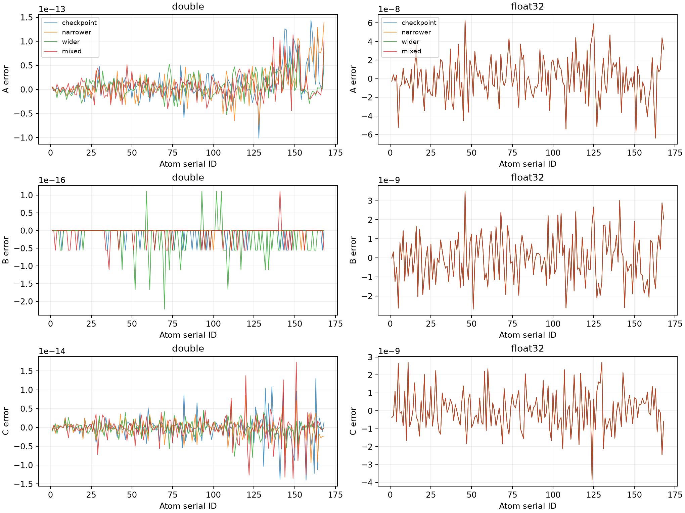
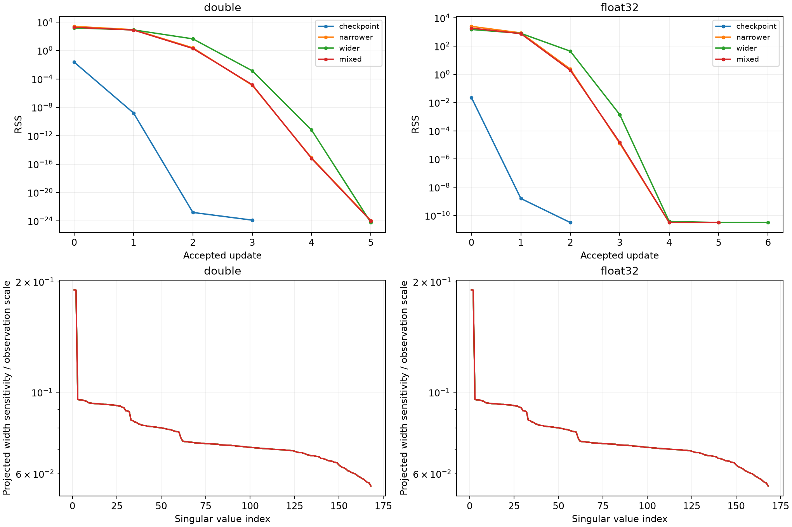

# Joint A/C/B least squares：固定 ROI 的 variable projection

本輪以 `9e656bc8` 的 fixed-B oracle／quantization 控制實驗為基礎，將全部 168 個 B 納入 joint estimation。實作只連結 testing executable，採 alpha=0、A≥0、B>0、C 不限符號；沒有 B 上下界、robust loss、自由 variance、位置估計、component 切割或 production 接入。

## 正式八例結果

**八例全面驗收通過。** 四個 double 起點恢復 truth，四個 float32 起點的每一原子 A/B/C 絕對誤差都小於 0.01；同精度的四個解通過 pairwise 一致性。

| Case | A RMSE | B RMSE (Å) | C RMSE | Voxel residual RMSE | Profile evaluations／接受更新 |
| --- | ---: | ---: | ---: | ---: | --- |
| checkpoint-double | 3.509228e-14 | 2.141389e-17 | 3.643657e-15 | 3.055555e-15 | 4／3 |
| narrower-double | 3.389045e-14 | 8.565557e-18 | 2.470297e-15 | 2.934661e-15 | 7／5 |
| wider-double | 2.323272e-14 | 4.730483e-17 | 2.017676e-15 | 2.064611e-15 | 7／5 |
| mixed-double | 2.759988e-14 | 2.497267e-17 | 3.681712e-15 | 2.672979e-15 | 7／5 |
| checkpoint-float32 | 2.254579e-08 | 1.23404e-09 | 1.09213e-09 | 1.514674e-08 | 4／2 |
| narrower-float32 | 2.254581e-08 | 1.23404e-09 | 1.09213e-09 | 1.514674e-08 | 7／5 |
| wider-float32 | 2.25458e-08 | 1.23404e-09 | 1.09213e-09 | 1.514674e-08 | 7／6 |
| mixed-float32 | 2.254581e-08 | 1.23404e-09 | 1.09213e-09 | 1.514674e-08 | 7／5 |

每一例的 A／B／C 達標數均為 **168／168／168**。四個 double 最大尺度化 truth 誤差為 **1.7637e-14**，最大 relative residual 為 **5.0476e-15**。四個 float32 最大 A、B、C 絕對誤差分別為 **6.3931e-8、3.4956e-9 Å、3.8698e-9**。

完整的逐例 bias、RMSE、p99、最大誤差與達標數見 [comparison.csv](figures/joint-abc-profile/comparison.csv)；逐原子 A/B/C 與 signed errors 見 [estimates.csv](figures/joint-abc-profile/estimates.csv)。p99 採絕對誤差的 nearest-rank 分位數。



每種精度各六對比較全部通過；全部十二對的最大尺度化 A/B/C 差為 **2.4971e-13**，最大 log-B 差為 **1.3301e-13**。最低 RSS 的合格代表分別為 **wider-double** 與 **wider-float32**。這是事前固定的報告選擇規則，微小 RSS 差沒有額外的科學優勢含義。全部分支保存在 [八例結果 JSON](figures/joint-abc-profile/results.json) 與 [pairwise CSV](figures/joint-abc-profile/multistart.csv)。

八例均由 LM 原生碼 2（RelativeErrorTooSmall）停止，沒有用完 200／100 的預算；數值資格另由完整終點檢查決定。各例完整 trials 與 accepted-update 標記保存在 `fits/*.json`。

## 數值資格與 width 診斷結果

| 八例中的最差值 | 實測 | 門檻 |
| --- | ---: | ---: |
| A/C projected KKT（主解及 reference） | 2.5744e-15 | 1e-10 |
| 主解／reference 尺度化係數差 | 2.6251e-14 | 1e-10 |
| B gradient infinity norm（主解及 reference） | 6.3747e-16 | 1e-12 |
| 未阻尼局部 log-B 修正 infinity norm | 1.3293e-13 | 1e-10 |
| Reference SVD 方向差分 relative L2 difference | 3.2155e-9 | 1e-6 |

主解與 reference 的 A/C KKT、B gradient 都通過。八例均無 A 邊界，A/C rank **336**、projected-width rank **168**。每例六個方向差分檢查均維持相同 active face；共 96 次額外 reference-SVD profile evaluations，另有 16 次 fresh endpoint evaluations，均未計入搜尋預算。

Projected-width 絕對奇異值（已除以固定 observation scale）約為 **0.0555421–0.1898470**，每欄 norm 約為 **0.0671426–0.1897897**，condition number 約 **3.41807**。欄正規化後 condition number 約 **1.36756**。各案例完整 spectrum、欄 norms 與最弱三個 log-B 方向保存在 fit JSON 及 `weak-directions/*.csv`。

在這些內部終點，A/C rank 與投影後 width rank 合計支持完整 504 參數的局部線性化識別；此判斷由兩個區塊的 rank 推得，仍只適用於本 fixture 與這些終點附近。



## 同 observations 的 fixed-B 對照

| Precision／模型 | A RMSE | B RMSE | C RMSE | Voxel residual RMSE |
| --- | ---: | ---: | ---: | ---: |
| double／true-b（B 固定） | 3.410907e-14 | 0 | 2.743874e-15 | 2.974649e-15 |
| double／checkpoint-b（B 固定） | 0.009166842 | 0.0003642412 | 0.0003229794 | 0.0004041532 |
| double／joint（B 估計） | 2.323272e-14 | 4.730483e-17 | 2.017676e-15 | 2.064611e-15 |
| float32／true-b（B 固定） | 2.192794e-08 | 0 | 1.011574e-09 | 1.521639e-08 |
| float32／checkpoint-b（B 固定） | 0.009166843 | 0.0003642412 | 0.0003229794 | 0.0004041532 |
| float32／joint（B 估計） | 2.25458e-08 | 1.23404e-09 | 1.09213e-09 | 1.514674e-08 |

固定 checkpoint B 所留下的約 9.17e-3 A RMSE，在 joint 模型中降至 double 的浮點求解尺度或 float32 約 2.25e-8 的量化尺度。相對於已知 true B 的 float32 control，多估計 B 使 residual 略降，但 A/C RMSE 略增；恢復品質因此同時用參數誤差與 residual 評估。

同精度全部八分支對兩個 fixed-B control 的比較見 [fixed-b-comparison.csv](figures/joint-abc-profile/fixed-b-comparison.csv)。Joint 的 checkpoint 起點在尚未更新 B 時，A/C 與既有 fixed-B checkpoint 解的最大尺度化差為 double **1.2286e-14**、float32 **1.3806e-14**，通過 1e-10 的重現門檻。

以兩個合格代表作逐原子向量差，float32−double 的 A/B/C 差值統計保存在 `results.json` 的 `float32_minus_double`；這裡沒有相減兩個 RMSE 當成可加的誤差貢獻。

本輪通過後，下一步可規劃以這個已驗證的 alpha=0 joint objective 定義 component，並明確設計 production 資料與收斂資格的接入契約。本輪交付仍限於實驗與驗證。

## 實驗與資料契約

沿用 [fixed-B fixture](../../tests/benchmarks/fixed_b_oracle.json)：0.30 Å map、82×125×67 grid、2.5 Å 球形聯集的 139,551 個等權 unique voxels、407,237 次球覆蓋。負值與零值保留。Voxel IDs、生成座標、cutoff、contributors 與 observations 在整個最佳化期間固定。

| 起點 | 初始 B |
| --- | --- |
| checkpoint | baseline-best-28 的原子 B |
| narrower | 0.8 × checkpoint B |
| wider | 1.2 × checkpoint B |
| mixed | serial ID 奇數 ×0.8；偶數 ×1.2 |

每個起點分別對 double 與 float32 observations 執行，共八例；初始 A/C 各自重新求受限 LS。起點與選解完全不使用 truth，也不跨案例暖啟動。

共用資料準備位於 `tests/support/FixedBOracle.cpp`。Double observations 由既有 simulation generator 按 manifest preparation order、單執行緒重新生成；float32 值直接讀 map。全部 rows 都檢查 float32 cast、signed quantization difference 與解析 forward consistency。Python 獨立重建完整 ROI、檢查 map bytes、原子身分與 checkpoint B。舊 map 的 samples、responses、background 及 checkpoint A/C 不進入 fitting。

Solver 的輸入只有 observations、幾何／support、initial B。Truth 僅用於資料生成及 Python 事後評分。固定 B 的資料準備抽出後，原四例的科學 JSON 與全部 CSV 必須逐項精確重現；其資格門檻未改變。

## 求解器與完整導數

外層以 η=log B，同時更新 168 個獨立 width；每次 profile evaluation 重新求全部 336 個 A/C：

\[
\beta^\star(\eta)=\arg\min_{A\geq0,C}\tfrac12\|X(e^\eta)\beta-y\|^2,
\qquad L^\star(\eta)=\tfrac12\|X(e^\eta)\beta^\star(\eta)-y\|^2.
\]

內層重用 `WeightedSolve` 的局部 Householder QR＋SparseQR 與 mixed active set；每次 trial 都在原始 rows 上檢查有限值、A 非負與 projected KKT≤1e-10。X 保留全部非零 basis，不加 regularization。

外層為既有 Eigen Levenberg–Marquardt，殘差除以固定 `s=max(1,||y||₂)`。固定 `factor=0.1`、`ftol=1e-14`、`xtol=1e-12`、`gtol=1e-12`；每例最多 200 次 profile evaluations、100 次接受更新。非法 B、非有限 basis 或失敗 inner solve 會終止分支，終點保留最後接受的參數。原生停止碼不代表數值合格，也不在終點驗證時增加搜尋預算。

在目前 active face，F 包含所有 C 及自由的 A。令 r=Xβ−y，完整 Jacobian 為：

\[
J_{\eta,j}=\frac{\partial X}{\partial\eta_j}\beta^\star,\quad
T_{:,j}=\left(\frac{\partial X_F}{\partial\eta_j}\right)^T r,\quad
J_{\rm profile}=(I-P_{X_F})J_\eta-(X_F^+)^T T.
\]

使用 `EvaluateBasis` 的 log-width 導數，包含中心、近零距離與 cutoff 分支。先對 X_F 欄正規化，再從完整 rows 作分塊 QR，以三角求解完成投影與第二項；小矩陣 SVD 檢查 rank。沒有形成 normal equations 或 N×N projector。active set 變動後以重新求解的 profile residual／Jacobian 評估。

此消去方法依循 [O’Leary 與 Rust：Variable Projection for Nonlinear Least Squares Problems](https://www.cs.umd.edu/~oleary/software/varpro/varpro.pdf)；本實驗的線性非負限制另以既有 active set 處理，公式僅在固定 active face 使用。非零殘差單元測試明確檢查第二項不可省略。

## 終點資格與識別

終點重新建立 X、主 A/C 解、原始 residual、gradient 及完整導數，另從原始 rows 獨立作 TSQR＋SVD 受限 reference solve，不重用主解壓縮矩陣。

| 檢查 | 事前固定門檻 |
| --- | --- |
| A/C projected KKT，主解與 reference | ≤1e-10，且有限、A≥0 |
| 主解／reference 最大尺度化 A/C 差 | ≤1e-10 |
| 主解與 reference 的 `||Jηᵀr/s²||∞` | ≤1e-12 |
| 完整 profile Jacobian 未阻尼修正 `||−Jprofile⁺r||∞` | ≤1e-10 |
| A/C rank、projected-width rank | 336、168 |
| 方向有限差分 relative L2 difference | ≤1e-6 |
| 四個 double 的最大尺度化 A/B/C truth 誤差 | ≤1e-10 |
| 四個 double 的 relative forward residual | ≤1e-12 |
| 四個 float32 的每個 A/B/C 絕對誤差 | <0.01 |
| 每種精度六組 pairwise 最大尺度化 A/B/C 差、最大 log-B 差 | 均≤1e-8 |

尺度化差固定為 `|a−b|/(1+max(|a|,|b|))`。Rank threshold 使用 `epsilon*max(N,p)*sigma_max`，N 是完整原始 row count。`RSS/N` 僅作描述性 scale，允許零。

對 `Z_B=(I−P_XF)Jη/s` 保存完整奇異值、每欄 norm、欄正規化後 spectrum，以及最弱三個右奇異向量的逐原子 log-B 方向。若有 A 邊界，標示診斷只適用該 active face。

每例固定另作 12 次 reference-SVD profile evaluations：全同號、交錯符號、最弱 width 三個正規化方向，各以 h=1e-4 與 h/2 作中央差分。若擾動改變 active face 或導數驗證失敗，標記 `derivative-unverified`。終點兩次求解及這 12 次驗證與搜尋預算分開計數。

`execution_complete`、`joint_qualified`、`oracle_recovered`、`multistart_consistent`、`overall_passed` 分別保存。任一案例失敗即不通過全面驗收。每種精度以最低 RSS 的合格分支作代表，保留全部分支及 trial／accepted 軌跡，不依 truth 選解。

## 驗證與資源

**全新目錄獨立重跑八例的科學 JSON 與所有 CSV bytes 完全相同**，僅排除時間、資源與執行目錄。八例在兩次執行中皆全面通過；[精確比對證據](figures/joint-abc-profile/reproducibility.json) 保留案例清單及空的差異列表。

- 126 項相關 C++ tests、68 項 Python tests（9 個 CTest 群組）通過；其中新增 5 項 C++、7 項 runner tests。涵蓋完整 Jacobian／envelope gradient、active face 改變、signed C、rank deficiency、width 無資訊、零 residual、直接 joint 解對照，以及失敗 inner solve 不取得 joint 資格。
- Repository lint 與 `BUILD_TESTING=OFF` production library 建置隔離檢查通過；production build 沒有 experiment/test targets 或 joint-ABC／fixed-B symbols。
- 抽出共用資料準備後，舊 fixed-B 四例科學 JSON 與全部 CSV 精確重現。新 joint 的初始 checkpoint A/C 也通過固定 B 對照。
- 正式 C++ 八例執行 **412.36 秒**，process peak RSS **1161.77 MiB**；獨立重跑 **383.72 秒**、**1321.72 MiB**。Python 原始 rows 驗證另計，記錄於 `independent-validation.json`。各 case 的 `process_peak_rss_bytes` 是同一程序累積的 high-water mark。
- 兩次執行均使用單程序、單執行緒；執行前後來源、執行檔與輸入 hashes 均一致。基底 commit 為 `9e656bc89fc9dd6e6a7569f826535b6378263f4b`，新增程式由 provenance 的 source hashes 精確辨識。

[驗證摘要](figures/joint-abc-profile/validation.json)、[來源／執行檔 provenance](figures/joint-abc-profile/provenance.json)、[輸入 hashes](figures/joint-abc-profile/input-hashes.json)、[正式 raw 索引](figures/joint-abc-profile/raw-artifact-index.json)、[重跑 raw 索引](figures/joint-abc-profile/repeat-raw-artifact-index.json)、[版本化產物 hashes](figures/joint-abc-profile/artifact-index.json) 均隨報告保存。

## 重跑與產物

沿用 Release／SYSTEM、BUILD_TESTING=ON 的實驗建置。Python runner 需要 NumPy，繪圖另需 Matplotlib。以下 `SIMULATION_DIR` 為 simulation 檔案所在目錄。

```sh
cmake --build build/observation-matching/on --target mdpde_experiment rhbm_tests -j 2

python3 tests/integration/joint_abc_profile.py run \
  --executable build/observation-matching/on/bin/mdpde_experiment \
  --model "$SIMULATION_DIR/fold_test_model_0.cif" \
  --map "$SIMULATION_DIR/sim_map_gaus_grid0.30_charge1_bw0.50.map" \
  --manifest "$SIMULATION_DIR/sim_map_gaus_grid0.30_charge1_bw0.50.map.simulation.json" \
  --checkpoint build/endpoint-refinement/baseline-run/solver-failures/contexts/final-32-33.json \
  --output build/joint-abc-profile/new-formal

# 使用相同輸入及全新 --output，再獨立執行八例。
python3 tests/integration/joint_abc_profile.py compare \
  --left build/joint-abc-profile/final --right build/joint-abc-profile/repeat \
  --output build/joint-abc-profile/reproducibility.json

python3 tests/integration/joint_abc_profile.py plots build/joint-abc-profile/final \
  --output build/joint-abc-profile/figures
```

Testing-only 子命令為 `joint-abc-profile MANIFEST MAP CHECKPOINT OUTPUT`；runner 拒絕 hash／身分／量化不符、缺案例與覆寫輸出。數值不合格仍保存完整診斷，不偽裝成執行失敗。

完整逐 voxel CSV、原始 JSON 與 logs 保存於 `build/joint-abc-profile/final` 及 `build/joint-abc-profile/repeat`。每份 raw artifact 都有 hash；原始大檔不納入版本控制，需另外備份。版本化精簡產物包含八份 fit JSON、逐原子 estimates、比較表、弱方向、圖表、provenance、輸入 hashes、重現性及測試摘要。

本輪驗收只涵蓋這份固定位置、固定 ROI、沒有額外注入噪聲的 fixture；不宣稱全域最佳解或跨資料集泛化。舊 0.10 Å 結果僅為背景，不用來單獨歸因網格效應。
