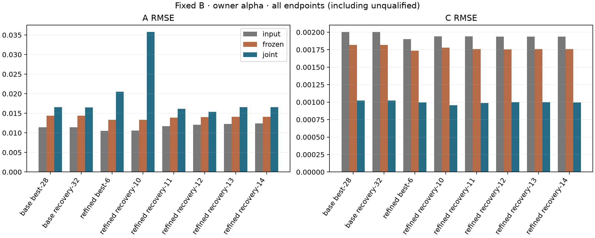
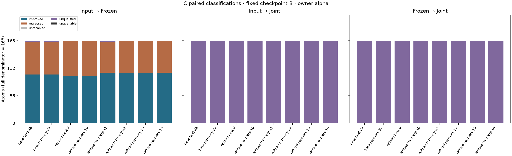
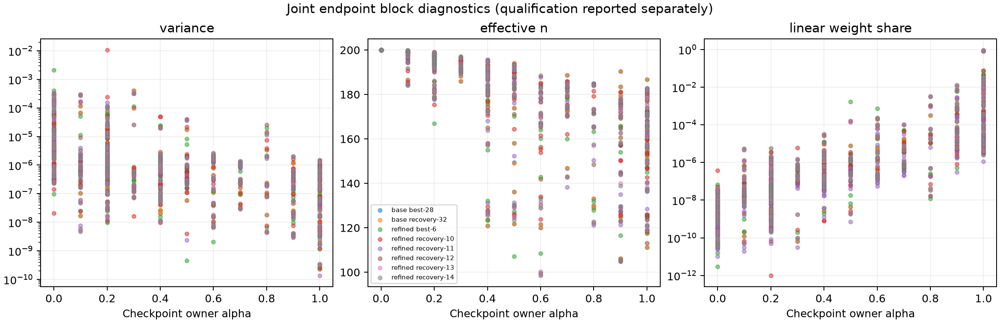

# 固定 B、逐原子 alpha 的 component-joint A/C matched MDPDE

本實驗僅存在於 testing executable，不修改 production fitting、公開 API、正式 CLI 或 production schema。
沿用 [estimated-neighbor one-sweep](estimated-neighbor-sweep-experiment.md) 的八份 checkpoint、原始 map 與逐點 observations。

## 實驗與資料契約

固定每份 checkpoint 的全部 B，Gaussian 與 charge basis 均使用 checkpoint widths，不做 B profile、Taylor 更新或 peeling。
使用全部 33,600 個 raw samples（每 atom 200 點），不依 response 正負或 selected flag 刪點，不取 log。
`X=[Phi_1,Psi_1,...,Phi_m,Psi_m]`，`beta=[A_1,C_1,...,A_m,C_m]`，A 非負、C 不限正負；
不加入 intercept、ridge 或 charge-sum constraint。

alpha 從 context 的 `atoms[].alpha` 按完整 atom identity 讀入，不重新訓練、置換或四捨五入。
八份 checkpoint 保存完全相同的 168 個 alpha，範圍 0–1，其中 28 個為零。
每個 row 使用原始 sampling owner 的 alpha 與 variance；不依 target、最大 contributor 或當前 A/C 改變 owner。
既有 alpha 來自舊 fitting 問題，本輪只檢驗移植後的結果，不視為新模型的最佳 tuning。

Component 先依有效 cubic stencil slots 的完整 voxel support 建立，再將同一 owner block 連結的分量合併，
避免共用 nuisance scale 造成未處理的跨分量耦合。保存成員、sample IDs、contributors 與分組標記；
不使用 production 分群權重門檻或 100-atom 上限，不因 A/C 為零或係數抵消刪邊。
生成／讀回幾何、64 slots、負係數、clamp、cutoff、近零規則沿用既有 matched kernel；
擬合用未量化 double，float32 僅供獨立 forward check。每個 state 全 rows 核對 `X beta` 與 `Predict`。

每份 checkpoint 比較 input、Frozen-AC、Joint-AC。Frozen 只釋放 target A/C，其餘 A/C 固定 checkpoint，
但估計所有 observation blocks 的 scales；Joint 聯合估計 component 全部 A/C 與相同 scales。
兩者使用相同 rows、alpha、lambda 與 objective。target columns 為零的 rows 仍參與尺度估計。
所有 Frozen 從原 checkpoint 出發、不回填後續 target，完成後才組裝一次 state。

主執行為八份 checkpoint 的 j4：8 個 Joint、1,344 個 Frozen。重現驗證固定 baseline-best-28 的 j1：
1 個 Joint、168 個 Frozen。合計 1,521 個 fit 問題，起點／精化另計。
沒有共同 alpha、alpha grid 或 shuffled-alpha 科學對照；LS 僅作起點與數值測試。
前版四組共同 alpha 的執行已中止，舊目錄保留，不能當成本版結果。

## Composite objective 與求解

以 [Ghosh–Basu 的 DPD formulation](https://arxiv.org/pdf/1403.6606) 為基礎，定義本實驗的 atom-block composite criterion。
這是明確指定的 heterogeneous criterion，不直接套用共同 alpha 的獨立樣本漸近結論。

令 block i 有 n_i rows、固定 alpha_i、自由正尺度 v_i，r=y-X beta，M 個 blocks 等權 lambda_i=1/M：

\[
Q=\sum_i\lambda_i Q_i,\qquad
Q_i=(2\pi v_i)^{-\alpha_i/2}
\left[(1+\alpha_i)^{-1/2}-\frac{1+\alpha_i}{\alpha_i n_i}
\sum_p e^{-\alpha_i r_{ip}^2/(2v_i)}\right]+\frac1{\alpha_i}.
\]

alpha_i=0 使用 `Q_i=0.5*(log(2*pi*v_i)+RSS_i/(n_i*v_i))`。
正 alpha 的固定 `1/alpha_i` 不改變估計解；程式以 `expm1` 等價計算，避免 alpha 接近零時的大常數相消。
所有 objective 都用原 map 單位；不同 alpha 的 terms 對 response 單位敏感，等權 lambda 不代表相同有效影響力。

區分 robust weight 與線性子問題的 row weight：

\[
w_{ip}=e^{-\alpha_i r_{ip}^2/(2v_i)},\quad
q_i=\frac{\lambda_i(1+\alpha_i)}{n_iv_i}(2\pi v_i)^{-\alpha_i/2},\quad
\omega_{ip}=q_iw_{ip}.
\]

alpha=0 的 w=1，但 omega 仍含 inverse variance；所有 alpha=0 且 scales 自由時並非 ordinary LS。
為避免 overflow，q 透過 log 計算後除以同一個全域最大值，保留所有相對 block 權重；不作逐 block normalization、floor 或 clipping。

每步依序用新鮮 weights、以 omega 解 constrained weighted LS，再以 w 更新各尺度：

\[
v_{i,trial}=\frac{\sum_p w_{ip}r_{trial,ip}^2}
{\sum_p w_{ip}-n_i\alpha_i(1+\alpha_i)^{-3/2}}.
\]

係數先按 L2 column norms scaling，以可釋放 A=0 constraints 的 mixed active-set 求解。
兩欄 Frozen 使用 column-pivoted QR；Joint 先用 blocked Householder QR 將高矩陣正交壓縮為 R，再對小型 R pivot。
不形成 normal equations、不裁切負 A、不截斷設計矩陣。終點直接以原 weighted design 的 SVD 獨立核對。

每個問題保存 checkpoint A/C 與 constrained-LS A/C 兩個起點；每個 block 用各起點的 RSS_i/n_i 初始化尺度。
主迭代最多 2,000 次，以同一 composite Q 驗收；沿 beta 線段與所有 log(v_i) 同時二分回溯，最多 30 次。
objective 容許 `32*epsilon*max(1,abs(Q))` 的捨入誤差，無可接受步為 stalled。
沒有以真值選起點、分支、停止條件或追加預算。

## 終點合格與失敗分類

fresh 係數方程正規化為

\[
g_k=\frac{\sum_p q_pw_px_{pk}r_p}
{\sqrt{\sum_p q_pv_p}\sqrt{\sum_p q_px_{pk}^2}},\qquad
s_i=\operatorname{mean}_p[w_{ip}(r_{ip}^2/v_i-1)]+\alpha_i(1+\alpha_i)^{-3/2}.
\]

自由係數使用 `abs(g_k)`，A=0 使用 `max(0,g_k)`。所有係數與尺度方程最大殘差須 <=1e-8，
所有 scales 與分母須為正，參數可行且 rank 足夠。合格候選再以最多 4,000 次精化至 1e-10。
獨立 SVD 重解終點 constrained weighted subproblem；主／精化／SVD 的係數差除以
`1+max(abs(left),abs(right))` 須 <=1e-6，`max(abs(log(v_primary)-log(v_reference)))` 亦須 <=1e-6。
weighted design 在 row weighting 後再次按欄正規化，保存 rank、condition、最小奇異值；rank threshold 為 `epsilon*max(rows,columns)`。

每個 block 以 `64*epsilon*(norm(y_i)+norm(X_i)*norm(beta))` 判定 exact-fit-boundary，
即使其他 blocks 未精確擬合，也不算一般正尺度解。明列 failure owner，區分 variance-boundary、invalid-denominator、
nonfinite、rank-deficient、stalled、budget-exhausted、reference-unverified。
兩個分支均合格但係數或 log-scale 差超過 1e-6 時標記 branch-sensitive；只在合格解中依同一 Q 選解。
沒有合格解時保留 checkpoint 起點分支的有限終點，標記不合格；合格也僅代表 stationarity，不保證全域唯一最小值。

## 評分、產物與重跑

Fit API 不接受 truth。Truth 僅作獨立 forward check 與事後 scoring，C 使用 manifest `charge_used`。
B 以 double bytes 核對 checkpoint；B error 只作固定輸入背景。
A/C 保存 bias、RMSE、p99、最大誤差、逐原子配對、歷史 matched ABC C 退步交叉表、serial 100 與最差案例。
全 168 atoms 保留於分母，另外列 qualified、unqualified、unresolved、unavailable。
數值差異 `abs(primary-reference)+abs(reference-SVD)` 只作配對解析度，不是信賴區間或嚴格誤差上界。
未合格分支可能沒有完成精化／SVD，此時保存的零差異不代表零不確定度；配對必須同時通過 qualified gate。

組裝後重新算完整 matched residual 與 neighbor error，按 signal／tail、cutoff-crossing／smooth、boundary／interior 分組。
input／Frozen／Joint 共同比較固定於 checkpoint 各 block 的 `v_i0=RSS_input,i/n_i`；若有 boundary 則 objective 為 null 並註明原因。
Joint 另報自行估計尺度下的 native Q；不能將 Frozen conditional losses 加總為組裝後 objective。
`blocks.csv` 保存每個 fit／起點的 endpoint block alpha、variance、尺度方程、分母 margin、w 分布、ESS 與 omega mass share。
原始 JSON 保存全部起點、primary／reference 軌跡、SVD、參數及 diagnostics；source、binary、inputs 與 artifacts 保存雜湊。
未達 stationarity 的終點不執行係數 SVD 合格驗證；另用事後 read-only checker 重建其 weighted design，
補列 rank／condition／最小奇異值，並逐值核對保存的方程殘差。此診斷不重跑 fitting，不改變數值資格。
checker 的程式、編譯命令、binary 與輸出保留於 `build/matched-joint-ac/validation`，與原始 runs 一起保存。
發布的 fits.csv 包含此補充診斷，原始 run JSON 保持不變。

```sh
python3 tests/integration/matched_joint_ac.py run \
  --executable build/observation-matching/on/bin/mdpde_experiment \
  --model "$MODEL" --map "$MAP" --manifest "$MAP.simulation.json" \
  --baseline-run build/endpoint-refinement/baseline-run \
  --refined-run build/endpoint-refinement/failed-only-audit \
  --output build/matched-joint-ac/new-composite-j4 --jobs 4

# 同樣輸入，另用新 output 加上 --jobs 1 --state baseline-best-28。
python3 tests/integration/matched_joint_ac.py compare \
  --left build/matched-joint-ac/new-composite-j4 \
  --right build/matched-joint-ac/new-composite-j1 \
  --state baseline-best-28 --output build/matched-joint-ac/new-comparison.json

# 使用已安裝 Matplotlib 的 Python。
python3 tests/integration/matched_joint_ac.py plots \
  build/matched-joint-ac/new-composite-j4 --output build/matched-joint-ac/new-figures
```

單次線性求解為單執行緒；j4 在 checkpoint 間平行獨立 fits，最多同時處理四份 checkpoint，避免長 Joint fit 讓其他 workers 閒置。run 拒絕覆寫，執行前後核對 provenance；
完整八狀態索引與 selected_state_ids 分別保存，summarize 驗證實際執行集合，不將未執行狀態當成功。
compare 必須指定 state，只排除時間欄位，完整比對其所有 fits、cases、逐點 CSV 與評分，另列其餘未比對狀態。
實驗輸出 schema v2 與舊 scalar-alpha v1 不混用。build 原始產物不納入 git，應另行備份。

本輪只回答既有逐原子 alpha／尺度下 Joint 相對同域 Frozen 的效果。
未做共同 alpha 或 permutation 對照，因此不能宣稱個別 alpha 本身較佳。
若 residual 改善但 C accuracy 退步，應記錄為固定 B 誤差的補償；八狀態和 samples 均非獨立資料集，
只報描述性比較，不宣稱 B 正確、完整 peeling 收斂或抗 outlier 能力。


## 實際結果

**本輪尚不能判定 Joint 優於 Frozen。** 八個 Joint 的兩個起點都耗盡 2,000 次預算，沒有取得通過 1e-8 方程門檻的候選，因此沒有啟動 Joint 的精化驗證。Frozen 則有 1,335/1,344 個問題合格，另有 7 個 reference-unverified、2 個 budget-exhausted；baseline j1 重跑的結果與 j4 完全一致。

選定的八個 Joint 終點之加權設計矩陣均為 rank 336，欄位正規化 condition number 約 86.5–228.3。baseline 的最後五步各回溯 23 次，最大尺度化係數變化僅約 8.88e-16、最大 log-scale 變化約 1.61e-12，但尺度方程殘差仍為 7.03e-6。這是極小步長下未達 stationarity 的結果；參數幾乎不動不足以判定成功，延長預算也未必能解決。

八個選定 Joint 終點中，serial 148 的 observation block（alpha=1）占全部 omega 總量的 82.2%–93.9%。baseline 的 28 個 alpha=0 blocks 合計只占約 2.09e-7。這顯示本次尺度與 alpha 的組合使線性權重高度集中；omega 占比本身不等於每個係數的影響力，也不能在缺乏共同 alpha 對照時歸因為個別 alpha 的優劣。

作為未驗證終點的描述，Joint C RMSE 比 input 低 47.6%–50.8%，但 A RMSE 為 input 的 1.27–3.38 倍，完整 residual RMSE 為 2.45–5.59 倍。共同尺度下的 composite Q 同時下降，反映這個 objective 與未加權 RSS 衡量不同的取捨。Frozen 組裝後的共同尺度 Q 在六份 state 較 input 差，也說明各 conditional fit 的結果組裝後需獨立重算，不能加總 conditional losses 推論整體改善。

下一輪應先在相同 objective 下檢查聯合步驟的下降方向、尺度更新與浮點精度，取得可驗證的 Joint 終點，再判讀 A/C 耦合改善。本輪沒有增加迭代預算或改選 alpha。

唯一配置為 checkpoint 保存的逐原子 alpha，全部 B 與各自 checkpoint 逐位一致。以下 RMSE 包含保留的不合格終點，合格數與配對判定另列；不合格結果不算已驗證改善。

| State | Input A / C RMSE | Frozen A / C RMSE | Joint A / C RMSE | Frozen 合格數 | Joint 合格 |
| --- | --- | --- | --- | --- | --- |
| baseline-best-28 | 0.01143769 / 0.0020040252 | 0.014385046 / 0.0018189448 | 0.016533708 / 0.0010233945 | 166/168 | budget-exhausted |
| baseline-recovery-32 | 0.011436302 / 0.0020040912 | 0.014386313 / 0.001818947 | 0.016531222 / 0.0010231539 | 166/168 | budget-exhausted |
| failed-only-best-6 | 0.010520198 / 0.0018995366 | 0.013339054 / 0.001737424 | 0.02051069 / 0.00099581433 | 168/168 | budget-exhausted |
| failed-only-recovery-10 | 0.010595164 / 0.0019417767 | 0.013341363 / 0.0017782543 | 0.035784248 / 0.00095500454 | 168/168 | budget-exhausted |
| failed-only-recovery-11 | 0.011700924 / 0.001939331 | 0.01387292 / 0.0017593869 | 0.016167116 / 0.00098585538 | 166/168 | budget-exhausted |
| failed-only-recovery-12 | 0.012088788 / 0.0019385005 | 0.014003213 / 0.0017570464 | 0.015379681 / 0.00099718409 | 167/168 | budget-exhausted |
| failed-only-recovery-13 | 0.012294407 / 0.0019380801 | 0.014087302 / 0.0017577166 | 0.016550584 / 0.00099885429 | 167/168 | budget-exhausted |
| failed-only-recovery-14 | 0.012399776 / 0.0019378718 | 0.0141294 / 0.0017580708 | 0.016531584 / 0.00099428649 | 167/168 | budget-exhausted |

Frozen 另有 20 個問題的兩個合格分支差異超過既定門檻，已標記 branch-sensitive。選定解依同一 objective 判定；數值合格不代表全域唯一解。



### C 的逐原子比較

| State | Input→Frozen 改善／退步／未解析／不合格 | Input→Joint | Frozen→Joint |
| --- | --- | --- | --- |
| baseline-best-28 | 99 / 67 / 0 / 2 | 0 / 0 / 0 / 168 | 0 / 0 / 0 / 168 |
| baseline-recovery-32 | 99 / 67 / 0 / 2 | 0 / 0 / 0 / 168 | 0 / 0 / 0 / 168 |
| failed-only-best-6 | 96 / 72 / 0 / 0 | 0 / 0 / 0 / 168 | 0 / 0 / 0 / 168 |
| failed-only-recovery-10 | 96 / 72 / 0 / 0 | 0 / 0 / 0 / 168 | 0 / 0 / 0 / 168 |
| failed-only-recovery-11 | 103 / 63 / 0 / 2 | 0 / 0 / 0 / 168 | 0 / 0 / 0 / 168 |
| failed-only-recovery-12 | 102 / 65 / 0 / 1 | 0 / 0 / 0 / 168 | 0 / 0 / 0 / 168 |
| failed-only-recovery-13 | 102 / 65 / 0 / 1 | 0 / 0 / 0 / 168 | 0 / 0 / 0 / 168 |
| failed-only-recovery-14 | 103 / 64 / 0 / 1 | 0 / 0 / 0 / 168 | 0 / 0 / 0 / 168 |



### Block diagnostics 與完整 residual

圖中保留各 Joint 選定終點的 block 診斷；數值資格以表格及 fits.csv 為準。w 的 ESS 不表示各 block 在線性求解中的相對權重，後者另看 omega mass share。



| State | Input / Frozen / Joint residual RMSE | Input / Frozen / Joint neighbor RMSE |
| --- | --- | --- |
| baseline-best-28 | 0.0016997481 / 0.0024950958 / 0.0042550231 | 0.0018022533 / 0.0019262881 / 0.0016356652 |
| baseline-recovery-32 | 0.0016997274 / 0.0024957307 / 0.0042549604 | 0.0018021611 / 0.001925967 / 0.001635418 |
| failed-only-best-6 | 0.0016250155 / 0.0022105939 / 0.0053686894 | 0.0017076831 / 0.0018341606 / 0.0019325733 |
| failed-only-recovery-10 | 0.0016302141 / 0.0022001371 / 0.0091168618 | 0.0017414552 / 0.0018621085 / 0.0028503899 |
| failed-only-recovery-11 | 0.0017548021 / 0.0026457439 / 0.0044439827 | 0.0017645919 / 0.0019068292 / 0.0016279814 |
| failed-only-recovery-12 | 0.0017940641 / 0.002843743 / 0.0043983945 | 0.0017743584 / 0.0019452447 / 0.0016438752 |
| failed-only-recovery-13 | 0.0018144296 / 0.002938835 / 0.0045918763 | 0.0017797062 / 0.0019640309 / 0.0017238097 |
| failed-only-recovery-14 | 0.0018247624 / 0.0029867543 / 0.0046374744 | 0.0017824886 / 0.0019736079 / 0.001733968 |

### Joint 終點的數值診斷

| State | 分支 | 係數最大殘差 | 尺度最大殘差 | 最差尺度 serial / alpha | 最大 omega share |
| --- | --- | --- | --- | --- | --- |
| baseline-best-28 | checkpoint | 3.36359e-08 | 7.02755e-06 | 131 / 0.5 | 0.872227 |
| baseline-recovery-32 | checkpoint | 3.80429e-08 | 7.93937e-06 | 131 / 0.5 | 0.87272 |
| failed-only-best-6 | checkpoint | 1.66475e-08 | 2.97119e-07 | 21 / 0.6 | 0.821562 |
| failed-only-recovery-10 | checkpoint | 2.19743e-08 | 2.48178e-06 | 142 / 0.1 | 0.86694 |
| failed-only-recovery-11 | checkpoint | 3.54807e-08 | 3.71927e-07 | 157 / 1 | 0.939377 |
| failed-only-recovery-12 | checkpoint | 3.28292e-08 | 1.22683e-07 | 84 / 0.9 | 0.84307 |
| failed-only-recovery-13 | checkpoint | 7.92029e-08 | 4.15357e-07 | 84 / 0.9 | 0.855463 |
| failed-only-recovery-14 | checkpoint | 4.01906e-08 | 2.2624e-07 | 84 / 0.9 | 0.858021 |

### 兩個起點的終點差異

以下保留尚未合格分支的數值差異，不能據此宣稱存在兩個已驗證局部最小值。沒有合格分支時，組裝 state 保留 checkpoint 起點的終點作診斷；不依真值選擇另一分支。

| State | Checkpoint seed / LS seed native Q | 最大尺度化係數差 | 最大 log-scale 差 | 兩分支合格 |
| --- | --- | --- | --- | --- |
| baseline-best-28 | -286.92151 / -252.58015 | 0.0291372 | 8.01865 | False / False |
| baseline-recovery-32 | -287.21411 / -252.81665 | 0.029137 | 8.01961 | False / False |
| failed-only-best-6 | -319.15259 / -287.12039 | 0.00901896 | 3.89074 | False / False |
| failed-only-recovery-10 | -305.5905 / -272.32424 | 0.0540812 | 7.87938 | False / False |
| failed-only-recovery-11 | -321.766 / -276.91971 | 0.0291077 | 4.97932 | False / False |
| failed-only-recovery-12 | -319.30279 / -279.44505 | 0.0328846 | 5.89885 | False / False |
| failed-only-recovery-13 | -320.57104 / -278.02323 | 0.037593 | 4.63369 | False / False |
| failed-only-recovery-14 | -322.16376 / -278.04401 | 0.0387139 | 4.5722 | False / False |

### 共同尺度 objective 與指定案例

下表的三組組裝 state 都使用 checkpoint 的同一尺度向量；Joint native Q 則使用自身估計尺度，兩欄不可混作同一比較。

| State | Checkpoint / Frozen / Joint common Q | Joint native Q | serial 100 C：Input / Frozen / Joint 絕對誤差 |
| --- | --- | --- | --- |
| baseline-best-28 | -76.271259 / -71.563289 / -102.16396 | -286.92151 | 0.00022432696 / 0.00066939821 / 0.001535006 |
| baseline-recovery-32 | -76.242693 / -71.555658 / -102.15099 | -287.21411 | 0.00022432696 / 0.00066933922 / 0.0015348552 |
| failed-only-best-6 | -79.813918 / -78.298621 / -96.955086 | -319.15259 | 6.4145188e-05 / 0.00015568878 / 0.0023824414 |
| failed-only-recovery-10 | -80.599382 / -82.742018 / -109.75775 | -305.5905 | 8.4874262e-05 / 0.00017960632 / 0.0022002952 |
| failed-only-recovery-11 | -79.511047 / -79.940899 / -106.77817 | -321.766 | 7.6641208e-05 / 0.00043095526 / 0.0021235941 |
| failed-only-recovery-12 | -79.236101 / -79.022083 / -107.71426 | -319.30279 | 7.459326e-05 / 0.00049400808 / 0.0020721205 |
| failed-only-recovery-13 | -79.105082 / -78.650674 / -107.41117 | -320.57104 | 7.3529359e-05 / 0.00052564363 / 0.0020451769 |
| failed-only-recovery-14 | -79.041035 / -78.474231 / -107.31194 | -322.16376 | 7.2987283e-05 / 0.0005415006 / 0.0020323526 |

serial 100 的改善資格與全體相同；完整配對狀態見結果 JSON 的 `serial_100`，不能只依上表誤差下降判為已驗證改善。

### 歷史 C 退步與最差終點案例

| State | 歷史 matched ABC C 退步數 | 其中 Frozen：改善 / 退步 / 未解析 / 不合格 | 其中 Joint：改善 / 退步 / 未解析 / 不合格 | 本次 Joint 最差 C gain：serial / gain / status |
| --- | --- | --- | --- | --- |
| baseline-best-28 | 70 | 37 / 33 / 0 / 0 | 0 / 0 / 0 / 70 | 63 / -0.0041334072 / unqualified |
| baseline-recovery-32 | 70 | 37 / 33 / 0 / 0 | 0 / 0 / 0 / 70 | 63 / -0.0041330423 / unqualified |
| failed-only-best-6 | 76 | 39 / 37 / 0 / 0 | 0 / 0 / 0 / 76 | 63 / -0.0042266213 / unqualified |
| failed-only-recovery-10 | 74 | 40 / 34 / 0 / 0 | 0 / 0 / 0 / 74 | 71 / -0.0035955255 / unqualified |
| failed-only-recovery-11 | 76 | 40 / 36 / 0 / 0 | 0 / 0 / 0 / 76 | 63 / -0.003104986 / unqualified |
| failed-only-recovery-12 | 75 | 38 / 37 / 0 / 0 | 0 / 0 / 0 / 75 | 85 / -0.0030339744 / unqualified |
| failed-only-recovery-13 | 75 | 39 / 36 / 0 / 0 | 0 / 0 / 0 / 75 | 85 / -0.0029093888 / unqualified |
| failed-only-recovery-14 | 75 | 39 / 36 / 0 / 0 | 0 / 0 / 0 / 75 | 85 / -0.0028707002 / unqualified |

gain 定義為 input 絕對誤差減去 Joint 絕對誤差；負值表示終點誤差較大，數值資格另列。各 state 的最差五例完整保存在結果 JSON。

### 驗證與產物

- 完整分量大小 `[168]`；正式 j4 為 8 個 Joint、1344 個 Frozen。
- `X beta` 與 matched Predict 最大差異 `9.7699626e-15`；forward-status.json 保存全部 rows 的獨立 forward 驗證。
- baseline-best-28 的完整 169 fits、兩起點、精化軌跡、組裝 state、逐點 CSV 及評分在 j1／j4 逐值一致，只排除時間欄位；其餘七狀態未重跑 j1，不宣稱通過 j1／j4 比對。
- 另以保存終點重算 2704 份 weighted spectra，方程 replay 最大差異為 0.0；不合格終點的 rank／condition 僅作診斷，不改變數值資格。完整 [weighted diagnostics](figures/matched-joint-ac/weighted-diagnostics.json)。
- 15 項 C++ 專項測試、45 項 Python 相關測試、8 個 CTest 群組、repository lint、whitespace 檢查通過；BUILD_TESTING=OFF 的 production 建置通過且不含新增實驗符號。
- 正式 runs 完成後補入浮點停滯、正／負／零 C 的驗收測試，並調整圖表標示；數值 fitting source、executable 與依賴雜湊保持不變。驗證索引保存這兩個非數值來源變更的紀錄。
- 相關 matched 回歸測試已通過；前版完整歷史 truth-neighbor／estimated-neighbor 重跑證據保留，但不冒充本次 binary 的完整科學重跑。
- [Alpha mapping](figures/matched-joint-ac/alpha-mapping.csv)、[來源 state 索引與 hash](figures/matched-joint-ac/state-index.json)。
- PDF 圖表：[A/C 誤差](figures/matched-joint-ac/parameter-errors.pdf)、[C 配對判定](figures/matched-joint-ac/charge-pairs.pdf)、[block 診斷](figures/matched-joint-ac/block-diagnostics.pdf)。三份 PNG 與 PDF 均已逐圖檢視，PDF 各為單頁。
- [結果 JSON](figures/matched-joint-ac/results.json)、[fits](figures/matched-joint-ac/fits.csv)、[估計](figures/matched-joint-ac/estimates.csv)、[配對](figures/matched-joint-ac/pairs.csv)、[歷史 C 退步交叉表](figures/matched-joint-ac/historical-cross.csv)、[Joint block 摘要](figures/matched-joint-ac/joint-blocks.csv)、[驗證索引](figures/matched-joint-ac/validation.json)。
- 本報告與公開圖表／資料的 [SHA-256 產物索引](figures/matched-joint-ac/artifact-index.json)。
- 原始完整軌跡、兩分支、全部 Frozen block 診斷及逐點資料：`build/matched-joint-ac/composite-final-j4` 與 `composite-final-j1`；[完整 j4 索引](figures/matched-joint-ac/composite-final-j4-artifact-index.json)、[baseline j1 索引](figures/matched-joint-ac/composite-final-j1-artifact-index.json)。舊中斷 run 不計入結果。
- composite-final-j4 executable wall time：9497.14 秒。
- composite-final-j1 executable wall time：5886.73 秒。
- 兩個 runs 起初同時執行，且 state 數不同；時間不能用來推算 j4 相對 j1 的平行加速倍率。
