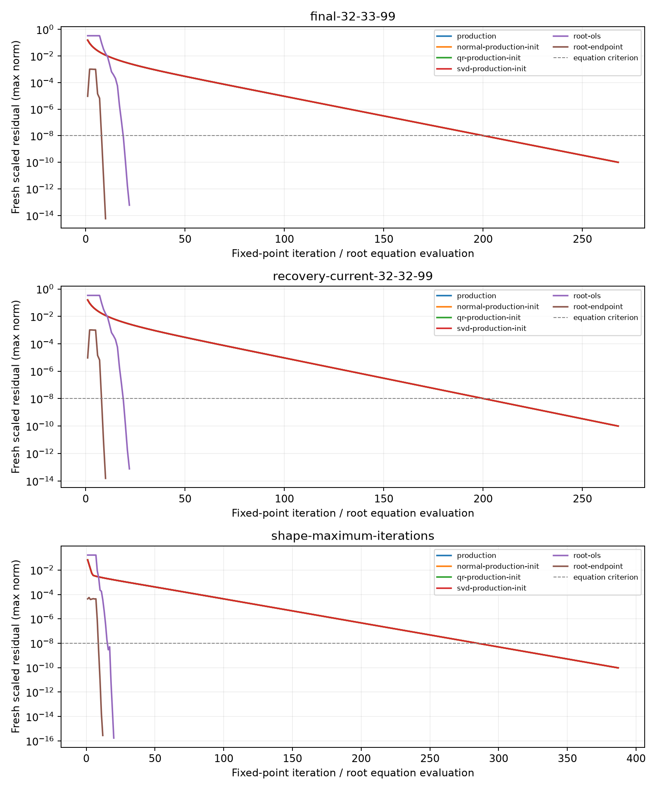
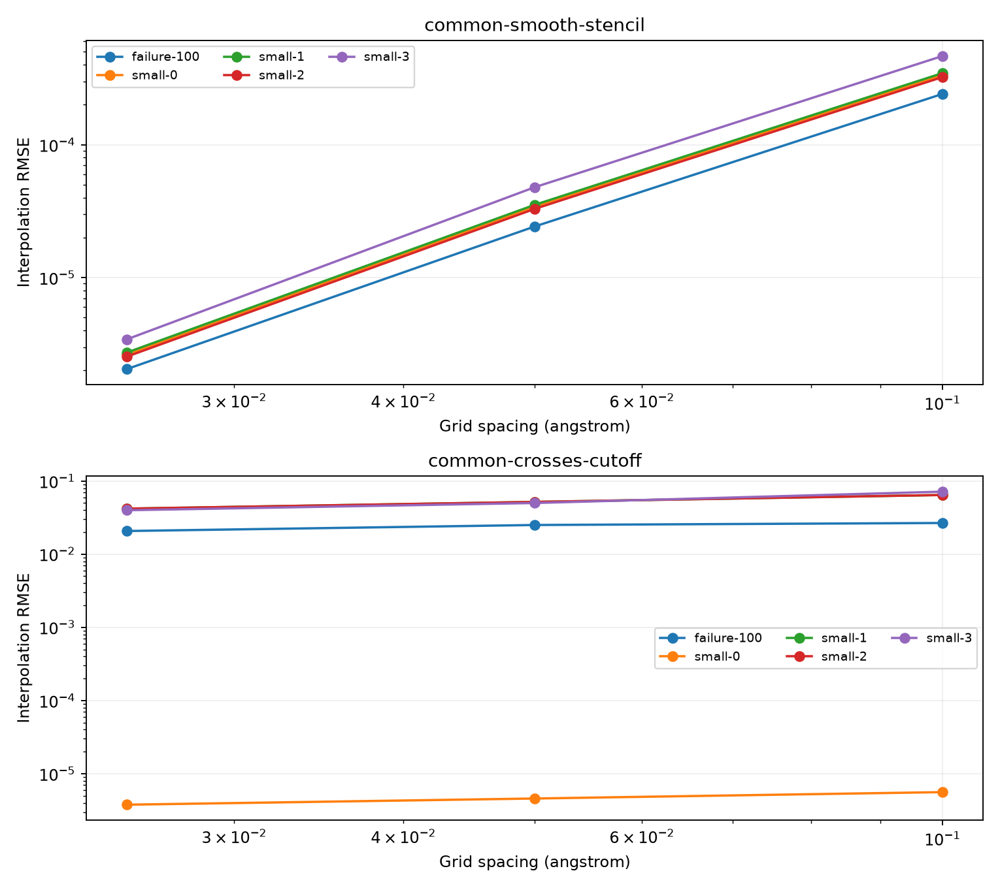

# MDPDE 可靠求解與 forward-model discrepancy：實驗結果

日期：2026-09-15。基準：`d169e0706c32f4d3636ac5261417392204c45983`。
本次新增 testing-only 實驗入口，未改正式求解器、MDPDE 定義、外層接受政策、covariance 或收斂門檻。

## 結論

1. **這次失敗的有限正變異 MDPDE 子問題有可驗證的解。** Final 與 recovery 入口都卡在
   `A / TRP 11 / NE1`（serial 100、選取索引 99）；輸入略有差異，並非同一份 dataset。
   兩例延長固定點迭代都在 268 次更新內達到 `1e-10` 方程殘差；從原終點啟動 root solve
   主求解都只需 10 次方程評估，另加 8 次獨立驗證。這裡的工作單位不同，不能把兩個數字直接當作加速倍數。
2. **QR／SVD 沒有改變這兩例的主要行為。** Weighted design condition number 約 6.98；
   normal equations、QR、SVD 的軌跡及終點近乎相同。證據支持固定點迭代收縮過慢，未支持線性 conditioning 為主因。
3. **Root solve 的起點與解分支必須保留。** 從既有終點啟動，337 份真實 shape 輸入全部通過參考殘差；
   從 OLS 啟動只有 261 份通過。指定擾動還在 atom 99 找到第二個有效根，不能直接全面替換或按真值挑根。
4. **此資料的主要 forward discrepancy 是插值，集中於 stencil 跨過硬截斷的位置。**
   解析 generator 與 estimator 幾乎一致；重建 map 的取樣與固定 map 完全一致。
   提高內層精度只帶來極小的參數改變，不能消除觀測模型差異，也尚未證明完整 peeling convergence。

## 來源、基準與狀態對應

三份輸入實際 SHA-256 均核對成功：

| 輸入 | SHA-256 |
| --- | --- |
| CIF | `156d35aa326f0d4408d726a999329d2ffede775489aeaa5d99a2cc9b9f663cab` |
| map | `cc9e76f94aa524b0f444bd8120ebe1adc3c364d4a277e9d805e0088677dc0a8c` |
| manifest | `b9c882e41f4ee6349ed988861d4e63a078349da9a21bbc3560cae4d4deba7de1` |

本輪使用獨立 Debug／SYSTEM／OpenMP／ROOT 建置，UMAP 與 Python bindings 關閉。
工具鏈為 Apple Clang 21.0.0、CMake 4.4.3、Eigen 5.0.1、Boost 1.92.0、ROOT 6.40.04；
完整設定與相依檔案雜湊保存在 provenance，套件版本另存 `environment.json`。
UMAP 不參與本次 fitting；本輪與前報告的相容性以實際數值重現核對。
未修改來源的基準、新捕捉 `j4/v3`、`j4/v4`，以及 audit OFF／capture OFF／`j1/v3`，
皆為 **32 attempts、31 accepted、best iteration 28、`recovery-failed`**。
168 筆完整持久化 local-potential records（含 raw／peeling blobs）、品質指標及 final certificate 逐欄一致。

Final nominal p99 仍為 `[0.006143670517417728, 0.008207428922010910, 0.001048905842297531]`，
complete=true、qualified=false。正式 amplitude／width／offset RMSE 仍為
`0.011437689979958447 / 0.000364241207648577 / 0.002004025190615797`。
原 quality gate 仍是 uncalibrated，25 輪與完整收斂驗收仍未通過。

每個 direct／audit run 保存 337 個 shape datasets：首次失敗一份、final 的 168 份、recovery-current 的 168 份；
另保存首次 offset IRLS 失敗。Final／recovery 各有 167 個原始 SUCCESS 控制與一個失敗。
Metadata 保存 phase、attempt、角色、atom identity、實際 adjusted response／offset model，
以及完整 state／frozen background 的 context 檔；捕捉沒有額外呼叫 operator。
關鍵四份輸入另保留於 [版本化案例索引](../../tests/fixtures/mdpde/index.json)。

## 實驗 A：方程、數值證據與解分支

對回傳的 beta、variance 重新計算 weights，使用包含既有 weight floor 的方程：

\[
e=y-X\beta,\quad w_j=\max(w_{\min},\exp[-\alpha e_j^2/(2v)]),
\]
\[
\Psi_\beta=X^TWe,\qquad
\Psi_v=n^{-1}\sum_jw_j(e_j^2/v-1)+\alpha(1+\alpha)^{-3/2}.
\]

Beta residual 第 k 項除以 `n * sqrt(v) * RMS(X[:,k])`；variance equation 已無量綱。
實驗通過線為 fresh residual 最大範數 `<=1e-8`，參考線 `<=1e-10`；
另要求正 variance denominator、完整 weighted rank、有限且有效的 Gaussian model。
這些是本輪預先指定的實驗標準，沒有取代 production 的原始停止規則。

固定點對照共用 production OLS 起點，保留 W→beta→variance 的更新順序，最多 10,000 次；
另獨立比較 QR／SVD 初始化，直接解加權 design 的最小平方系統；介面依據
[Eigen least-squares 說明](https://eigen.tuxfamily.org/dox/group__LeastSquares.html)。Root 使用 Eigen Powell hybrid dogleg，變數為
`(beta0, log(beta1), log(v))`，中央差分 Jacobian，`xtol=1e-12`，每起點最多 2,000 次方程評估，
包含 Jacobian 差分成本，並預留 8 次供獨立終點驗證（主求解最多 1,992 次）。終點另以中央差分檢查 Jacobian condition 與估計剩餘參數誤差。
求解器的小步長／停滯狀態本身不算通過；停止與殘差合格的區分參考
[SUNDIALS 的 nonlinear stopping criteria](https://sundials.readthedocs.io/en/v7.5.0/kinsol/Mathematics_link.html#nonlinear-iteration-stopping-criteria)。

| 真實案例 | 原始 fresh residual | 固定點達 1e-10 的更新數 | Root／OLS 主求解評估 | Root／原終點主求解評估 |
| --- | ---: | ---: | ---: | ---: |
| 首次失敗，ASN 12 CA／serial 107 | 4.31933e-5 | 387 | 20 | 12 |
| Final，TRP 11 NE1／serial 100 | 9.34389e-6 | 268 | 22 | 10 |
| Recovery-current，同一原子、不同 dataset | 9.34395e-6 | 268 | 22 | 10 |

表內 root 欄另各加 8 次獨立驗證。Root／原終點成本是**已完成原始 100 次迭代之後**的額外成本。
本輪 timing 包含診斷、SVD 與 trace 成本；不作 production 性能保證。

Final 例的 variance 從 `2.877353395435375e-5` 精化至 `2.876772546630947e-5`；
amplitude 只改變約 `6.23e-8`，width 只改變約 `4.37e-8`。
因此內層資格問題確實可處理，但這個幅度無法直接解釋或消除外層 `~1e-2` nominal residual。

### 多根與起點敏感性

Final 例在 beta0 或 log(beta1) 的 `±1e-3` 指定擾動後，找到另一根：

| 根 | variance | amplitude | width |
| --- | ---: | ---: | ---: |
| 原 OLS 固定點路徑／原終點 root | 2.87677254663e-5 | 6.99968863071 | 0.499894595608 |
| 擾動起點的另一根 | 2.18540209421e-5 | 6.99969719603 | 0.499945192644 |

兩者都通過 fresh 方程與可行性檢查；recovery dataset 也有對應的兩根。
以 log(v) 為主的參數差異遠超數值精度，不能視為捨入差異。本輪保留全部解，不依真值選擇。

337 例中，延長固定點、QR、SVD、root／原終點均為 337/337 通過 `1e-10`；
root／OLS 為 261/337。Beta0／log(beta1) 擾動也有停滯或落在無效 denominator 區域的案例。
原 production 有 56/337 達本輪較嚴的 residual 線；其餘原始 SUCCESS 仍只表示通過原先的 iteration-change 規則。



三種線性解法的曲線幾乎重疊。橫軸已分別標示固定點更新與 root 方程評估，不是相同成本單位。

## 實驗 B：forward discrepancy 與局部精度

使用相同 168 原子、每原子 200 個實際 sampling positions、alpha、signal range `[0,1]`，
比較 estimator 解析值、generator 解析值、double grid 插值、CCP4 寫入讀回插值、固定 map 插值。
共 33,600 個樣本；完整精度讀取 JSON，並逐點驗證原 map 取樣與捕捉 response 完全一致。
完整 atom identity 配對，charge 取自 manifest 的 `charge_used`，包括回退零值。
Map generation 使用現有 generator，sampling 使用現有 cubic interpolation。
每個 grid 都保留全部相關 contributors；局部視窗也不以中心 sampling point 篩掉 stencil 所需的原子。

| 差異，fold 全部樣本／h=0.1 | RMSE | 最大絕對值 |
| --- | ---: | ---: |
| Generator 解析 − estimator 解析 | 1.81133e-16 | 1.77636e-15 |
| Double grid 插值 − generator 解析 | 0.0423532 | 0.408384 |
| CCP4 round-trip 插值 − double grid 插值 | 3.19925e-7 | 2.55450e-6 |
| 固定 map 插值 − 重建 round-trip 插值 | 0 | 0 |

插值 RMSE 在跨 cutoff 的 27,772 個樣本為 `0.0465854`；
不跨 cutoff 的 5,828 個樣本為 `0.000303414`。
上述數值是原始 response 單位；機器可讀結果也提供除以各原子 signal peak 的正規化統計。
Round-trip 同時包含 float32 voxel 與檔案座標表示的影響；所有讀回 voxel 均與 double 值轉 float32 完全相等。

### Grid 精細化：保持同一組樣本再比較

除四個單原子／重疊／正負零 charge fixture 外，對 serial 100 執行三個 spacing 的局部視窗。
使用共同集合避免 h 改變 stencil 分組後，誤把樣本組成變化當作精度提升：

| h（Å） | 全部 200 點 RMSE | 共同不跨 cutoff 的 26 點 | 共同跨 cutoff 的 75 點 |
| --- | ---: | ---: | ---: |
| 0.1 | 0.0165293 | 2.41206e-4 | 0.0266809 |
| 0.05 | 0.0153439 | 2.42738e-5 | 0.0250474 |
| 0.025 | 0.0126919 | 2.05235e-6 | 0.0207257 |

平滑區域明顯改善，跨硬截斷區域改善較慢。本輪沒有要求 production 全面改用更密 grid。
圖中的 `small-0/1/2` 分別為單原子零／正／負 charge，`small-3` 為重疊的負／正／零 charge 原子。
小型 fixture 另涵蓋中心、非 grid 對齊、cutoff 兩側與 map 邊界；邊界／signal／tail 結果分開保存。
單原子在 `r=2.51`、charge=`±0.3` 時，generator 已截斷為零，estimator 約為 `±0.1195`。
因此 fold 取樣位置上的解析一致性不能延伸成所有距離都具有相同 support。



### 固定真值鄰居與 offset 的局部 shape 對照

此部分是離線 self-consistency 實驗：在各資料層都使用同一個真值鄰居／offset snapshot，
再經 production `PreparedLocalGaussianDesign` 建立 log dataset，固定 alpha、取樣座標與 fit range。
不是原始完整 peeling 的最終狀態，也沒有將真值送入 production fitting。

- 解析 estimator／generator 的 168 例都落在 roundoff exact-fit 邊界，A/B 誤差約 `1e-14 / 1e-16`。
  邊界以 QR residual 與 `64*eps*(||y||+||X||*||beta_QR||)` 分開辨識；不強制建立正變異參考根。
- Double grid 資料的 A/B RMSE 約 `0.03018258 / 0.000961014`；root 精化後約
  `0.03018256 / 0.000961012`。提高求解精度對這項觀測模型誤差的改善極小。
- 全 fold 的各層保留相同 100 個正值 signal 樣本；各 fixture 的 membership、共同樣本 log bias／RMSE／max 都有保存。
- 各資料層也保留 OLS／原終點／六個擾動起點的 root 結果；沒有只呈現成功起點。
  例如 failure-100 的 `h=0.025` double grid，root／原終點 residual 約 `1.03e-10`，
  通過 `1e-8` 實驗線，但未通過 `1e-10` 參考線，仍按兩個標準分別記錄。
  全部 900 組資料中，366 組為 roundoff exact-fit 邊界；其餘 534 組均至少有一個方法通過參考線。
- 固定 C 的 shape 實驗不提供 offset 改善證據，也不能把上述 RMSE 與完整 peeling 的 RMSE 直接排序比較。

## 驗證與下一步

- 原始基準、新 capture／audit、audit OFF／j1：168 筆完整記錄、品質及 certificate 完全一致。
- 三個小型 fixture × j1/j4 × quiet/non-quiet，共 12 組：audit ON/OFF 的 state、commit、背景與工作量完全一致。
- 數值單元測試涵蓋 alpha=0 閉式解、獨立 scalar 方程、有限正變異、exact-fit、近零噪聲、rank、floor、denominator、無效 root 起點、grid nodes／boundary。
- 三個關鍵 shape 與一個 offset 版本化案例，以及 audit 捕捉的全部案例，均可不讀 CIF／map／manifest 精確重播。
- 既有 estimator、HRL、sampler、command、scorer 與 focused production tests 通過。
  未提供外部路徑的舊 replay test 仍會 skip；本輪另以實際資料執行成功，不把 skip 當作驗收。
- BUILD_TESTING=OFF 建置成功，symbol inspection 未找到新增實驗或捕捉入口。

下一輪建議先評估**保留原迭代路徑的終點精化／受控 fallback**，並明確設計多根選擇規則；
再以 observation-matched prediction 處理插值與硬截斷。只有正式 inner operator 取得可靠資格後，
才有依據評估 recovery 是否能降低同一狀態下的 nominal residual。本輪未改動或驗證新的 recovery 行為。

## 重跑與產物

關鍵案例與精簡結果可隨原始碼保留：

- [案例與雜湊](../../tests/fixtures/mdpde/index.json)
- [精簡數值結果](figures/mdpde-experiment/results.json)
- [實驗 runner](../../tests/integration/mdpde_experiment.py)

完整本機產物位於 `build/mdpde-experiment/`：`baseline-source/`、`capture-source/`、`delivery-source/` 保存來源；
`baseline-run/`、`direct/`、`audit/`、`off-j1/` 保存 DB、log、score、certificate 與 provenance；
`final-solver/`、`final-forward/` 保存交付版執行的命令、時間、input hashes、source／binary hashes 與全部結果；
`final-analysis/` 保存 JSON／CSV、曲線及 artifact index。此 build 目錄未納入版本控制，需另外備份。

```sh
cmake -S . -B build/mdpde-on -G Ninja -DCMAKE_BUILD_TYPE=Debug \
  -DBUILD_TESTING=ON -DBUILD_PYTHON_BINDINGS=OFF -DRHBM_GEM_DEP_PROVIDER=SYSTEM \
  -DRHBM_GEM_ENABLE_SECOND_STAGE_AUDIT=ON -DRHBM_GEM_ENABLE_UMAP=OFF \
  -DRHBM_GEM_OPENMP_MODE=ON
cmake --build build/mdpde-on --target rhbm_gem_cli rhbm_tests mdpde_experiment -j 4

# 不需要模擬資料即可比較版本化失敗輸入。
python3 tests/integration/mdpde_experiment.py experiment \
  --executable build/mdpde-on/bin/mdpde_experiment --operation solve \
  --captures tests/fixtures/mdpde --output build/new-mdpde-replay

# MODEL / MAP 指向上方 SHA-256 對應的本機資料；輸出使用全新目錄。
python3 tests/integration/mdpde_experiment.py capture \
  --executable build/mdpde-on/bin/RHBM-GEM --model "$MODEL" --map "$MAP" \
  --output build/new-mdpde-capture
python3 tests/integration/mdpde_experiment.py experiment \
  --executable build/mdpde-on/bin/mdpde_experiment --operation forward \
  --captures build/new-mdpde-capture/solver-failures \
  --manifest "$MAP.simulation.json" --map "$MAP" --output build/new-forward
```

使用有 Matplotlib 的獨立 Python 環境執行 `summarize --solver … --forward … --output … --plots` 可重建曲線。
`experiment` 與 `capture` 不覆寫已有的正式執行資料；來源／執行檔／輸入於執行前後均驗證雜湊。
新增解析器與實驗容許記錄失敗解，將其標為未通過；缺失案例、重播不一致或產物不完整則以非零狀態結束。
