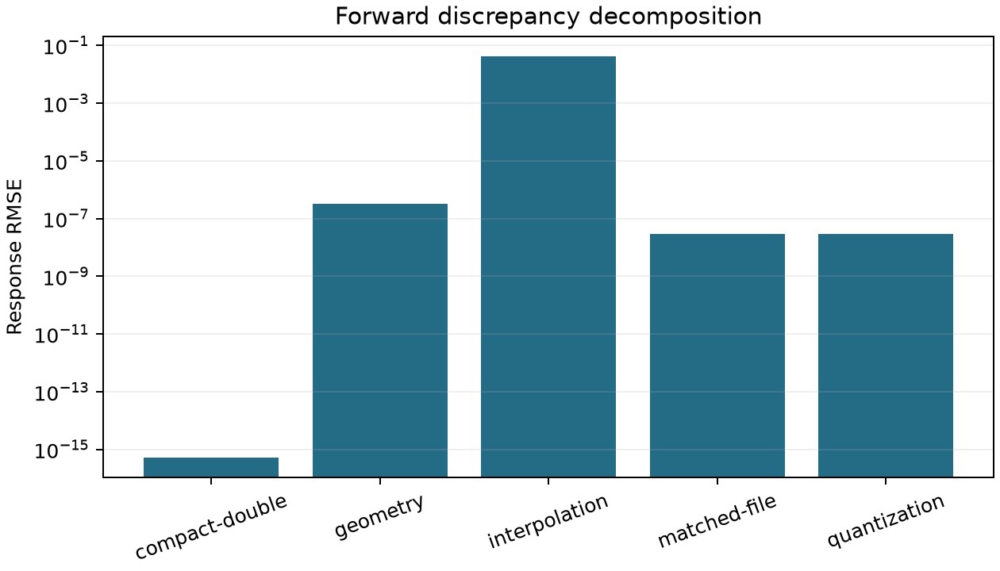
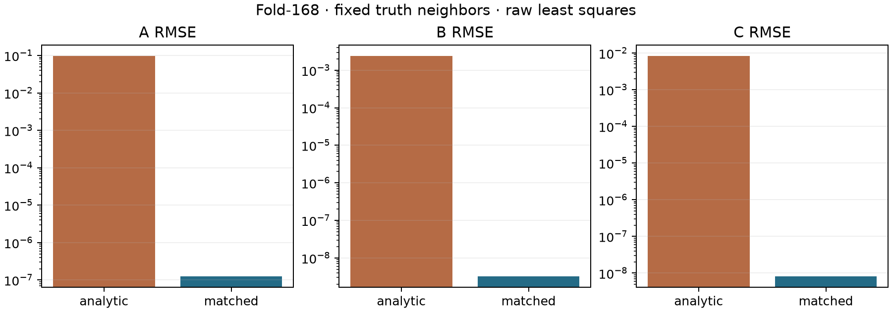

# Observation-matched prediction：預測一致性與局部估計實驗

日期：2026-09-16。來源基準：`e5dc4c4b` 加上本輪 testing-only 實驗程式；完整來源、執行檔、
相依套件與輸入雜湊保存於各 run 的 provenance。本文數字來自本輪實際執行。

## 結論

**在這份固定模擬資料上，將 grid／cutoff／cubic interpolation 納入預測，幾乎消除了
forward-model mismatch，並使固定真值鄰居下的 A/B/C 誤差大幅降低。**

Fold-168 的 compact double prediction 與原 sampler 相差 RMSE `5.17001e-16`；
對實際 float32 map 的未量化 prediction，RMSE 為 `2.91318e-8`，已由 voxel 量化誤差解釋。
聯合估計 A/B/C 的 RMSE 由 `0.0980360 / 0.00241357 / 0.00838606` 降至
`1.26194e-7 / 3.24956e-9 / 8.20551e-9`。三個參數的 168 個逐原子對照都改善，沒有退步案例。

這支持下一輪建立 **testing-only 的完整 peeling observation-matching 實驗**。
本輪未改 production，未證明未知鄰居情況或完整 peeling 的收斂，也沒有把 `uncalibrated` 品質 gate 改為通過。

## 輸入與隔離

三份實際輸入與既有 schema-7 基準的 SHA-256 一致：

| 輸入 | SHA-256 |
| --- | --- |
| CIF | `156d35aa326f0d4408d726a999329d2ffede775489aeaa5d99a2cc9b9f663cab` |
| map | `cc9e76f94aa524b0f444bd8120ebe1adc3c364d4a277e9d805e0088677dc0a8c` |
| manifest | `b9c882e41f4ee6349ed988861d4e63a078349da9a21bbc3560cae4d4deba7de1` |

沿用 endpoint-refinement `baseline-run` 保存的 final context，核對完整 atom identity、
168 個原子各 200 個 sampling positions，以及逐點 capture response 的精確重播。
既有 337 份 shape captures 與 offset capture 全部列入輸入雜湊；本輪局部擬合使用原始 map samples，
不把 log-linear solver 的 dataset 當作新的 observation。

真值只用於生成 reference、固定鄰居／固定 C，以及事後評分。Fit 介面不接受自由參數的真值，
不依真值初始化、選解或停止。C 真值使用 manifest 的 `charge_used`，包含合法零值與查表回退零值。
新實作只連結測試與實驗 executable，沒有修改 `src/`、公開 header、正式 CLI、MDPDE 或 peeling policy。

## 方法與預先指定判準

對每個 sample 保存 64 個 stencil slots；保留 cubic 的負係數與邊界 clamp 的重複 index。
Contributor selection 逐 voxel 套用 generator 的整體 cutoff、2.5 Å charge cutoff 與近零距離規則，
不從 sample 中心的鄰居清單截掉 stencil 所需貢獻。實驗也重現原 sampler 的越界 sentinel 行為：
float32 header 可使原來恰在邊界的點略微落在讀回範圍外。

區分生成時 voxel 座標與讀回後的插值幾何：

1. `grid`：原 double grid 配原幾何。
2. `header`：保留原 double voxel values，但以讀回的 origin／spacing 取樣。
3. `file`：原子貢獻先在 voxel 相加、整體轉 float32，再以讀回幾何取樣。

完整生成器與原 sampler 提供獨立參照。Compact prediction 不從 reference map 讀取預測值。
Float32 只用於 forward 驗證；局部擬合使用 double prediction，避免將階梯量化函式當成平滑最小平方問題。
每點 forward tolerance 為 `512*eps*max(1, Σ|coefficient| Σ|atom contribution|)`；
量化上界由實際 `|float32(voxel)-voxel|` 經絕對插值係數傳播，不用固定的 `1e-7` 取代尺度判斷。

局部實驗比較相同 raw least-squares loss、相同 samples 與相同 solver 的兩個預測模式：
解析模式在 sample 位置計算；matched 模式在 voxel 計算後插值。兩者均使用 generator support，
各自以同一模式計算 self、固定真值鄰居與 charge basis。沒有 response 正值篩選，也不依 selected flag 刪點。

| 子問題 | 自由參數 | 固定參數 | Fold 樣本數／原子 |
| --- | --- | --- | ---: |
| AB | A、B | 鄰居真值、目標 C 真值 | `[0,1] Å` 的 100 點 |
| ABC | A、B、C | 鄰居真值 | 全部 200 點 |

即使 C 固定，charge basis 仍隨 B 更新。固定 B 時用 QR 解 A 或 A/C，SVD 檢查 rank；
A 非負、C 不限制符號。外層在 `B∈[0.1,2.0] Å` 以 129 個 log-width 點定位谷，
每個谷以 Brent 最多 128 次迭代細化；另以 257 點與 SVD 重算。保存兩套 profile 與全部候選 minima。
參數邊界、rank deficiency、預算耗盡、近等價多解、核對不一致與 nonstationarity 分型記錄。

Fresh Jacobian 使用 `(log A, log B, C)` 的自由座標，逐欄正規化。
Stationarity 為 `max |J_normalizedᵀ residual| / max(1, ||adjusted response||)`，要求 `<=1e-8`；
兩套參數逐項差異除以 `max(1, |primary|, |reference|)` 後要求 `<=1e-6`。
掃描有限區間與局部 Jacobian 檢查不構成全域唯一解證明。

## Forward 結果

Fold 使用 33,600 點。另含 serial 100 的三個 local grids，及零／正／負 charge 與重疊原子的
四類小型 fixture，各用 `h=0.1、0.05、0.025 Å`。合計 **16 個 grid cases、183 個局部 targets、35,220 個 samples**。
同一 fixture 在不同 spacing 保持相同取樣座標。所有 forward checks 通過後才開始擬合。

| Fold 全部樣本的差異 | RMSE | 最大絕對值 |
| --- | ---: | ---: |
| Double grid − 解析模型 | 0.0423531858 | 0.408384270 |
| Header 幾何 − 原 double 幾何 | 3.18176992e-7 | 2.44752075e-6 |
| Float32 voxel − header double values | 2.91317621e-8 | 2.43911673e-7 |
| Compact double − 原 double sampler | 5.17000843e-16 | 5.32907052e-15 |
| Compact float32 − 原 round-trip sampler | 4.92392914e-16 | 5.32907052e-15 |
| 未量化 matched prediction − 實際 map | 2.91317621e-8 | 2.43911675e-7 |

重建 round-trip 與固定 map 的所有 voxel、幾何及樣本完全一致。
全部逐點量化誤差上界檢查通過；最後一列與 float32 誤差一致。
前次報告的約 `3.2e-7` round-trip discrepancy 混合了 header 幾何與 voxel 量化；本輪已分開兩者。



Serial 100 的共同平滑樣本 26 點，在三個 spacing 的 interpolation RMSE 分別為
`2.41206e-4 / 2.42738e-5 / 2.05235e-6`；共同跨 cutoff 的 75 點為
`0.0266809 / 0.0250474 / 0.0207257`。這重現了既有 discrepancy 結果。
Matching 在既有 spacing 即可解釋 observation；它沒有把 interpolated value 還原成連續場的精確值。

## 局部參數結果

183 targets × 4 observation layers × 2 prediction modes × 2 fit types，合計 **2,928 fits**。
全部通過數值資格，沒有未辨識、多解、預算耗盡或邊界終點。
最大 stationarity 為 `3.32489e-9`；最大 primary/reference 尺度化參數差異為 `8.76493e-8`。
1,098 個解析／matched 無噪聲自洽控制全部通過 `1e-6` 真值恢復線，最大尺度化誤差 `4.99039e-8`。

### 實際 map、固定真值鄰居

| 子問題／參數 | 解析 prediction RMSE | Matched RMSE | Matched／解析 |
| --- | ---: | ---: | ---: |
| AB／A | 0.0508381037 | 7.74739133e-8 | 1.52393e-6 |
| AB／B | 0.00174258679 | 2.56208048e-9 | 1.47027e-6 |
| ABC／A | 0.0980360146 | 1.26193551e-7 | 1.28722e-6 |
| ABC／B | 0.00241357269 | 3.24955580e-9 | 1.34637e-6 |
| ABC／C | 0.00838606098 | 8.20551342e-9 | 9.78471e-7 |

五組逐參數對照各有 168/168 原子改善，改善幅度均超過各自 primary/reference 差異之和。
Matched ABC 的最大 A/B/C 絕對誤差為 `4.38537e-7 / 1.05202e-8 / 2.79953e-8`。
局部 column-normalized Jacobian condition number 在 AB 最大約 9.49、ABC 最大約 18.46，
本輪沒有顯示嚴重局部不可辨識性。詳細 bias、p99、max 與逐原子數值見 JSON／CSV。



### 剩餘誤差不能全部稱為 map 量化下限

Matched double-grid ABC 的 A/B/C RMSE 已有
`9.37159e-8 / 2.17892e-9 / 6.48638e-9`，即使尚未量化也不是精確零。
Matched file 的 primary/reference RMS 參數差異與這個尺度相近；成對比較的解析與 matched
數值差異之和分別為 `3.16971e-7 / 6.68265e-9 / 2.23388e-8`。
因此本輪可確認巨大改善，但不能把 matched RMSE 的最後幾位數視為已校準精度，
也不能僅從 RMSE 差直接分解出參數的量化誤差。

解析 observation 搭配解析 prediction 同樣恢復真值；反向將 matched prediction 擬合解析 observation
則產生偏差。這個負控制支持效果來自 observation operator 的相容性，而非 matched 模式一律較好。

### 與既有 MDPDE／peeling 報告的關係

既有完整 production 的 A/B/C RMSE `0.01143769 / 0.000364241 / 0.00200403`，以及前次固定 C 的
log-MDPDE double-grid AB RMSE 約 `0.0301826 / 0.000961014`，僅作歷史參照。
它們使用不同 loss、鄰居狀態與更新程序，不能與本表直接排序來宣稱新 estimator 較佳。
本輪因果比較限於同 raw loss、同 samples、同 solver 的 analytic／matched 配對。

## 工作量、驗證與下一步

一次 Release／SYSTEM／OpenMP j4 的完整執行為 41.67 秒，包含 map 重建、forward 驗證、
兩套 profile 求解及檔案輸出，不是 production 性能保證。
解析／matched 各執行 591,841／591,690 次 profile evaluations；matched 每次包含最多 64 個 voxel basis。
各 fit elapsed time 的總和約 3.34／118.68 秒（平行執行的總和不等於 wall time），
因此本輪確認的是準確性效果，尚未完成 kernel 快取或 production 性能最佳化。

單元與 integration tests 涵蓋非對齊／anisotropic grids、負係數、clamped edges、header 邊界外移、
cutoff 漏掉 contributor、兩種 cutoff、近零距離、正負零 charge、量化順序、width–charge 導數、
exact fit、rank deficiency、參數邊界、預算耗盡，以及不隱藏失敗或改变 paired membership。
原始 sampler、generator、estimator、HRL、solver replay 與相關 integration tests 亦通過。

驗證紀錄：

- 435 項相關 C++ tests 通過，含 7 項新測試；提供實際 capture 路徑完成原 replay 測試，沒有以 skip 充數。
- 6 項新 Python tests、19 項既有 scorer tests、3 項 endpoint runner tests 與 2 項 MDPDE runner tests 通過。
- j1／j4 的 35,220 行 samples、全部 forward checks、2,928 fits 的參數、狀態、profile、minima 與工作量完全一致；僅排除 elapsed time。j1 完整執行為 112.89 秒。
- `BUILD_TESTING=OFF` 建置成功，symbol inspection 未發現實驗／capture 入口；以該執行檔重新跑 production，168 筆完整 local-potential records（含 blobs）、品質、summary 與 certificate 皆與既有 baseline 完全一致，仍為 32 attempts／31 accepted、best 28、`recovery-failed`。
- `lint_repo`、文件連結與變更空白檢查通過。

下一步建議將此 operator 接入獨立 testing-only peeling，統一 neighbor subtraction、local fitting、
joint offset、objective、nominal operator、recovery 與 certificate 的 prediction。
目前固定真值鄰居的設定消除了鄰居估計誤差，不能代替該閉迴路驗證。
本輪也沒有評估含噪 map 的穩健性或 estimator covariance；337 captures 與 168 atoms 不是獨立蛋白樣本。

## 重跑與產物

建立 Release／SYSTEM／OpenMP、`BUILD_TESTING=ON`、audit ON、UMAP／Python bindings OFF 的建置，
編譯 `mdpde_experiment` 與 `rhbm_tests`。小型 C++ tests 不依賴外部模擬檔。
`MODEL`、`MAP` 指向上列 SHA-256 對應資料；`CAPTURES` 指向 baseline 的 `solver-failures`。
若 capture 已移除，先用既有 `mdpde_experiment.py capture` 對同一固定輸入重建。

```sh
python3 tests/integration/observation_matching.py run \
  --executable build/observation-matching/on/bin/mdpde_experiment \
  --model "$MODEL" --map "$MAP" --manifest "$MAP.simulation.json" \
  --captures "$CAPTURES" --output build/observation-matching/new-j4 --jobs 4

# 使用新 output 目錄，以 --jobs 1 再執行一次後比較。
python3 tests/integration/observation_matching.py compare \
  --left build/observation-matching/new-j4 --right build/observation-matching/new-j1 \
  --output build/observation-matching/new-thread-comparison.json

# 在含 Matplotlib 的獨立 Python 環境執行。
python3 tests/integration/observation_matching.py plots build/observation-matching/new-j4 \
  --output build/observation-matching/new-figures
```

Runner 在執行前後核對 source／binary／input hashes，拒絕覆寫既有 output；缺案例、forward 驗證失敗、
無噪聲控制不合格或 artifact 不完整會失敗。一般待比較 fit 的不合格或 accuracy 無改善會保留為科學結果，
不從統計分母刪除，也不自動改成 technical error。

版本化交付為 [精簡結果](figures/observation-matching/results.json)、
[Fold 實際 map 的逐原子 fits](figures/observation-matching/fold-file-fits.csv) 與上述 PNG／PDF。
完整 `build/observation-matching/final-j4`／`final-j1` 保存逐點 CSV、2,928 fits 的兩套 profiles／minima、
forward checks、source／binary／dependency／input hashes、execution 與 artifact index；此目錄未納入版本控制，需另行備份。
第一次邊界不相容的 run 與中間驗證 run 仍保存於原目錄，未覆寫為成功結果。
