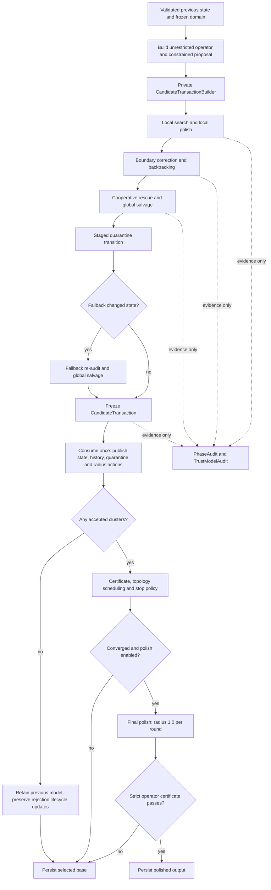

# Second-stage P0 structural refactoring

## Baseline and contract

The baseline is `c5417717154896e53d31a1d43910cde15e3f80f6`. This change
reorganizes implementation ownership without changing numerical thresholds,
search factors, solver calls, objective references, stop precedence, or final
persistence policy. No tests or test cases are added. Existing tests only adapt
to moved internal declarations and the separated certificate measurements.

The execution map includes the retained P1 final-polish changes. Cooperative
rescue and production radius growth retain their original policies.

## Ownership and execution

`CandidateTransactionBuilder` owns the only writable selection. Boundary,
rescue, rejection, and fallback operations are private builder methods; stage
orchestration outside the builder receives read-only results. It keeps one
assembled state and existing patch/overlay workspaces rather than cloning a
full state at each phase. The builder freezes after the staged quarantine
transition and any required fallback re-audit. `CandidateTransaction` exposes
only a const view and an rvalue-qualified consuming commit.

Commit publishes candidate state/provenance, audited history, staged quarantine,
and radius actions together. Rejection rolls back the affected model,
provenance and history; it does not discard rejection-driven radius shrink,
fixed activity, failure evidence or quarantine lifecycle transitions. An
all-rejected attempt restores the previous model while still publishing those
required transitions. Suspicious-failure evidence is sampled before quarantine,
as before this refactor. The prior accepted state is moved into attempt-local
storage so certification can compare it with the committed candidate without
adding a full-state copy. Final dependency polish retains its separate
persistence/recertification boundary.

## Candidate evaluation map

`EvaluateCandidate(candidate, scope, reference)` has typed reference overloads.
They share the existing numerical primitives and return values; callers apply
returned history only on acceptance. Scope selects existing behavior, not a
configurable policy engine. Objective observers/counters remain separate from
model and history mutation. The old `TryCommitClusterCandidate` entrypoint is a
thin compatibility adapter for existing focused tests, not a second validator.

| Scope / phase | Preserved evaluation order and references |
| --- | --- |
| Local search | Proposal construction/validity and nonmaterial shortcut remain in search; preflight evaluates trust then guard; objective evaluation uses previous and candidate-neighbor reevaluated best. |
| Local polish | Solver retains its existing feasibility/trust checks; objective evaluation uses the accepted local endpoint and requires strict improvement. |
| Fallback re-audit | Recompute trust norm, evaluate trust/guard, then previous/best objective gates; restart history from the attempt input. |
| Boundary | Evaluate member previous/best gates in existing key order, then the combined objective. |
| Boundary correction | Suspicious-polish guard, raw objective observation, member/combined evaluation, then strict improvement against the original correction reference. |
| Cooperative rescue | Preserve tolerated local deterioration and best-history update rules, combined previous/best audit, and strict global improvement. |
| Global selection audit | Preserve the affected-sample union and complete-state previous/best audit; salvage order remains in the builder. |
| Final polish | Validity, suspicious-polish guard, strict global improvement, then member non-regression against the base; strict operator recertification remains downstream on converged stops only. |

Failures keep the existing short-circuit behavior. Proposal interpolation,
search retry, rescue candidate retention, correction generation and salvage
remain orchestration responsibilities. Maximum movement still controls
nonmaterial search/backtracking, best-history ties and topology drift.

## Observation and certificate separation

`TrustModelAudit` owns per-key trials/funnels and frozen-IRLS/rho calculations in
its own translation unit. Workers access preallocated, distinct key records;
final disposition and serialization follow the existing cluster order. No
trust-model storage is carried in cluster candidate results or iteration
results. The experiment remains diagnostic-only with its existing build flag.

Phase notifications delegate snapshots, local-polish rejection formatting,
assembly reconstruction and proposal capture to `PhaseAudit`. The existing
phase collector retains isolated solver workspaces and counters. Both flags
remain OFF by default; disabled event entrypoints do not capture snapshots or
run diagnostic solvers. Existing phase/trust log schemas and parent identities
are retained; timing is not part of equivalence.

`ConvergenceCertificate` contains only the accepted-active p99, nominal-operator
p99, qualification/completeness and orthogonal blockers. The accompanying
`ConvergenceDiagnostics` owns maximum/population measurements, and
`IterationDiagnostics` owns reported proposal/accepted maximum movement.
Percentile sampling and finite-value predicates are unchanged. Both production
and final-polish logs still serialize the same measurements.

## Validation

Use existing focused tests, the complete remaining CTest suite, repository lint,
and whitespace checks. Existing tests exercise phase/trust diagnostic isolation
and internal evaluator/transaction behavior; no new cases are added. Build/test
logs remain under `build/p0-structure`.

These checks establish evidence only within their existing coverage, not every
fallback/correction branch or general numerical equivalence. Fold-168 remains
an optional independent quality regression.
