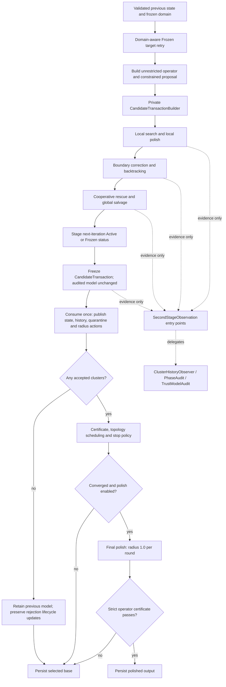

# Second-stage P0 structural refactoring

## Baseline and contract

The baseline is `c5417717154896e53d31a1d43910cde15e3f80f6`. This change
reorganizes implementation ownership without changing numerical thresholds,
search factors, solver calls, objective references, stop precedence, or final
persistence policy. No tests or test cases are added. Existing tests only adapt
to moved internal declarations and the separated certificate measurements.

The execution map includes the retained P1 changes and [P2 steps 1–2](second-stage-p2-structure.md).
Production radii use Keep/Shrink only. P2 component transactions were withdrawn
after remote-cluster regressions; global greedy salvage remains.

## Ownership and execution

`CandidateTransactionBuilder` owns the only writable selection. Boundary,
rescue and rejection operations are private builder methods; stage
orchestration outside the builder receives read-only results. It keeps one
assembled state and existing patch/overlay workspaces rather than cloning a
full state at each phase. The builder freezes after the staged quarantine
transition without changing the audited model. `CandidateTransaction` exposes
only an rvalue-qualified consuming commit. The builder retains a const view
for existing focused tests.

Commit publishes candidate state/provenance, audited history, staged quarantine,
and radius actions together. Rejection rolls back the affected model,
provenance and history; it does not discard rejection-driven radius shrink,
fixed activity, failure evidence or quarantine lifecycle transitions. An
all-rejected attempt restores the previous model while still publishing those
required transitions. Suspicious-failure evidence is sampled before quarantine,
as before this refactor. The prior accepted state is moved into attempt-local
storage so certification can compare it with the committed candidate without
adding a full-state copy. Final dependency polish retains its separate
persistence/recertification boundary.

## Candidate evaluation map

`EvaluateCandidate` uses `(candidate, reference)` throughout. Local references
carry `LocalObjectivePolicy` (previous non-regression or strict reference
improvement); boundary and correction references carry
`BoundaryAcceptancePolicy` (ordinary or cooperative rescue). The local
`objective_reference` is the previous objective for search and the accepted
local base for polish. Global audit and final polish retain their dedicated
references. These types share numerical primitives, not a configurable policy
engine; boundary transaction methods only pass the boundary policy.

`LocalCandidateEvaluation` returns acceptance and numerical diagnostics; its
caller requests the optional history payload through the observation interface.
`BoundaryCandidateEvaluation` returns the audit objective and deterioration
statistics; an empty optional denotes rejection. Boundary diagnostic records
carry observation IDs, and callers publish only the selected observation.
Existing focused tests invoke the evaluator directly. Correction reuses its raw
objective evidence for combined acceptance, including an unavailable result.

| Scope / phase | Preserved evaluation order and references |
| --- | --- |
| Local search | Proposal construction/validity and nonmaterial shortcut remain in search; preflight evaluates trust then guard; objective acceptance uses previous; passing candidates update history with a candidate-neighbor best reference. |
| Local polish | Solver retains its existing feasibility/trust checks; objective evaluation uses the accepted local endpoint and requires strict improvement. |
| Boundary | Evaluate member previous gates in existing key order, then the combined objective. |
| Boundary correction | Suspicious-polish guard, raw objective observation, member/combined evaluation, then strict improvement against the original correction reference. |
| Cooperative rescue | Preserve tolerated local deterioration; share local history/tie-break updates, combined previous/best audit, and strict global improvement. |
| Global selection audit | Preserve the affected-sample union and complete-state previous/best audit; salvage order remains in the builder. |
| Final polish | Validity, suspicious-polish guard, strict global improvement, then member non-regression against the base; strict operator recertification remains downstream on converged stops only. |

Failures keep the existing short-circuit behavior. Proposal interpolation,
search retry, rescue candidate retention, correction generation and salvage
remain orchestration responsibilities. Maximum movement still controls
nonmaterial search/backtracking, best-history ties and topology drift.

## Observation and certificate separation

`SecondStageObservation.hpp` exposes lifecycle and candidate notifications
without including the three observer implementation headers. Initialization,
partition/background reset, attempt setup, local/member observations,
accept/reject and publication remain at their original call sites. Context
ownership, diagnostic payloads and history tokens are unchanged. Evidence used
by radius, quarantine or rollback remains in production structures.

The lightweight trust trial interface uses the existing preallocated per-key
record; funnel and rho details stay in `TrustModelAudit`. Boundary diagnostic
and phase event names are selected by the observation layer.
`ProductionObservationScope` preserves the production solver-audit lifetime and
thread-local context; worker scope propagation remains unchanged.

`TrustModelAudit` owns per-key trials/funnels and frozen-IRLS/rho calculations in
its own translation unit. Workers access preallocated, distinct key records;
final disposition and serialization follow the existing cluster order. No
trust-model storage is carried in cluster candidate results or iteration
results. The experiment remains diagnostic-only with its existing build flag.

Phase notifications delegate snapshots, local-polish rejection formatting,
assembly reconstruction and proposal capture to `PhaseAudit`. The existing
phase collector retains isolated solver workspaces and counters. Both flags
remain OFF by default; disabled event entrypoints do not capture snapshots or
run diagnostic solvers. Existing phase/trust log schemas and parent identities
are retained; timing is not part of equivalence.

`ConvergenceCertificate` contains only the accepted-active p99, nominal-operator
p99, qualification/completeness and orthogonal blockers. The accompanying
`ConvergenceDiagnostics` owns maximum/population measurements, and
`IterationDiagnostics` owns reported proposal/accepted maximum movement.
Percentile sampling and finite-value predicates are unchanged. Both production
and final-polish logs still serialize the same measurements.
The internal `suspicious_block_fallback` blocker includes shape and hard-failure
evidence as well as offsets. The schema-10 `suspicious-offset` log label is a
historical compatibility name and retains the same value and position.

## Validation

Use existing focused tests, the complete remaining CTest suite, repository lint,
and whitespace checks. Existing tests exercise phase/trust diagnostic isolation
and internal evaluator/transaction behavior; no new cases are added. Build/test
logs remain under `build/p0-structure`.

The policy/observation interface follow-up uses `1041f13b` as its baseline.
Before and after the change, the existing `EstimatorSecondStageDefenseTest.*`
suite passes 107 tests with both diagnostic switches OFF and 108 with both ON.
The phase-only and trust-only library builds also pass. This focused matrix uses
Debug builds with UMAP disabled; existing test edits only adapt evaluator calls
and policy references, without changing assertions or adding cases.

These checks establish evidence only within their existing coverage, not every
fallback/correction branch or general numerical equivalence. Fold-168 remains
an optional independent quality regression.
