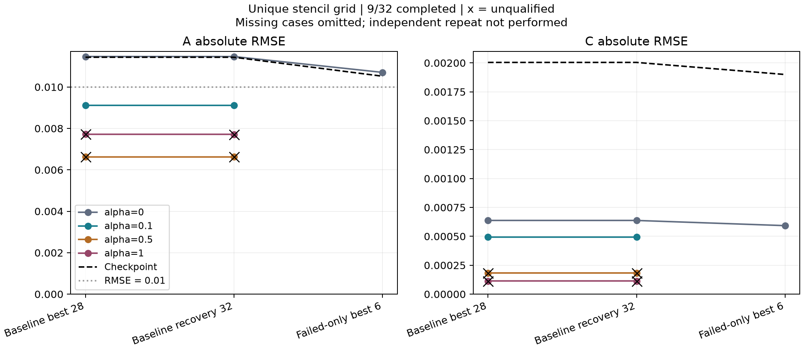
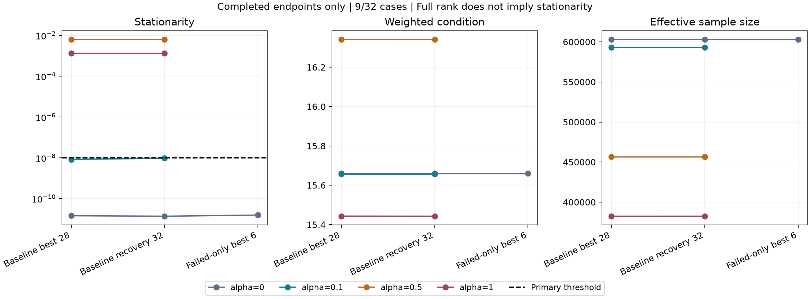

# Experiment A — Unique stencil grid

本實驗僅連結 testing executable；production fitting、公開 API、正式 CLI 與 schema 不變。
目的為檢查直接 grid-domain、固定 B 的 Joint A/C MDPDE 能否取得合格終點，以及參數誤差與數值條件。

## 本次部分執行結果（依使用者要求停止）

**原定 32 組中，完成 9 組：5 組數值合格、4 組 `budget-exhausted`。** 這是部分實驗結果，未完成原計畫的完整批次與獨立重跑驗證。
baseline-best-28 與 baseline-recovery-32 各完成四組 alpha；failed-only-best-6 僅完成 alpha=0。該 checkpoint 的 alpha=0.1 在第二起點計算中依使用者要求中止，沒有完整 fit artifact，不納入結果；其餘 22 組尚未開始。
以下只統計具有完整兩起點、終點與 residual artifacts 的九組，不使用工程預檢或中途 log 作為完成結果。

### A/C 精度與數值資格

| checkpoint | alpha | 資格 | A RMSE | C RMSE | A／C：絕對誤差 <0.01 |
| --- | ---: | --- | ---: | ---: | --- |
| baseline-best-28 | 0 | qualified | 0.01147195 | 0.00063733 | 115/168；168/168 |
| baseline-best-28 | 0.1 | qualified | 0.00911389 | 0.00049315 | 115/168；168/168 |
| baseline-best-28 | 0.5 | budget-exhausted | 0.00662204 | 0.00018293 | 159/168；168/168 |
| baseline-best-28 | 1 | budget-exhausted | 0.00771748 | 0.00011407 | 146/168；168/168 |
| baseline-recovery-32 | 0 | qualified | 0.01147065 | 0.00063731 | 115/168；168/168 |
| baseline-recovery-32 | 0.1 | qualified | 0.00911231 | 0.00049311 | 115/168；168/168 |
| baseline-recovery-32 | 0.5 | budget-exhausted | 0.00662207 | 0.00018289 | 159/168；168/168 |
| baseline-recovery-32 | 1 | budget-exhausted | 0.00771625 | 0.00011406 | 146/168；168/168 |
| failed-only-best-6 | 0 | qualified | 0.01070530 | 0.00059243 | 118/168；168/168 |

已完成的 alpha=0 三組全部合格，A RMSE 約 0.0107–0.0115；alpha=0.1 的兩組也全部合格，A RMSE 約 0.00911。
因此，若標準是 **A RMSE<0.01**，目前兩個已完成 alpha=0.1 案例達標；若要求 **每個原子的 A 絕對誤差<0.01**，則仍未達標，兩組皆只有 115/168。所有已完成案例的 C 均有 168/168 小於 0.01；其中五組同時取得數值資格。
alpha=0.5、1 的 A/C 誤差較小只是未合格終點的描述性數字，不能視為已驗證 estimator improvement。所有九組皆保留 checkpoint B，B 沒有被估計。`|error|<0.01` 也不保證四捨五入到兩位小數必然相同。



### baseline-best-28 的 residual 與權重診斷

| alpha | variance | Grid residual RMSE | 原 samples residual RMSE | weighted condition | ESS | 最高 1% rows 權重占比 |
| ---: | ---: | ---: | ---: | ---: | ---: | ---: |
| 0 | 4.1796434e-07 | 0.00064650161 | 0.00087532326 | 15.65964 | 602995.0 | 1.0000% |
| 0.1 | 2.6435235e-07 | 0.0009621802 | 0.0015027215 | 15.65613 | 593079.8 | 1.0594% |
| 0.5 | 4.2610526e-08 | 0.0027244033 | 0.0041241973 | 16.34121 | 456438.3 | 1.4937% |
| 1 | 2.6476432e-08 | 0.0029318876 | 0.0044599576 | 15.44311 | 382450.5 | 1.8218% |

九組終點的加權矩陣皆為 full rank 336，但四組高 alpha 終點仍未通過 stationarity。矩陣條件良好與滿足 estimating equations 是不同條件。
所有合格案例的兩個起點均通過 1e-8 主門檻、1e-10 精化門檻及獨立 SVD 檢查，未標記 branch-sensitive。四個未合格問題的兩起點均用完 100 次主迭代，沒有進入精化。
唯一 global block 的權重占比必然為 100%；不拿此數字宣稱改善舊實驗的 block concentration。



### 舊 matched-sampling 結果的描述性參照

舊 baseline-best-28 Joint 的 A／C RMSE 為 0.016533708／0.0010233945，原 samples residual RMSE 為 0.0042550231，且為 **budget-exhausted、未合格**。新 Grid alpha=0.1 在同一 sample domain 的 residual 見上表。
觀測方式、共同 alpha／單一 variance 與迭代預算同時不同，不能把差異單獨歸因於移除 interpolation，也不跨 alpha 排序 native objective。

### 已驗證與未完成項目

- 602,995 unique voxels、2,150,400 slots 的完整集合、排序、去重、multiplicity 與 sample replay 通過 C++／Python 獨立檢查；保留 210,011 個負 observations 與 392,984 個正 observations。
- 獨立 generator double 最大差異 1.7763568394002505e-15；float32 map 最大差異為 0；sample replay 最大差異 5.329070518200751e-15。
- 權重 CSV checker 在停止後修正為傳播尺度相關 residual 浮點誤差界；已觀察到約 1e-15 的 residual 差被小 variance 放大為約 3.1e-12 的 weight 差。這只修改資料重播檢查，沒有修改 fitting、stationarity 或 SVD 門檻；停止時原始 runner 已保存在 raw artifacts，另記錄新版 checker hashes。
- 九組完整 fits 已重新檢查固定 B、分支預算、數值資格、逐 voxel／sample residual 與終點權重；停止時已核對來源、輸入、執行檔 hashes 未改變。
- 34 項針對性 C++ tests、62 項 Python tests、8 個 CTest 群組、repository lint 及 BUILD_TESTING=OFF 隔離檢查已通過。
- 稀疏分塊 QR 與密集 QR 在 baseline-best-28／alpha=0 的最大係數差約 8.28e-13；此為求解路徑核對，**不等於原定四組 alpha 的獨立重跑**。
- **未執行** baseline-best-28 的完整四組獨立重跑；未宣稱批次重現性已驗證。停止時 runner 尚未寫出最終資源摘要，因此峰值 RSS 不可用，未填入推測值。
- 停止是使用者要求，與 numerical budget-exhausted 或技術執行失敗分開記錄。完整批次 runner 仍嚴格拒絕缺案例；本部分摘要另存，不建立假的完整 fit-index。
- 完整軌跡與逐點 CSV 保存在 `build/unique-stencil-grid/final`（未納入 git）；工程預檢目錄不列入結果。

產物：[部分結果 JSON](figures/unique-stencil-grid/partial-results.json)、[fits CSV](figures/unique-stencil-grid/fits.csv)、[全部誤差統計](figures/unique-stencil-grid/statistics.csv)、[逐原子估計](figures/unique-stencil-grid/estimates.csv)、[兩分支診斷](figures/unique-stencil-grid/branch-diagnostics.json)、[完成／中止範圍](figures/unique-stencil-grid/partial-status.json)。
PDF：[參數誤差](figures/unique-stencil-grid/parameter-errors.pdf)、[數值診斷](figures/unique-stencil-grid/solver-diagnostics.pdf)。驗證：[檢查索引](figures/unique-stencil-grid/validation.json)、[來源與執行檔 hashes](figures/unique-stencil-grid/provenance.json)、[輸入 hashes](figures/unique-stencil-grid/input-hashes.json)、[raw artifact hashes](figures/unique-stencil-grid/raw-artifact-index.json)、[歷史參照](figures/unique-stencil-grid/historical-reference.json)、[公開產物 hashes](figures/unique-stencil-grid/artifact-index.json)。

## 資料與比較範圍

沿用 [joint A/C 實驗](matched-joint-ac-experiment.md) 的八份 fold-168 checkpoint、原 map、manifest 與完整 atom identities。
全部 33,600 samples 的每個 cubic stencil 均取 64 slots，包含零／負係數與 boundary clamp 的重複 slots。
依 global voxel index 排序去重為 **602,995 個 observations**，約占 244×373×201 map 的 3.30%。
每 voxel 只使用一次，不按 multiplicity、selected flag、response 正負或插值係數改變權重。
因此沿用的是原 stencil 的空間範圍；unique voxels 與插值後 samples 並非相同的統計資訊或 loss。

讀回 map 的 origin／spacing 用來重建 stencil indices；manifest 的生成座標用來計算 voxel basis。
此區分避免引入 float32 header 捨入的幾何差異。原 map value 為 observation，未量化 double 為 prediction。
生成器整體 cutoff、charge cutoff 與近零距離規則直接沿用既有 matched basis；此 fixture 整體 cutoff 為 2.5 Å。
所有 168 原子一起估計；不建立 artificial voxel owner，也不使用 production component 大小上限。

固定各 checkpoint 的 B，模型為 `y = X(B) beta`，
`X = [G_1,K_1,...,G_168,K_168]`、`beta = [A_1,C_1,...,A_168,C_168]`。
A 非負、C 不限符號；B 逐位保留。沒有 B 搜尋、Frozen fitting、其他 ROI、ridge、intercept 或 charge-sum constraint。

只新增 Grid 組，各 checkpoint 獨立執行共同 alpha **0、0.1、0.5、1**，共 32 個問題。
舊 matched-sampling 結果僅作描述性參照：觀測方式、alpha／variance 結構和迭代預算同時不同，不能單獨歸因於移除 interpolation。
原 samples 僅用於 fitting 完成後的 residual 評分，沒有新增 interpolated fitting。

## Objective、初始化與數值資格

重用既有 constrained linear MDPDE，將全部 rows 放在唯一 global block，lambda=1，只有一個自由正 variance。
Objective 與方程定義見 [既有求解器文件](matched-joint-ac-experiment.md#composite-objective-與求解)。
此處 alpha=0 確實退化為 constrained least squares，variance=RSS/N。
Truth 僅用於獨立 forward check 與事後評分，不用於 fitting、初始化、選解、停止或選 alpha。

每個問題保留 checkpoint 與 constrained-LS 兩起點，各以自身 RSS/N 初始化 variance。
各 alpha 都從相同兩種規則重新啟動，不跨 alpha 暖啟動。
有合格分支時，選 native objective 較低的合格主終點；若全未合格，依既有規則保留 checkpoint 分支為描述性的 selected endpoint。
兩分支完整資料皆保存；兩個合格分支的尺度化係數或 log-variance 差超過 `1e-6` 時標示 branch-sensitive。
每個起點分支主迭代上限 **100 次**、stationarity 門檻 `1e-8`；通過後精化最多 **100 次**至 `1e-10`。
SVD 獨立核對、尺度化係數差與 log-variance 差均維持 `1e-6` 門檻。
本實驗的 Jacobi SVD 明確採用 blocked Householder QR 前處理，避免高矩陣逐欄 pivot 的成本；
每次仍由完整 weighted design 獨立重建 QR，以 `SVD(R)` 配 `Qᵀy` 核對解，避免顯式形成高矩陣的左奇異向量。
正交轉換保留 singular values；不重用主迭代的 R，也不形成 normal equations 或使用稀疏近似。
既有實驗預設保留原 pivoted QR 前處理；專項測試核對兩路徑的係數、rank、constraints、condition 與資格一致性。
主迭代耗盡保留 `budget-exhausted`；主迭代通過但精化／SVD 未通過為 `reference-unverified`。
exact-fit-boundary、variance-boundary、invalid-denominator、rank-deficient、stalled、nonfinite 及 branch-sensitive 均沿用既有規則。
不追加預算或放寬門檻；有限的不合格終點仍保存於完整人口的描述性結果，不算已驗證改善。

未加權設計與每個分支主終點的 weighted design 皆按欄正規化後計算 rank、condition 與最小奇異值。
未合格終點的 spectrum 僅作診斷，不使其合格。數值差異只作配對解析度，不是 confidence interval。
新加的 `endpoint_diagnostics` 與逐 voxel weights 都重算於主終點；既有 solver 的 `weighted_spectrum`／block diagnostics 保留其精化終點語意。
全域權重另保存 ESS、分位數、最大單點占比與最高 1% rows 的占比；唯一 block 的 100% 占比不代表改善舊 block concentration。
不同 alpha 的 native objective 不直接排序；八份 checkpoint 也不是八個獨立蛋白樣本。

## 驗證與輸出

每次執行先重建獨立 generator map，逐 voxel 核對 double prediction、float32 量化與原 map values，
再核對全部 slots 對原 samples 的重播。每個 checkpoint 另檢查 `X beta` 與直接原子求和。
Python checker 獨立重建每個 sample 的 voxel indices、檢查排序與唯一性、slot sequence、multiplicity、量化及 sample replay。
C++ fused operations 與 Python 分步運算的座標／插值係數檢查使用隨座標尺度／grid index 縮放的浮點容差；不放寬 fitting 資格。

Runner 保存 dataset、逐 voxel 與逐 slot CSV、每個 input／fit 的逐 voxel 與 sample residual、兩分支完整軌跡、
fit-index、A/B/C estimates、bias／RMSE／p99／max／`|error|<0.01` 數量、provenance 與 artifact hashes。
全部 168 原子保留於分母，B 誤差只作固定輸入背景。
資料、forward 或產物不完整為技術失敗；數值未合格或 accuracy 無改善則是保留的科學結果。

原密集 QR 實測 alpha=0.1 的 25 輪約四分鐘；經使用者授權，主迭代與 constrained-LS 初始化改用 Eigen SparseQR／COLAMD 加速。
每份 checkpoint 快取精確非零元素並由四組 alpha 共用；不設截斷門檻，保留極小非零 basis，不刪任何 voxel。
先在 1,024-row tiles 內，對實際出現的 columns 作 Householder QR，再將保留的 R／Qᵀy 交給 SparseQR。
所有 rows 均參與正交轉換；Qᵀy 尾部只貢獻與係數無關的常數。Objective、variance 與 stationarity 一律回到完整 X／y 計算。
SparseQR 的絕對 pivot 門檻為 `epsilon × max(rows, columns) × 最大加權正規化欄 norm`；最終資格仍由完整密集矩陣的獨立 SVD 核對。
專項測試涵蓋稀疏／密集／SVD 一致性、約束釋放、零權重與 rank deficiency。

單工作程序、單執行緒線性求解。同 checkpoint 四組 alpha 共用一份約 1.51 GiB 的 double design；求解副本另需記憶體。
執行紀錄保存 wall time 與 child peak RSS；fit 的 seconds 是既有 solver 時間，不含 wrapper 的額外終點診斷／CSV 輸出。
build 目錄的完整 raw artifacts 不納入 git，需另行備份；公開精簡表格與圖表另存於文件 figures 目錄。

## 重跑

使用 Release／SYSTEM／OpenMP、`BUILD_TESTING=ON`、audit ON、UMAP／Python bindings OFF，編譯 `mdpde_experiment` 與 `rhbm_tests`。
MODEL／MAP 為既有 fold-168 hash 驗證輸入；BASELINE／REFINED 分別指向保存八份 checkpoints 的 baseline-run 與 failed-only-audit。

```sh
python3 tests/integration/unique_stencil_grid.py run \
  --executable build/observation-matching/on/bin/mdpde_experiment \
  --model "$MODEL" --map "$MAP" --manifest "$MAP.simulation.json" \
  --baseline-run "$BASELINE" --refined-run "$REFINED" \
  --output build/unique-stencil-grid/new-full

# 用新的 output，以上述相同參數加上 --state baseline-best-28 獨立重跑。
python3 tests/integration/unique_stencil_grid.py compare \
  --left build/unique-stencil-grid/new-full --right build/unique-stencil-grid/new-repeat \
  --state baseline-best-28 --output build/unique-stencil-grid/new-comparison.json

python3 tests/integration/unique_stencil_grid.py summarize build/unique-stencil-grid/new-full

# 使用含 Matplotlib 的 Python。
python3 tests/integration/unique_stencil_grid.py plots build/unique-stencil-grid/new-full \
  --output build/unique-stencil-grid/new-figures
```

Runner 拒絕覆寫。預設執行全部八份 checkpoints；`--state` 僅用來明確選取單一保留 checkpoint。
compare 排除時間與資源欄位，比對完整 dataset、來源、四組 alpha 的科學輸出與逐點 CSV，明列未比對的其餘 states。
